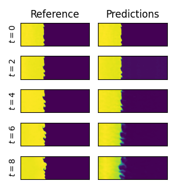
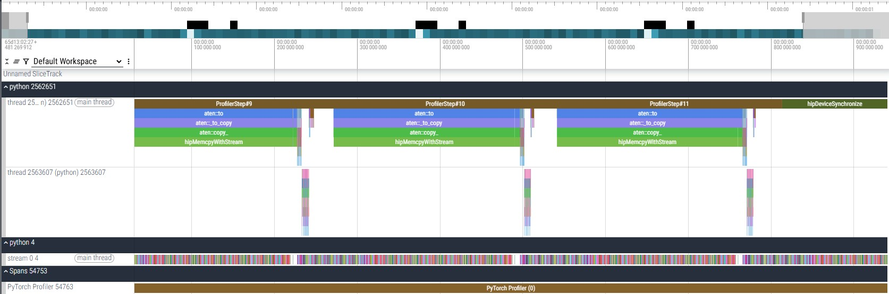

# Fourier Neural Operators for Scientific Applications

## Prerequisites
This examples assume that PyTorch with ROCm support is correctly installed on the system.
If that's not the case, follow [these instructions](https://github.com/marikurz-amd/HPCTrainingExamples-Test/tree/main/MLExamples) to install PyTorch.
The remaining dependencies can be installed with
```bash
pip install -r requirements.txt
```

## A Brief Introduction to Neural Operators
Many tasks in computational science can be reduced to predicting how a system evolves in time.
Given the state of the system at some point in time $U(x,t=t_0)$, the task is to predict the system's state after a time increment $\Delta t$.
The general task can thus be summarized as computing
```math
U(x,t_0+\Delta t) = R\left(U(x,t_0)\right)
```
in an auto-regressive fashion.
Traditionally, the dynamics of how the system evolves, i.e. $R(\cdot)$, are prescribed by a set of (discretized) partial differential equations that are motivated by the underlying physics and are derived from first principles.
While this approach has a long-standing legacy and can provide a range of hard guarantees and error estimates alongside the predicted solution, it is computationally expensive and even intractable for many problem sizes of practical interest.
Machine Learning (ML) methods can be used to reduce the involved cost by replacing $R(\cdot)$ by an Artificial Neural Network (ANN) that is trained to approximate the underlying dynamics of a system from training data.

Neural Operators are a special class of ANNs that operate in infinite-dimensional function spaces and learn directly the operator mapping the current solution function to the solution function at the next time instant $U(x,t_0) \rightarrow U(x,t_1)$.
See for instance [Kovachki et al., 2023](https://www.jmlr.org/papers/volume24/21-1524/21-1524.pdf) for more details.

## Datasets
The development of ML in computer vision in the early 2010s was among others fueled by establishing a set of common benchmark problems that were used across the field to develop, improve and assess different learning strategies and models.
A similar movement in the computational natural sciences has got traction much more recently.
Unfortunately, such problems are oftentimes very high-dimensional, time-dependent and parametrized by a range of similarity parameters.
This renders it challenging to obtain, save and distribute exhaustive datasets in these domains.
Two exemplary projects that provide a set of such benchmark datasets are 
- The Well [(GitHub)](https://github.com/PolymathicAI/the_well)
- PDEBench [(GitHub)](https://github.com/pdebench/PDEBench)

The following example will use datasets from "The Well".

> [!WARNING]
> The datasets differ significantly in size and the overall data pool contains around 15 TB of data.
> This example uses the `turbulent_radiative_layer_2D` case, which is by far the smallest requiring around 6.9 GB of disk space.
> Prior to choosing a different dataset, please ensure that sufficient disk space and internet bandwidth is available to download it!

## Training a Model
Run a few episodes of training with
```bash
python fno.py --num_episodes=5 --batch_size=4
```
The script automatically downloads the dataset if it does not exist yet, so it might take a few minutes.
If the dataset has already been downloaded, you can pass the location of the dataset via `--base_path=/my/path/to/datasets/`. 
After training, the model is evaluated on an example of the validation set auto-regressively, where the model's prediction are fed back into it to produce a whole trajectory of how the system will evolve.
The following compares the predictions of the FNO with the true trajectory at distinct points in time:



Clearly, the FNO model provides useful predictions during the first timesteps, but tends to diverge over time due to the exponential error growth over time.

## Profiling
Depending on the GPU you have available, training an episode should take between a minute up to an hour.
Feel free to reduce the number of training episodes in case the training takes too long.
In a next step, let's investigate how well the GPU is utilized during the training.
For this, the PyTorch profiler is a natural first step.
Augment the training script `fno.py` by the necessary commands to obtain a profile of the main training loop.

> [!TIP]
> Have a look at these [training examples](https://github.com/amd/HPCTrainingExamples/tree/main/MLExamples/PyTorch_Profiling) within this repository for help on how to use the PyTorch profiler.
> Or look at the proposed solution in the `fno_profile.py` file.

After obtaining a profile by running
````bas
python fno_profile.py --torch-profile --num_episodes=1
````
open the resulting JSON file in Perfetto as explained [in this excercise](ttps://github.com/amd/HPCTrainingExamples/tree/main/MLExamples/PyTorch_Profiling/torch-profiler).
Depending on your hardware, the trace should look something like this:



Apparently, the training throughput is mainly limited by the data transfer of the individual training batches from the host to the GPU device indicated by the `hipMemcpyWithStream` blocks.

## Optimizing the Data Transfer
For good performance on ML tasks, it is crucial to optimize the data pipeline to hide the memory transfer of the training data with the computations, i.e. evaluating the model and performing backpropagation.
This depends on the ratio between the computational cost of the model and the size of the training data, the batch size, available memory bandwidth, etc. and is thus case-specific.
However, a few general steps can be considered to improve the performance:
- Use pinned memory for the dataset to improve memory throughput.
  This can be easily done by passing an additional flag to the `DatLoader`:
```python
data_loader = torch.utils.data.DataLoader(
    dataset = dataset_train,
    shuffle = True,
    batch_size = args.batchsize,
    pin_memory = True
)
``` 
- The PyTorch `DataLoader` supports to prefetch batches into GPU memory.
  This can be utlized by passing the following arguments to the `DataLoader` constructor:
```python
data_loader = torch.utils.data.DataLoader(
    dataset = dataset_train,
    shuffle = True,
    batch_size = args.batchsize,
    pin_memory = True
    num_workers = 2,
    prefetch_factor=4
}
```
- Data transfer between host and device is significantly impacted by the affinity between CPUs, GPUs, and memory on multi-GPU systems.
  Have a look at [this exercise](https://github.com/amd/HPCTrainingExamples/tree/main/Affinity) to learn about how to correctly set the affinity of the problem.

Add these strategies to the training script and test the performance by looking at the number of `batches/s` you achieve.
> [!NOTE]
> The observed improvements depend on the employed hardware, so the hyperparameters might need tuning or maybe some steps will not result in any improvement.

## Distributed Training
WIP
