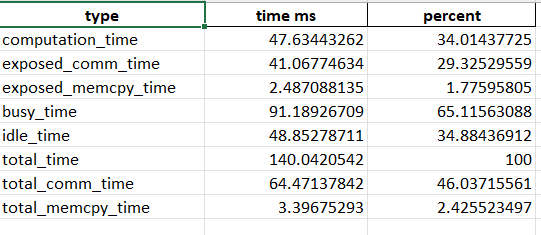
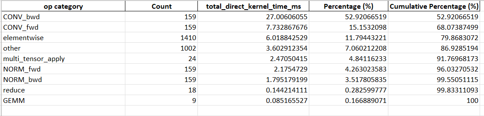
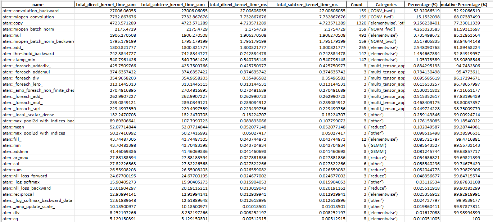
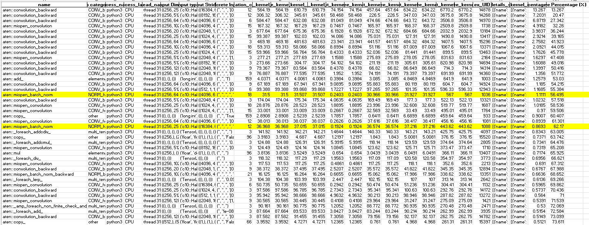
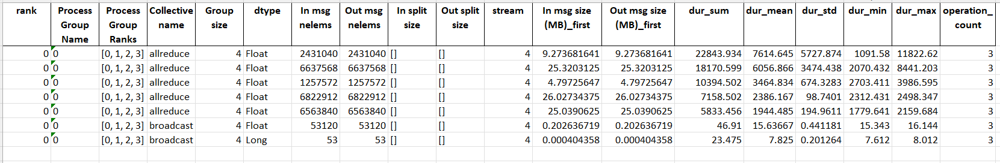
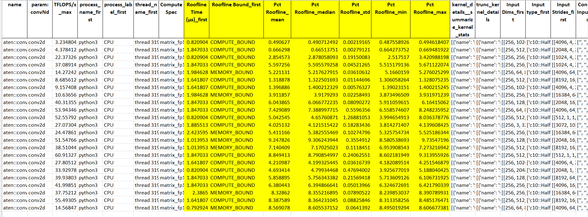

# TraceLens

[TraceLens](https://github.com/AMD-AGI/TraceLens/tree/main) is an open-source Python library developed by AMD that automates performance analysis from GPU trace files. Rather than manually inspecting raw profiling data in tools like Perfetto or Chrome Trace Viewer, TraceLens parses traces from PyTorch, JAX, and rocprofv3 and produces structured performance reports — including hierarchical GPU timeline breakdowns, per-operator roofline analysis (TFLOP/s, TB/s), and multi-GPU communication diagnostics. It can pinpoint whether a kernel is compute-bound or memory-bound, separate true communication time from synchronization skew in distributed workloads, and compare traces side-by-side to quantify the impact of code or configuration changes. TraceLens works through both a CLI (for quick report generation) and a Python SDK (for building custom analysis workflows), making it useful for both one-off debugging and repeatable performance regression testing.

---

## Installing TraceLens

Getting started with TraceLens is very simple. The TraceLens SDK can be installed with the following command:

```bash
pip install git+https://github.com/AMD-AGI/TraceLens.git
```

---

## Generating a Performance Report

Let us generate a trace for the CIFAR 100 example. Collect the trace file generated after running the CIFAR 100 training script given. Using the TraceLens CLI, you can generate a performance report for your workload by using the trace file generated during execution.

```bash
TraceLens_generate_perf_report_pytorch --profile_json_path traces/trace_0_20_0.json
```

This generates a performance report for the workload. The excel workbook generated details different aspects of GPU performance and we will illustrate some of the columns here. For more detailed breakdown of column definitions visit [Column Definitions](https://github.com/AMD-AGI/TraceLens/blob/main/docs/perf_report_columns.md).

### GPU Timeline

The gpu_timeline sheet gives a high level breakdown of GPU time into different aspects like computation, communication, memory copy followed by idle time. For the CIFAR example we see that the ResNet model is idle for a large chunk and the computation time of 34% suggests that it is not very efficient. The computation/communication overlap can be improved which would increase GPU efficiency in this workload, as currently there is a lot of exposed communication taking place.


---

### Ops Summary by Category

The other important information the report provides is by grouping the CPU operations that launch kernels, which give insights that can be portable across platforms and are reporoducible. The tool only looks at the leaf kernels, to prevent double counting.
The ops_summary_by_category is the most aggregated view and it gives a high level summary by grouping the operations into borad computation categories like GEMM, convolution forward and backward, etc. 

The other sheets then breakdown this data in much more fine grained analysis which can be useful to see which operations within a particular category could be the reason for inefficiency.

In this case we observe that the aten::convolution_backward CPU operation from the CONV_bwd takes 52% of the GPU time.

---

### Ops Unique Args

The sheet ops_unique_args is the most detailed view, which groups the operations based on the name and the combination of input shape, dtypes, strides and concrete inputs. This is helpful if we wish to find which particular input patterns are responsible for the performance woes. 



for instance if we look at the operations:

| Operation | Input Dims |
|-----------|------------|
| aten::miopen_batch_norm | ((256, 64, 8, 8), (64,), (64,), (64,), (64,), (), (), ()) |
| aten::miopen_batch_norm | ((256, 256, 8, 8), (256,), (256,), (256,), (256,), (), (), ()) |

We see that the 2nd operation is slower as compared to the 1st as evident by the kernel median run time.

---

### Category-Level Breakdown

The other sheets further show the operations at a category level based on wheter it is from the GEMM, CONV_fwd, CONV_bwd, etc phases. They have the associated operations within the respective sheets.

---

### Collectives Communication

The report also analyzes the time it takes in collectives communication. It gives an insight as to how much time the collectives are taking from the perspective of rank 0. for instance if we look at the first all_reduce we observe that their is a lot of variance in the communication and the time it takes to perform it is inconsistent as the mean is 7614.645 μs and the deviation is nearly 5727.874 μs.


---

## Roofline Performance

Another interesting feature is that TraceLens generates additional sheets with roofline model metrics. These sheets help you understand how efficiently operations are using the GPU's computational and memory bandwidth capabilities.

We had run our training example on MI300, we have added the Max achievable FLOPS for the mi300 in the [mi300.json](HPCTrainingExamples/MLExamples/PyTorch_Profiling/TraceLens/mi300.json) file. We re run the following to generate the perf report with comparision to roofline metrics.

```bash
TraceLens_generate_perf_report_pytorch \
    --profile_json_path traces/trace_0_20_0.json \
    --gpu_arch_json_path mi300.json
``` 

The report looks similar to the earlier one with the main addition being the roofline columns in the category based sheets. We see the CPU ops now have a percentage value which determines how close the particular operation is compared to the theoretical roofline.


It also determines if a particular operation is **memory bound** or **compute bound**, based on whether the FLOPS/Byte (arithmetic intensity) is above or below the GPU's roofline knee point.

The roofline knee point is calculated as:

```
Arithmetic Intensity Threshold = Peak FLOPS / Peak Bandwidth
```

For the MI300X (FP16): ~1300 TFLOPS / 5.3 TB/s ≈ **245 FLOPs/Byte**. Operations with FLOPS/Byte **below** this threshold are **memory-bound** (limited by how fast data can be moved), and operations **above** are **compute-bound** (limited by how fast the GPU can compute).

### CONV_fwd Roofline Example

Looking at two convolution operations from our CIFAR-100 ResNet report on the CONV_fwd sheet:

| | Compute-Bound Conv | Memory-Bound Conv |
|---|---|---|
| **Input Shape** | (256, 256, 2, 2) | (256, 64, 8, 8) |
| **Filter Shape** | (256, 256, 3, 3) | (64, 64, 1, 1) |
| **GFLOPS** | 1.21 | 0.13 |
| **Data Moved (MB)** | 2.13 | 4.01 |
| **FLOPS/Byte** | **542.1** | **31.9** |
| **Roofline Bound** | **COMPUTE_BOUND** | **MEMORY_BOUND** |
| **Kernel Time (µs)** | 33.0 | 9.2 |
| **TFLOPS/s** | 36.6 | 14.6 |
| **TB/s** | 0.07 | 0.46 |
| **Pct Roofline** | 5.6% | 8.6% |

**Why is the 3×3 convolution compute-bound?** The 3×3 filter performs 9× more multiply-accumulate operations per input element than a 1×1 filter, but on a small spatial size (2×2). This drives up the arithmetic intensity to 542.1 FLOPS/Byte — well above the 245 threshold. Performance is limited by compute throughput (36.6 TFLOPS/s achieved vs. 654 TFLOPS/s peak), and the low TB/s (0.07) confirms the GPU is not bandwidth-stressed.

**Why is the 1×1 convolution memory-bound?** The 1×1 filter does very little compute per element, but the input tensor is large (8×8 spatial). This means a lot of data must be moved for relatively few FLOPs, giving an arithmetic intensity of only 31.9 FLOPS/Byte — well below the 245 threshold. Performance is limited by memory bandwidth (0.46 TB/s achieved vs. 5.3 TB/s peak). To optimize this operation, the focus should be on improving memory access patterns rather than increasing compute throughput.

---

## TraceLens Python SDK

The TraceLens tool also provides a number of APIs which allow for more customisable performance analysis. We showcase some of the features in the following notebooks:

- **[Trace2Tree.ipynb](Trace2Tree.ipynb)** — Traverse the trace file as a tree structure. Navigate parent/child relationships between operations, find GPU kernels launched by CPU ops, walk forward/backward linking, and perform per-operator roofline analysis programmatically.
- **[EventReplay.ipynb](EventReplay.ipynb)** — Isolate a particular operation from the trace and replay just that operation on the GPU. Useful for benchmarking individual ops, comparing kernel performance across PyTorch/ROCm versions, and generating standalone reproducers.
- **[TraceFusion.ipynb](TraceFusion.ipynb)** — Merge trace files from multiple ranks into a single file for visual analysis in [Perfetto UI](https://ui.perfetto.dev/). Supports custom filtering (e.g., NCCL-only, GPU kernels only, specific ops) and rank subsetting for focused multi-GPU debugging.

Tracelens also supports a wide range of capabilities including comparision between perf reports from 2 different hardware accelerators to determine operations which are less performant in one as compared to the other, for more details visit the documentation on [compare perf reports](https://github.com/AMD-AGI/TraceLens/blob/main/docs/compare_perf_reports_pytorch.md).