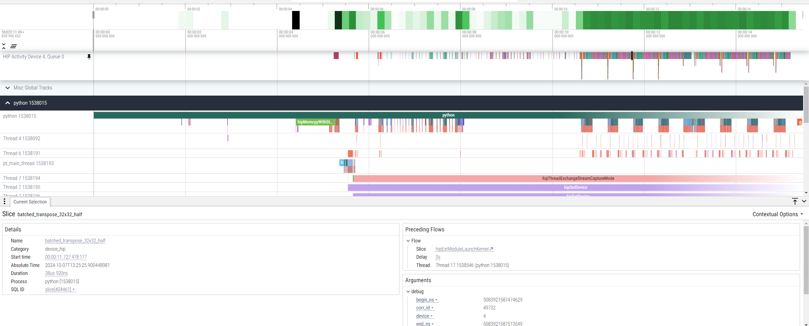
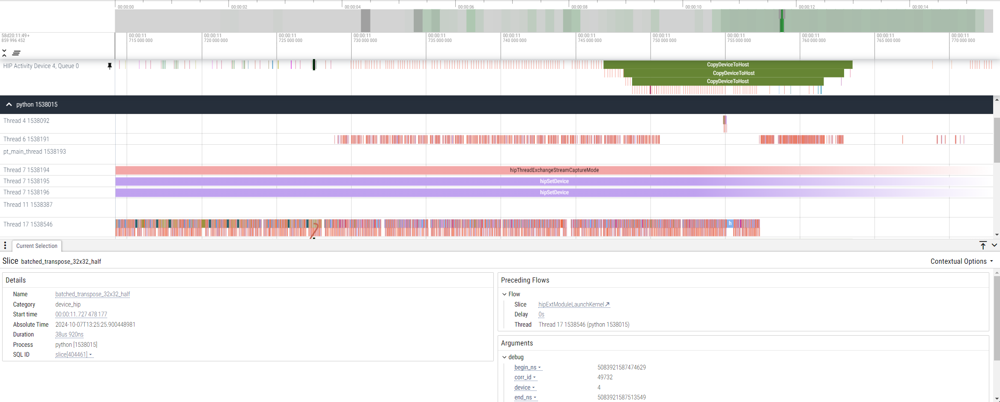
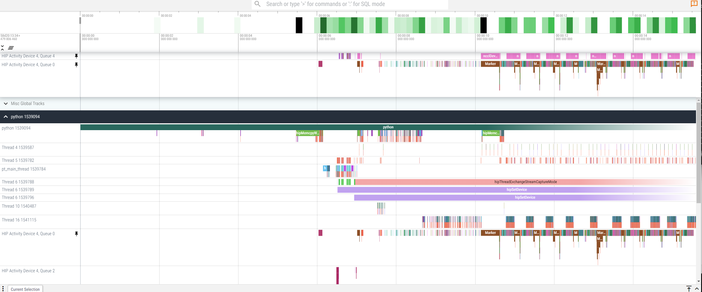
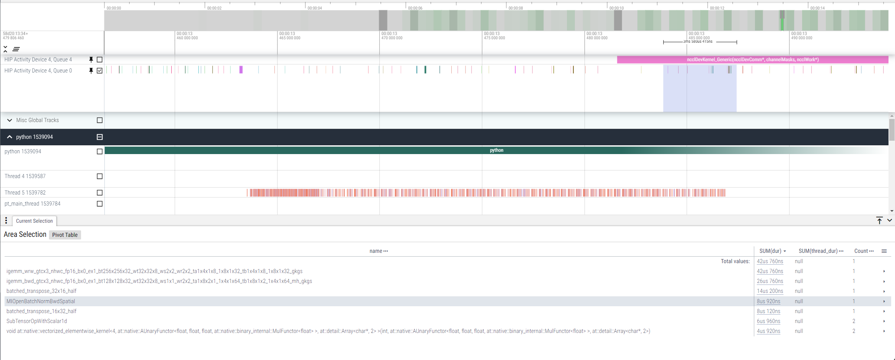
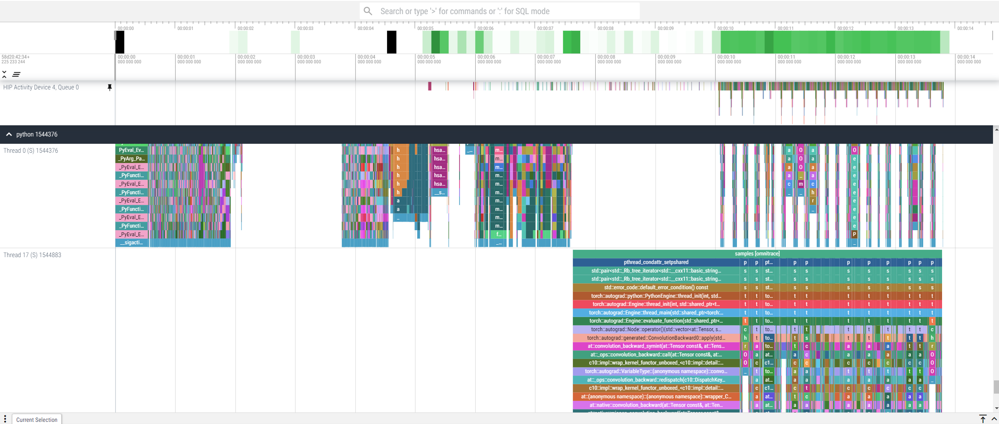
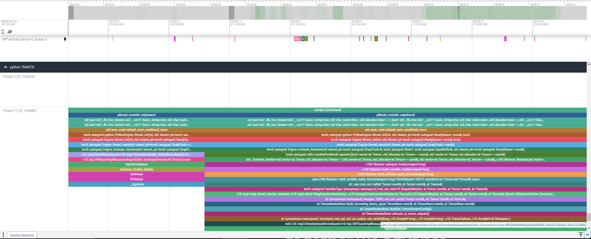

# ROCm Systems Profiler (rocprof-sys)

ROCm Systems Profiler (formerly Omnitrace) is an application tracing utility, as the name suggests, and can be used with application instrumentation or via application sampling. In most AI use cases, instrumentation is impractical due to the many-component python ecosystem. This guide will focus on the utility of application sampling with `rocprof-sys` in python applications.

ROCm Systems Profiler sampling has a wide range of hardware counters available for inspection. The package includes an easy to use utility called `rocprof-sys-avail` which can list available counters as well as filter for specific categories. ROCm Systems Profiler can be configured to target specific hardware counters via configuration file, which can be passed on the command line via `-c config.cfg` syntax to the `rocprof-sys-sample` executable. The full list of hardware counters available is extensive. A default configuration can be generated and inspected with `rocprof-sys-avail -G <name>.cfg`. Apart from configuration files, one can often achieve the same settings by using environment variables or command line arguments.

For machine learning applications, where sampling is the key tool for obtaining performance metrics, it might be advantegous to disable collecting from some sources (e.g, rocprofiler) to decrease the trace size.

To use ROCm Systems Profiler to profile a workload, once the configuration file is generated the application can be launched. Once the trace is collected, you can view it in the Perfetto tool at [https://ui.perfetto.dev/](ui.perfetto.dev). For some versions of the trace there is a known bug in Perfetto, so if that occurs one might need to view traces using the older (stable) Perfetto version: [https://ui.perfetto.dev/v46.0-35b3d9845/](https://ui.perfetto.dev/v46.0-35b3d9845/)

Launching a single-process profiling job can be done as seen in `rocm-systems-profiler.sh`:

```bash 
rocprof-sys-run --profile --trace -- \
python3 ${PROFILER_TOP_DIR}/train_cifar_100.py --data-path ${PROFILER_TOP_DIR}/data
```

Here, the sampling uses many external tools and will produce a fine grained view of compute parameters, as seen below:



The trace above lets you zoom in and select kernels of interest - in this small model, no kernel stands out as particularly troublesome except that they are all very very short running kernels. In this case, it's due to the very small size of the data and just not enough work to keep the GPU busy:



<!-- Experienced issues last time I checked with ROCm 6.4.1, needs to be debugged and updated
ROCm Systems Profiler is compatible with MPI (and Slurm) and will generate one profile per process. The usual way to combine MPI, `rocprof-sys`, and a python executable is the following:

```bash
mpirun -n 4 \
rocprof-sys-sample -c $RSP_CFG \
-I  all -- \
python3 ${PROFILER_TOP_DIR}/train_cifar_100.py --data-path ${PROFILER_TOP_DIR}/data
```

It's easiest to analyze just one trace from a distributed run, again in Perfetto. Here, we can clearly see RCCL kernels launching concurrent operations with compute kernels:



Zooming in on the RCCL kernels shows they have a very long duration compared to the compute kernels:


-->
<!-- This is likely not causing bottlenecks: this profiling introduces significant overhead and artificially inflates the duration of these kernels. -->

ROCm Systems Profiler also offers the ability to sample the call stack of the application. This can provide additional information regarding CPU and GPU usage statistics, concurrent with your application kernels. To run in this mode for python applications, launch it with `rocprof-sys-sample`:

```bash
rocprof-sys-sample -c $RSP_CFG \
python3 ${PROFILER_TOP_DIR}/train_cifar_100.py --data-path ${PROFILER_TOP_DIR}/data
```

You can see, now, the C++ calls from both python and pytorch leading to kernels on the GPU:



And zooming in on these, you can see exactly which low level rocBLAS kernels are launched in each higher level function:



