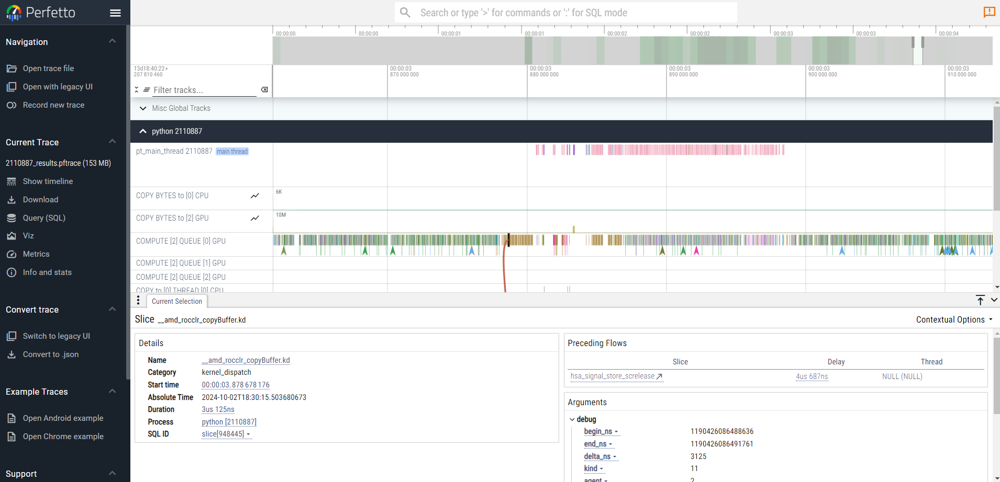

# rocprofv3

One of the easiest tools to identify GPU kernel hotspots in an application is `rocprofv3`, available in ROCm 6.2.0 and onward. `rocprofv3` can be launched with a following command:

```
rocprofv3 --stats --kernel-trace --output-directory single_process --output-file kernels --output-format csv -- python3 <app with arguments>
```

An example of this is shown in `kernels.sh` script in this folder. `--kernel-trace` option specifies that one is interested in GPU kernel activity, while `--stats` option will enable generating summary of the `--kernel-trace`. Specifying names for output directory and files is optional, but can be convenient. Using the csv output format (default before ROCm 7.0) will produce a number of files per process. For example, with the configuration above you will be provided with the following outputs:

```bash
ls single_process
kernels_agent_info.csv  kernels_domain_stats.csv  kernels_kernel_stats.csv  kernels_kernel_trace.csv
```

At a high-level view, the `kernels_kernel_stats.csv` file may be the most useful for identifying which kernels are of particular interest. For the run above, the top kernels of this unoptimized application are:

```bash
head single_process/kernels_kernel_stats.csv
"Name","Calls","TotalDurationNs","AverageNs","Percentage","MinNs","MaxNs","StdDev"
"__amd_rocclr_copyBuffer",7084,17229993,2432.240683,8.38,601,10656,1241.386133
"MIOpenBatchNormBwdSpatial",1113,13283773,11935.106020,6.46,6009,51117,6712.148824
"void at::native::vectorized_elementwise_kernel<4, at::native::AUnaryFunctor<float, float, float, at::native::binary_internal::MulFunctor<float> >, at::detail::Array<char*, 2> >(int, at::native::AUnaryFunctor<float, float, float, at::native::binary_internal::MulFunctor<float> >, at::detail::Array<char*, 2>)",3402,12535732,3684.812463,6.10,641,12458,1127.090878
"MIOpenBatchNormFwdTrainSpatial",1113,10454471,9393.055705,5.08,5048,20351,3723.028735
"SubTensorOpWithScalar1d",2898,10330053,3564.545549,5.02,1161,16345,1668.462768
"igemm_fwd_gtcx3_nhwc_fp16_bx0_ex0_bt128x128x32_wt32x32x8_ws1x1_wr2x2_ta1x8x2x1_1x4x1x64_tb1x8x2x1_1x4x1x64_gkgs",609,9725160,15969.064039,4.73,11818,29164,3533.613567
"igemm_wrw_gtcx3_nhwc_fp16_bx0_ex1_bt256x256x32_wt32x32x8_ws2x2_wr2x2_ta1x4x1x8_1x8x1x32_tb1x4x1x8_1x8x1x32_gkgs",252,7631141,30282.305556,3.71,24877,43866,2466.553834
"igemm_wrw_gtcx3_nhwc_fp16_bx0_ex0_bt256x256x32_wt32x32x8_ws2x2_wr2x2_ta1x4x1x8_1x8x1x32_tb1x4x1x8_1x8x1x32_gkgs",378,7155943,18931.066138,3.48,13741,31607,4078.800286
"igemm_bwd_gtcx3_nhwc_fp16_bx0_ex0_bt128x128x32_wt32x32x8_ws1x1_wr2x2_ta1x8x2x1_1x4x1x64_tb1x8x1x2_1x4x1x64_gkgs",462,7049063,15257.712121,3.43,11938,27081,2561.401809> 
```

Let's compare that to the top kernels in a parallel run, from `slurm_kernels.sh` or `mpi_kernels.sh`, depending on your system:

```bash
head mpi/pid<pid>_kernels_kernel_stats.csv
"Name","Calls","TotalDurationNs","AverageNs","Percentage","MinNs","MaxNs","StdDev"
"rccl_main_kernel(ncclDevComm*, unsigned long, ncclWork*)",142,916515855,6454337.007042,82.74,7210,382428559,32102362.228032
"__amd_rocclr_copyBuffer",6768,16006424,2365.015366,1.44,601,13140,1789.526108
"MIOpenBatchNormBwdSpatial",1060,12805350,12080.518868,1.16,4847,54241,6935.866504
"void at::native::vectorized_elementwise_kernel<4, at::native::AUnaryFunctor<float, float, float, at::native::binary_internal::MulFunctor<float> >, at::detail::Array<char*, 2> >(int, at::native::AUnaryFunctor<float, float, float, at::native::binary_internal::MulFunctor<float> >, at::detail::Array<char*, 2>)",3220,10130050,3145.978261,0.9145,681,13781,1055.132363
"MIOpenBatchNormFwdTrainSpatial",1060,9491028,8953.800000,0.8568,3806,18106,3643.596736
"igemm_fwd_gtcx3_nhwc_fp16_bx0_ex0_bt128x128x32_wt32x32x8_ws1x1_wr2x2_ta1x8x2x1_1x4x1x64_tb1x8x2x1_1x4x1x64_gkgs",563,9075229,16119.412078,0.8192,8172,28763,3708.184699
"SubTensorOpWithScalar1d",2774,8900046,3208.379957,0.8034,1081,15503,1785.945155
"igemm_wrw_gtcx3_nhwc_fp16_bx0_ex1_bt256x256x32_wt32x32x8_ws2x2_wr2x2_ta1x4x1x8_1x8x1x32_tb1x4x1x8_1x8x1x32_gkgs",238,7955597,33426.878151,0.7182,14782,49634,4192.493464
"igemm_wrw_gtcx3_nhwc_fp16_bx0_ex0_bt256x256x32_wt32x32x8_ws2x2_wr2x2_ta1x4x1x8_1x8x1x32_tb1x4x1x8_1x8x1x32_gkgs",360,6661235,18503.430556,0.6013,11056,51717,5898.362328
```

From the above, we can clearly identify that the most expensive kernels in this application are now collective communications (`rccl_main_kernel`) and kernels that are relevant to this AI model (resnet): gemm and batchnorm, both forward and backwards. As expected, the rccl doesn't appear as a top kernel in the single-process run since there is no communication.

<!-- Note: when output file name is not specified, `rocprofv3` will give each output file a unique name based on process ID. For scale out jobs, it's useful to control the output directory to a local scratch space to prevent collision. You can control both the output file basename and directory with the arguments `-o` and `-d` respectively. -->

`rocprofv3` can also output the same information in a trace-based view, that can be visualized with Perfetto. To configure this, change the output format to pftrace: 

```bash 
mpirun -n 4 rocprofv3 --sys-trace --output-format pftrace --output-directory mpi --output-file pid%pid%_traces -- python3 <app with arguments>
```

Example traces look like the image below, where users can zoom in and out and learn detailed information about the performance of each kernel.



In the image above, the highlighted kernel (small black box with a line coming from it) is a `rocclr_copyBuffer`, and the orange boxes to the right are more collective kernels. The green kernels to the left are all compute kernels from the model's forward and backward pass.

<!-- `rocprofv3` will serialize kernel dispatches to ensure that only one dispatch is ever in flight.  So, for some kernels that are expected to be overlapped (communication/computation, for example), `rocprofv3` will not provide valuable profiling information for measuring stream concurrency.  For determining which kernels are most expensive, however, `rocprofv3` can be very useful. -->


