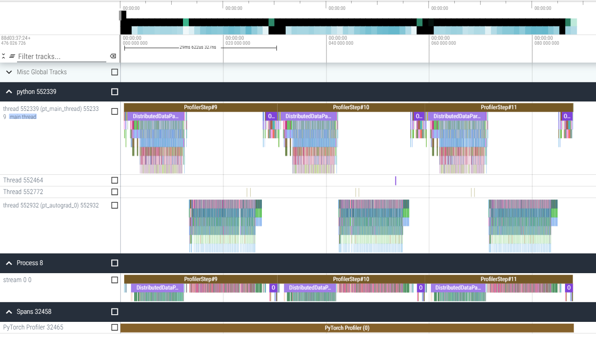
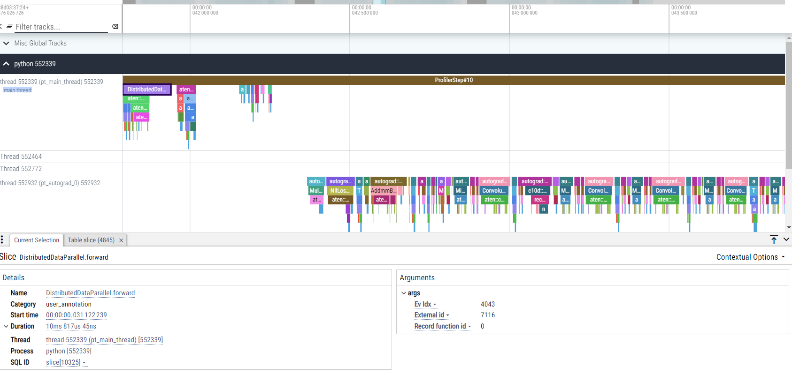
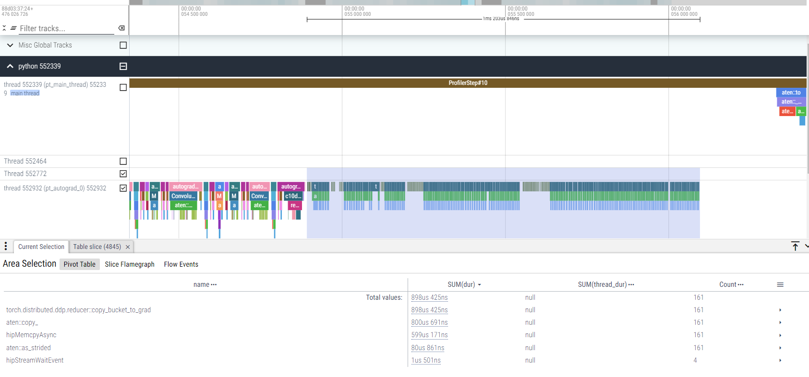

# Torch Profiler

The pytorch profiler is a built-in tool from pytorch with support and integration on AMD Instinct GPUs with ROCm. The pytorch documentation site has excellent information about the profiler's best practices: [Pytorch Profiler](https://pytorch.org/tutorials/recipes/recipes/profiler_recipe.html). It is unobtrusive, easy to use, and can be a useful first step in understanding the performance of a model to highlight areas for further investigation. Here, we will highlight some of the key steps to using it at scale and see trace output examples.

In the included python script, `train_cifar_100.py`, the pytorch profiler can be enabled with the argument `--torch-profile`. The profiler itself is initialized and used as a context in python:

```python
if args.torch_profile == True:
    from torch.profiler import profile, record_function, ProfilerActivity, schedule
    this_schedule = schedule(skip_first=3, wait=5, warmup=1, active=3,repeat=1)
    profiling_context = profile(activities=[ProfilerActivity.CPU, ProfilerActivity.CUDA], record_shapes=True, schedule=this_schedule)
else:
    import contextlib
    profiling_context = contextlib.nullcontext()
```

With this method of creation, the profiler limits its profiling iterations to just a few iterations, not including warm up, to keep the trace small and provide a representative slice of the application. The iteration is updated during the training loop:

```python 
if args.torch_profile and rank == 0:
    profiling_context.step()
```

and the output is both saved as a "Chrome trace" (json file compatible with Perfetto visualization tool) as well as printing the top kernels. This is restricted to only happening on rank 0, so that not all processes produce this output.

```python
if args.torch_profile and rank == 0:
    profiling_context.export_chrome_trace(f"trace_{epoch}_{i}.json")
    print(profiling_context.key_averages(group_by_stack_n=5).table(sort_by="cuda_time_total", row_limit=10))
```

On a single process, the overall trace looks like this when opened in Perfetto:



You can see clearly the iterative nature of the algorithm's training loop.  Zooming in on the transition between threads:



You can see here the end of the forward pass in the top thread, as well as the loss computation, and the `loss.backward()` call kicks off a chain of autograd-based computations to compute the gradients of the model. At the end of the backward pass, pytorch clearly performs collective operations and updates:




