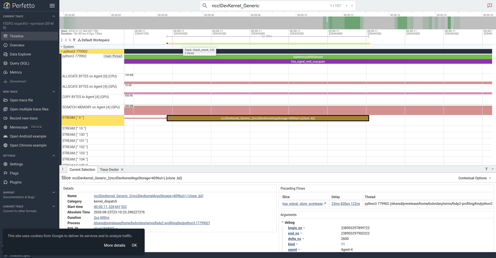

# rocprofiler-systems — FSDP2 (the prefetch-overlap timeline)

> Part of the [FSDP2 profiler guides](README.md). Read the shared
> [ground rules](README.md#ground-rules-or-your-numbers-are-noise) first. This is
> the FSDP2-specific companion to the cross-example
> [`../../common/profilers/rocprofiler-systems.md`](../../common/profilers/rocprofiler-systems.md).

[`rocprofv3 --sys-trace`](rocprofv3.md#3-timeline---sys-trace--perfetto) draws a
**GPU-centric** timeline. `rocprofiler-systems` (formerly Omnitrace) records the
**same** Perfetto timeline but adds the **host**: every CPU thread with sampled
call stacks, the Python/launch calls, and rocm-smi GPU busy/power counters. It
ships **inside the ROCm module** (`rocprof-sys-run` is on `PATH` after
`module load rocm` — there is no separate `rocprofiler-systems` module on this
stack). For FSDP2 that is exactly what you need to answer the one question that decides
efficiency: **does the all-gather of layer *N+1*'s parameters overlap the compute
of layer *N*, or does the GPU stall waiting for the gather?**

## The thing to look for

FSDP2 is efficient only when the just-in-time all-gather is **hidden** behind
compute (the collective is the fused `ncclDevKernel_Generic_2` on this RCCL — see
[rocprofv3](rocprofv3.md)):

- **Overlapped (good):** the collective for the next layer runs on a GPU `STREAM`
  queue *concurrently* with the current layer's GEMM/attention on another queue.
  The compute queue never goes idle for the gather.
- **Serialized (bad):** gather → compute → gather. The compute queue is **empty**
  during each collective. This points to a prefetch/overlap problem or a
  host-staged transport (check `iommu=pt`, `NCCL_DEBUG=INFO`).

## 1. Collect a host+GPU trace

`rocprof-sys-run` replaces the executable it profiles, so under `torchrun` wrap the
**per-rank Python** (not the launcher). The helper
[`rocsys_wrap.sh`](rocsys_wrap.sh) puts *only local rank 0* under rocprof-sys and
runs the other ranks bare so the collectives still complete:

```bash
salloc --gpus=4 --ntasks=1 --exclusive --time=00:30:00
module load rocm openmpi pytorch      # rocprof-sys-run ships inside the rocm module
export UPSTREAM=~/pytorch_examples/distributed/FSDP2

# host call-stack sampling is off by default — turn it on so the CPU rows appear
export ROCPROFSYS_USE_SAMPLING=ON
export ROCPROFSYS_SAMPLING_FREQ=1000
export ROCPROFSYS_USE_PROCESS_SAMPLING=OFF   # hide per-core counter rows (readable fig)
export ROCPROFSYS_TIME_OUTPUT=OFF

chmod +x ./rocsys_wrap.sh
torchrun --standalone --nproc_per_node=4 --no-python \
  ./rocsys_wrap.sh "$PWD/rsys" ../benchmarks/fsdp2_bench.py --warmup 2 --iters 3
```

This writes `rsys/**/*.proto` for rank 0.

> **Heads-up (ROCm 7.2.3):** driving this **headlessly in a batch job** can hang
> during rocprof-sys' instrumentation init before the model starts — collect it
> **interactively** in a `salloc`/desktop session, and wrap the command in
> `timeout 600 …` in any batch script. Because of this the repo ships the
> **rocprofv3 `--sys-trace` timeline** (below) as the committed GPU-side figure;
> rocprof-sys adds the host call-stack rows on top of that same picture when you
> capture it live.

## 2. RCCL tuning, seen on the timeline: `--explicit-prefetching`

The upstream `example.py` wires explicit prefetching behind
`--explicit-prefetching` (`set_modules_to_forward_prefetch` /
`set_modules_to_backward_prefetch`). Collect a trace **with** it and compare the
overlap to the baseline:

```bash
# baseline (default prefetch) vs explicit prefetching, same window
for tag in baseline prefetch; do
  flag=""; [ "$tag" = prefetch ] && flag="--explicit-prefetching"
  torchrun --standalone --nproc_per_node=4 --no-python \
    ./rocsys_wrap.sh "$PWD/rsys_$tag" ../benchmarks/fsdp2_bench.py --warmup 2 --iters 3 $flag
done
```

> `fsdp2_bench.py` sets up sharding directly; to exercise the upstream
> `--explicit-prefetching` path with the same knob, run the upstream `example.py`
> (see [`../README_rccl_optimization.md` §3b](../README_rccl_optimization.md#3b-prefetch-the-next-layers-all-gather--explicit-prefetching)),
> which accepts the flag and the prefetch **depth**.

**Expect:** with prefetching, the next layer's `ncclDevKernel_Generic_2` collective
slides **left** to sit under layer *N*'s GEMM — the compute queue stays busy and
per-step `step_s` drops, even though the RCCL byte volume is unchanged. Without it,
the compute queue shows a gap under each gather. TraceLens quantifies the same
thing: the [exposed-communication slice](tracelens.md#3-per-rank-perf-report-roofline--gpu_timeline)
of `gpu_timeline` (14 % here) is what shrinks as overlap improves.

## 3. View it: search a kernel, then zoom

Open the `.proto` (rocprof-sys) — or, for the committed figure below, the
[rocprofv3 `--sys-trace`](rocprofv3.md#3-timeline---sys-trace--perfetto) `.pftrace`
— at <https://ui.perfetto.dev> inside a graphical session (a browser is available
with `module load google-chrome/stable`):

1. Command palette (`>`) → **`Expand all`**.
2. Search `ncclDevKernel_Generic`, press **Enter** to jump to a collective.
3. Press **`f`** to zoom to it, then **`s`** a few times to widen to a full step.

Align three rows: the **host thread** (Python forward/backward, plus
`hipMemcpyWithStream` / `hsa_signal_wait` when sampling is on), the **GPU `STREAM`
queue** running GEMM, and the **queue running the collective**. Overlap between
the last two is the FSDP2 efficiency you are tuning for. In the GPU-side timeline
below the fused `ncclDevKernel_Generic_2` sits on `STREAM 0` while the host thread
and memory-copy rows run above it:



Reading it: if the compute `STREAM` is **busy** under the collective → overlapped
(good); if it is **empty** during the collective → serialized (bad — turn on
prefetching, §2). rocprof-sys' extra host call-stack rows tell you *what the CPU is
doing* in any stall (a launch, a `hsa_signal_wait`, or Python).

## 4. Capturing the screenshot

The committed figure is the rocprofv3 `--sys-trace` timeline captured headlessly
with [`screenshot_perfetto.py`](screenshot_perfetto.py) (see
[rocprofv3 §5](rocprofv3.md#5-capturing-the-screenshots)). To capture the **true
rocprof-sys** `.proto` (with host call-stacks), collect it interactively (§1 —
headless capture can hang on this stack) and run:

```bash
module load google-chrome/stable
export CHROME_BIN=$(command -v google-chrome)
python screenshot_perfetto.py rsys/**/*.proto \
  figs/fsdp2_rocsys_timeline.png "FSDP2 rocprof-sys rank0" 16000 ncclDevKernel_Generic 5
```

The `.proto` / `.pftrace` files are **not committed** (large binaries) —
regenerate with the commands above or the batch job.

> **Knobs that change the picture**
> | env var | default | effect |
> |---------|---------|--------|
> | `ROCPROFSYS_USE_SAMPLING` | `false` | **turn ON** — adds host call-stack rows |
> | `ROCPROFSYS_USE_PROCESS_SAMPLING` | `true` | CPU-freq / rocm-smi counter rows (turn OFF for a compact timeline) |
> | `ROCPROFSYS_SAMPLING_FREQ` | `1000` | host sampling rate (Hz) |

## 5. Participant exercises

1. **Overlap or stall?** In the trace, search `ncclDevKernel_Generic`, press `f`.
   *Is the neighboring compute `STREAM` busy or empty during the collective?*
2. **Turn prefetching on.** Collect the `--explicit-prefetching` trace (§2) and
   repeat. *Did the collective move under the previous GEMM? By how much did
   `step_s` drop while the RCCL byte volume stayed flat?*
3. **Sweep prefetch depth.** Using the upstream `example.py`, sweep
   `num_to_forward_prefetch` 1 → 2 → 3. *Where does extra overlap stop helping,
   and what happens to `peak_mem_mb` (more parameters gathered at once)?*
4. **Read a host stall.** With sampling on, click the host thread inside a gap and
   expand the sampled frames. *Which call is the CPU in — a launch, a wait, or
   Python?*

## See also

- [rocprofv3](rocprofv3.md) `--sys-trace` — the GPU-side timeline this extends
- [torch.profiler](torch-profiler.md) / [TensorBoard](tensorboard.md) — framework-native overlap view
- [TraceLens](tracelens.md) — quantify the exposed (non-overlapped) comm as skew
- [`../README_rccl_optimization.md` §3](../README_rccl_optimization.md#section-3--overlap-and-reshape-the-collectives-fsdp2-knobs) — the overlap levers
