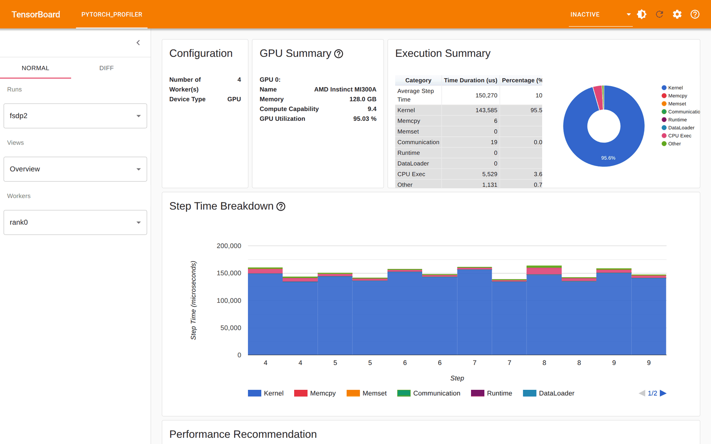

# TensorBoard (torch-tb-profiler) — FSDP2 (comm vs compute, visually)

> Part of the [FSDP2 profiler guides](README.md). Read the shared
> [ground rules](README.md#ground-rules-or-your-numbers-are-noise) first. This is
> the FSDP2-specific companion to the cross-example
> [`../../common/profilers/tensorboard.md`](../../common/profilers/tensorboard.md).

The `*.pt.trace.json` files written by [`--profile`](torch-profiler.md) load
directly into TensorBoard's **PyTorch Profiler** plugin, which gives the
*Overview*, *Operator*, *Kernel*, and *Trace* views — including a step-time
breakdown into **compute / communication / overlap / other**. For FSDP2 the
Overview's communication bar and the Trace view's overlap are the fastest visual
read of whether the all-gather is hidden behind compute.

## Install (venv layered on the module)

`tensorboard` and `torch-tb-profiler` are **not** in `pytorch/2.12.0`:

```bash
module load rocm openmpi pytorch
python -m venv --system-site-packages ~/venvs/tbprof
source ~/venvs/tbprof/bin/activate
pip install tensorboard torch-tb-profiler
```

## 1. Generate a trace, then launch TensorBoard

First produce a per-rank trace with [torch.profiler](torch-profiler.md). To also
get the **Distributed** view (per-rank comm/compute), put every rank's trace in
**one** run directory so TensorBoard sees them as one 4-worker run:

```bash
export UPSTREAM=~/pytorch_examples/distributed/FSDP2
torchrun --standalone --nproc_per_node=4 ../benchmarks/fsdp2_bench.py \
  --profile --profile-dir ./torch_prof
# collect all ranks into one run dir (enables the Distributed view)
mkdir -p tb_logs/fsdp2
for n in 0 1 2 3; do ln -sf "$(readlink -f torch_prof/rank$n/*.pt.trace.json)" \
  tb_logs/fsdp2/rank$n.pt.trace.json; done
tensorboard --logdir ./tb_logs --port 6006
```

Reach the GUI on port 6006 of the compute node:

- **SSH tunnel:** `ssh -L 6006:<node>:6006 aac6`, then browse
  <http://localhost:6006> locally (`man aac6_x11`).
- **Desktop:** `man aac6_vnc` / `man aac6_novnc`, open <http://localhost:6006> in
  the desktop browser.

## 2. What to read (FSDP2)

**Overview** confirms the setup and where the time goes. Actual capture (4-worker
run, MI300A):



- *Configuration / GPU Summary:* 4 workers, AMD Instinct MI300A, 128 GB, GPU
  utilization **95.0 %** — a compute-bound step.
- *Execution Summary:* average step **150,270 µs**; Kernel **143,585 µs (95.5 %)**,
  CPU Exec 5,529 µs (3.6 %), Communication **19 µs (0.0 %)**.

> **The Communication slice reads ~0 % — and that is a trap.** torch-tb-profiler
> classifies communication by kernel *name*, and RCCL 2.27's fused
> `ncclDevKernel_Generic_2` is **not** recognized as a collective, so its time is
> counted as **Kernel/compute**. The 44 % RCCL share that
> [rocprofv3](rocprofv3.md#1-per-kernel-totals---kernel-trace---stats) and
> [torch.profiler](torch-profiler.md#1-baseline-the-per-op--rccl-table) measure is
> hidden here. Treat TensorBoard's Overview as the compute/step-time view and use
> [TraceLens](tracelens.md#4-the-rccl-report-per-collective-bandwidth--skew) for
> the true communication split on this stack.

- **Distributed view** (visible because all 4 ranks are in one run): per-rank
  *Computation / Communication / Overlap* bars and a communication matrix — the
  best TensorBoard view for spotting an imbalanced (skewed) rank.
- **Trace view.** Find a `ProfilerStep`, then look for whether the
  `ncclDevKernel_Generic_2` slice on the RCCL stream sits *under* the GEMM slice on
  the compute stream (overlapped) or *between* GEMMs (serialized). This is the same
  picture as the [torch.profiler Perfetto view](torch-profiler.md#4-viewing-the-trace).
- **Kernel view.** The GEMM- (transformer) dominated breakdown, with
  `ncclDevKernel_Generic_2` listed alongside — the same totals as
  [rocprofv3 `--stats`](rocprofv3.md#1-per-kernel-totals---kernel-trace---stats).

## 3. RCCL tuning, seen in the breakdown

Generate two traces into **separate** logdirs and flip between them in the run
selector (top-left) to watch the Communication/Overlap bars change:

```bash
torchrun --standalone --nproc_per_node=4 ../benchmarks/fsdp2_bench.py \
  --profile --profile-dir ./tb_fp32
torchrun --standalone --nproc_per_node=4 ../benchmarks/fsdp2_bench.py \
  --profile --profile-dir ./tb_bf16 --mixed-precision
tensorboard --logdir_spec fp32:./tb_fp32,bf16:./tb_bf16 --port 6006
```

**Expect:** the bf16 run's Communication slice shrinks (smaller all-gather bytes)
and the compute (Kernel) slice shrinks too (bf16 GEMMs) — the same effect the
[torch.profiler table](torch-profiler.md#3-rccl-tuning-seen-in-the-table-bf16-paramsgrads)
shows as numbers, here as bars you can eyeball side by side.

## 4. Capturing the screenshots

TensorBoard is a live web GUI, so the Overview is captured with a headless browser
pointed at the running server (no display needed) by
[`shot_tensorboard.py`](shot_tensorboard.py), which starts TensorBoard, waits for
the port, and screenshots the plugin:

```bash
module load google-chrome/stable
export CHROME_BIN=$(command -v google-chrome)
python shot_tensorboard.py ./tb_logs figs/fsdp2_tb_overview.png figs/fsdp2_tb_second.png 6007
```

The **Overview** captures cleanly headlessly; the *Distributed / Trace / Kernel*
views are behind an Ant Design dropdown that is unreliable to drive headlessly, so
capture those interactively in a `man aac6_vnc` desktop. The trace JSONs are
regenerated by [`submit_timeline_traces.sbatch`](submit_timeline_traces.sbatch);
they are **not committed**.

## 5. Participant exercises

1. **Spot the misclassification.** In the Overview, read the *Communication*
   percentage (~0 %). *Why is it ~0 when rocprofv3 says RCCL is ~44 %?* (Answer:
   the fused `ncclDevKernel_Generic_2` name isn't recognized as a collective — see
   the caveat in §2.) Which tool gives the honest comm number?
2. **bf16 A/B.** Load `fp32` and `bf16` runs (§3). *Which bars shrink, and by how
   much — the Kernel slice (bf16 GEMMs) should drop sharply.*
3. **Overlap in the Trace view.** Zoom a `ProfilerStep`. *Is the
   `ncclDevKernel_Generic_2` under a GEMM (overlapped) or between them
   (serialized)?* Cross-check against
   [rocprofiler-systems](rocprofiler-systems.md).
4. **Read the Distributed view.** With all 4 ranks in one run, open *Distributed*.
   *Which rank has the largest Communication bar?* Cross-check against the
   [TraceLens straggler summary](tracelens.md#4-the-rccl-report-per-collective-bandwidth--skew).

## See also

- [torch.profiler](torch-profiler.md) — produces the trace TensorBoard reads
- [rocprofiler-systems](rocprofiler-systems.md) — Perfetto timeline alternative
- [TraceLens](tracelens.md) — the same overlap/comm split as a quantified table + roofline
