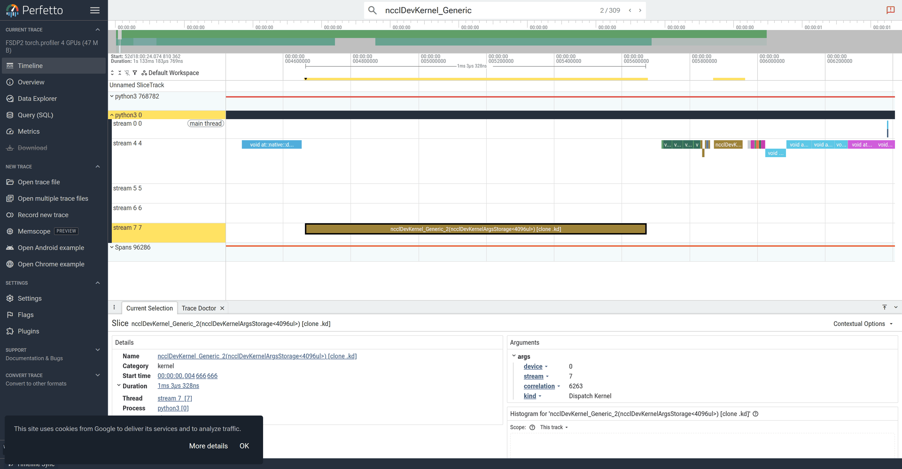

# torch.profiler (Kineto) — FSDP2 (the RCCL collective table)

> Part of the [FSDP2 profiler guides](README.md). Read the shared
> [ground rules](README.md#ground-rules-or-your-numbers-are-noise) first. This is
> the FSDP2-specific companion to the cross-example
> [`../../common/profilers/torch-profiler.md`](../../common/profilers/torch-profiler.md).

`torch.profiler` is the **first stop** for FSDP2: it speaks the framework's
language (ops, `nccl:all_gather` / `nccl:reduce_scatter`, module names) and needs
no extra tooling — it ships in `pytorch/2.12.0`. On ROCm the `CUDA` activity set
captures HIP kernels **and** the RCCL collective kernels, so one table attributes
time to compute (GEMM / attention) vs. the two sharded-comm phases.

The benchmark [`../benchmarks/fsdp2_bench.py`](../benchmarks/fsdp2_bench.py) has
two built-in paths that both use `torch.profiler`:

- `--profile` — wraps a fixed window (wait=1/warmup=3/active=6) in
  `torch.profiler.profile`, prints the rank-0 key-averages table, and writes a
  per-rank Kineto/TensorBoard trace (`rank0/…pt.trace.json`).
- `--rccl-time` — sums the on-GPU device time of the `nccl*` kernels per step and
  reports it as `rccl_s` on the `RESULT` line (via
  [`../../common/rccl_time.py`](../../common/rccl_time.py)). This is the single
  number the RCCL exercises move.

## 1. Baseline: the per-op / RCCL table

```bash
salloc --gpus=4 --ntasks=1 --exclusive --time=00:30:00
module load rocm openmpi pytorch
export UPSTREAM=~/pytorch_examples/distributed/FSDP2   # if not already cloned

torchrun --standalone --nproc_per_node=4 ../benchmarks/fsdp2_bench.py \
  --profile --profile-dir ./torch_prof
```

Rank 0 prints the key-averages table (sorted by CUDA time). The **shape** to
recognize for a genuinely sharded model: no `AllReduce`, but both an all-gather
(forward **and** backward) and a reduce-scatter (backward). Actual rank-0 rows on
MI300A (16 layers, dim 1024, 4 GPUs, fp32), abridged:

```
Name                                       Self CUDA   Self CUDA %   # of Calls
----------------------------------------   ---------   -----------   ----------
aten::mm  (GEMM)                            462.8 ms      38.7%         1554
ncclDevKernel_Generic_2(...)  (RCCL)        420.9 ms      35.2%          309
nccl:_all_gather_base                       323.6 ms      27.0%          198
aten::_efficient_attention_backward          79.2 ms       6.6%           96
nccl:_reduce_scatter_base                    70.3 ms       5.9%          102
----------------------------------------
Self CUDA time total: 1.197 s
```

> **RCCL 2.27 fuses the collectives into one device kernel.** On this stack the
> on-GPU work of *every* collective shows up as `ncclDevKernel_Generic_2` — you
> will **not** see `ncclDevKernel_AllGather_RING_LL` / `…_ReduceScatter_…` rows.
> The all-gather vs. reduce-scatter split is instead visible on the
> **framework** rows `nccl:_all_gather_base` (27.0 %) and
> `nccl:_reduce_scatter_base` (5.9 %). Search the Perfetto timeline for
> `ncclDevKernel_Generic`, not `…AllGather`.

Together the collectives are the communication share the RCCL exercises attack.
`all_gather` appears in **both** forward and backward (198 calls vs. 102 for
reduce-scatter — parameters are re-gathered for the backward unless you set
`reshard_after_forward=False`).

> **Caveat — the per-op Self CUDA is skew-inflated.** A rank that finishes its
> collective early still shows the *full* kernel duration while it waits for the
> slowest rank, so `nccl:_all_gather_base = 323 ms` overstates the true transport
> cost. [TraceLens](tracelens.md) separates real comm latency (~76 ms exposed
> here) from inter-rank skew; use it for the honest number.

> **See the op, not just the kernel.** Sort by name or grep the table for
> `nccl:` to see the framework-level ops (`nccl:_all_gather_base`,
> `nccl:_reduce_scatter_base`) alongside the device kernels. `record_shapes=True`
> and `profile_memory=True` are already on in
> [`fsdp2_bench.py`'s `profile_steps`](../benchmarks/fsdp2_bench.py); add
> `with_stack=True` there for a source view (extra overhead).

## 2. The one number: `RCCL_TOTAL_MS` / `rccl_s`

For a scalar you can A/B across edits, use `--rccl-time`:

```bash
torchrun --standalone --nproc_per_node=4 ../benchmarks/fsdp2_bench.py \
  --rccl-time --iters 20 | grep RESULT
# RESULT world_size=4 step_s=0.133 tokens_per_s=123024 peak_mem_mb=6394 \
#   local_shard_params=267.5M rccl_s=<measured>
```

`rccl_s` is the summed all-gather + reduce-scatter **device** time per step (a
lower bound on wall-clock comm — it excludes launch/wait/overlap, but is measured
identically every run, which is what makes the comparison meaningful). The clean
per-step time on 4 GPUs here is ~0.133 s (123 k tokens/s); the profiled window
runs slower because of tracing overhead.

## 3. RCCL tuning, seen in the table: bf16 params/grads

The all-gather moves parameters in their storage dtype; the reduce-scatter moves
gradients in `reduce_dtype`. Casting to bf16 **halves** the all-gather bytes.
Rerun the *same* command with `--mixed-precision`:

```bash
# baseline
torchrun --standalone --nproc_per_node=4 ../benchmarks/fsdp2_bench.py --rccl-time | grep RESULT
# bf16 params / fp32 reduce  (the all-gather shrinks; the reduce-scatter does not)
torchrun --standalone --nproc_per_node=4 ../benchmarks/fsdp2_bench.py --rccl-time --mixed-precision | grep RESULT
```

**What actually moves (measured, rank-0 Self CUDA):** the clearest bf16 win is
**compute** — the GEMMs drop ~3.6×, which *raises* communication's share of the
step and is precisely when the RCCL levers start to matter:

| Metric (rank 0) | fp32 baseline | `--mixed-precision` (bf16/fp32) |
|-----------------|--------------:|--------------------------------:|
| `aten::mm` (GEMM) Self CUDA | 462.8 ms | **127.2 ms** |
| all-gather message size (TraceLens) | 48 MB (fp32) | **24 MB (bf16 params)** |
| `nccl:_all_gather_base` Self CUDA | 323.6 ms | 270.2 ms* |
| `nccl:_reduce_scatter_base` Self CUDA | 70.3 ms | 300.2 ms* |

> **\*Do not read the collective rows as clean before/after.** On a single MI300A
> the per-op Self CUDA is dominated by **inter-rank skew**, not bytes, so it is
> noisy across runs (here the reduce-scatter row even *rose*). bf16 halves the
> all-gather **byte volume** — read that in the [TraceLens collective
> report](tracelens.md#4-the-rccl-report-per-collective-bandwidth--skew) (message
> size / bus bandwidth), not in this kernel total.

To also halve the reduce-scatter bytes, edit `reduce_dtype=torch.bfloat16` by hand
(see [`../README_rccl_optimization.md` §1a](../README_rccl_optimization.md#1a-bf16-parameters-and-gradients-mixedprecisionpolicy)) —
keep `float32` if convergence matters.

> The RCCL signal is small when all ranks share one MI300A (on-package fabric is
> nearly free): TraceLens measures the all-gather at ~100 GB/s bus bandwidth but
> with **skew larger than the comm latency itself** — this run is skew-bound, not
> link-bound. Rerun with more GPUs — the `PPAC_MI300A_CPX` 12-/24-GPU cases, where
> collectives cross physical APUs — for a stronger transport signal.

## 4. Viewing the trace

The `--profile` run also writes `./torch_prof/rank0/*.pt.trace.json` (one per
rank). Three ways to read it:

- **Perfetto:** open the JSON at <https://ui.perfetto.dev> (drag-and-drop) inside
  an AAC6 graphical session (`man aac6_vnc` / `man aac6_novnc` / `man aac6_x11`).
  Search `ncclDevKernel_Generic` to jump to a collective and see whether it
  overlaps the compute stream (the RCCL kernel runs on its own HIP stream — e.g.
  `stream 7` — concurrently with the GEMM stream).
- **TensorBoard:** the richer GUI (step-time comm/compute split, kernel view) —
  see [`tensorboard.md`](tensorboard.md).
- **TraceLens:** turn the same JSON into a quantified RCCL bandwidth/skew table
  and a per-op roofline **without** hand-reading Perfetto — see
  [`tracelens.md`](tracelens.md). This is the recommended next step.

## 5. Capturing the screenshots

The Perfetto render of the Kineto trace is captured headlessly with
[`screenshot_perfetto.py`](screenshot_perfetto.py) (see
[`submit_timeline_traces.sbatch`](submit_timeline_traces.sbatch)):

```bash
module load google-chrome/stable
export CHROME_BIN=$(command -v google-chrome)
python screenshot_perfetto.py ./torch_prof/rank0/*.pt.trace.json \
  figs/fsdp2_torch_allgather.png "FSDP2 torch.profiler" 16000 ncclDevKernel_Generic 6
```



The selected kernel is the fused RCCL collective (`ncclDevKernel_Generic_2`, ~763 µs
here) on `stream 7`; the compute kernels run concurrently on `stream 4` — visual
confirmation that FSDP2's all-gather overlaps compute.

## 6. Participant exercises

1. **Confirm it is really sharded.** Grep the rank-0 table for `AllReduce`. It
   should be **absent** — FSDP2 uses all-gather + reduce-scatter. Which op appears
   in both the forward and backward regions of the trace?
2. **Split compute from comm.** Sum the `ncclDevKernel_*` rows and divide by the
   `Self CUDA time total`. *What fraction is communication at 2 vs 4 GPUs?* (Rerun
   with `--nproc_per_node=2`.)
3. **Move the number.** Record `rccl_s` for the fp32 baseline, then
   `--mixed-precision`. *How close to half did the all-gather share fall? Why did
   the reduce-scatter barely move?* (Answer: `reduce_dtype` is still fp32.)
4. **Remove the backward all-gather.** By hand, add `reshard_after_forward=False`
   (see [`../README_rccl_optimization.md` §3a](../README_rccl_optimization.md#3a-keep-parameters-gathered-after-forward--reshard_after_forward)).
   *Does the all-gather call count drop? What happens to `peak_mem_mb`?*

## See also

- [rocprofv3](rocprofv3.md) — framework-independent kernel + RCCL trace
- [rocprofiler-systems](rocprofiler-systems.md) — the prefetch-overlap timeline
- [TensorBoard](tensorboard.md) — GUI over this trace
- [TraceLens](tracelens.md) — automated RCCL bandwidth/skew + roofline from this trace
- [`../README_rccl_optimization.md`](../README_rccl_optimization.md) — the levers this table measures
