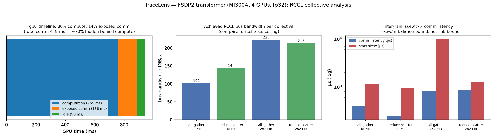

# TraceLens — FSDP2 (automated RCCL bandwidth/skew + roofline)

> Part of the [FSDP2 profiler guides](README.md). Read the shared
> [ground rules](README.md#ground-rules-or-your-numbers-are-noise) first. See the
> repo's tool overview at [`../../../TraceLens/README.md`](../../../TraceLens/README.md).

[TraceLens](https://github.com/AMD-AGI/TraceLens) is AMD's open-source tool that
**post-processes a profiler trace** into structured reports — so it needs **no
extra run**: point it at the `*.pt.trace.json` that
[`--profile`](torch-profiler.md) already wrote. For FSDP2 it answers the two
questions the raw trace makes you compute by hand:

- **Communication:** for each collective (`allgather`, `reduce_scatter`), the
  message size, **algorithmic and bus bandwidth**, and the **inter-rank skew** —
  the time one rank spends *waiting* for others, separated from true comm time.
  Skew is the scaling killer that a single-rank kernel total hides.
- **Compute:** a per-operator **roofline** (TFLOP/s, TB/s, % of peak, and a
  compute-bound vs memory-bound verdict) for the GEMM/attention kernels, plus a
  `gpu_timeline` sheet splitting the step into compute / communication / copy /
  idle.

This is the recommended follow-up to every other guide here: run the profiler
once, then let TraceLens quantify what Perfetto shows visually.

## 1. Install (module, or venv layered on the module)

On this stack TraceLens is available as a module — the simplest path:

```bash
module load rocm openmpi pytorch tracelens/dev
TraceLens_generate_perf_report_pytorch --help    # confirm it is on PATH
```

If the module is absent (or you want a specific version), pip-install into a venv:

```bash
module load rocm openmpi pytorch
python -m venv --system-site-packages ~/venvs/tracelens
source ~/venvs/tracelens/bin/activate
pip install git+https://github.com/AMD-AGI/TraceLens.git
```

Build the venv on a **login node** (it needs network); run the reports on either.

## 2. Get a trace (all ranks, for the collective report)

The multi-rank collective report needs **every rank's** trace, so profile all
ranks. `fsdp2_bench.py --profile` already writes one per rank under
`--profile-dir`:

```bash
salloc --gpus=4 --ntasks=1 --exclusive --time=00:30:00
export UPSTREAM=~/pytorch_examples/distributed/FSDP2
torchrun --standalone --nproc_per_node=4 ../benchmarks/fsdp2_bench.py \
  --profile --profile-dir ./torch_prof
# -> ./torch_prof/rank0/*.pt.trace.json, rank1/…, rank2/…, rank3/…
```

## 3. Per-rank perf report (roofline + gpu_timeline)

```bash
TraceLens_generate_perf_report_pytorch \
  --profile_json_path ./torch_prof/rank0/*.pt.trace.json \
  --gpu_arch_json_path ../../../TraceLens/mi300.json
```

This writes an Excel workbook (or CSVs with `--output_csvs_dir`) next to the
trace. Sheets to read for FSDP2, with **actual rank-0 numbers** (MI300A, 4 GPUs,
fp32):

- **`gpu_timeline`** — the high-level compute / communication / idle split:

  | slice | time (ms) | % |
  |-------|----------:|--:|
  | computation | 755.1 | 80.0 |
  | exposed communication | 135.6 | 14.4 |
  | idle | 53.4 | 5.7 |
  | *total* communication (incl. overlapped) | 419.0 | 44.4 |

  The key insight: total comm is **44 %** of GPU time but only **14 % is
  *exposed*** — FSDP2 already overlaps ~70 % of the collectives behind compute.
  The remaining exposed slice is what the [prefetch lever](rocprofiler-systems.md)
  targets.
- **`ops_summary_by_category`** — GPU time grouped: GEMM **569.8 ms (74.1 %)**,
  SDPA_bwd 79.2 ms (10.3 %), SDPA_fwd 27.4 ms (3.6 %), elementwise 25.8 ms
  (3.4 %). The fastest "where does the time go" view — this is a **compute-bound**
  step.
- **Roofline columns** (added by `--gpu_arch_json_path`) — for each op, FLOPS/Byte
  (arithmetic intensity), achieved TFLOP/s and TB/s, **% of roofline**, and a
  `COMPUTE_BOUND` / `MEMORY_BOUND` verdict. On MI300 the knee is
  `Peak FLOPS / Peak BW`; the transformer GEMMs land near compute-bound, the
  layernorm/elementwise ops memory-bound. This is the **compute-optimization**
  half — it tells you which kernels have headroom before you reach for
  `torch.compile` or a fused optimizer (see
  [`../README_compute_optimization.md`](../README_compute_optimization.md)).

## 4. The RCCL report: per-collective bandwidth + skew

This is the FSDP2-specific payoff. The multi-rank collective report reads **every
rank's** trace from a directory, but it expects them named `rank{N}_trace.json`,
so symlink the per-rank files into that convention first and pass `--world_size`:

```bash
cd torch_prof
for n in 0 1 2 3; do ln -sf rank$n/*.pt.trace.json rank${n}_trace.json; done
cd ..

TraceLens_generate_multi_rank_collective_report_pytorch \
  --trace_dir ./torch_prof --world_size 4 --gpus_per_node 4 \
  --output_xlsx_path ./torch_prof/nccl_analysis_report.xlsx \
  --output_csvs_dir  ./torch_prof/nccl_csvs
```

It matches each collective across ranks and writes
`nccl_csvs/nccl_summary_implicit_sync.csv`. **Actual measured** rows (MI300A, 4
GPUs, fp32; the two message sizes are the per-layer 48 MB collectives and the
larger 252 MB embedding/output collectives):

| Collective | Msg (MB) | count | comm latency µs | algo bw GB/s | bus bw GB/s | start skew µs |
|------------|---------:|------:|----------------:|-------------:|------------:|--------------:|
| all-gather | 48.0 | 192 | 396 | 136 | **102** | **1163** |
| reduce-scatter | 48.0 | 96 | 246 | 192 | **144** | 925 |
| all-gather | 252.0 | 6 | 827 | 297 | **223** | **9749** |
| reduce-scatter | 252.0 | 6 | 867 | 284 | **213** | 1253 |

How to read it for FSDP2 tuning:

- **`bus bw (GB/s)`** — the effective inter-GPU bandwidth the collective achieved.
  Compare it to the **rccl-tests ceiling** for the same collective and message
  size (see [the ceiling note](README.md#the-communication-ceiling-rccl-tests--transferbench)).
  The 48 MB collectives reach ~100–144 GB/s and the 252 MB ones ~210–223 GB/s —
  larger messages amortize latency and get closer to the link ceiling.
- **`start skew µs`** — time ranks spend waiting for the slowest rank to *arrive*.
  Here it is **larger than the comm latency itself** (1163 µs skew vs. 396 µs
  latency for the 48 MB all-gather; 9749 µs vs. 827 µs for the 252 MB one) — so
  this run is **skew / load-imbalance-bound, not link-bound**. The fix is overlap
  and balance, not a faster transport. A raw kernel total (rocprofv3, or the
  [torch.profiler Self-CUDA](torch-profiler.md#1-baseline-the-per-op--rccl-table))
  cannot separate this from real comm; TraceLens can. The `straggler_summary.csv`
  confirms it: rank 3 finishes its collectives in 156 ms total, rank 2 takes
  442 ms.
- **`Msg (MB)`** — confirms the byte volume the bf16 lever halves (48 → 24 MB).



## 5. RCCL tuning, quantified: before/after compare

Generate a report for the baseline and for one lever, then diff them:

```bash
# baseline
torchrun --standalone --nproc_per_node=4 ../benchmarks/fsdp2_bench.py \
  --profile --profile-dir ./tl_fp32
TraceLens_generate_perf_report_pytorch --profile_json_path ./tl_fp32/rank0/*.pt.trace.json \
  --gpu_arch_json_path ../../../TraceLens/mi300.json

# bf16 params/grads (halves the all-gather bytes)
torchrun --standalone --nproc_per_node=4 ../benchmarks/fsdp2_bench.py \
  --profile --profile-dir ./tl_bf16 --mixed-precision
TraceLens_generate_perf_report_pytorch --profile_json_path ./tl_bf16/rank0/*.pt.trace.json \
  --gpu_arch_json_path ../../../TraceLens/mi300.json

# quantify the delta (per-op and per-collective)
TraceLens_compare_perf_reports_pytorch \
  --report_a ./tl_fp32/rank0/*.xlsx --report_b ./tl_bf16/rank0/*.xlsx
```

**Expect:** the collective report shows the `allgather` **message size** halve
under bf16 (48 → 24 MB), while `reduce_scatter` (still fp32 reduce) holds; and the
per-op compare shows the **GEMM time drop ~3.6×** (the dominant bf16 win). The raw
comm *latency* on one MI300A is skew-dominated and moves less cleanly than the byte
count — the same caveat as the
[torch.profiler table](torch-profiler.md#3-rccl-tuning-seen-in-the-table-bf16-paramsgrads),
now with bandwidth and skew attached so you can see *why*. Repeat the compare for
`NCCL_ALGO=Tree` (see [rocprofv3 §2](rocprofv3.md#2-rccl-tuning-seen-in-the-totals-nccl_algo--nccl_proto))
to see whether the bus bandwidth or the skew is what moved.

## 6. SDK / notebooks (optional deeper analysis)

TraceLens also ships a Python SDK and example notebooks (vendored in this repo):

- [`../../../TraceLens/Trace2Tree.ipynb`](../../../TraceLens/Trace2Tree.ipynb) —
  walk the CPU→GPU launch tree and do per-op roofline programmatically.
- [`../../../TraceLens/TraceFusion.ipynb`](../../../TraceLens/TraceFusion.ipynb) —
  **merge the per-rank traces into one** for multi-GPU visual analysis in
  Perfetto, with NCCL-only / GPU-kernel-only filtering — useful to view all four
  ranks' all-gathers on a single timeline.
- [`../../../TraceLens/EventReplay.ipynb`](../../../TraceLens/EventReplay.ipynb) —
  isolate and replay a single kernel for a standalone reproducer.

## 7. Capturing the screenshots

The report is an Excel/CSV workbook, so rather than screenshot a spreadsheet the
figure above is rendered directly from the collective CSV +  `gpu_timeline`
numbers by [`make_tracelens_fig.py`](make_tracelens_fig.py):

```bash
python make_tracelens_fig.py figs/fsdp2_tracelens_collective.png
```

It reads `torch_prof/nccl_csvs/nccl_summary_implicit_sync.csv` when present (so it
tracks a fresh run) and falls back to the measured values baked into the script.
The input trace JSONs and workbooks are regenerated by
[`submit_timeline_traces.sbatch`](submit_timeline_traces.sbatch) (which also runs
these TraceLens commands) and are **not committed**.

## 8. Participant exercises

1. **Read the true comm.** From the collective report (§4), find `allgather`'s
   `bus bw` and `skew`. *Is this run link-limited or skew-limited?* Compare `bus bw`
   to the rccl-tests ceiling.
2. **Halve the bytes.** Run the bf16 compare (§5). *By how much did the `allgather`
   message size and latency drop? Why did `reduce_scatter` stay put?*
3. **Roofline the compute.** In the per-rank report, find the top GEMM. *Is it
   compute- or memory-bound, and what % of roofline?* Decide whether
   `torch.compile` (fusion) or a bigger batch would help.
4. **Change the algorithm.** Compare a `NCCL_ALGO=Tree` report to the Ring
   baseline. *Did `bus bw` rise, or did `skew` fall — and which matters more at
   your GPU count?*

## See also

- [torch.profiler](torch-profiler.md) — produces the trace TraceLens reads
- [rocprofv3](rocprofv3.md) — TraceLens also reads rocprofv3 JSON / pftrace traces
- [rocprofiler-systems](rocprofiler-systems.md) — the visual counterpart to the skew number
- [`../README_rccl_optimization.md`](../README_rccl_optimization.md) / [`../README_compute_optimization.md`](../README_compute_optimization.md) — the levers this report quantifies
