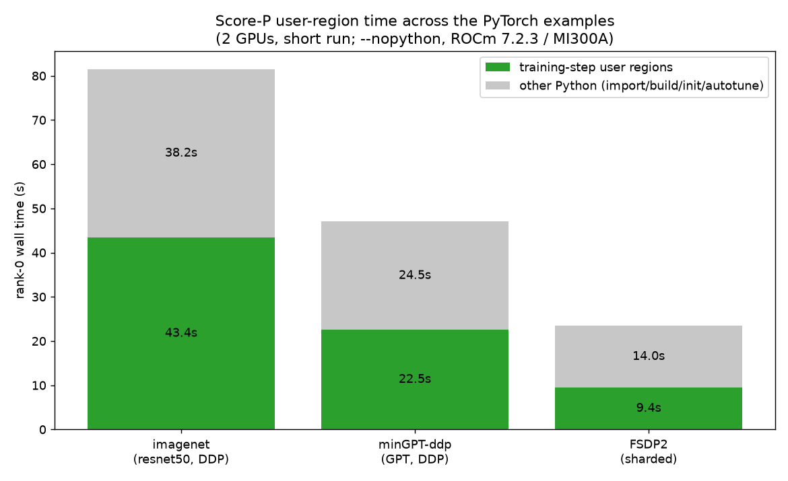

# Score-P — PyTorch examples (Python training-loop regions)

> Shared guide for [`imagenet`](../../imagenet/profiling/PROFILING.md),
> [`minGPT-ddp`](../../minGPT-ddp/PROFILING.md), and [`FSDP2`](../../FSDP2/PROFILING.md).
> Read each example's *Ground rules* first.

[Score-P](https://www.vi-hps.org/projects/score-p/) instruments the **Python
training loop** and writes a per-rank **CUBE4 profile** (`profile.cubex`, opened in
CubeGUI) and optional **OTF2 trace**. For these examples it captures the hand-placed
**user regions** around the training step, letting you compare the RCCL-synchronized
step against the compute-only (`no_sync`) step across ranks.

> **What Score-P does *not* capture here (important).** The PyTorch module is built
> on **ROCm 7.2.x**, where the Score-P ROCm adapter aborts, and `torchrun` uses
> **RCCL** (not MPI). So Score-P records **Python regions only** — not GPU kernels
> and not RCCL. For GPU/RCCL detail use [torch.profiler](torch-profiler.md),
> [rocprofv3](rocprofv3.md), or [rocprofiler-systems](rocprofiler-systems.md). Score-P
> is the right tool when you want **per-rank, phase-level timing of your own Python
> code** in the same Cube/OTF2 format as the [CG solver](../../../../MPI-examples/cg-solver-example/docs/profilers/scorep.md).
>
> Full **automatic** Python instrumentation of PyTorch is impractically heavy (it
> intercepts every Python call), so this integration uses `--nopython` plus a few
> **user regions** — see [Annotating your own code](#5-annotating-your-own-code).

> **Verified on AAC6 / MI300A — ROCm 7.2.3, PyTorch 2.12.0, Score-P 11.0-dev,
> 2 GPUs.** All text output and the figure below are from those runs.

## 1. One-time setup (Score-P Python bindings)

The `scorep` module provides the measurement system and the OTF2 Python bindings,
but **not** the Score-P Python *instrumentation* bindings (`import scorep`). Install
those once into a venv layered on the PyTorch module — **on a login node** (it has
network; the compute nodes do not):

```bash
module load rocm/7.2.3 openmpi pytorch/2.12.0 scorep/11.0-dev
python -m venv --system-site-packages ~/scorep-venvs/ml-7.2.3
source ~/scorep-venvs/ml-7.2.3/bin/activate
pip install scorep          # builds the binding against scorep-config
python -c "import torch, scorep; print(torch.__version__, scorep.__version__)"
```

The binding needs `libpapi.so.7.1`, which is present on the **compute** nodes (not
the login node) — so **build the venv on login, run on a compute node**.

## 2. Run under Score-P

Use the shared launcher [`../scorep_launch.sh`](../scorep_launch.sh) inside a GPU
allocation. It runs `torchrun --no-python` so each worker executes
`python -m scorep <script>` with its own per-rank experiment directory, sets
`SCOREP_ML=1` (activating the [`scorep_ml.region()`](../scorep_ml.py) annotations),
and prints a rank-0 text summary.

```bash
srun -p <partition> --exclusive --gres=gpu:4 -t 00:20:00 --pty bash
module load rocm/7.2.3 openmpi pytorch/2.12.0 scorep/11.0-dev
VENV=~/scorep-venvs/ml-7.2.3         # the launcher default is ~/scorep-venvs/ml

# imagenet (ResNet-50, DDP)
cd imagenet
NPROC=2 VENV=$VENV ../common/scorep_launch.sh \
  ddp_resnet_bench.py -a resnet50 -b 64 --warmup 5 --iters 10

# minGPT-ddp (GPT, DDP)
cd ../minGPT-ddp
NPROC=2 VENV=$VENV ../common/scorep_launch.sh \
  ddp_gpt_bench.py --warmup 5 --iters 10

# FSDP2 (sharded)
cd ../FSDP2
NPROC=2 VENV=$VENV ../common/scorep_launch.sh \
  fsdp2_bench.py --warmup 5 --iters 10
```

Each run writes `scorep_<script>/rank_<N>/` containing `profile.cubex` (and
`traces.otf2` if you pass `SCOREP_TRACE=1`). Useful overrides: `NPROC`,
`SCOREP_EXP_BASE`, `SCOREP_TRACE=1`, `VENV`.

## 3. Text output

Rank-0 summary printed by the launcher (`scorep-score`), ResNet-50 example:

```
flt     type max_buf[B] visits time[s] time[%]  time/visit[us]  region
         ALL        399     13   81.53   100.0      6271517.63  ALL
         USR        288     12   43.37    53.2      3614386.29  USR
      SCOREP        111      1   38.16    46.8     38157093.75  SCOREP
```

And the flat region profile (`cube_stat -p -m time`):

```
Routine                           time
INCL(python3.12)             81.529729
  EXCL(python3.12)           38.157094      <- import torch / model build / dist init / MIOpen autotune
  user:train_step_sync       43.244023      <- DDP steps (grad all-reduce over RCCL)
  user:train_step_nosync      0.128612      <- no_sync steps (compute only)
```

> **Reading it.** `train_step_sync` vs `train_step_nosync` is the DDP communication
> signal. In this short run the **warmup steps also run with `sync=True`**, and the
> first steps include one-off **MIOpen autotune**, so `train_step_sync` is inflated;
> raise `--warmup`/`--iters` for a steady-state comparison. `EXCL(python)` is the
> uninstrumented Python (setup) time outside the regions.

minGPT-ddp and FSDP2 look the same, with `user:train_step_sync`/`train_step_nosync`
(minGPT) and `user:train_step` (FSDP2).

## 4. Figure

The committed [`figs/make_scorep_ml_fig.py`](figs/make_scorep_ml_fig.py) turns the
saved `*_cube_stat.txt` into a comparison across the three examples:

```bash
source ~/scorep-venvs/figs/bin/activate     # a venv with matplotlib
cd common/profilers/figs && python make_scorep_ml_fig.py   # -> scorep_ml_breakdown.png
```



Green is the time in the training-step user regions; grey is the remaining Python
(import/build/init/autotune) that lands outside the regions.

## 5. Annotating your own code

The examples are annotated with a **zero-cost, opt-in** helper,
[`../scorep_ml.py`](../scorep_ml.py) — `region()` records a Score-P user region only
when the launcher sets `SCOREP_ML=1`, and is a no-op otherwise (so normal
`torchrun` runs are unchanged). To add your own regions:

```python
from scorep_ml import region     # common/ is on sys.path via the examples' header

with region("dataloader"):
    batch = next_batch()
with region("forward"):
    out = model(batch)
with region("backward"):
    loss.backward()
```

Nest freely; CubeGUI shows the call tree. Keep regions **coarse** (phase-level) —
per-tensor-op regions defeat the point and add overhead.

## 6. Graphics: CubeGUI and the trace, remotely

CubeGUI is not installed on the cluster. The simplest self-contained viewer is the
official **CubeGui AppImage** — one file, no root (verified: `CubeGui-4.9.1.AppImage`,
84 MB, from the Jülich release server):

```bash
# once, on a login node (has network); ~/ is shared to the compute nodes:
cd ~/tools
wget https://apps.fz-juelich.de/scalasca/releases/cube/4.9/dist/CubeGui-4.9.1.AppImage
chmod +x CubeGui-4.9.1.AppImage

# inside a TurboVNC / noVNC / ssh -X desktop terminal, in your run dir:
~/tools/CubeGui-4.9.1.AppImage scorep_ddp_resnet_bench/rank_0/profile.cubex
# if FUSE is unavailable, extract once and run the unpacked binary (verified here):
#   ~/tools/CubeGui-4.9.1.AppImage --appimage-extract
#   LD_LIBRARY_PATH=~/tools/squashfs-root/usr/lib ~/tools/squashfs-root/usr/bin/cube <profile.cubex>
```

Start the graphical session with the documented methods (CubeGUI is Qt/xcb and needs
a **real X display**, not a headless shell):

- **`man aac6_vnc`** — TurboVNC desktop (best for CubeGUI)
- **`man aac6_novnc`** — the same desktop in a browser (noVNC)
- **`man aac6_x11`** — X11-forward a single GUI window (`ssh -X`)

The matplotlib PNG from step 4 can be opened directly in the desktop with
`xdg-open figs/scorep_ml_breakdown.png`. For an OTF2 trace (`SCOREP_TRACE=1`), dump
events with `otf2-print rank_0/traces.otf2 | less` or open in a trace viewer.

## 7. Troubleshooting

| Symptom | Cause / fix |
|---------|-------------|
| `import scorep` fails | Activate the venv from step 1; it must layer on the same PyTorch module. |
| `libpapi.so.7.1: cannot open shared object file` | Run on a **compute node** (has libpapi); build the venv on login. |
| `Can't create experiment directory .../rank_0` | The base dir must exist — the launcher does `mkdir -p`; if launching by hand, create `$SCOREP_EXP_BASE` first. |
| Run hangs / huge trace | You dropped `--nopython`; automatic Python instrumentation of PyTorch is too heavy. Keep `--nopython` + user regions. |
| No GPU kernels in the profile | Expected on ROCm 7.2.x (adapter aborts). Use [torch.profiler](torch-profiler.md) / [rocprofv3](rocprofv3.md) for GPU. |
| `train_step_sync` huge vs `nosync` | First steps include MIOpen autotune and warmup runs with `sync=True`; raise `--warmup`/`--iters`. |

## See also

- [torch.profiler](torch-profiler.md) — the primary ML profiler (GPU + RCCL)
- [rocprofv3](rocprofv3.md) / [rocprofiler-systems](rocprofiler-systems.md) — GPU kernels / timeline
- [CG solver Score-P guide](../../../../MPI-examples/cg-solver-example/docs/profilers/scorep.md) — the MPI + GPU/HIP counterpart
