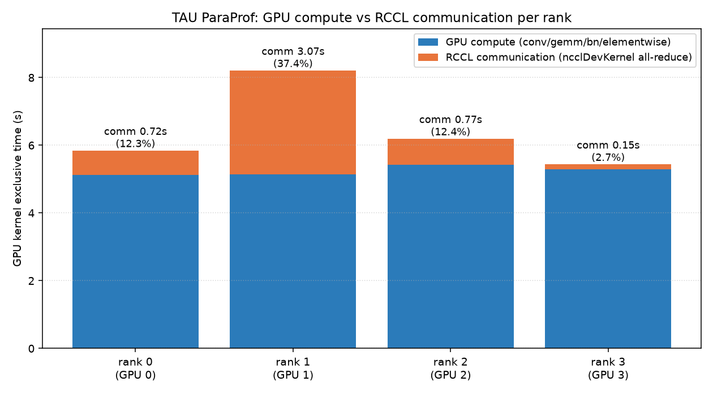

# ImageNet DDP: measuring RCCL communication at scale

README.md from `HPCTrainingExamples/MLExamples/Pytorch/imagenet` in the Training Examples repository

The **mnist** (at ../mnist) example is deliberately tiny: the dataset is 
small and its "multi-GPU" batch uses `torch.nn.DataParallel`, which is 
single-process and does **not** scale well. This example steps up to a 
**larger workload** (ResNet on ImageNet-sized 224x224x3 images, 1000 classes)
trained with **true `DistributedDataParallel` (DDP)**, one process per GPU,
using the **RCCL** (ROCm Collective Communication Library) backend.

The key idea: synthetic (`--dummy`) data means **no 150 GB ImageNet
download is needed**. The input pipeline is essentially free, so each training
step is dominated by

1. GPU **compute** (the forward/backward of the CNN), and
2. the **RCCL all-reduce** of gradients across GPUs at the end of each step.

By comparing step time across GPU counts we isolate and quantify the RCCL
communication cost.

> This README is the **quick start**. For the required MI300A settings, the
> scaling-sweep drivers, optimization levers, measured results, profiling,
> and the pure-RCCL bandwidth micro-benchmark, see
> **`benchmarks/README_benchmark.md`**.

> On ROCm, PyTorch's `nccl` backend is provided by **librccl**, so all the
> `NCCL_*` environment variables are honored by RCCL.

## 1. Get an allocation and load PyTorch

```bash
salloc -p PPAC_MI300A_SPX -N1 --gpus=4 -t 00:40:00
```

> Set up virtual environment to avod scattering python packages across system
>    and for more repeatability

```bash
uv init imagenet_test
cd imagenet_test
uv venv --system-site-packages
source .venv/bin/activate
```

> Use pre-installed module versions to avoid downloading large wheels.
> uv pip install -r requirements.txt # installs nvidia packages, so skip

```bash
module load rocm openmpi pytorch
```

## 2. Get the examples

```bash
git clone --depth=1 https://github.com/pytorch/examples.git pytorch_examples
cp pytorch_examples/imagenet/* .
```

## 3. Optional modifications to the example source code

These are the basic edits to the example to get the instrumentation in place
for the optimizations exercises. All of these edits can be applied by running
the script below or going through the individual edits and applying them one-by-one.

```bash
./apply_basic_edits.sh
```

### 3a. Fix warning `destroy_process_group`

> Upstream main.py inits the NCCL process group but never destroys it, so PyTorch
> warns at exit ("`destroy_process_group()` was not called ... can leak resources").
> Register an atexit handler right after `init_process_group` so every worker
> (incl. mp.spawn children) cleans up on a normal exit.

```bash
sed -i '/world_size=args.world_size, rank=args.rank)/a\        import atexit as _ax, torch.distributed as _d; _ax.register(lambda: _d.destroy_process_group() if _d.is_initialized() else None)' main.py
```

### 3b) Keep the demo (and the profiler trace) short.

```bash
sed -i '/^        data_time.update(time.time() - end)/a\
        if i >= 100: break' main.py
```

### 3c) Add GPU peak memory instrumentation

> Print per-GPU peak memory once at the end of train() (matches README `peak_mem_mb`)
```bash
sed -i '/^def validate(/i\    torch.cuda.is_available() and getattr(args,"rank",0)<=0 and print(f"PEAK_MEM_MB {torch.cuda.max_memory_allocated()/1e6:.0f}")' main.py
```

The two demo measurements below are now independent, self-contained changes:
**3d** adds the profiler and the total-RCCL-time print; **3e** adds the
`.to` vs `.migrate` staging comparison. Each stands alone (neither references
the other's variables), so you can apply either one, and in either order.

### 3d. Enable the profiler and print total RCCL time

> Start a `torch.profiler` at the top of `train()` and stop it just before
> `validate()`. The on-GPU time of the `nccl*` collective kernels is summed and
> printed as `RCCL_TOTAL_MS` (~0 at 1 GPU, growing with GPU count). The `break`
> from step 3b keeps the captured trace short.

Start the profiler at the top of `train()`:

```bash
sed -i '/^    model.train()/a\
    import torch.profiler as _tp\
    _prof = _tp.profile(activities=[_tp.ProfilerActivity.CPU, _tp.ProfilerActivity.CUDA], acc_events=True); _prof.start()' main.py
```

Stop the profiler and print the total RCCL kernel time (inserted at the end of `train()`, right before `def validate(`):

```bash
sed -i '/^def validate(/i\
    _prof.stop()\
    _rccl_ms = sum(e.self_device_time_total for e in _prof.key_averages() if "nccl" in e.key.lower())/1e3\
    _ws = getattr(args,"world_size","?")\
    getattr(args,"rank",0)<=0 and print(f"RCCL_TOTAL_MS {_rccl_ms:.3f} gpus={_ws}")' main.py
```

### 3e. Compare `.to` (copy) vs `.migrate` (zero-copy) staging

> The migrate path (`STAGE=migrate`) aliases the batch instead of copying it; it
> needs `COMMON_DIR` (for `zerocopy.Stager`), `HSA_XNACK=1`, and pageable
> (non-pinned) host memory. When `STAGE` is unset these edits are inert, so the
> plain scaling runs are unaffected.

Point `COMMON_DIR` at the shared helpers and enable XNACK:

```bash
export COMMON_DIR="../common"
export HSA_XNACK=1
```

Set up the staging counters and (for `STAGE=migrate`) the zero-copy `Stager` at the top of `train()`:

```bash
sed -i '/^    model.train()/a\
    _stage_ms = 0.0; _stage_n = 0; _stager = None\
    if os.environ.get("STAGE") == "migrate":\
        import sys; sys.path.insert(0, os.environ["COMMON_DIR"]); from zerocopy import Stager\
        _stager = Stager(device, method="register")' main.py
```

register-migrate needs pageable (non-pinned) host memory:

```bash
sed -i 's/pin_memory=True/pin_memory=False/g' main.py
```

Time the host->device staging, but only when `STAGE` is set (copy vs migrate):

```bash
sed -i '/^        images = images.to(device, non_blocking=True)/c\
        if os.environ.get("STAGE"):\
            _e0 = torch.cuda.Event(enable_timing=True); _e1 = torch.cuda.Event(enable_timing=True)\
            _e0.record()\
            images = _stager.to_device(images) if _stager is not None else images.to(device, non_blocking=True)\
            _e1.record(); torch.cuda.synchronize()\
            _stage_ms += _e0.elapsed_time(_e1); _stage_n += 1\
        else:\
            images = images.to(device, non_blocking=True)' main.py
```

Print the per-step staging time (inserted at the end of `train()`, right before `def validate(`):

```bash
sed -i '/^def validate(/i\
    _stg = os.environ.get("STAGE",""); _ws2 = getattr(args,"world_size","?")\
    getattr(args,"rank",0)<=0 and _stage_n and print(f"STAGE_MS_PER_STEP {_stage_ms/_stage_n:.4f} gpus={_ws2} stage={_stg}")' main.py
```

Notes:

> MIOpen's default solver search can take **>10 minutes** cold for ResNet
> convolutions. Set fast selection, then warm the cache by running the warmup script
> or the **1-GPU `main.py` case** (the same run the sweep uses) for a few steps:

> The pytorch module already set `MIOPEN_USER_DB_PATH` / `MIOPEN_CUSTOM_CACHE_DIR`
> at a stable per-allocation dir (e.g. /tmp/$USER/miopen-cache/jobs/<jobid>), so
> DON'T override them -- just inherit them. Only ensure fast solver selection:

```bash
export MIOPEN_FIND_MODE=FAST
```

> Suppress some warning noise
```bash
export MIOPEN_LOG_LEVEL=3
export KINETO_LOG_LEVEL=3
```

> `MIOPEN_USER_DB_PATH` and `MIOPEN_CUSTOM_CACHE_DIR` are set in the PyTorch module to a `/tmp` directory
> Create the directory and set the automatic removal at end of job

```bash
mkdir -p "$MIOPEN_USER_DB_PATH"
```

Confirm the GPUs are visible:

```bash
python3 -c 'import torch; print(torch.cuda.is_available(), torch.cuda.device_count())'
```

## 4. Warm the MIOpen cache (once per allocation)

> **Warm once per allocation.** A new `salloc`/`sbatch` gets a fresh job ID (and
> thus a fresh empty cache). Warming single-process first matters: inside one
> allocation all N ranks share that one cache dir, so a cold multi-rank run would
> contend on the SQLite db; after warming, ranks just read it (with
> `MIOPEN_FIND_MODE=FAST`).

```bash
HIP_VISIBLE_DEVICES=0  python -c "import torch,torchvision.models as M; \
   d=torch.device('cuda'); \
   n=M.resnet50().to(d); \
   c=torch.nn.CrossEntropyLoss().to(d); \
   x=torch.randn(256,3,224,224,device=d); \
   y=torch.randint(0,1000,(256,),device=d); \
   [c(n(x),y).backward() for _ in range(3)];  \
   torch.cuda.synchronize(); \
   print('warm done')"
```

## 5. Run the scaling sweep (one line per GPU count)

Run the benchmark once per GPU count by changing `HIP_VISIBLE_DEVICES`.

```bash
HIP_VISIBLE_DEVICES=0       python main.py -a resnet50 --dummy --dist-url 'tcp://127.0.0.1:23456' \
        --dist-backend nccl --multiprocessing-distributed --world-size 1 --rank 0 -b 128  -p 20 --epochs 1 |& tee run_1.log
HIP_VISIBLE_DEVICES=0,1     python main.py -a resnet50 --dummy --dist-url 'tcp://127.0.0.1:23456' \
        --dist-backend nccl --multiprocessing-distributed --world-size 1 --rank 0 -b 256  -p 20 --epochs 1 |& tee run_2.log
HIP_VISIBLE_DEVICES=0,1,2,3 python main.py -a resnet50 --dummy --dist-url 'tcp://127.0.0.1:23456' \
        --dist-backend nccl --multiprocessing-distributed --world-size 1 --rank 0 -b 512  -p 20 --epochs 1 |& tee run_4.log
```

## 6. APU programming model (MI300A)

> The MI300A APU has a unified memory and does not need to copy the data, just the pointer. Other GPUS can emulate APU behavior
>   Requires `HSA_XNACK 1` to be set. Set earlier in script
>   `.to` (copy) vs `.migrate` staging comparison (4 GPUs): compare `STAGE_MS_PER_STEP` in final report

- **Host-to-device staging time** — the per-step `images.to(device)` copy is
  wrapped in CUDA events and printed as `STAGE_MS_PER_STEP`, but **only when the
  `STAGE` environment variable is set**, so the plain scaling runs are not
  perturbed. Setting `STAGE=migrate` swaps the `.to()` copy for the zero-copy
  `migrate()` path (MI300A unified memory), so you can compare the two directly:

```bash
# .to() copy vs zero-copy migrate (single GPU) -- compare STAGE_MS_PER_STEP
STAGE=copy    HIP_VISIBLE_DEVICES=0 python main.py -a resnet50 --dummy \
  --dist-url 'tcp://127.0.0.1:23456' --dist-backend nccl \
  --multiprocessing-distributed --world-size 1 --rank 0 -b 128 -p 20 --epochs 1 |& tee stage_copy.log
STAGE=migrate HIP_VISIBLE_DEVICES=0 python main.py -a resnet50 --dummy \
  --dist-url 'tcp://127.0.0.1:23456' --dist-backend nccl \
  --multiprocessing-distributed --world-size 1 --rank 0 -b 128 -p 20 --epochs 1 |& tee stage_migrate.log
```

The `.to()` path pays a `hipMemcpy` every step; `migrate` aliases the batch, so
its `STAGE_MS_PER_STEP` should be much smaller. `migrate` requires `HSA_XNACK=1`
and `COMMON_DIR` pointing at [`../common`](../common) (both exported by
`main.py`); if the migrate extension can't build, `Stager` falls back to a copy
and the two numbers will match.


## 7. Measure RCCL time and compare `.to` vs `.migrate` staging

The [`main.py`](main.py) driver runs the sweep above **and** adds two extra
numbers with a handful of small `sed` patches to the (freshly cloned) `main.py`.
The patches are deliberately tiny so they are clear in a hands-on session:

- **Total RCCL time** — a `torch.profiler` is started at the top of `train()` and
  stopped at the end; the on-GPU time of the `nccl*` collective kernels is summed
  and printed as `RCCL_TOTAL_MS`. This is the total RCCL communication time for
  the run (it is ~0 at 1 GPU, since there is no all-reduce, and grows with GPU
  count).

> Get the RCCL total time for each run sorted by the number of GPUs
```bash
echo "=== RCCL total time (per GPU count) ==="
grep -h RCCL_TOTAL_MS run_*.log | sort -t= -k2 -n
```

> Scaling runs are run_<N>.log; staging runs are stage_{copy,migrate}.log, so a
> grep keeps the two reports separate. Lines are self-describing (gpus=N).
```bash
echo "=== Host->device staging: .to (copy) vs .migrate ==="
grep -h STAGE_MS_PER_STEP stage_*.log
```

### 8. Calculating the performance

```bash
echo "=== Calculating the performance =="
./images_per_sec.sh
```

Stock upstream `main.py` prints periodic `Epoch:` progress lines that include the
per-step `Time`. The [`images_per_sec.sh`](images_per_sec.sh) helper parses those
logs (`run_1.log`, `run_2.log`, `run_4.log` written by
[`main.py`](main.py)) and prints one line per GPU count:

```
run_1.log  img/s=968   step=0.1322s  batch=128  peak_mem_mb=...  speedup=1.00x
run_2.log  img/s=1901  step=0.1347s  batch=256  peak_mem_mb=...  speedup=1.96x
run_4.log  img/s=3720  step=0.1376s  batch=512  peak_mem_mb=...  speedup=3.84x
```

- **`img/s`** — global throughput, computed as the total node batch divided by
  the average per-step `Time`. Ideally it grows linearly with GPU count; the gap
  from linear is RCCL cost.
- **`speedup`** — throughput relative to the 1-GPU baseline (`run_1.log`), so it
  reads `1.00x` for `run_1` and shows the weak-scaling efficiency for `run_2`/`run_4`.
- **`step`** — average per-step time. `-b` here is the **per-GPU** batch, so the
  global batch grows with GPU count (weak scaling): flat step time = perfect
  scaling; any growth is RCCL.
- **`peak_mem_mb`** — per-GPU peak allocated memory (`PEAK_MEM_MB`).

> This is the simple, demo-friendly version. For the robust, per-step, per-rank
> instrumentation (with a fair pinned-memory baseline) use
> `ddp_resnet_bench.py`'s `--rccl-time`, `--host-copy`, and `--migrate` flags,
> documented in [`benchmarks/README_benchmark.md`](benchmarks/README_benchmark.md).

## 9. Cleanup

```
deactivate
rm -rf imagenet_test
```

## 10. Run on CPX partitions (`SH5_MI300A_CPX`, `PPAC_MI300A_CPX`)

The sweep above assumes **SPX** mode, where each MI300A APU is one HIP device
(so `PPAC_MI300A_SPX --gpus=4` = 4 devices). When SPX nodes are scarce, the same
study runs on **CPX** partitions, where each of an APU's **6 XCDs** is exposed as
its own HIP device:

| Partition | Physical APUs | HIP devices | What one device is |
|---|---|---|---|
| `SH5_MI300A_CPX` | 1 | 6 | one XCD (~1/6 of an APU) |
| `PPAC_MI300A_CPX` | 4 | 24 | one XCD (~1/6 of an APU) |

Two ready-to-submit batch scripts drive the CPX sweeps:

```bash
sbatch run_imagenet_uv_sh5_cpx.sbatch    # 1 APU, GPU_LIST="1 2 4 6"
sbatch run_imagenet_uv_ppac_cpx.sbatch   # 4 APUs, GPU_LIST="1 2 4 6 12 24"
```

Both are like the SPX driver but with the sweep written as a loop over a
GPU-count list, and two CPX-specific adjustments:

- **Smaller per-GPU batch.** A CPX partition has ~1/6 the compute and memory of a
  full APU, so the SPX per-GPU batch of 128 can OOM or crawl. The scripts default
  to `PERGPU_BATCH=32`; the global batch is `N * PERGPU_BATCH` (weak scaling).
  Both `GPU_LIST` and `PERGPU_BATCH` are overridable at submit time, e.g.
  `sbatch --export=ALL,PERGPU_BATCH=64 run_imagenet_uv_sh5_cpx.sbatch`. Tune it up
  until `peak_mem_mb` approaches the partition's memory limit (which depends on
  whether the node uses shared (NPS1) or split (NPS4) memory — check `rocm-smi`).

- **Extended GPU-count list.** `SH5` goes up to 6 (one XCD → the whole chip);
  `PPAC` continues to 12 and 24.

`images_per_sec.sh` handles either sweep: it derives the GPU count `N` from each
`run_<N>.log` name and reads `PERGPU_BATCH` from the environment, printing the
same `img/s` / `speedup` lines (speedup is relative to the smallest `N`).

**Interpreting CPX results.** The RCCL story differs sharply between the two:

- On **`SH5_MI300A_CPX`** all ranks live on one APU, so the gradient all-reduce
  travels over the on-package Infinity Fabric. It is extremely fast, so
  `RCCL_TOTAL_MS` / `comm` cost stays near zero even at 6 GPUs — communication
  looks almost free.
- On **`PPAC_MI300A_CPX`** up to 6 ranks stay intra-APU (cheap), but at `N=12`
  and `N=24` the collective crosses physical APUs (socket-to-socket links), so
  RCCL cost should visibly rise. This is the CPX sweep that best reproduces the
  real communication behavior the example is built to expose.

So CPX is a fine substitute for running the *scaling mechanics*, but 
the intra-chip CPX scaling understates RCCL cost — the interesting
communication behavior only appears once the rank count crosses physical APUs
(i.e. on the 24-GPU `PPAC_MI300A_CPX` node).

## 11. Featured RCCL optimization: tune the all-reduce with environment variables

The [`README_rccl_optimization.md`](README_rccl_optimization.md) exercises tune the
RCCL all-reduce by editing `os.environ[...]` *inside* `main.py`, before
`init_process_group`. You don't actually have to touch the source: because
`--multiprocessing-distributed` launches the ranks with `mp.spawn`, every worker
**inherits the shell environment**, and RCCL reads its `NCCL_*` settings when the
communicator is built (at `init_process_group`). So exporting the variables in the
shell is equivalent to the §2 in-code edits — with the bonus that you can sweep a
value without re-editing the file.

> This reuses the `RCCL_TOTAL_MS` instrumentation added in §3 and the warmed
> MIOpen cache from §4. Run the 4-GPU case (`-b 512`) so there is an all-reduce to
> tune (there is none at 1 GPU).

### Most effective transport/algorithm (section 2)

Pin the two settings that most affect the ResNet50 all-reduce on the coherent
MI300A fabric:

```bash
export NCCL_ALGO=Tree     # 2a: latency-optimized; best once the all-reduce crosses APUs
export NCCL_PROTO=LL128   # 2b: sweet spot for medium messages on high-bandwidth coherent links
```

### Vary the number of channels from 1 to 32 (section 2c)

Force an exact channel count by setting the min and max to the same value, then
sweep. More channels drive the copy with more compute units (higher effective
bandwidth) until the fabric saturates:

```bash
for NCH in 1 2 4 8 16 32; do
  NCCL_MIN_NCHANNELS=$NCH NCCL_MAX_NCHANNELS=$NCH \
  HIP_VISIBLE_DEVICES=0,1,2,3 python main.py -a resnet50 --dummy \
    --dist-url 'tcp://127.0.0.1:23456' --dist-backend nccl \
    --multiprocessing-distributed --world-size 1 --rank 0 -b 512 -p 20 --epochs 1 \
    |& tee run_nch_${NCH}.log
done
```

Report `RCCL_TOTAL_MS` for each channel count and pick the knee of the curve:

```bash
echo "=== RCCL total time by channel count ==="
for NCH in 1 2 4 8 16 32; do
  printf "channels=%-3s " "$NCH"; grep -h RCCL_TOTAL_MS run_nch_${NCH}.log | tail -1
done
```

**Expect:** `RCCL_TOTAL_MS` falls as channels increase, then flattens (or ticks
back up) once the fabric saturates — often around 8-16 channels on one APU. On a
single MI300A the signal is small; the sweep is far more dramatic on the 12-/24-GPU
`PPAC_MI300A_CPX` runs, where the all-reduce crosses physical APUs.

### Stack the DDP overlap knobs (section 3)

The §3 levers (`gradient_as_bucket_view`, `bucket_cap_mb`, `static_graph`) are DDP
**constructor arguments**, not env vars, so they need a one-line edit. Apply the
stacked "most effective" combination with the same `sed` style as §3:

```bash
sed -i 's/model = torch.nn.parallel.DistributedDataParallel(model, device_ids=\[args.gpu\])/model = torch.nn.parallel.DistributedDataParallel(model, device_ids=[args.gpu], gradient_as_bucket_view=True, bucket_cap_mb=100, static_graph=True)/' main.py
```

With the env vars above still exported, rerun the 4-GPU baseline and watch the
per-step `Time` drop as the all-reduce overlaps better with the backward pass
(`RCCL_TOTAL_MS`, the bytes moved, stays about the same). Reset with
`git checkout -- main.py` (then re-apply the §3 instrumentation) before moving on.

## 12. Featured compute optimization: `torch.compile`

From [`README_compute_optimization.md`](README_compute_optimization.md) §3a:
`torch.compile` captures the model into a fused graph, cutting Python/launch
overhead. Add it right after the model is wrapped in DDP (same `sed` style as §3):

```bash
sed -i '/model = torch.nn.parallel.DistributedDataParallel(model, device_ids=\[args.gpu\])/a\                model = torch.compile(model)' main.py
```

Rerun the single-GPU compute baseline and compare per-step `Time` against the
un-compiled `run_1.log`:

```bash
HIP_VISIBLE_DEVICES=0 python main.py -a resnet50 --dummy \
  --dist-url 'tcp://127.0.0.1:23456' --dist-backend nccl \
  --multiprocessing-distributed --world-size 1 --rank 0 -b 128 -p 20 --epochs 1 |& tee run_compile.log
```

**Expect:** the **first** step is much slower (one-time compile), then per-step
`Time` improves versus the un-compiled baseline. Try
`torch.compile(model, mode="max-autotune")` for more aggressive tuning at a longer
compile cost. Reset with `git checkout -- main.py` (then re-apply the §3
instrumentation) before moving on.

## 13. Featured profiling exercise: a measured timeline of compute vs communication (4×MI300A)

This hands-on exercise captures a **real GPU timeline** of the 4-GPU run and reads
the **compute vs. communication** story straight off it. Both `torch.profiler` and
**TAU** record every GPU kernel with a timestamp, so the **compute** kernels
(`Conv`/`GEMM`/batchnorm from forward & backward) and the **RCCL all-reduce**
kernels (`ncclDevKernel*`) fall into visually distinct bands — the same split §7
measures numerically as `RCCL_TOTAL_MS`, now laid out in time across all four ranks.

The figure below is **measured on 4×MI300A (`PPAC_MI300A_SPX`)** — one lane per
GPU, blue = compute, orange = the RCCL all-reduce, white = idle (data-loader /
Python between steps):


Read it like this:

- **Per-step structure** — each blue block is a step's forward+backward compute,
  ended by an orange RCCL all-reduce of the gradients.
- **Exposed communication** — on the leader (GPU 0) the all-reduce is thin, but on
  GPU 1-3 it widens into long orange blocks: those ranks finish compute early and
  **spin-wait inside `ncclDevKernel`** for the collective to complete. This exposed,
  imbalanced all-reduce is exactly what the §11 RCCL optimizations
  (`NCCL_ALGO`/channels, `gradient_as_bucket_view`, `bucket_cap_mb`, `static_graph`)
  attack — the timeline makes the cost visible, not just the `RCCL_TOTAL_MS` number.
- **Gaps between steps** = per-step overhead (Python / launch / dummy data-loader),
  the target of the §12 `torch.compile` optimization.

> **Where the two figures in this section come from.** Both are generated from the
> **same measured 4-GPU run** captured by
> [`profiling/capture_timeline.sbatch`](profiling/capture_timeline.sbatch); neither
> is hand-drawn.
>
> | Figure | Tool it comes from | How it was produced |
> |---|---|---|
> | [`figs/timeline_4gpu.png`](figs/timeline_4gpu.png) (above) | `torch.profiler` Chrome traces | [`profiling/render_timeline.py`](profiling/render_timeline.py) parses the per-rank `torch_trace_rank*.json` and draws the Gantt headlessly with matplotlib (`Agg`) — no display, browser, or Java needed. |
> | [`figs/perfetto_4gpu.png`](figs/perfetto_4gpu.png) (§13.3) | `torch.profiler` Chrome traces, viewed in Perfetto | The four per-rank traces are merged into one 4-lane trace by [`profiling/merge_perfetto.py`](profiling/merge_perfetto.py) → `imagenet_4gpu.perfetto.json.gz`, loaded in [`ui.perfetto.org`](https://ui.perfetto.org), and screenshotted. |
> | [`figs/tau_profile_4gpu.png`](figs/tau_profile_4gpu.png) (§13.4) | **TAU** ParaProf profile | A 4-rank `mpirun -n 4 tau_exec` run ([`profiling/capture_tau.sbatch`](profiling/capture_tau.sbatch)); `pprof` dumps the per-rank GPU-kernel profile, and [`profiling/render_tau_profile.py`](profiling/render_tau_profile.py) draws the compute-vs-RCCL split headlessly (no ParaProf GUI/Java). |
>
> The first two derive from the **`torch.profiler`** capture (Path A, §13.3); the
> third is from the **TAU** capture (Path B, §13.4). TAU's Jumpshot/Vampir *timeline*
> converters fail on this build (see §13.4), so the TAU figure is drawn from its
> ParaProf profile rather than a timeline screenshot.

### 13.1 One-shot capture (automated)

The whole pipeline — capture with both tools, drop the raw traces, and render this
PNG **headlessly** (no X server, browser, or Java) — is one batch job:

```bash
sbatch profiling/capture_timeline.sbatch      # 4-GPU PPAC_MI300A_SPX, ~6 min
```

It produces:

- `figs/timeline_4gpu.png` — the committed figure above (rendered by
  [`profiling/render_timeline.py`](profiling/render_timeline.py) with matplotlib's
  `Agg` backend).
- `profiling/traces/torch_trace_rank{0..3}.json` — per-rank `torch.profiler` traces
  in **Chrome/Perfetto Trace Event format** (valid Perfetto input; ~60 MB each).
- `profiling/traces/imagenet_4gpu.perfetto.json.gz` — those four merged into **one
  4-lane Perfetto trace** (GPU 0-3 as separate process lanes), gzipped to ~1.5 MB —
  the easy file to download and open in the Perfetto UI (built by
  [`profiling/merge_perfetto.py`](profiling/merge_perfetto.py)).
- `profiling/traces/traces.otf2` — the TAU trace in OTF2 (for **Vampir**), when the
  TAU run and `tau2otf2` succeed.

> **Perfetto only ingests** Perfetto protobuf (`.pftrace`/`.pb`) or Chrome JSON
> Trace Event format (`{"traceEvents":[...]}` or a bare event array). The
> `torch.profiler` exports above are Chrome JSON and load directly. TAU's own
> `tau_trace2json` emits a *TAU-specific* JSON schema (`event-type`/`node-id`/…)
> that Perfetto does **not** understand — so the TAU trace is for Jumpshot/Vampir,
> and the Perfetto artifact comes from `torch.profiler` (§13.3).

To re-render a different window from the captured traces (no GPU needed):

```bash
python3 profiling/render_timeline.py --glob 'profiling/traces/torch_trace_rank*.json' \
    --out figs/timeline_4gpu.png --start-ms 10850 --end-ms 11550
```

The rest of this section breaks the job into the manual steps for a hands-on run.

### 13.2 Get a 4-GPU SPX allocation

```bash
salloc -p PPAC_MI300A_SPX -N1 --gpus=4 --exclusive -t 00:40:00
source .venv/bin/activate            # the uv venv from §1
module load rocm/6.4.3 openmpi pytorch/2.12.0 tau
```

Reuse the instrumented `main.py` (§2-3) and the **warmed MIOpen cache** (§4), and
shorten the run to ~20 steps so the trace stays small:

```bash
sed -i 's/if i >= 100: break/if i >= 20: break/' main.py
```

### 13.3 Path A — `torch.profiler` (Chrome/Perfetto JSON)

The §3d profiler already runs; add one line so it also writes a **per-rank**
Chrome/Perfetto trace when it stops (insert right after `_prof.stop()`):

```python
    _prof.stop()
    _prof.export_chrome_trace(f"torch_trace_rank{getattr(args,'rank',0)}.json")
```

Run the standard 4-GPU case (§5); each of the four `mp.spawn` workers writes its
own `torch_trace_rank{0..3}.json`:

```bash
HIP_VISIBLE_DEVICES=0,1,2,3 python main.py -a resnet50 --dummy \
  --dist-url 'tcp://127.0.0.1:23456' --dist-backend nccl \
  --multiprocessing-distributed --world-size 1 --rank 0 -b 512 -p 20 --epochs 1
```

**View it graphically — no Perfetto module needed.** Perfetto is just a viewer:
open [`https://ui.perfetto.org`](https://ui.perfetto.org) in a browser and load a
`torch_trace_rank*.json` (one GPU), or the merged
`imagenet_4gpu.perfetto.json.gz` (all four GPUs as lanes). Merge them yourself with:

```bash
python3 profiling/merge_perfetto.py --glob 'profiling/traces/torch_trace_rank*.json' \
    --out profiling/traces/imagenet_4gpu.perfetto.json.gz
```

The merged trace opens in the Perfetto UI as four GPU process lanes. Within each
GPU, the compute stream (`Thread 1`, running `DistributedDataParallel.forward` and
the colored conv/GEMM kernels) is separate from the RCCL stream (`Thread 4`), where
the `nccl:broadcast` at startup and the periodic `nccl:all_reduce` →
`ncclDevKernel_Generic` slices are the communication:


Or render the headless PNG with
[`profiling/render_timeline.py`](profiling/render_timeline.py) (as in §13.1).

### 13.4 Path B — TAU (`tau_exec`) → Jumpshot / Vampir

TAU intercepts ROCm via `LD_PRELOAD`, which is inherited by the four `mp.spawn`
workers, so each rank writes its own trace with **no source edit**. On ROCm > 6.1.9
use the `rocprofsdk` configuration:

```bash
export TAU_TRACE=1 TAU_PROFILE=1
export TRACEDIR=$PWD/tau_trace PROFILEDIR=$PWD/tau_trace
mkdir -p tau_trace
HIP_VISIBLE_DEVICES=0,1,2,3 tau_exec -T rocm,rocprofsdk -rocm \
  python main.py -a resnet50 --dummy --dist-url 'tcp://127.0.0.1:23457' \
    --dist-backend nccl --multiprocessing-distributed --world-size 1 --rank 0 \
    -b 512 -p 20 --epochs 1
```

Merge the per-rank traces, then view in a **TAU-native** timeline:

```bash
cd tau_trace
tau_treemerge.pl                              # -> tau.trc + tau.edf (all ranks)
tau2slog2 tau.trc tau.edf -o imagenet_4gpu.slog2 && jumpshot imagenet_4gpu.slog2   # timeline
tau2otf2  tau.trc tau.edf traces.otf2         # -> open traces.otf2 in Vampir
pprof ; paraprof &                            # flat per-rank compute/comm profile
```

(`jumpshot`/`paraprof` are Java apps; `java` is available on AAC6 — see §13.5 for
running them on a desktop.)

> **Do not** feed TAU output to Perfetto. On this build `tau_trace2json` writes a
> *TAU-specific* JSON schema (`{"event-type":…,"node-id":…}`), which the Perfetto UI
> cannot parse. For a Perfetto timeline use the `torch.profiler` Chrome JSON from
> Path A; TAU's traces go to Jumpshot (slog2) or Vampir (OTF2). TAU may also return
> a nonzero exit at ROCm teardown — the trace files are still written and usable.

**The TAU profile (ParaProf) below is real measured data from a 4-rank
`mpirun -n 4 tau_exec` run** ([`profiling/capture_tau.sbatch`](profiling/capture_tau.sbatch),
node `ppac-pl1-s24-30`). The `pprof` per-rank breakdown separates the RCCL all-reduce
(`[ROCm Kernel] ncclDevKernel_Generic`) from the ResNet-50 compute kernels
(conv / GEMM / batch-norm / elementwise):



Note the **communication imbalance** TAU exposes: exclusive RCCL kernel time ranges
from 2.7 % (rank 3) to 37.4 % (rank 1) — the busy-wait a rank spends inside the
collective while others finish compute, i.e. the load imbalance a real tuning
exercise would chase.

> **Converter caveat on this build.** `tau2slog2` and `tau2otf2` both fail on the
> merged trace here (`tau2slog2` throws a Java `LineIDMap` NPE; `tau2otf2` writes an
> empty `traces.otf2/`), so Jumpshot/Vampir *timelines* are currently unavailable —
> but the raw `tau.trc`/`tau.edf` and the ParaProf profiles (`profile.*`) are intact.
> The figure above is therefore rendered **headlessly from the ParaProf profile**
> with [`profiling/render_tau_profile.py`](profiling/render_tau_profile.py) (no Java,
> ParaProf GUI, or display needed):
>
> ```bash
> pprof -s > profiling/tau/tau_pprof.txt        # dump per-rank profile as text
> python3 profiling/render_tau_profile.py profiling/tau/tau_pprof.txt \
>     --out figs/tau_profile_4gpu.png
> ```

### 13.5 Viewing without a local display

The capture job **always drops the raw traces** to `profiling/traces/` regardless
of whether the automated screenshot works, so if you can't open a browser on the
node you can download and view them yourself:

- **No Perfetto module is required** — `ui.perfetto.org` runs entirely in your
  browser. Copy the merged trace to your laptop and open it there:

```bash
scp <you>@aac6.amd.com:.../imagenet/profiling/traces/imagenet_4gpu.perfetto.json.gz .
# then drag it into https://ui.perfetto.org
# (merged 4-GPU trace is ~1.5 MB; the per-rank torch_trace_rank*.json are ~60 MB each)
```

- Or use a cluster desktop and open the browser there: `man aac6_vnc` (TurboVNC),
  `man aac6_novnc` (browser), `man aac6_x11` (`ssh -X`).

> A best-effort headless Perfetto screenshot
> ([`profiling/perfetto_shot.py`](profiling/perfetto_shot.py)) is attempted by the
> capture job; it needs a bundled Chromium download and outbound network from the
> compute node, so it may be skipped — the committed figure always comes from the
> reliable matplotlib render, and the JSON traces are always available to screenshot
> yourself.

### 13.6 Close the loop with the optimizations

Re-capture after applying the featured optimizations and compare:

- After the §11 **channel tuning** (`NCCL_MIN/MAX_NCHANNELS`, `NCCL_ALGO=Tree`) and
  the DDP overlap knobs, the orange all-reduce blocks on GPU 1-3 shrink.
- After §12 **`torch.compile`**, the blue compute bands fuse into fewer, longer
  kernels and the inter-step white gaps shrink.

Reset when done:

```bash
sed -i 's/if i >= 20: break/if i >= 100: break/' main.py   # restore the §3b break
unset TAU_TRACE TAU_PROFILE TRACEDIR PROFILEDIR
```

> For the full menu of profilers on this example (torch.profiler, rocprofv3,
> rocprof-compute, rocprofiler-systems, Score-P, and TAU/HPCToolkit) see
> [`profiling/PROFILING.md`](profiling/PROFILING.md).

## Next steps

- **[`README_rccl_optimization.md`](README_rccl_optimization.md)** — hands-on
  exercises that optimize the RCCL all-reduce by editing `main.py` directly
  (bf16 gradient compression, `NCCL_ALGO`/`PROTO`/channels, DDP bucketing/overlap).
- **[`README_compute_optimization.md`](README_compute_optimization.md)** — hands-on
  exercises that optimize per-GPU compute by editing `main.py` directly (bf16
  autocast, `channels_last`, `cudnn.benchmark`, `torch.compile`, fused optimizer).
- **[`benchmarks/`](benchmarks/README_benchmark.md)** — the rigorous study:
  automated sweep drivers (`benchmarks/ddp_bench_sweep.sh`), optimization levers
  (`--channels-last`, `--amp`, `--compile`), the required MI300A/RCCL settings,
  measured results, batch jobs, the pure-RCCL bandwidth micro-benchmark, and how
  this compares to the other distributed examples.
- **[`profiling/`](profiling/PROFILING.md)** — splitting a step into compute vs.
  communication with torch.profiler, rocprofv3, and rocprof-sys.
- **Self-contained runs** — `run_imagenet_uv.sh` (and `submit_imagenet_uv.batch`)
  build a disposable **uv** venv, clone the upstream example, warm, sweep, and
  clean up automatically. See [`benchmarks/README_benchmark.md`](benchmarks/README_benchmark.md).
