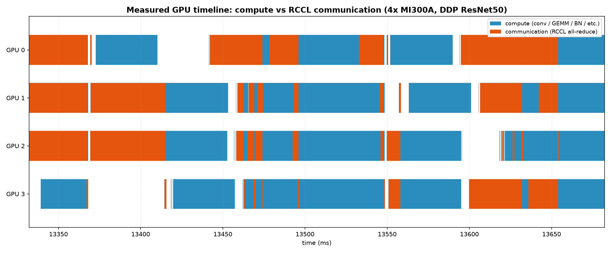
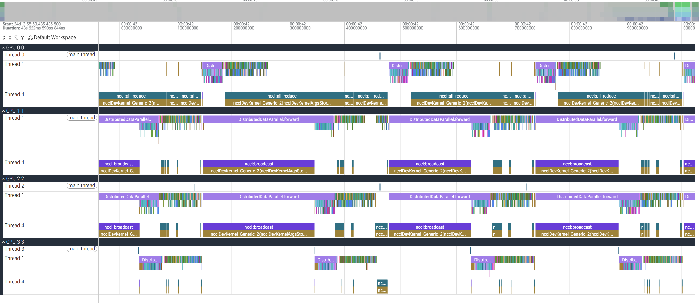
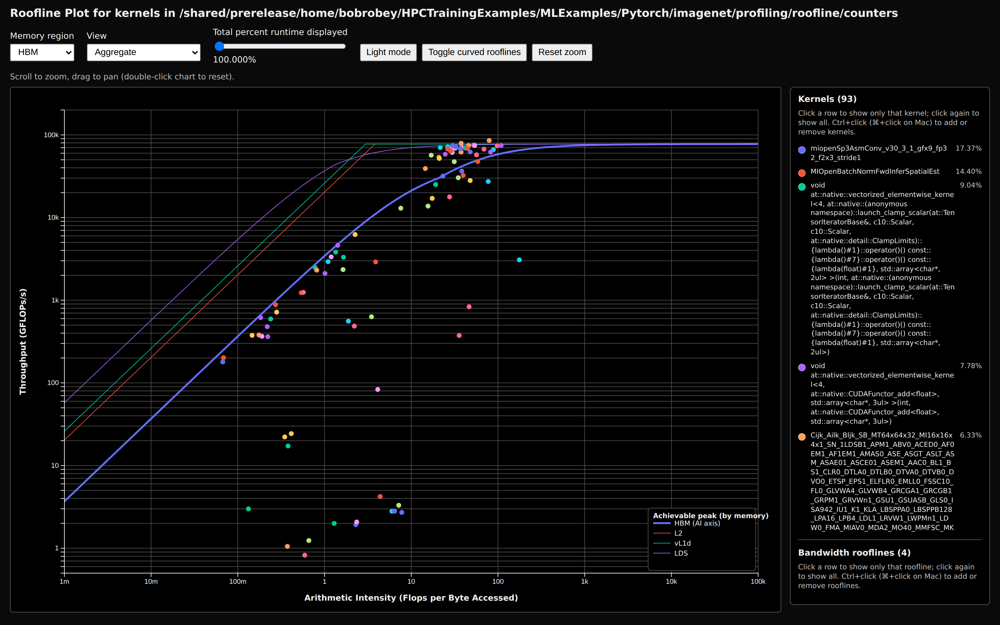

# ImageNet DDP: measuring RCCL communication at scale

> README.md from `HPCTrainingExamples/MLExamples/Pytorch/imagenet` in the HPCTrainingExamples repository

This example sets up a **large workload** (ResNet on ImageNet-sized 224x224x3 images, 1000 classes)
trained with **true `DistributedDataParallel` (DDP)**, one process per GPU,
using the **RCCL** (ROCm Collective Communication Library) backend.
Recall that On ROCm, PyTorch's `nccl` backend is provided by **librccl**, so all the
`NCCL_*` environment variables are honored by RCCL.

Note that we use synthetic data so that **no 150 GB ImageNet
download is needed**. The input pipeline is essentially free, so each training
step is dominated by

1. GPU **compute** (the forward/backward of the CNN), and
2. the **RCCL all-reduce** of gradients across GPUs at the end of each step.

Synthetic data is enabled with the `--dummy` flag.
By comparing step time across GPU counts we isolate and quantify the RCCL
communication cost.

> For the required MI300A settings, the
> scaling-sweep drivers, optimization levers, measured results, profiling,
> and the pure-RCCL bandwidth micro-benchmark, see
> **`benchmarks/README_benchmark.md`**.


## Contents

1. [Get an allocation and load PyTorch](#sec-alloc)
2. [Get the examples](#sec-examples)
3. [Optional modifications to the example source code](#sec-edits)
4. [Warm the MIOpen cache (once per allocation)](#sec-miopen)
5. [Run the scaling sweep (assumes an SPX partition)](#sec-sweep)
6. [APU programming model (MI300A)](#sec-apu)
7. [Read the two numbers (RCCL time, staging)](#sec-read-numbers)
8. [Calculating the performance](#sec-performance)
9. [Featured RCCL optimization: tune the all-reduce with environment variables](#sec-rccl-opt)
10. [Featured compute optimization: hands-on `main.py` edits](#sec-compute-opt)
11. [Featured profiling exercise: a measured timeline of compute vs communication (4×MI300A)](#sec-profiling-exercise)
12. [Batch-driven optimization studies and measured performance impacts](#sec-batch-studies)
13. [Featured profiling tool: roofline extractor (per-kernel compute vs. memory)](#sec-roofline)
14. [Cleanup](#sec-cleanup)
15. [Run on CPX partitions (`SH5_MI300A_CPX`, `PPAC_MI300A_CPX`)](#sec-cpx)
- [Next steps](#sec-next-steps)


<a id="sec-alloc"></a>
## 1. Get an allocation and load PyTorch

These instructions assume you are running this example on AMD's AAC6 cluster, which has MI300A APUs.
Pick whichever partition is free — the step-by-step example runs on all of them.
**SPX** gives each rank a whole MI300A APU; **CPX** splits each APU into 6 smaller
GPU partitions, so a CPX node exposes the single XCDs leaves more room for
interactive experimentation. The `PPAC_MI300A_SPX` nodes are scarce, so the CPX
partitions are good fallbacks.

```bash
# 4 full-APU GPUs on a PPAC SPX node (whole node; DefCpuPerGPU=48 -> 192 CPUs)
salloc -p PPAC_MI300A_SPX -N1 --gpus=4 -t 00:40:00

# 4 CPX partitions on the PPAC CPX node (24 GPUs/node; DefCpuPerGPU=8 -> 32 CPUs)
salloc -p PPAC_MI300A_CPX -N1 --gpus=4 -t 00:40:00

# 4 CPX partitions on an SH5 CPX node (6 GPUs/node; DefCpuPerGPU=8 -> 32 CPUs)
salloc -p SH5_MI300A_CPX  -N1 --gpus=4 -t 00:40:00
```

CPX partitions carve one APU's 128 GB HBM into 6 (~21 GB each), so if you hit an
OOM on CPX, drop the per-GPU batch size (e.g. `-b 128`).

> **Optional — CPU/GPU affinity.** To bind each rank to the cores nearest its GPU,
> add task/affinity flags to the allocation (or to `srun`):
>
> ```bash
> salloc -p PPAC_MI300A_SPX -N1 --gpus=4 --ntasks-per-node=4 \
>        --cpus-per-task=48 --gpu-bind=closest --cpu-bind=cores -t 00:40:00
> # On a CPX partition use --cpus-per-task=8 (matches DefCpuPerGPU=8, since the
> # 6 CPX GPUs share one APU's 48 cores).
> ```
>
> These matter most when you launch ranks with **`srun`**, where Slurm places and
> binds each task. The README's default path uses `mp.spawn` and the TAU path uses
> `mpirun` ([Path B (TAU)](#sec-prof-tau)), which do their own binding, so there the Slurm flags are only
> advisory.

Set up virtual environment to avod scattering python packages across system
and for more repeatability

Check `uv` is installed by doing `which uv`. If not, install it and then do:
```bash
uv init imagenet_test
cd imagenet_test
uv venv --system-site-packages
source .venv/bin/activate
```

Use pre-installed module versions to avoid downloading large wheels.
`uv pip install -r requirements.txt` installs nvidia packages, so we skip it.

The command below will load the default version of ROCm, make sure it matches the one you intend to use:
```bash
module load rocm openmpi pytorch
```

Confirm the GPUs are visible:

```bash
python3 -c 'import torch; print(torch.cuda.is_available(), torch.cuda.device_count())'
```
You should also make sure that the PyTorch you are importing is the one that comes from the module you loaded:
```bash
 python3 -c 'import torch;print(torch.__file__)'
```
check that the above path matches the path shown when doing `module show pytorch`.

<a id="sec-examples"></a>
## 2. Get the examples

```bash
git clone --depth=1 https://github.com/pytorch/examples.git pytorch_examples
cp pytorch_examples/imagenet/* .
```

<a id="sec-edits"></a>
## 3. Optional modifications to the example source code

Below there are some basic edits to the example to get the instrumentation in place
for the optimizations exercises. We advise users going through this document to apply the
changes one by one, to monitor what each does to the original code. However, for the sake of time
one could run the script below to apply all the changes at once. This is recommended for users that
have gone through these instructions already at least once:

```bash
../apply_basic_edits.sh
```

<a id="sec-edit-destroy"></a>
### 3a. Fix warning `destroy_process_group`

Upstream main.py inits the NCCL process group but never destroys it, so PyTorch
warns at exit ("`destroy_process_group()` was not called ... can leak resources").
Register an atexit handler right after `init_process_group` so every worker
(incl. mp.spawn children) cleans up on a normal exit.

```bash
sed -i '/world_size=args.world_size, rank=args.rank)/a\        import atexit as _ax, torch.distributed as _d; _ax.register(lambda: _d.destroy_process_group() if _d.is_initialized() else None)' main.py
```

<a id="sec-edit-break"></a>
### 3b) Keep the demo (and the profiler trace) short.

This shortens the demo to 100 iterations for quicker runs and to accomodate more users.

```bash
sed -i '/^        data_time.update(time.time() - end)/a\
        if i >= 100: break' main.py
```

<a id="sec-edit-peakmem"></a>
### 3c) Add GPU peak memory instrumentation

Understanding how much memory is being used relative to the available memory
is important in optimizing a job.

Print per-GPU peak memory once at the end of train():
```bash
sed -i '/^def validate(/i\    torch.cuda.is_available() and getattr(args,"rank",0)<=0 and print(f"PEAK_MEM_MB {torch.cuda.max_memory_allocated()/1e6:.0f}")' main.py
```

***NOTE***: the next two measurements below are independent, self-contained changes:
**3d** adds the profiler and the total-RCCL-time print; **3e** adds the
`.to` vs `.migrate` staging comparison. Each stands alone (neither references
the other's variables), so you can apply either one, and in either order.

<a id="sec-edit-profiler"></a>
### 3d. Enable the profiler and print total RCCL time

Start a `torch.profiler` at the top of `train()` and stop it just before
`validate()`. The on-GPU time of the `nccl*` collective kernels is summed and
printed as `RCCL_TOTAL_MS` (~0 at 1 GPU, growing with GPU count). The `break`
from step 3b keeps the captured trace short.

Start the profiler at the top of `train()`:

```bash
sed -i '/^    model.train()/a\
    import torch.profiler as _tp\
    _prof = _tp.profile(activities=[_tp.ProfilerActivity.CPU, _tp.ProfilerActivity.CUDA], acc_events=True); _prof.start()' main.py
```

Stop the profiler and print the total RCCL kernel time (inserted at the end of `train()`, right before `def validate(`):

```bash
sed -i '/^def validate(/i\
    _prof.stop()\
    _rccl_ms = sum(e.self_device_time_total for e in _prof.key_averages() if "nccl" in e.key.lower())/1e3\
    _ws = getattr(args,"world_size","?")\
    getattr(args,"rank",0)<=0 and print(f"RCCL_TOTAL_MS {_rccl_ms:.3f} gpus={_ws}")' main.py
```

<a id="sec-edit-staging"></a>
### 3e. Compare `.to` (copy) vs `.migrate` (zero-copy) staging

The MI300A is a true APU with a single address space. Many other GPUs emulate the single address
space with managed memory that copies arrays from host to device and back when needed.

The migrate path (`STAGE=migrate`) aliases the batch instead of copying it; it
needs `COMMON_DIR` in the `sys.path` to find `zerocopy.Stager`, `HSA_XNACK=1`, and pageable
(non-pinned) host memory. When `STAGE` is unset these edits are inert, so the
plain scaling runs are unaffected.

Point `COMMON_DIR` at the shared helpers and enable XNACK. Anchoring to the repo
root makes the export work from any directory (the manual flow above leaves you
in `imagenet_test`, two levels below `common/`, so a bare `../common` would not
resolve):

```bash
export COMMON_DIR="$(git rev-parse --show-toplevel)/MLExamples/Pytorch/common"
export HSA_XNACK=1
```

Set up the staging counters and (for `STAGE=migrate`) the zero-copy `Stager` at the top of `train()`:

```bash
sed -i '/^    model.train()/a\
    _stage_ms = 0.0; _stage_n = 0; _stager = None\
    if os.environ.get("STAGE") == "migrate":\
        import sys; sys.path.insert(0, os.environ["COMMON_DIR"]); from zerocopy import Stager\
        _stager = Stager(device, method="register")' main.py
```

Time the `host->device` staging, but only when `STAGE` is set (copy vs migrate):

```bash
sed -i '/^        images = images.to(device, non_blocking=True)/c\
        if os.environ.get("STAGE"):\
            _e0 = torch.cuda.Event(enable_timing=True); _e1 = torch.cuda.Event(enable_timing=True)\
            _e0.record()\
            images = _stager.to_device(images) if _stager is not None else images.to(device, non_blocking=True)\
            _e1.record(); torch.cuda.synchronize()\
            _stage_ms += _e0.elapsed_time(_e1); _stage_n += 1\
        else:\
            images = images.to(device, non_blocking=True)' main.py
```

Print the per-step staging time (inserted at the end of `train()`, right before `def validate(`):

```bash
sed -i '/^def validate(/i\
    _stg = os.environ.get("STAGE",""); _ws2 = getattr(args,"world_size","?")\
    getattr(args,"rank",0)<=0 and _stage_n and print(f"STAGE_MS_PER_STEP {_stage_ms/_stage_n:.4f} gpus={_ws2} stage={_stg}")' main.py
```

<a id="sec-edit-pinmem"></a>
### 3f. Make `pin_memory` graceful for the fallback path

The `register` staging path needs **pageable** (non-pinned) host memory, because
`hipHostRegister` fails on already-pinned buffers. But the plain `.to()` fallback
(discrete GPU, `HSA_XNACK != 1`, or the extension failing to build) copies faster
from **pinned** memory. So rather than forcing `pin_memory=False` unconditionally,
gate it on whether the zero-copy `register` path is actually available -- exactly
mirroring `Stager`'s own graceful fallback (`zerocopy.unified_memory_available()`).
When `STAGE` is unset this is inert: `pin_memory` stays `True` (upstream behavior),
so the plain scaling runs keep fast pinned copies.

Inject the gate helper right after the imports:

```bash
sed -i '/^from torch.utils.data import Subset/a\
def _zero_copy_active():\
    """pin_memory gate: pageable only when the STAGE=migrate register path is live."""\
    if os.environ.get("STAGE") != "migrate":\
        return False\
    try:\
        import sys; sys.path.insert(0, os.environ["COMMON_DIR"]); from zerocopy import unified_memory_available\
        return unified_memory_available()\
    except Exception:\
        return False' main.py
```

Use pageable buffers only when zero-copy is active, pinned otherwise:

```bash
sed -i 's/pin_memory=True/pin_memory=not _zero_copy_active()/g' main.py
```

<a id="sec-miopen"></a>
## 4. Warm the MIOpen cache (once per allocation)

 MIOpen's default solver search can take **>10 minutes** cold for ResNet
 convolutions. Set fast selection, then warm the cache by running the warmup script
 or the **1-GPU `main.py` case** (the same run the sweep uses) for a few steps:
 **Warm once per allocation.** A new `salloc`/`sbatch` gets a fresh job ID (and
 thus a fresh empty cache). Warming single-process first matters: inside one
 allocation all N ranks share that one cache dir, so a cold multi-rank run would
 contend on the SQLite db; after warming, ranks just read it (with
 `MIOPEN_FIND_MODE=FAST`).

```bash
export MIOPEN_FIND_MODE=FAST
```

The pytorch module on AAC6 already sets `MIOPEN_USER_DB_PATH` / `MIOPEN_CUSTOM_CACHE_DIR`
at a stable per-allocation dir (e.g. /tmp/$USER/miopen-cache/jobs/<jobid>), so
DON'T override them -- just inherit them.  Create the directory

```bash
mkdir -p "$MIOPEN_USER_DB_PATH"
```

Suppress some warning noise
```bash
export MIOPEN_LOG_LEVEL=3
export KINETO_LOG_LEVEL=3
```

Then proceed to warm up the cache:
```bash
HIP_VISIBLE_DEVICES=0  python -c "import torch,torchvision.models as M; \
   d=torch.device('cuda'); \
   n=M.resnet50().to(d); \
   c=torch.nn.CrossEntropyLoss().to(d); \
   x=torch.randn(256,3,224,224,device=d); \
   y=torch.randint(0,1000,(256,),device=d); \
   [c(n(x),y).backward() for _ in range(3)];  \
   torch.cuda.synchronize(); \
   print('warm done')"
```

<a id="sec-sweep"></a>
## 5. Run the scaling sweep (assumes an SPX partition)

Run the benchmark once per GPU count by changing `HIP_VISIBLE_DEVICES`:

```bash
HIP_VISIBLE_DEVICES=0       python main.py -a resnet50 --dummy --dist-url 'tcp://127.0.0.1:23456' \
        --dist-backend nccl --multiprocessing-distributed --world-size 1 --rank 0 -b 128  -p 20 --epochs 1 |& tee run_1.log
HIP_VISIBLE_DEVICES=0,1     python main.py -a resnet50 --dummy --dist-url 'tcp://127.0.0.1:23456' \
        --dist-backend nccl --multiprocessing-distributed --world-size 1 --rank 0 -b 256  -p 20 --epochs 1 |& tee run_2.log
HIP_VISIBLE_DEVICES=0,1,2,3 python main.py -a resnet50 --dummy --dist-url 'tcp://127.0.0.1:23456' \
        --dist-backend nccl --multiprocessing-distributed --world-size 1 --rank 0 -b 512  -p 20 --epochs 1 |& tee run_4.log
```

<a id="sec-apu"></a>
## 6. APU programming model (MI300A)

The MI300A APU has a unified memory and does not need to copy the data, just the pointer. Other GPUS can emulate APU behavior leveraging the APU programming model. The APU programming model requires `HSA_XNACK 1` to be set (you also need it on MI300A).
We will compare `.to` (copy) vs `.migrate` staging looking at `STAGE_MS_PER_STEP` in the final report.

- **Host-to-device staging time** — the per-step `images.to(device)` copy is
  wrapped in CUDA events and printed as `STAGE_MS_PER_STEP`, but **only when the
  `STAGE` environment variable is set**, so the plain scaling runs are not
  perturbed. Setting `STAGE=migrate` swaps the `.to()` copy for the zero-copy
  `migrate()` path (MI300A unified memory), so you can compare the two directly:

```bash
# .to() copy vs zero-copy migrate (single GPU) -- compare STAGE_MS_PER_STEP
STAGE=copy    HIP_VISIBLE_DEVICES=0 python main.py -a resnet50 --dummy \
  --dist-url 'tcp://127.0.0.1:23456' --dist-backend nccl \
  --multiprocessing-distributed --world-size 1 --rank 0 -b 128 -p 20 --epochs 1 |& tee stage_copy.log
STAGE=migrate HIP_VISIBLE_DEVICES=0 python main.py -a resnet50 --dummy \
  --dist-url 'tcp://127.0.0.1:23456' --dist-backend nccl \
  --multiprocessing-distributed --world-size 1 --rank 0 -b 128 -p 20 --epochs 1 |& tee stage_migrate.log
```

The `.to()` path pays a `hipMemcpy` every step; `migrate` aliases the batch, so
its `STAGE_MS_PER_STEP` should be much smaller. `migrate` requires `HSA_XNACK=1`
and `COMMON_DIR` pointing at [`../common`](../common) (both exported by
`main.py`); if the migrate extension can't build, `Stager` falls back to a copy
and the two numbers will match.


<a id="sec-read-numbers"></a>
## 7. Read the two numbers (RCCL time, staging)

The [scaling sweep](#sec-sweep) and [staging runs](#sec-apu) already wrote the logs; 
read back the two instrumented numbers — `RCCL_TOTAL_MS` (the profiler from [the profiler edit](#sec-edit-profiler))
and `STAGE_MS_PER_STEP` (the staging timing from [the staging edit](#sec-edit-staging)).

RCCL total time per run, sorted by GPU count (`run_<N>.log`):
```bash
echo "=== RCCL total time (per GPU count) ==="
grep -h RCCL_TOTAL_MS run_*.log | sort -t= -k2 -n
```

`.to` (copy) vs `.migrate` staging (`stage_{copy,migrate}.log`):
```bash
echo "=== Host->device staging: .to (copy) vs .migrate ==="
grep -h STAGE_MS_PER_STEP stage_*.log
```

<a id="sec-performance"></a>
## 8. Calculating the performance

This sweep is a **weak-scaling** study: the per-GPU batch (`-b`) is held fixed at
128 images, so **every GPU always does the same work as in the single-GPU run** —
it is the *total* (node-wide) batch that grows with GPU count (128 → 256 → 512), not
the work per GPU. Because per-GPU compute is constant, the per-step `Time` should
ideally stay **flat** as GPUs are added, and throughput should grow **linearly**
(≈ N× the 1-GPU rate). The only new cost at ≥ 2 GPUs is the gradient all-reduce, so
whatever the step time creeps up — and whatever throughput falls short of linear —
is the (exposed) RCCL communication.

> Contrast **strong scaling**, where the *total* problem size is fixed and per-GPU
> work shrinks as you add GPUs; there you'd expect the step time itself to drop.
> This demo does the opposite: more GPUs = more total work at (ideally) the same
> step time, so the payoff shows up as higher throughput, not a shorter step.

```bash
echo "=== Calculating the performance =="
../images_per_sec.sh
```

Stock upstream `main.py` prints periodic `Epoch:` progress lines that include the
per-step `Time`. The [`images_per_sec.sh`](images_per_sec.sh) helper parses those
logs (`run_1.log`, `run_2.log`, `run_4.log` written by
[`main.py`](main.py)) and prints one line per GPU count:

```
run_1.log  img/s=968   step=0.1322s  batch=128  peak_mem_mb=...  speedup=1.00x
run_2.log  img/s=1901  step=0.1347s  batch=256  peak_mem_mb=...  speedup=1.96x
run_4.log  img/s=3720  step=0.1376s  batch=512  peak_mem_mb=...  speedup=3.84x
```

- **`img/s`** — global throughput: the **global batch** divided by the **average
  per-step `Time`**, i.e. images processed per second across the whole node.
  - *global batch* = per-GPU `-b` × number of GPUs, e.g. 128 × 4 = 512 images per
    step summed across the node.
  - *average per-step `Time`* = the running-average seconds-per-step that `main.py`
    prints **in parentheses** on its `Epoch:` lines (one full step: forward +
    backward + all-reduce + optimizer).

  Per the weak-scaling note above, the ideal is linear growth with GPU count; the
  shortfall from linear is mostly the **exposed** (un-overlapped) all-reduce.
  Compare with `RCCL_TOTAL_MS` ([profiler edit](#sec-edit-profiler)/[two-numbers readout](#sec-read-numbers)), the *total* RCCL time, to see how much is
  hidden behind compute.
- **`speedup`** — a **throughput speedup**, *not* a time speedup. It is the ratio of
  throughputs to the 1-GPU baseline, `img/s(N) / img/s(1)` (so `run_1` reads
  `1.00x`) — i.e. "how many times more images/sec than one GPU". It is **not** the
  strong-scaling runtime speedup `T(1)/T(N)` (how many times *faster* the same job
  finishes); in this weak-scaling demo the step time stays roughly flat, so a *time*
  speedup would be ~`1x` and is not the point. Since each added GPU takes on an extra
  128-image share, the ideal *throughput* speedup here is **linear, `N×`**
  (4 GPUs → `4.00x`). How close you get is the weak-scaling **efficiency** =
  `speedup / N` (e.g. `3.84x / 4 ≈ 96%`).
- **`step`** — the average per-step time (the value `img/s` divides into). Flat
  across GPU counts = ideal weak scaling; any growth is the exposed all-reduce.
- **`peak_mem_mb`** — per-GPU peak allocated memory (`PEAK_MEM_MB`).

> This is the simple, demo-friendly version. For the robust, per-step, per-rank
> instrumentation (with a fair pinned-memory baseline) use
> `ddp_resnet_bench.py`'s `--rccl-time`, `--host-copy`, and `--migrate` flags,
> documented in [`benchmarks/README_benchmark.md`](benchmarks/README_benchmark.md).

<a id="sec-rccl-opt"></a>
## 9. Featured RCCL optimization: tune the all-reduce with environment variables

We have collected some tips and tricks on how to improve RCCL performance in
[`README_rccl_optimization.md`](README_rccl_optimization.md). Those exercises are
applied **by editing `main.py`**, and they come in three flavors: a bf16 gradient-compression hook (§1), `NCCL_*`
transport/algorithm settings (§2), and DDP constructor knobs (§3).

<a id="sec-compute-opt"></a>
## 10. Featured compute optimization: hands-on `main.py` edits

There are also some examples of how to speed up the per-GPU compute
(ResNet50 forward/backward) in
[`README_compute_optimization.md`](README_compute_optimization.md). Those exercises
are applied **by editing `main.py`**, and they come in three flavors: lower-precision
math (bf16 autocast, fp32 matmul precision, §1), memory layout & kernel selection
(`channels_last`, `cudnn.benchmark`, §2), and kernel fusion / launch-overhead cuts
(`torch.compile`, fused optimizer, §3).

<a id="sec-profiling-exercise"></a>
## 11. Featured profiling exercise: a measured timeline of compute vs communication

In this section, we will look at how to profile our workload to measure the time taken for
communication and computation. Note that as before we are assuming we are on an SPX node with 4 MI300A APUs.
We will be using both `torch.profiler` and
**TAU** to record every GPU kernel with a timestamp, so the **compute** kernels
(Conv/GEMM/batchnorm from forward & backward) and the **RCCL all-reduce**
kernels (ncclDevKernel) fall into visually distinct bands — the same split that the [two-numbers readout](#sec-read-numbers)
measures numerically as `RCCL_TOTAL_MS`, now laid out in time across all four ranks.

<a id="sec-prof-torch"></a>
### 11.1 `torch.profiler`

We begin by considering the profiling output produced by `torch.profiler`: this will be displayed next as Chrome traces as well as Perfetto traces (using JSON files).

First, add `matplotlib` to your environment:
```
uv pip install matplotlib
```

Then, modify the `main.py` to make profiling faster by shortening the run to ~20 steps so the trace stays small:

```bash
sed -i 's/if i >= 100: break/if i >= 20: break/' main.py
```

and write per-rank Chrome/Perfetto traces when the profiler stops:

```bash
sed -i '/^    _prof.stop()/a\
    _rk = getattr(args, "rank", 0)\
    _prof.export_chrome_trace(f"torch_trace_rank{_rk}.json")' main.py
```

Next, we run to produce the profiling output:

```bash
OUT_DIR="${SLURM_SUBMIT_DIR:-$PWD}"
HIP_VISIBLE_DEVICES=0,1,2,3 python main.py -a resnet50 --dummy \
  --dist-url 'tcp://127.0.0.1:23456' --dist-backend nccl \
  --multiprocessing-distributed --world-size 1 --rank 0 -b 512 -p 20 --epochs 1 \
  |& tee "${OUT_DIR}/capture_run_torch.log"
```

Then merge the per-rank torch traces into ONE 4-lane Perfetto trace (Chrome JSON, gzipped):

```bash
mkdir -p "${OUT_DIR}/traces"
cp -f torch_trace_rank*.json "${OUT_DIR}/traces/" 2>/dev/null
python3 "${OUT_DIR}/profiling/merge_perfetto.py" \
  --glob 'torch_trace_rank*.json' \
  --out "${OUT_DIR}/traces/imagenet_4gpu.perfetto.json.gz"
```

The figure below is **measured on 4×MI300A (`PPAC_MI300A_SPX`)** — one lane per
GPU, blue = compute, orange = the RCCL all-reduce, white = idle (data-loader /
Python between steps):



Read it like this:

- **Per-step structure** — each blue block is a step's forward+backward compute,
  ended by an orange RCCL all-reduce of the gradients.
- **Exposed communication** — the long orange blocks are a rank stuck inside
  `ncclDevKernel`, **spin-waiting** for the all-reduce to complete. In this run
  **GPU 0** has the longest orange stretches — notably the ~125 ms block spanning
  ~38,720-38,840 ms — because it finishes its compute earliest and then waits on the
  slower ranks, which are still busy with compute (blue) or briefly idle (white).
  Which rank waits longest is set by the per-step compute imbalance, not by being
  rank 0. This exposed, imbalanced all-reduce is exactly what the
  [RCCL optimizations](#sec-rccl-opt)
  (`NCCL_ALGO`/channels, `gradient_as_bucket_view`, `bucket_cap_mb`, `static_graph`)
  attack — the timeline makes the cost visible, not just the `RCCL_TOTAL_MS` number.
- **Gaps between steps** = per-step overhead (Python / launch / dummy data-loader),
  the target of the [`torch.compile`](#sec-compute-opt) compute optimization.

> **Where the figures in this section come from.** None are hand-drawn. The two
> `torch.profiler` figures come from one measured 4-GPU run captured by
> [`profiling/capture_torch.sbatch`](profiling/capture_torch.sbatch); the TAU figure
> comes from the separate [`profiling/capture_tau.sbatch`](profiling/capture_tau.sbatch).
>
> | Figure | Tool it comes from | How it was produced |
> |---|---|---|
> | [`figs/timeline_4gpu.png`](figs/timeline_4gpu.png) (above) | `torch.profiler` Chrome traces | [`profiling/render_timeline.py`](profiling/render_timeline.py) parses the per-rank `torch_trace_rank*.json` and draws the Gantt headlessly with matplotlib (`Agg`) — no display, browser, or Java needed. |
> | [`figs/perfetto_4gpu.png`](figs/perfetto_4gpu.png) ([Path A (torch.profiler)](#sec-prof-torch)) | `torch.profiler` Chrome traces, viewed in Perfetto | The four per-rank traces are merged into one 4-lane trace by [`profiling/merge_perfetto.py`](profiling/merge_perfetto.py) → `imagenet_4gpu.perfetto.json.gz`, loaded in [`ui.perfetto.org`](https://ui.perfetto.org), and screenshotted. |
> | [`figs/tau_profile_4gpu.png`](figs/tau_profile_4gpu.png) ([Path B (TAU)](#sec-prof-tau)) | **TAU** ParaProf profile | A 4-rank `mpirun -n 4 tau_exec` run ([`profiling/capture_tau.sbatch`](profiling/capture_tau.sbatch)); `pprof` dumps the per-rank GPU-kernel profile, and [`profiling/render_tau_profile.py`](profiling/render_tau_profile.py) draws a two-panel **compute-imbalance / exposed-communication-wait** chart headlessly (no ParaProf GUI/Java). |
>
> The first two derive from the **`torch.profiler`** capture ([Path A (torch.profiler)](#sec-prof-torch)); the
> last is from the **TAU** capture ([Path B (TAU)](#sec-prof-tau)) — the ParaProf profile rendered
> headlessly as a compute-imbalance / communication-wait chart.

<a id="sec-prof-oneshot"></a>
### 11.1 One-shot capture (automated)

The whole `torch.profiler` pipeline — capture, merge the per-rank traces, drop the
raw traces, and render this PNG **headlessly** (no X server, browser, or Java) — is
one batch job. (The TAU path is a separate job, `profiling/capture_tau.sbatch`; see
[Path B (TAU)](#sec-prof-tau).)

```bash
sbatch profiling/capture_torch.sbatch         # 4-GPU PPAC_MI300A_SPX, ~6 min
```

It produces:

- `figs/timeline_4gpu.png` — the committed figure above (rendered by
  [`profiling/render_timeline.py`](profiling/render_timeline.py) with matplotlib's
  `Agg` backend).
- `profiling/traces/torch_trace_rank{0..3}.json` — per-rank `torch.profiler` traces
  in **Chrome/Perfetto Trace Event format** (valid Perfetto input; ~60 MB each).
- `profiling/traces/imagenet_4gpu.perfetto.json.gz` — those four merged into **one
  4-lane Perfetto trace** (GPU 0-3 as separate process lanes), gzipped to ~1.5 MB —
  the easy file to download and open in the Perfetto UI (built by
  [`profiling/merge_perfetto.py`](profiling/merge_perfetto.py)).

(TAU's ParaProf profile comes from the separate `capture_tau.sbatch`; see [Path B (TAU)](#sec-prof-tau).)

> **Perfetto only ingests** Perfetto protobuf (`.pftrace`/`.pb`) or Chrome JSON
> Trace Event format (`{"traceEvents":[...]}` or a bare event array). The
> `torch.profiler` exports above are Chrome JSON and load directly, so the Perfetto
> artifact comes from `torch.profiler` ([Path A (torch.profiler)](#sec-prof-torch)).

To re-render a different window from the captured traces (no GPU needed):

```bash
python3 profiling/render_timeline.py --glob 'profiling/traces/torch_trace_rank*.json' \
    --out figs/timeline_4gpu.png --start-ms 10850 --end-ms 11550
```

The rest of this section breaks the job into the manual steps for a hands-on run.

### 11.2 Get a 4-GPU SPX allocation

```bash
salloc -p PPAC_MI300A_SPX -N1 --gpus=4 --exclusive -t 00:40:00
source .venv/bin/activate            # the uv venv from [allocation setup](#sec-alloc)
module load rocm openmpi pytorch tau
```

Reuse the instrumented `main.py` ([source edits](#sec-edits)) and the **warmed MIOpen cache** ([warm MIOpen](#sec-miopen)), and
shorten the run to ~20 steps so the trace stays small:

```bash
sed -i 's/if i >= 100: break/if i >= 20: break/' main.py
```

<a id="sec-prof-torch"></a>
### 11.3 Path A — `torch.profiler` (Chrome/Perfetto JSON)

The [profiler edit](#sec-edit-profiler) already runs; add one `sed` so it also writes a **per-rank**
Chrome/Perfetto trace when it stops (the export is inserted right after
`_prof.stop()`):

```bash
sed -i '/^    _prof.stop()/a\
    _rk = getattr(args, "rank", 0)\
    _prof.export_chrome_trace(f"torch_trace_rank{_rk}.json")' main.py
```

Run the standard 4-GPU case ([scaling sweep](#sec-sweep), `run_4`); each of the four `mp.spawn` workers
writes its own `torch_trace_rank{0..3}.json`.

**View it graphically — no Perfetto module needed.** Perfetto is just a viewer:
open [`https://ui.perfetto.org`](https://ui.perfetto.org) in a browser and load a
`torch_trace_rank*.json` (one GPU), or the merged
`imagenet_4gpu.perfetto.json.gz` (all four GPUs as lanes). Merge them yourself with:

```bash
python3 profiling/merge_perfetto.py --glob 'profiling/traces/torch_trace_rank*.json' \
    --out profiling/traces/imagenet_4gpu.perfetto.json.gz
```

The merged trace opens in the Perfetto UI as four GPU process lanes. Within each
GPU, the compute stream (`Thread 1`, running `DistributedDataParallel.forward` and
the colored conv/GEMM kernels) is separate from the RCCL stream (`Thread 4`), where
the `nccl:broadcast` at startup and the periodic `nccl:all_reduce` →
`ncclDevKernel_Generic` slices are the communication:



Or render the headless PNG with
[`profiling/render_timeline.py`](profiling/render_timeline.py) (as in [one-shot capture](#sec-prof-oneshot)).

<a id="sec-prof-tau"></a>
### 11.4 Path B — TAU (`tau_exec`) → ParaProf profile

TAU intercepts ROCm via `LD_PRELOAD` (**no source edit**). Unlike Path A, TAU wants
**distinct MPI ranks**, so instead of the README's single `mp.spawn` launch, run
**one process per GPU** with `mpirun -n 4` — that gives TAU a proper 4-rank profile
instead of collapsing every worker onto node 0. A tiny per-rank wrapper pins one
MI300A APU per rank and starts the launched (non-spawn) path; on ROCm > 6.1.9 use the
`rocprofsdk` configuration:

```bash
export TAU_PROFILE=1
export PROFILEDIR=$PWD/tau_trace
mkdir -p tau_trace

# One APU per rank; OMPI_COMM_WORLD_* is set per rank by mpirun.
cat > tau_wrapper.sh <<'EOF'
#!/bin/bash
export HIP_VISIBLE_DEVICES=${OMPI_COMM_WORLD_LOCAL_RANK}
exec python main.py -a resnet50 --dummy \
  --dist-url 'tcp://127.0.0.1:23457' --dist-backend nccl \
  --world-size ${OMPI_COMM_WORLD_SIZE} --rank ${OMPI_COMM_WORLD_RANK} \
  --gpu 0 -b 512 -p 20 --epochs 1
EOF
chmod +x tau_wrapper.sh

mpirun -n 4 --map-by numa --bind-to numa --report-bindings \
  tau_exec -T rocm,rocprofsdk -rocm ./tau_wrapper.sh
```

> **OpenMPI binding note:** under `mpirun`, per-rank core placement comes from
> OpenMPI's `--map-by numa --bind-to numa` (one rank per MI300A APU, matching
> `HIP_VISIBLE_DEVICES=local_rank`), **not** Slurm's `--cpus-per-task`; add
> `--report-bindings` to confirm rank *i* landed on APU *i*. This is exactly the
> command [`profiling/capture_tau.sbatch`](profiling/capture_tau.sbatch) runs.

Merge the per-rank profiles, then inspect the flat per-rank compute/comm profile:

```bash
cd tau_trace
pprof            # text per-rank profile (exclusive time per GPU kernel)
paraprof &       # GUI per-rank profile browser
```

(`paraprof` is a Java app; `java` is available on AAC6 — see [headless viewing](#sec-prof-nodisplay) for running it
on a desktop.)

> For a Perfetto timeline use the `torch.profiler` Chrome JSON from Path A.

**The TAU profile (ParaProf) below is real measured data from a 4-rank
`mpirun -n 4 tau_exec` run** ([`profiling/capture_tau.sbatch`](profiling/capture_tau.sbatch),
node `ppac-pl1-s24-26`). The `pprof` per-rank breakdown separates the RCCL all-reduce
(`[ROCm Kernel] ncclDevKernel_Generic`) from the ResNet-50 compute kernels
(conv / GEMM / batch-norm / elementwise), which we render as two panels — **compute
imbalance** (left) and **exposed communication wait** (right):


Read it as the two costs a real tuning exercise would chase:

- **Compute imbalance (panel A):** per-rank GPU compute ranges 3.65 s (rank 0) to
  4.70 s (rank 2) — a **1.05 s spread (22 % of max)**. Ranks that finish compute early
  then wait for the stragglers.
- **Exposed communication wait (panel B):** exclusive RCCL all-reduce time ranges
  **0.61 s (rank 3) to 2.33 s (rank 1)** — 11.6 % to 34.3 % of each rank's GPU time.
  That is the busy-wait a rank spends inside `ncclDevKernel` while others finish
  compute; its cross-rank spread (**1.72 s**) is the exposed, imbalanced all-reduce the
  [RCCL optimizations](#sec-rccl-opt) attack.

> The figure above is rendered **headlessly from the ParaProf profile** with
> [`profiling/render_tau_profile.py`](profiling/render_tau_profile.py) (no Java,
> ParaProf GUI, or display needed):
>
> ```bash
> pprof -s > profiling/tau/tau_pprof.txt        # dump per-rank profile as text
> python3 profiling/render_tau_profile.py profiling/tau/tau_pprof.txt \
>     --out figs/tau_profile_4gpu.png
> ```

<a id="sec-prof-nodisplay"></a>
### 11.5 Viewing without a local display

The capture job **always drops the raw traces** to `profiling/traces/`, so if you
can't open a browser on the node you can download and view them yourself:

- **No Perfetto module is required** — `ui.perfetto.org` runs entirely in your
  browser. Copy the merged trace to your laptop and open it there:

```bash
scp <you>@aac6.amd.com:.../imagenet/profiling/traces/imagenet_4gpu.perfetto.json.gz .
# then drag it into https://ui.perfetto.org
# (merged 4-GPU trace is ~1.5 MB; the per-rank torch_trace_rank*.json are ~60 MB each)
```

- Or use a cluster desktop and open the browser there: `man aac6_vnc` (TurboVNC),
  `man aac6_novnc` (browser), `man aac6_x11` (`ssh -X`).

> The committed figures always come from the reliable headless matplotlib render;
> the Perfetto view is a manual screenshot of the merged trace in `ui.perfetto.org`.
> An optional helper [`profiling/perfetto_shot.py`](profiling/perfetto_shot.py) can
> automate that screenshot **where a browser is available** (it needs Playwright +
> a bundled Chromium download), e.g. on a login/desktop node — it is intentionally
> **not** run by the capture job, since the compute nodes lack Chromium.

<a id="sec-prof-closeloop"></a>
### 11.6 Close the loop with the optimizations

Re-capture after applying the featured optimizations and compare:

- After the [RCCL optimizations](#sec-rccl-opt) **channel tuning** (`NCCL_MIN/MAX_NCHANNELS`, `NCCL_ALGO=Tree`) and
  the DDP overlap knobs, the orange all-reduce blocks on GPU 1-3 shrink.
- After [compute optimizations](#sec-compute-opt) **`torch.compile`**, the blue compute bands fuse into fewer, longer
  kernels and the inter-step white gaps shrink.

Reset when done:

```bash
sed -i 's/if i >= 20: break/if i >= 100: break/' main.py   # restore the [demo-length break](#sec-edit-break)
unset TAU_PROFILE PROFILEDIR
```

> For a **per-kernel roofline** (compute- vs. memory-bound, % of MI300A peak) see
> the roofline-extractor walkthrough in [roofline extractor](#sec-roofline). For the full menu of profilers on this
> example (torch.profiler, rocprofv3, rocprof-compute, rocprofiler-systems, Score-P,
> and TAU/HPCToolkit) see [`profiling/PROFILING.md`](profiling/PROFILING.md).

<a id="sec-prof-novnc"></a>
### 11.7 Create a noVNC desktop (view GUIs like ParaProf/Perfetto in the browser)

Some tools (ParaProf, ParaView, or just a browser for `ui.perfetto.org`) need a
graphical desktop. noVNC gives you the compute node's XFCE desktop **in your local
browser** — no VNC client install — proxied through the control node's nginx (TLS +
TOTP). Full details are in `man aac6_novnc` and `man aac6_vnc`; the short version:

1. **Open an SSH tunnel** from your laptop/workstation to the nginx proxy (port 6443),
   and enter your TOTP when prompted:

```bash
ssh -L 6443:10.194.42.31:6443 <username>@aac6.amd.com
```

2. **Get a node allocation** and note the node name from the output:

```bash
salloc -p PPAC_MI300A_SPX -N1 --gpus=4 -t 08:00:00
# salloc: Nodes ppac-pl1-s24-16 are ready for job
```

   The Slurm prolog automatically starts a TurboVNC desktop (display `:1`, 1920×1080)
   and the websockify bridge on that node — no manual `vncserver` needed.

3. **Open the noVNC URL** in your local browser, substituting your node name:

```
https://localhost:6443/novnc/<node name>/vnc.html
# e.g. https://localhost:6443/novnc/ppac-pl1-s24-16/vnc.html
```

   The proxy uses a self-signed certificate, so your browser shows a one-time
   security warning — approve it to continue (the connection is still TLS-encrypted;
   see `man aac6_novnc` to import the cert and silence the warning).

4. **Log in** with your cluster **username** and current 6-digit **TOTP** code (this
   is the *only* login — there is no separate VNC password; the desktop is started
   with security type `None` and is protected by the TOTP proxy):


5. **Click Connect** to open the XFCE desktop:


A signed session cookie is issued, so you only log in once per 24-hour browser
session. From the desktop you can launch `paraprof &` on the TAU `profile.*`, open a
browser on `ui.perfetto.org`, or run any other GUI tool.

**Navigating the XFCE desktop (a few hints):**

- **Launch apps:** the **Applications** menu is at the top-left of the panel —
  *Terminal Emulator*, *File Manager*, a web browser, and *Settings* live there. You
  can also **right-click the desktop** for a quick app menu and *Open Terminal Here*.
- **Panel & clock:** the top panel lists open windows and holds the clock and the
  **workspace switcher**; XFCE has several virtual desktops — click a square to switch,
  or drag a window onto one to move it.
- **Windows:** drag the title bar to move, double-click it to maximize, and use
  `Alt`+drag to move a window that's larger than the screen.
- **Copy/paste & fullscreen (noVNC):** hover the small **tab on the left edge** of the
  browser window to open the noVNC control bar. It has a **Clipboard** panel (paste
  text between your laptop and the remote desktop), a **Fullscreen** button, and
  **Settings → Scaling Mode → Local Scaling** so the 1920×1080 desktop fits your
  browser window.
- **Files:** your `$HOME` on the cluster is shared, so `profiling/tau/`, `figs/`, etc.
  are the same paths you see over SSH.

**Run TAU and open its profile in the desktop.** Open a terminal inside the XFCE
desktop (Applications → *Terminal Emulator*, or right-click the desktop → *Open
Terminal Here*), then load the modules and either reuse or capture a TAU profile:

```bash
cd <path-to>/HPCTrainingExamples/MLExamples/Pytorch/imagenet
module load rocm openmpi pytorch tau

# (a) Reuse profiles already captured by [Path B (TAU)](#sec-prof-tau) / capture_tau.sbatch — they live in
#     profiling/tau/ (persistent), copied out of the job's /tmp work dir:
cd profiling/tau

# (b) …or capture a fresh 4-rank profile now (from within your allocation):
#     sbatch profiling/capture_tau.sbatch    # then: cd profiling/tau
```

With the `profile.*` files in the current directory, view them two ways:

```bash
pprof            # text summary: exclusive time per GPU kernel, per rank
paraprof &       # GUI profile browser (needs the desktop)
```

In ParaProf, the main window shows one bar per rank; double-click a rank (thread) to
drill into the per-kernel breakdown — the RCCL all-reduce
(`[ROCm Kernel] ncclDevKernel_Generic`) versus the ResNet-50 conv / GEMM /
batch-norm / elementwise compute. Select `ncclDevKernel_Generic` and open its
per-rank **Bar Chart** to see the communication-wait imbalance directly; the main
stacked-bar window (with mean / std-dev) shows the compute imbalance. That is the same
data the headless two-panel [`figs/tau_profile_4gpu.png`](figs/tau_profile_4gpu.png)
([Path B (TAU)](#sec-prof-tau)) is rendered from — ParaProf just lets you explore it interactively.

> **Shut down in order** (`man aac6_vnc`): close the noVNC browser **tab first**,
> then release the Slurm job (`exit`/`scancel`), then exit the SSH session. The
> WebSocket is forwarded through the tunnel, so leaving the tab open makes the SSH
> logout hang. If it hangs, close the tab, or press `Enter` `~` `.` to force-close SSH.

> **Only one TOTP prompt is expected.** If a *second* page asks for a password, the
> node's VNC server is advertising PAM auth types instead of `None`; restart it with
> `vncserver -kill :1 && vncserver :1 -geometry 1920x1080 -securitytypes None -localhost`
> on the node, or report it to the admins.

<a id="sec-batch-studies"></a>
## 12. Batch-driven optimization studies and measured performance impacts

The hands-on levers in [RCCL optimizations](#sec-rccl-opt) and [compute optimizations](#sec-compute-opt) (`torch.compile`) are also packaged as
two self-contained SLURM batch scripts. Each one builds a disposable `uv` venv,
clones the upstream example, applies the [source-code instrumentation](#sec-edits), warms the MIOpen
cache, runs the study, and prints a summary at the **end of its `.out` file** —
so you can reproduce the numbers below with a single `sbatch`.

<a id="sec-batch-submit"></a>
### 12.1 Submitting the studies

```bash
# Compute study: eager vs torch.compile (1 GPU, SPX, b=512)
sbatch run_imagenet_uv_compute_opt.sbatch

# RCCL study: NCCL algorithm / protocol / channel-count sweep (4 GPUs, SPX, b=512)
sbatch run_imagenet_uv_rccl_opt_sweep.sbatch
```

Read the summary block that each job appends to `run_imagenet_uv_spx-<jobid>.out`:

```bash
# compute study
sed -n '/=== compute optimization/,$p' run_imagenet_uv_spx-<jobid>.out
# RCCL study
sed -n '/=== RCCL total time by NCCL algorithm/,$p' run_imagenet_uv_spx-<jobid>.out
```

<a id="sec-batch-times"></a>
### 12.2 Expected run times

Measured on `PPAC_MI300A_SPX` (walltimes include the venv build, upstream clone,
MIOpen warmup, and every phase of the study — not just the timed steps):

| Study | Script | GPUs | Phases | Wall time (SBATCH request) |
|---|---|---|---|---|
| Compute (`torch.compile`) | `run_imagenet_uv_compute_opt.sbatch` | 1 | 2 (eager, compile) | **~14 min** (`--time=02:00:00`) |
| RCCL sweep | `run_imagenet_uv_rccl_opt_sweep.sbatch` | 4 | 11 (2 algo + 3 proto + 6 channel) | **~44 min** (`--time=08:00:00`) |

> Each phase re-pays MIOpen/allocator warmup, and the compile phase additionally
> pays a one-time `torch.compile` graph build, so wall time is dominated by
> per-phase startup rather than the ~100 timed steps. The time requests are
> deliberately generous headroom; the studies finish well inside them.

<a id="sec-batch-compute"></a>
### 12.3 Compute optimization: `torch.compile` (1 GPU, b=512)

Throughput is reported as a **steady-state median**, not a running average. The
script's `summarize()` collects the instantaneous per-step `Time`, **drops the
first (warmup / one-time graph-compile) step**, and takes the median; `img/s` is
the global batch divided by that median. This is the fix for the earlier quick
summary, which averaged `Time` over the 100-iteration cap and — because the first
`torch.compile` step alone costs tens of seconds — reported a *misleading*
`eager 563 / compile 420 img/s` that made `torch.compile` look like a regression.

The script prints (steady-state median over its 100-iteration capped
run, ~9 samples after the warmup step is dropped):

| Metric | eager | `torch.compile` | Impact |
|---|---|---|---|
| **Steady-state median step** | 0.416 s | 0.384 s | **-7.7 %** (faster) |
| **Steady-state img/s** | 1232 | 1335 | **+8.3 %** |
| Peak memory (`PEAK_MEM_MB`) | 44874 MB | 42329 MB | **-5.7 %** |

**Sustained rate (longer run).** A 100-iteration window samples only the fast
early steps, so it reads slightly optimistic. Re-measuring the same median over a
**full epoch** (2503 steps, ~116 samples per phase — see [longer-runs note](#sec-batch-longruns)) gives the
sustained figures **eager 0.445 s / 1151 img/s** and **compile 0.421 s /
1216 img/s**, i.e. a steadier **+5.4 %**. Either way the ranking is the same.

**Takeaway:** once the one-time compile is amortized, `torch.compile` gives a
solid throughput gain (~5-8 %) **and** lower peak memory for ResNet-50 on a single
MI300A. Try `torch.compile(model, mode="max-autotune")` for a larger gain at a
longer compile cost.

<a id="sec-batch-rccl"></a>
### 12.4 RCCL optimization: NCCL algorithm / protocol / channels (4 GPUs, b=512)

`RCCL_TOTAL_MS` (defined in [profiler edit](#sec-edit-profiler)/[two-numbers readout](#sec-read-numbers); lower is better). In each phase only the swept
knob is set; the others stay at their NCCL defaults ([NCCL defaults](#sec-batch-defaults)).

**Algorithm** (protocol + channels = default):

| `NCCL_ALGO` | RCCL_TOTAL_MS |
|---|---|
| **Tree** | **42630** |
| Ring | 45848 |

**Protocol** (algorithm + channels = default):

| `NCCL_PROTO` | RCCL_TOTAL_MS |
|---|---|
| **LL** | **4111** |
| Simple | 10819 |
| LL128 | 37944 |

**Channel count** (algorithm + protocol = default):

| `NCCL_MIN/MAX_NCHANNELS` | RCCL_TOTAL_MS |
|---|---|
| **1** | **30821** |
| 8 | 37725 |
| 16 | 40134 |
| 2 | 41681 |
| 32 | 44286 |
| 4 | 45877 |

**Takeaway:** `NCCL_PROTO=LL` is the dominant lever here — **~9-10x** less
collective time than the LL128/auto baseline for this ~102 MB gradient all-reduce;
`Tree` edges out `Ring` (~7 %); and on a single APU **fewer channels win** (1 is
best, extra channels add CUDA-block overhead without a bandwidth payoff).

> **Single-APU caveat.** On one SPX APU the all-reduce stays on the on-package
> Infinity Fabric, so these are relative signals on a small, fast collective. The
> ranking (especially the protocol effect) is far more pronounced once the
> collective crosses **physical APUs** — rerun the sweep on the 12-/24-GPU
> `PPAC_MI300A_CPX` node ([CPX partitions](#sec-cpx)) to see the large-message behavior.

<a id="sec-batch-longruns"></a>
### 12.5 Note: use longer runs when resources allow

The compute study is capped at 100 iterations so it finishes quickly and stays a
polite neighbor on a shared system. Reporting a **steady-state median with the
first step dropped** ([compute study](#sec-batch-compute)) already keeps the **first-iteration overheads of some
compute optimizations** — most notably the one-time `torch.compile` graph build —
out of the headline number, so `torch.compile` no longer looks like a regression.
But a 100-iteration window still samples only the fast early steps, so the median
reads slightly optimistic versus the sustained rate.

**When you have more compute resources and fewer users on the system**, raise the
iteration cap (edit the [demo-length edit](#sec-edit-break) `if i >= 100: break` to a larger value, or run full
epochs) and/or increase the number of phases. More steps let the one-time compile
cost amortize and pull the median toward the true **sustained** throughput (the
full-epoch figures in [compute study](#sec-batch-compute)), which is the number to quote for real training. The
RCCL sweep is far less sensitive to this (each config re-pays only MIOpen/allocator
warmup, not a graph compile), but longer per-config runs still tighten its
`RCCL_TOTAL_MS` numbers.

<a id="sec-batch-defaults"></a>
### 12.6 NCCL/RCCL variable defaults

On ROCm, `librccl` honors the `NCCL_*` names. Unless you set them, RCCL
auto-selects; the sweep's "default" columns above reflect those auto choices:

| Variable | Default | Behavior when unset |
|---|---|---|
| `NCCL_ALGO` | auto | Internal performance model picks per collective/size & topology (typically Ring or Tree). |
| `NCCL_PROTO` | auto | Chooses per message size from the allowed set — `LL,LL128,Simple` on supported platforms (`LL,Simple` otherwise). LL for small, LL128 for medium, Simple for large messages. |
| `NCCL_MIN_NCHANNELS` | platform-dependent | Auto-tuned lower bound on channels (CUDA blocks) from topology. |
| `NCCL_MAX_NCHANNELS` | platform-dependent (max capped at **32** in recent NCCL/RCCL) | Auto-tuned upper bound; RCCL picks the actual count within `[min,max]`. |

> Upstream guidance is that these are **best left unset** — manual values only win
> for a specific message size / topology, which is exactly what this sweep
> demonstrates (`NCCL_PROTO=LL` beats the auto choice for this particular
> all-reduce size).

<a id="sec-roofline"></a>
## 13. Featured profiling tool: roofline extractor (per-kernel compute vs. memory)

The [profiling exercise](#sec-profiling-exercise) timeline shows **where** time goes (compute vs. the RCCL all-reduce). A
**roofline** answers the next question — for each GPU kernel, **is it compute-bound
or memory-bound, and how close is it to the hardware peak?** — so you know *which*
kernel to optimize and *how*. The system `roofline-extractor` module (by Andrew
Chisolm and Noah Wolfe) automates this: it drives `rocprofv3` to collect the FLOP
and byte-movement counters per kernel, computes each kernel's **arithmetic
intensity** (FLOP per byte) and **achieved throughput**, and plots every kernel
against the MI300A bandwidth/compute ceilings.

A roofline is a **per-kernel, per-GPU** compute analysis, so this profiles a
**single-GPU, short ResNet-50 `--dummy` run** (not the 4-GPU DDP job). The
[`profiling/capture_roofline.sbatch`](profiling/capture_roofline.sbatch) script
packages the whole flow — build a disposable `uv` venv, load
`rocm pytorch roofline-extractor`, warm the MIOpen cache, then run the extractor:

```bash
# From the imagenet dir, on a node with a GPU:
sbatch profiling/capture_roofline.sbatch
```

Under the hood it just calls the module's wrapper (five `rocprofv3` passes: four
for counters, one for the kernel trace), which you can also run by hand inside an
allocation:

```bash
module load rocm pytorch roofline-extractor          # puts roofline-extractor-* on $PATH
HIP_VISIBLE_DEVICES=0 roofline-extractor-profile -o profiling/roofline --arch MI300A -- \
  python main.py -a resnet50 --dummy --gpu 0 -b 256 -p 10 --epochs 1
```

> Always invoke the tool through the `roofline-extractor-profile` /
> `roofline-extractor-extract` wrappers (not `python rooflineExtractor.py`): they
> set the `PYTHONPATH` for the module's vendored dependencies. `--arch MI300A`
> skips auto-detection; `-f csv` needs ROCm 7+ (the default stack here) and is
> auto-dropped on older ROCm.

The measured roofline for this run (log-log: **arithmetic intensity** on x,
**throughput** on y; the sloped lines are the HBM/L2/L1/LDS **bandwidth** roofs
rising to the flat **compute** ceiling; each dot is a kernel):



The run covers **93 unique kernels / 52,001 dispatches / ~14.0 s of GPU time**,
achieving on average **68 % of the (linear) roofline**. The kernels that dominate
the time split cleanly into the two roofline regimes:

| Kernel (ResNet-50 role) | % GPU time | Arith. intensity (FLOP/byte) | Achieved (TFLOP/s) | % of roofline |
|---|---:|---:|---:|---:|
| `miopenSp3AsmConv…f2x3` (Winograd conv) | 17.4 % | 38.2 | 36.4 | 49 % |
| `Cijk_…MT128x32x32…` (rocBLAS GEMM) | 4.8 % | 69.0 | 67.2 | 65 % |
| `Cijk_…MT64x64x32…` (rocBLAS GEMM) | 6.3 % | 20.9 | 53.7 | 70 % |
| `MIOpenBatchNormFwdInferSpatialEst` (batch norm) | 14.4 % | 0.54 | 1.23 | 62 % |
| `vectorized_elementwise_kernel` (clamp/ReLU) | 9.0 % | 0.78 | 2.49 | 87 % |
| `vectorized_elementwise_kernel` (add) | 7.8 % | 0.18 | 0.62 | 91 % |

Read the roofline like this:

- **High arithmetic intensity → compute-bound (right side, up against the flat
  ceiling).** The conv and GEMM kernels (AI 21-69 FLOP/byte) sit near the FP32
  compute roof (~74 TFLOP/s linear) and already reach tens of TFLOP/s. More HBM
  bandwidth would not help them; the levers are better matrix-engine utilization
  or **lower precision** — bf16 autocast ([compute optimizations](#sec-compute-opt)) moves them toward the far higher
  MFMA ceiling. (This run is FP32: main.py uses no AMP.)
- **Low arithmetic intensity → memory-bound (left side, on the sloped roof).**
  Batch norm and the elementwise ops (AI 0.18-0.78) run at ~1-2 TFLOP/s because
  they are limited by **HBM bandwidth**, not FLOPs. Their lever is **fusion** —
  fewer passes over HBM — which is exactly what `torch.compile` ([compute optimizations](#sec-compute-opt)) does by
  folding elementwise/BN work into the conv/GEMM epilogues.

**Viewing the interactive plot.** `roofline-extractor-profile` writes everything to
`profiling/roofline/`:

| Artifact | What it is |
|---|---|
| `counters.html` | interactive D3 roofline plot (hover a dot for the kernel; toggle HBM/LDS roofs) |
| `counters_EXTRACTED_AGG.csv` | per-kernel aggregated metrics (AI, throughput, % of roofline, limiter) |
| `counters_EXTRACTED.csv` | per-dispatch metrics |
| `profile_*.log` | the guided per-kernel text analysis (source of the table above) |

The plot is an **interactive HTML file**, so the figure above is a **screenshot**
of `counters.html` opened in a browser — the easiest way on a headless node is the
[noVNC/XFCE desktop](#sec-prof-novnc) (or `scp` the file and open it locally). For the terminal
summary without any display, read the `profile_*.log` or the `*_AGG.csv`. To fold
several runs/phases into one combined roofline, use the wrapper's `-D`/`--directory`
mode; `--dump` writes the CSVs and `--send NAME` renames the HTML.

> **Where this figure comes from.** [`figs/roofline_1gpu.png`](figs/roofline_1gpu.png)
> is a screenshot of the `profiling/roofline/counters.html` produced by one measured
> single-MI300A run of [`profiling/capture_roofline.sbatch`](profiling/capture_roofline.sbatch);
> the numbers in the table are quoted verbatim from that run's `profile_*.log`.

<a id="sec-cleanup"></a>
## 14. Cleanup

```
deactivate
cd ..
rm -rf imagenet_test
```

<a id="sec-cpx"></a>
## 15. Run on CPX partitions (`SH5_MI300A_CPX`, `PPAC_MI300A_CPX`)

The sweep above assumes **SPX** mode, where each MI300A APU is one HIP device
(so `PPAC_MI300A_SPX --gpus=4` = 4 devices). The same study runs on **CPX** 
partitions with just some small changes to mimic running
on larger systems with multiple nodes.  The CPX compute mode subdivides
the MI300A node where each of an APU's **6 XCDs** is exposed as
its own HIP device:

| Partition | Physical APUs | HIP devices | What one device is |
|---|---|---|---|
| `SH5_MI300A_CPX` | 1 | 6 | one XCD (~1/6 of an APU) |
| `PPAC_MI300A_CPX` | 4 | 24 | one XCD (~1/6 of an APU) |

Two ready-to-submit batch scripts drive the CPX sweeps:

```bash
sbatch run_imagenet_uv_sh5_cpx.sbatch    # 1 APU, GPU_LIST="1 2 4 6"
sbatch run_imagenet_uv_ppac_cpx.sbatch   # 4 APUs, GPU_LIST="1 2 4 6 12 24"
```

Both are like the SPX driver but with the sweep written as a loop over a
GPU-count list, and two CPX-specific adjustments:

- **Smaller per-GPU batch.** A CPX partition has ~1/6 the compute and memory of a
  full APU, so the SPX per-GPU batch of 128 can OOM or crawl. The scripts default
  to `PERGPU_BATCH=32`; the global batch is `N * PERGPU_BATCH` (weak scaling).
  Both `GPU_LIST` and `PERGPU_BATCH` are overridable at submit time, e.g.
  `sbatch --export=ALL,PERGPU_BATCH=64 run_imagenet_uv_sh5_cpx.sbatch`. Tune it up
  until `peak_mem_mb` approaches the partition's memory limit (which depends on
  whether the node uses shared (NPS1) or split (NPS4) memory — check `rocm-smi`).

- **Extended GPU-count list.** `SH5` goes up to 6 (one XCD → the whole chip);
  `PPAC` continues to 12 and 24.

`images_per_sec.sh` handles either sweep: it derives the GPU count `N` from each
`run_<N>.log` name and reads `PERGPU_BATCH` from the environment, printing the
same `img/s` / `speedup` lines (speedup is relative to the smallest `N`).

**Interpreting CPX results.** The RCCL story differs sharply between the two:

- On **`SH5_MI300A_CPX`** all ranks live on one APU, so the gradient all-reduce
  travels over the on-package Infinity Fabric. It is extremely fast, so
  `RCCL_TOTAL_MS` / `comm` cost stays near zero even at 6 GPUs — communication
  looks almost free.
- On **`PPAC_MI300A_CPX`** up to 6 ranks stay intra-APU (cheap), but at `N=12`
  and `N=24` the collective crosses physical APUs (socket-to-socket links), so
  RCCL cost should visibly rise. This is the CPX sweep that best reproduces the
  real communication behavior the example is built to expose.

So CPX is a fine substitute for running the *scaling mechanics*, but 
the intra-chip CPX scaling understates RCCL cost — the interesting
communication behavior only appears once the rank count crosses physical APUs
(i.e. on the 24-GPU `PPAC_MI300A_CPX` node).

<a id="sec-next-steps"></a>
## Next steps

- **[`README_rccl_optimization.md`](README_rccl_optimization.md)** — hands-on
  exercises that optimize the RCCL all-reduce by editing `main.py` directly
  (bf16 gradient compression, `NCCL_ALGO`/`PROTO`/channels, DDP bucketing/overlap).
- **[`README_compute_optimization.md`](README_compute_optimization.md)** — hands-on
  exercises that optimize per-GPU compute by editing `main.py` directly (bf16
  autocast, `channels_last`, `cudnn.benchmark`, `torch.compile`, fused optimizer).
- **[`benchmarks/`](benchmarks/README_benchmark.md)** — the rigorous study:
  automated sweep drivers (`benchmarks/ddp_bench_sweep.sh`), optimization levers
  (`--channels-last`, `--amp`, `--compile`), the required MI300A/RCCL settings,
  measured results, batch jobs, the pure-RCCL bandwidth micro-benchmark, and how
  this compares to the other distributed examples.
- **[`profiling/`](profiling/PROFILING.md)** — splitting a step into compute vs.
  communication with torch.profiler, rocprofv3, and rocprof-sys.
- **Per-kernel roofline ([roofline extractor](#sec-roofline))** — [`profiling/capture_roofline.sbatch`](profiling/capture_roofline.sbatch)
  drives the `roofline-extractor` module to plot every GPU kernel by arithmetic
  intensity vs. achieved throughput against the MI300A ceilings (which kernels are
  compute- vs. memory-bound, and how close to peak).
- **Self-contained runs** — `run_imagenet_uv.sh` (and `submit_imagenet_uv.batch`)
  build a disposable **uv** venv, clone the upstream example, warm, sweep, and
  clean up automatically. See [`benchmarks/README_benchmark.md`](benchmarks/README_benchmark.md).
