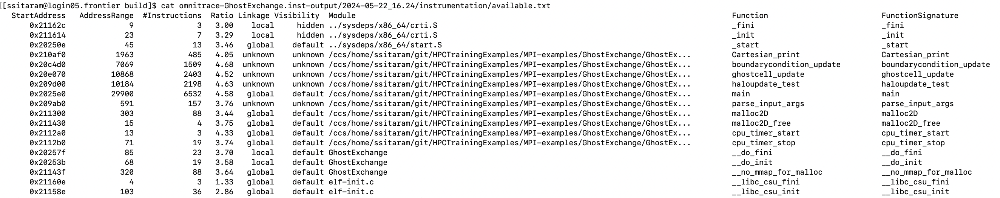
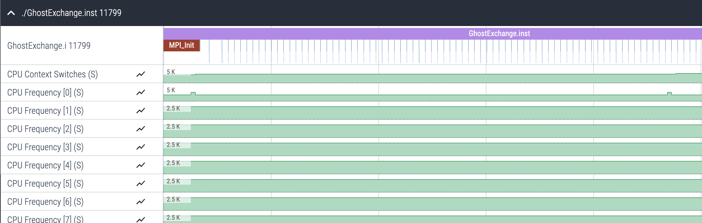
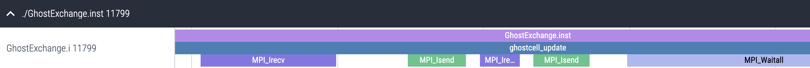
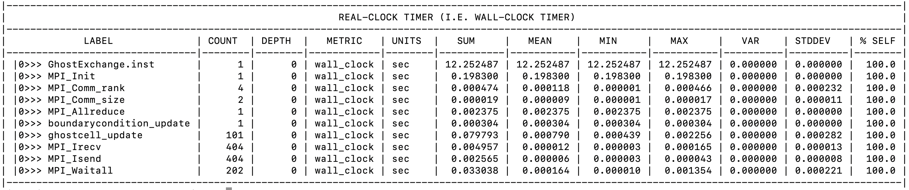

# Ghost Exchange: Original Implementation

This example shows a CPU-only implementation, and how to use Omnitrace to trace it.

## Environment: Frontier

We have developed and tested these examples for Frontier, using these modules:

```
module load cce/17.0.0
module load rocm/5.7.0
module load omnitrace/1.11.2
module load craype-accel-amd-gfx90a cmake/3.23.2
```

## Building and Running

To build and run this initial implementation do the following:

```
cd Orig
mkdir build; cd build;
cmake ..
make -j8
srun -N1 -n4 -c7 --gpu-bind=closest -A <account> -t 05:00 ./GhostExchange -x 2 -y 2 -i 20000 -j 20000 -h 2 -t -c -I 100
```

Output from this run should look something like this:

```
GhostExchange_ArrayAssign Timing is stencil 11.700421 boundary condition 0.026961 ghost cell 0.222361 total 12.124237
```

## Instrumenting with Binary-rewrite

Before instrumenting and running with Omnitrace, we need to make sure our default configuration file is generated with:

```
omnitrace-avail -G ~/.omnitrace.cfg
export OMNITRACE_CONFIG_FILE=~/.omnitrace.cfg
```

Note that `~/.omnitrace.cfg` is the default place Omnitrace will look for a configuration file, but 
you can point it to a different configuration file using the environment variable `OMNITRACE_CONFIG_FILE`.

It is recommended to use `omnitrace-instrument` to output an instrumented binary since our application uses MPI. This way, tracing output will appear in separate files by default. We can instrument and run with these commands:

```
omnitrace-instrument -o ./GhostExchange.inst -- ./GhostExchange
srun -N1 -n4 -c7 --gpu-bind=closest -A <account> -t 05:00 omnitrace-run -- ./GhostExchange.inst -x 2  -y 2  -i 20000 -j 20000 -h 2 -t -c -I 100
```

Note: it is necessary to run with `omnitrace-run` when running an instrumented binary.

## Expected Instrumentation Output

Omnitrace will output text indicating its progress when using both `omnitrace-instrument` and
`omnitrace-run`. `omnitrace-instrument` shows which functions it instrumented and which functions are available to be instrumented in output files, the paths are reported as shown here:

<p></p>

The `available` output file looks like this:

<p></p>

While the `instrumented` output file looks like this:

<p></p>

We see in this case `omnitrace-instrument` seems to only instrument a few functions. This is because 
by default Omnitrace excludes any functions smaller than a certain number of instructions from instrumentation to reduce the overhead of tracing, the size of the resulting trace, and increase readability of the trace visualization. This can be tuned by the `-i <instruction-count>` argument to `omnitrace-instrument`, which will include functions with at least `<instruction-count>` instructions in instrumentation. Specific functions can be included by providing a regular expression to the `-I <function-regex>`, which will include in instrumentation any function name matching the regular expression, despite heuristics.

For more thorough details on Omnitrace options, we defer to the [Omnitrace documentation](rocm.github.io/omnitrace).

For `omnitrace-run`, we look for the following output to ensure our run is correctly using Omnitrace, and for locating the output files:

<p></p>

The ASCII art lets you know Omnitrace is running, and:

<p></p>

Shows the output paths for the proto files, and also validates that the proto files generated successfully.

If the `omnitrace-run` output seems to halt abruptly without the output file paths, ensure your app 
can run successfully outside of Omnitrace.

## Initial Trace

Below is a screenshot of a trace obtained for this example:
<p></p>
(truncated for space)
<p></p>

In this screenshot, we see Omnitrace is showing CPU frequency data for every core.
To have Omnitrace only show CPU frequency for a single CPU core, add this to `~/.omnitrace.cfg`:

```
OMNITRACE_SAMPLING_CPUS                            = 0
```

and re-run the command from before, no need to re-instrument:

```
srun -N1 -n4 -c7 --gpu-bind=closest -A <account> -t 05:00 omnitrace-run -- ./GhostExchange.inst -x 2  -y 2  -i 20000 -j 20000 -h 2 -t -c -I 100
```

Now we see that only one instance of CPU frequency is reported:

<p></p>

Zooming in, we see instrumented MPI activity:

<p></p>

We can alter the Omnitrace configuration to see MPI overheads measured numerically. Add this to `~/.omnitrace.cfg`:

```
OMNITRACE_PROFILE                                  = true
```

Then re-running our same instrumented binary gives us a few new output files, look for `wall_clock-0.txt`:

<p></p>

Here, we see a hierarchical view of overheads, to flatten the profile to see total count and mean duration for each MPI call, add this to `~/.omnitrace.cfg`:

```
OMNITRACE_FLAT_PROFILE                             = true
```

Re-running `omnitrace-run` with our intrumented binary will now produce a `wall_clock-0.txt` file that looks like this:

<p></p>

We can see the number of times each MPI function was called, and the time associated with each.
