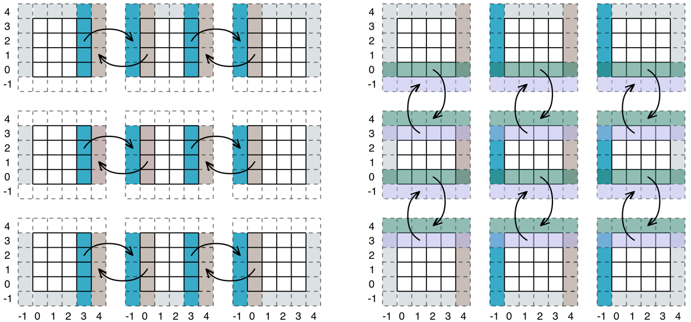

# MPI Example: Ghost Exchange with OpenMP

README.md from `HPCTrainingExamples/MPI-examples/GhostExchange/GhostExchange_ArrayAssign` from the Training Examples repository.

In this version of the Ghost Exchange example we use OpenMP to perform the necessary computations in parallel on GPUs.These computations are for instance data initialization and solution advancement. When running in parallel, each MPI process will execute the prescribed kernels in parallel, and these will execute in parallel on the GPU, thanks to OpenMP.
We begin with an original implementation that can run in parallel thanks to MPI but is CPU only, meaning that the computations will run in serial on the CPU on a per process basis. Several improved versions are provided which are outlined in the next paragraph.

## Features of the various versions
The Ghost Exchange example with OpenMP contains several implementations at various stages
of performance optimization. Generally speaking, however, the various versions follow the same basic algorithm, what changes is where the computation happens, or the data movement and location. See below a breakdown of the features of the various versions:

- **Orig**: this is a CPU-only implementation that runs in parallel with MPI, and serves as the starting point for further optimizations. It is recommended to start here.
- **Ver1**: this version is a variation of Orig that uses OpenMP and unified shared memory to offload the computations to the GPUs. Memory can be moved to the GPU using map clauses with OpenMP, however it is much easier to not have to worry about explicit memory management for an initial port, which is what the unified shared memory allows. Note that arrays allocated on the CPU are used for MPI communication, henche GPU aware MPI is not used in this version. To enable unified shared memory, `export HSA_XNACK=1` before running the example.
- **Ver2**: this is a variation of Ver1, adding `roctx` ranges to get more easily readable profiling output. This change does not affect performance.
- **Ver3**: this is a variation of Ver2, allocating the communication buffers on GPU using the OpenMP API.
- **Ver4**: this is a variation of Ver2, exploring dynamically allocating communication buffers on the CPU using malloc.
- **Ver5**: this is a variation of Ver4, where the solution array is unrolled from a 2D array into a 1D array.
- **Ver6**: this is a variation of Ver5, using explicit memory management directives to specify when data movement should happen. In this context unified shared memory is not required and therefore one could `unset HSA_XNACK`.

## Overview of the implementation

The code is controlled with the following arguments:
- `-i imax -j jmax`: set the total problem size to `imax*jmax` cells.
- `-x nprocx -y nprocy`: set the number of MPI processes in the x and y direction respectively, with `nprocx*nprocy` total processes.
- `-h nhalo`: number of halo layers, the minimum value dictated by the mathematical operator in this case is one, but it can be made bigger to increase the communication work, for experimentation.
- `-t`: legacy argument used to include MPI barriers before the ghost exchange. Currently has no impact.
- `-c`: include as input argument to include the ghost cells in the corners of the MPI subdomains during the ghost exchange.
- `-p`: include as input argument to print the solution field (including values on the halo). Printing is limited above by the size of the problem.

The kernel used to advance the solution is a blur kernel, that modifies the value of a
given element by averaging the values at a 5-point stencil location centered at the given element:

`xnew[j][i] = (x[j][i] + x[j][i-1] + x[j][i+1] + x[j-1][i] + x[j+1][i])/5.0`

The halo exchange happens in a two-step fashion as shown in the image below, from the book [Parallel and high performance computing, by Robey and Zamora](https://www.manning.com/books/parallel-and-high-performance-computing):
<p>

</p>
Above, a ghost cell on a process is delimited by a dashed outline, while cells owned by a process are marked with a solid line. Communication is represented with arrows and colors representing the original data, and the location that data is being communicated and copied to. We see that each process communicates based on the part of the problem it owns: the process that owns the central portion of data must communicate in all four directions, while processes on the corner only have to communicate in two directions only.

We now describe how to compile and run some of the above versions. Note that the modules that will be loaded next rely on the model installation described in the HPCTrainingDock [repo](https://github.com/amd/HPCTrainingDock).

## Original version of Ghost Exchange

```
module load openmpi amdclang
```

Setting `HSA_XNACK=1` now for all of the following runs, except for Ver6, for which it is not needed.

```
export HSA_XNACK=1
export MAX_ITER=1000
```

Build the code

```
cd Orig
mkdir build && cd build
cmake ..
make -j
```

Run the example

```
echo "Orig Ver: Timing for CPU version with 4 ranks"
mpirun -n 4  ./GhostExchange -x 2  -y 2  -i 20000 -j 20000 -h 1 -c -I ${MAX_ITER}
```

Note the time that it took to run and the time for each part of the application.

Now we will try and run it with some simple affinity settings. These map the 4 process to separate NUMA regions and binds the process to the core

```
echo "Orig Ver: Timing for CPU version with 4 ranks with affinity"
mpirun  -n 4  --bind-to core     -map-by ppr:1:numa  --report-bindings ./GhostExchange -x 2  -y 2  -i 20000 -j 20000 -h 1 -c -I ${MAX_ITER}
```

Here are other affinity settings that you can try. These are for larger number of ranks and GPUs. Note that the number of processes per resource (ppr)
increases

```
echo "Orig Ver: Timing for CPU version with 16 ranks"
mpirun -n 16  ./GhostExchange -x 4  -y 4  -i 20000 -j 20000 -h 1 -t -c -I ${MAX_ITER}
echo "Orig Ver: Timing for CPU version with 16 ranks with affinity"
mpirun -n 16  --bind-to core     -map-by ppr:2:numa  --report-bindings ./GhostExchange -x 4  -y 4  -i 20000 -j 20000 -h 1 -t -c -I ${MAX_ITER}
mpirun -n 64  --bind-to core     -map-by ppr:8:numa  --report-bindings ./GhostExchange -x 8  -y 8  -i 20000 -j 20000 -h 1 -t -c -I ${MAX_ITER}
mpirun -n 256 ./GhostExchange -x 16 -y 16 -i 20000 -j 20000 -h 1 -t -c
mpirun -n 16  --bind-to core     -map-by ppr:2:numa  ./GhostExchange -x 4  -y 4  -i 20000 -j 20000 -h 1 -t -c
mpirun -n 64  --bind-to core     -map-by ppr:8:numa  ./GhostExchange -x 8  -y 8  -i 20000 -j 20000 -h 1 -t -c
mpirun -n 256 --bind-to hwthread -map-by ppr:32:numa ./GhostExchange -x 16 -y 16 -i 20000 -j 20000 -h 1 -t -c -I ${MAX_ITER}
```

## Version 1 -- Adding OpenMP target offload to original CPU code

Build the example

```
cd ../../Ver1
mkdir build && cd build
cmake ..
make -j
```

Now run the example

```
echo "Ver 1: Timing for GPU version with 4 ranks with compute pragmas"
mpirun -n 4  --bind-to core     -map-by ppr:1:numa  --report-bindings ./GhostExchange -x 2  -y 2  -i 20000 -j 20000 -h 1 -t -c -I ${MAX_ITER}
```

Adding affinity script

```
echo "Ver 1: Timing for GPU version with 4 ranks with compute pragmas"
mpirun -n 4  --bind-to core     -map-by ppr:1:numa  --report-bindings ../../affinity_script.sh ./GhostExchange -x 2  -y 2  -i 20000 -j 20000 -h 1 -t -c -I ${MAX_ITER}
```

You can export the environment variable below to check that the kernels are indeed executing on the GPU:

```
export LIBOMPTARGET_INFO=-1
```

Version 2 through 6 can be run similarly. For version 6, we recommend to `unset HSA_XNACK` since explicit memory management is implemented in this example. On MI300A, having `HSA_XNACK=1` set will make OpenMP ignore the map clauses.

