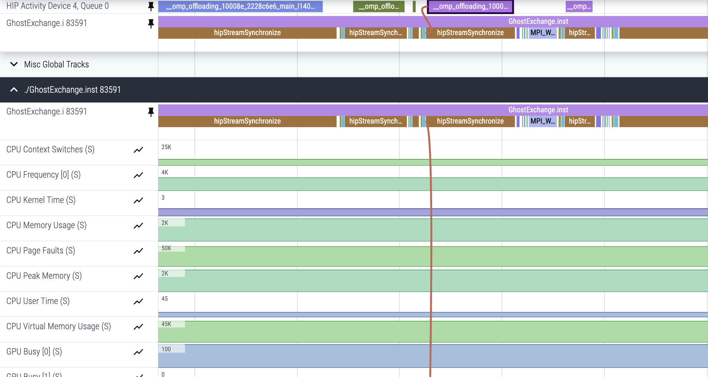
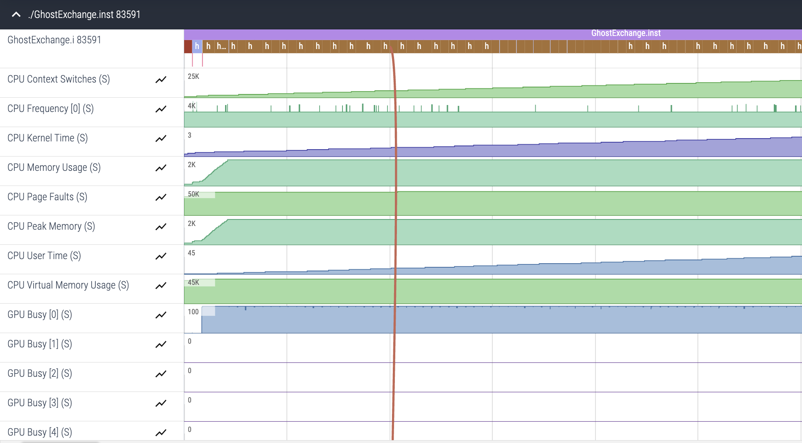
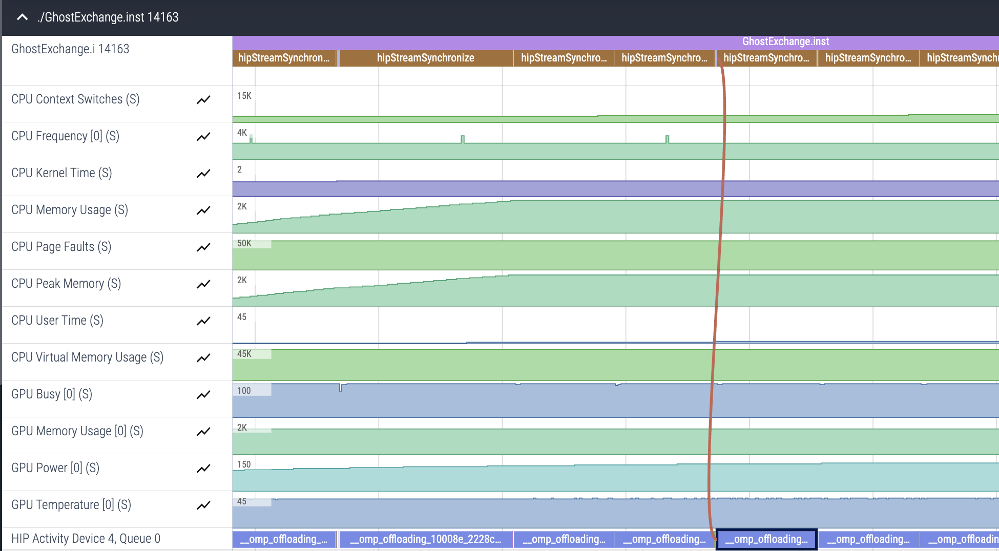
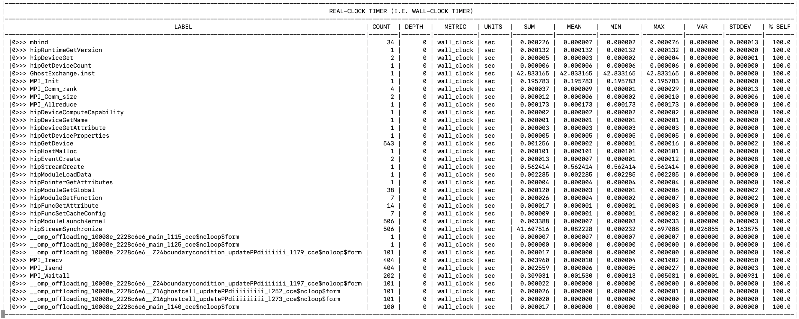
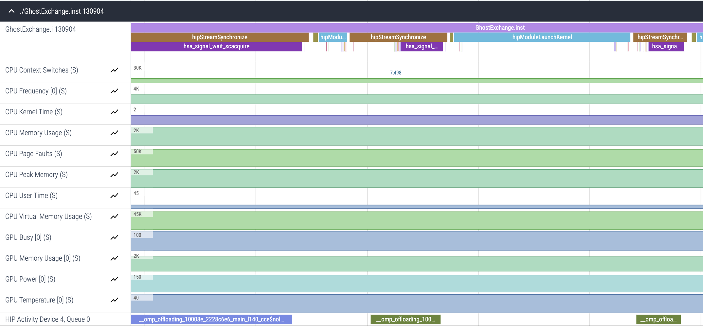

# Ghost Exchange Version 1: OpenMP GPU port

In this version of the Ghost Exchange, we port the initial code to GPUs by using OpenMP pragmas.
This uses OpenMP's target offload feature with a managed memory model, so the only differences between
the original code and this version are the addition of OpenMP pragmas.

Using the managed memory model, the memory buffers are still initially allocated on host, but the OS
will manage page migration and data movement across the Infinity Fabric&trade; link on MI250X.

## Environment: Frontier

```
module load cce/17.0.0
module load rocm/5.7.0
module load omnitrace/1.11.2
module load craype-accel-amd-gfx90a cmake/3.23.2
```

## Build and Run

```
cd Ver1
mkdir build; cd build;
cmake ..
make -j8
srun -N1 -n4 -c7 --gpu-bind=closest -A <account> -t 05:00 ./GhostExchange -x 2  -y 2  -i 20000 -j 20000 -h 2 -t -c -I 100
```

This run should show output that looks like this:

```
GhostExchange_ArrayAssign Timing is stencil 41.139365 boundary condition 0.096919 ghost cell 0.120836 total 42.683348
```

Now, this runtime is somewhat unexpected and points to some issue in our OpenMP configuration. Certainly, 
using managed memory means sub-optimal memory movement, but we have observed on a different system that this 
implementation runs in around 3 seconds. Using different compilers makes matching configurations complex,
so we suspect there is some subtle configuration difference that is impacting performance here. We will use
Omnitrace to narrow down where the additional overhead manifests throughout these examples.

## Initial Trace

Remember to enable the `HSA_XNACK` environment variable and ensure that the configuration file is
known to Omnitrace:

```
export HSA_XNACK=1
export OMNITRACE_CONFIG_FILE=~/.omnitrace.cfg
srun -N1 -n4 -c7 --gpu-bind=closest -A <account> -t 05:00 ./GhostExchange.inst -x 2  -y 2  -i 20000 -j 20000 -h 2 -t -c -I 100
```

## Pin Rows for Easier Visualization

The profile we obtain will show all the offloaded kernels launched with the OpenMP pragmas.
However, the initial visualization we get with Perfetto often does not group the rows of interest 
together. In this screenshot, we show the "pin" icon that allows us to pin rows to the top of the
visualization, allowing us to see relevant tracing data for our specific case:

<p></p>

This profile will also show `rocm-smi` information about each GPU, though that data seems to indicate
only GPU 0 is engaged. To show only information relevant to GPU 0, we can add this to `~/.omnitrace.cfg`:

```
OMNITRACE_SAMPLING_GPUS                            = 0
```

Before this is set, the profile looks like this:

<p></p>

And after we re-run `omnitrace-run` with `OMNITRACE_SAMPLING_GPUS=0`, we see:

<p></p>

## Look at the Flat Timemory profile

Again, add `OMNITRACE_PROFILE=true` and `OMNITRACE_FLAT_PROFILE=true` to `~/.omnitrace.cfg` to get 
`wall_clock-0.txt` to see overall overhead in seconds for each function:

<p></p>

We now see kernels with `__omp_offloading...` that show we are launching kernels, and we see that our
runtime for `GhostExchange.inst` has increased to 42 seconds. We also see that the only function call
that takes around that long in the profile is `hipStreamSynchronize`. This indicates that the bulk of
the time is spent in the GPU compute kernels, especially the blur kernel. We know that the kernel is
memory bound, but the very long duration indicates that there is an overhead due to page
migration. Omnitrace has helped us narrow down where this overhead is coming from, but it
does not show page faults arising from GPU kernels. We are hoping that this feature would be
available in a future update.

## HSA Activity

The AMD compiler implements OpenMP target offload capability using the
[HSA](https://rocm.docs.amd.com/projects/ROCR-Runtime/en/latest/index.html) runtime library.
The Cray compiler, on the other hand, implements OpenMP target offload functionality using the
[HIP](https://rocm.docs.amd.com/projects/HIP/en/latest/index.html) runtime. Ultimately,
the HIP runtime relies on the HSA runtime. To see HSA activity, add this to `~/.omnitrace.cfg`:

```
OMNITRACE_ROCTRACER_HSA_ACTIVITY                   = true
OMNITRACE_ROCTRACER_HSA_API                        = true
```

This will add HSA layer activities in the trace:

<p></p>
