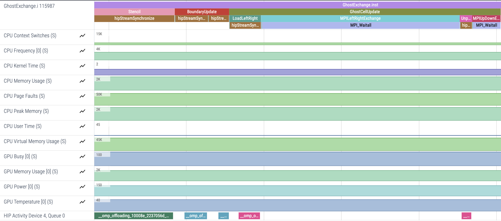
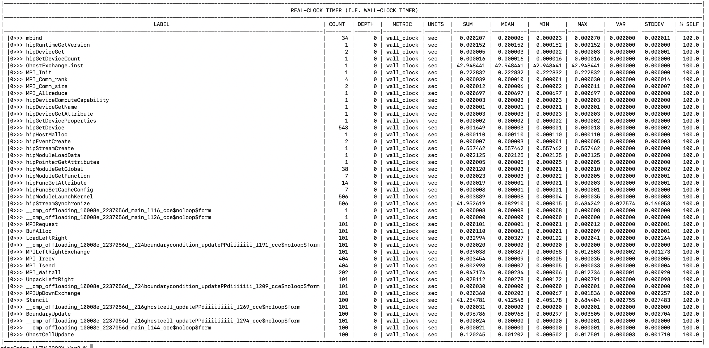

# Ghost Exchange: `roctx` ranges

In this implementation, we add `roctx` ranges to the code to demonstrate their use in highlighting regions of interest in a trace. This allows you to group several functions and kernels in the same range to mark logical regions of your application, making the trace easier to understand at a higher level.

## Environment: Frontier

```
module load cce/17.0.0
module load rocm/5.7.0
module load omnitrace/1.11.2
module load craype-accel-amd-gfx90a cmake/3.23.2
```

## Get an Initial Trace

Omnitrace enables `roctx` ranges by default, so we only needed to add them in the code.
Instrument and run the instrumented application to get a trace:

```
export HSA_XNACK=1
export OMNITRACE_CONFIG_FILE=~/.omnitrace.cfg
srun -N1 -n4 -c7 --gpu-bind=closest -A <account> -t 05:00 ./GhostExchange.inst -x 2  -y 2  -i 20000 -j 20000 -h 2 -t -c -I 100
```

With `roctx` regions, our trace looks like this:

<p></p>

Note: to reduce the number of rows of `rocm-smi` output you see, you may also need to add `OMNITRACE_SAMPLING_GPUS=0` 

## Look at Timemory output

With `OMNITRACE_PROFILE=true` and `OMNITRACE_FLAT_PROFILE=true` in your `~/.omnitrace.cfg` you will
see a `wall_clock-0.txt` file that looks like this:

<p></p>

We see that `roctx` regions also show up in this file. Importantly we see the region called `BufAlloc`
gets called 101 times, showing that the code allocating our buffers is running multiple times 
throughout our application's execution.
