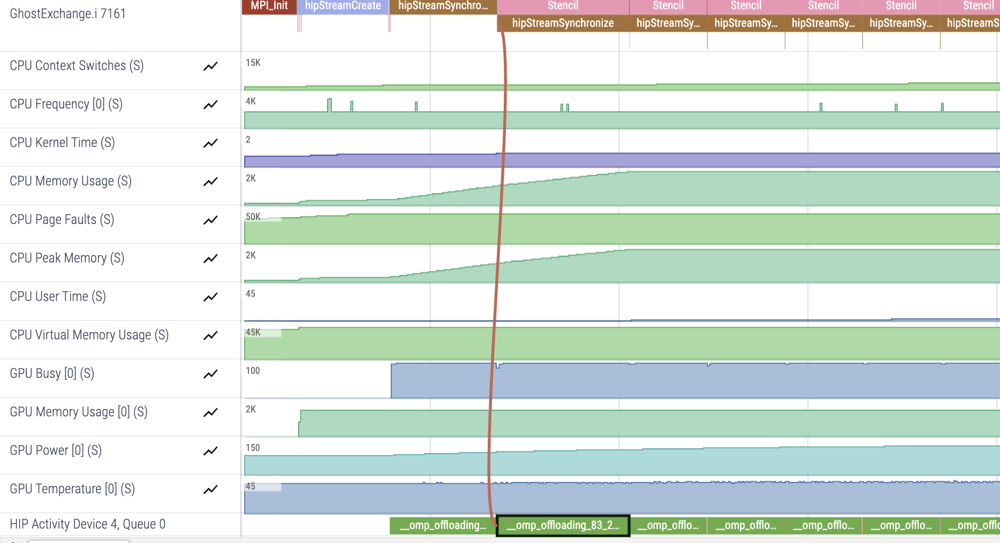
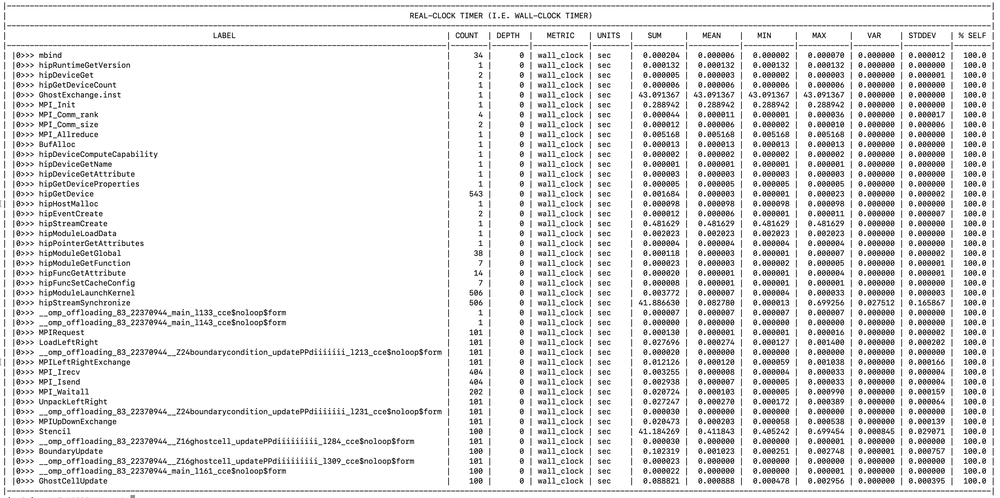

# Ghost Exchange: Reduce Allocations

In the first `roctx` range example we saw that BufAlloc was being called 101 times, indicating we were allocating our buffers several times.
In this example, we move the allocations so that we only need to allocate the buffers one time and explore how that impacts performance through Omnitrace.

## Environment: Frontier

```
module load cce/17.0.0
module load rocm/5.7.0
module load omnitrace/1.11.2
module load craype-accel-amd-gfx90a cmake/3.23.2
```

## Build and Run

```
cd Ver4
mkdir build; cd build;
cmake ..
make -j8
srun -N1 -n4 -c7 --gpu-bind=closest -A <account> -t 05:00 ./GhostExchange -x 2  -y 2  -i 20000 -j 20000 -h 2 -t -c -I 100
```

The output for this run should look like:

```
GhostExchange_ArrayAssign Timing is stencil 41.207540 boundary condition 0.100581 ghost cell 0.102640 total 42.511851
```

Note we see similar runtimes to previous examples, so these changes do not fix the issue.

## Get an Initial Trace

```
export HSA_XNACK=1
export OMNITRACE_CONFIG_FILE=~/.omnitrace.cfg
srun -N1 -n4 -c7 --gpu-bind=closest -A <account> -t 05:00 ./GhostExchange.inst -x 2  -y 2  -i 20000 -j 20000 -h 2 -t -c -I 100
```

This trace should look largely like the previous roctx trace:

<p></p>

An easier way to see how this code has changed is to look at `wall_clock-0.txt`, by adding 
`OMNITRACE_PROFILE=true` and `OMNITRACE_FLAT_PROFILE=true` to `~/.omnitrace.cfg`:

<p></p>

Here we see that the change has the intended effect of reducing the number of calls to `BufAlloc` to one, rather than 101.
