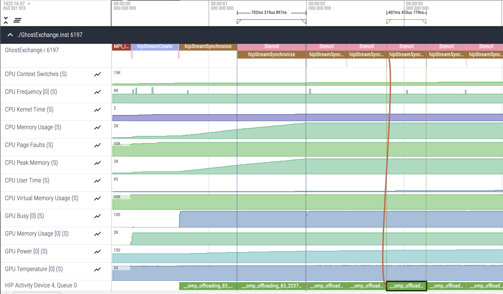
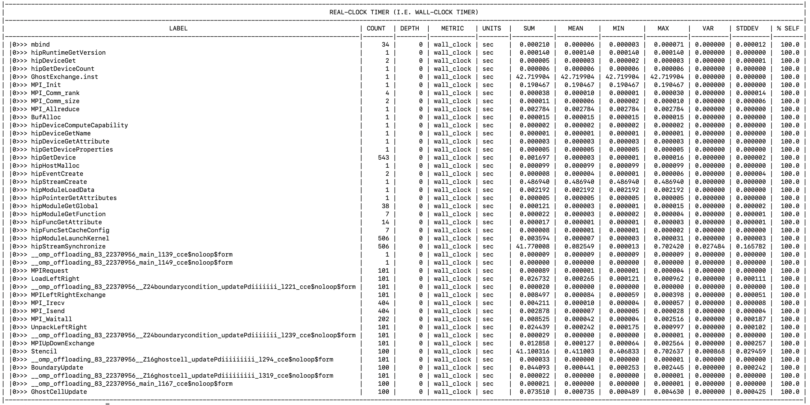

# Ghost Exchange: Changing Data Layout

In this example we explore changing our 2D array layout to 1D and use Omnitrace to investigate the performance impact.

This sort of change typically requires significant development overhead, as the indexing of the data must change everywhere in the application.

## Environment: Frontier

```
module load cce/17.0.0
module load rocm/5.7.0
module load omnitrace/1.11.2
module load craype-accel-amd-gfx90a cmake/3.23.2
```

## Build and Run

```
cd Ver5
mkdir build; cd build;
cmake ..
make -j8
srun -N1 -n4 -c7 --gpu-bind=closest -A <account> -t 05:00 ./GhostExchange -x 2  -y 2  -i 20000 -j 20000 -h 2 -t -c -I 100
```

The output from this run should look like:

```
GhostExchange_ArrayAssign Timing is stencil 40.865325 boundary condition 0.109544 ghost cell 0.207257 total 42.252296
```

We still see a similar runtime, indicating this code change did not fix our issue.

## Get a Trace

```
export HSA_XNACK=1
export OMNITRACE_CONFIG_FILE=~/.omnitrace.cfg
srun -N1 -n4 -c7 --gpu-bind=closest -A <account> -t 05:00 ./GhostExchange.inst -x 2  -y 2  -i 20000 -j 20000 -h 2 -t -c -I 100
```

The initial trace for this example should look very similar to previous traces we have seen:

<p></p>

That is, we cannot see an obvious change in performance from just looking at this trace. We will make a note of the runtime of the second kernel invocation as taking 702ms, and the fifth kernel invocation as taking 407ms. In the next version we will compare these numbers to another modification.

## Look at Timemory output

We also see that our `wall_clock-0.txt` file looks pretty similar to our previous example:

<p></p>

To enable the output of this file, add `OMNITRACE_PROFILE=true` and `OMNITRACE_FLAT_PROFILE=true` to your `~/.omnitrace.cfg` file.
