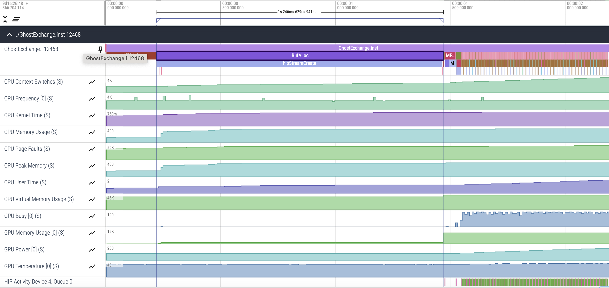
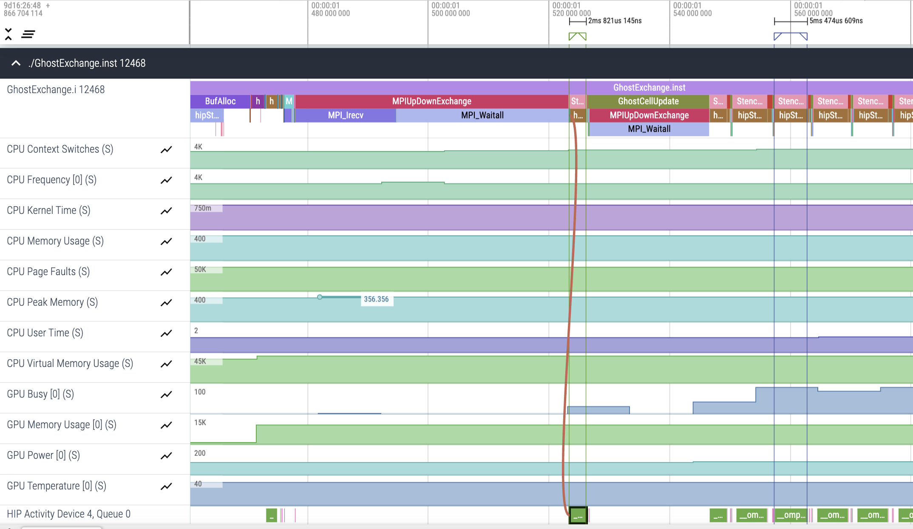
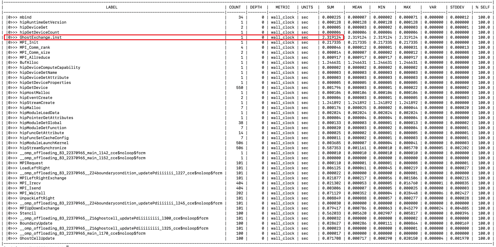

# Ghost Exchange: Explicit Memory Management

In this example we explicitly manage the memory movement onto the device by using 
`omp target enter data map`, `omp target update from`, and `omp target exit data map`, etc. 
instead of requiring OpenMP to use managed memory and have the OS manage page migrations 
automatically. We no longer need either the pragma `omp requires unified_shared_memory` on
each translation unit or the `HSA_XNACK=1` setting. However, if the openmpi implementation we will be
using does not have GPU-aware MPI, then we need `HSA_XNACK=1` to make the code run.

Typically, startup costs of an application are not as important as the kernel runtimes. 
In this case, by explicitly moving memory at the beginning of our run, 
we're able to remove the overhead of memory movement from kernels. 
However our startup is slightly slower since we need to allocate a copy
of all buffers on the device up-front.

## Environment: Frontier

```
module load cce/17.0.0
module load rocm/5.7.0
module load omnitrace/1.11.2
module load craype-accel-amd-gfx90a cmake/3.23.2
```

If your environment is AAC, you do not need to load the cray specific modules and the cmake module, but rather the `amdclang` module. If the OpenMPI you will be using does not have GPU-aware MPI enabled, you will need to `export HSA_XNACK=1`. If you have GPU-aware MPI enabled, then you can `unset HSA_XNACK`. This is because in the code there are some `target data` OpenMP directives that pass the device pointers to the MPI API to leverage GPU-aware MPI, but these OpenMP directives have no effect when `export HSA_XNACK=1` and so if no GPU-aware MPI is present, we can by pass the directives by doing `export HSA_XNACK=1`.

## Build and Run

```
cd Ver6
mkdir build; cd build;
cmake ..
make -j
```

On Frontier, you can run with:
```
srun -N1 -n4 -c7 --gpu-bind=closest -A <account> -t 05:00 ./GhostExchange -x 2  -y 2  -i 20000 -j 20000 -h 2 -t -c -I 100
```
On AAC, you can use `mpirun`:
```
mpirun -n 4 ./GhostExchange -x 2  -y 2  -i 20000 -j 20000 -h 2 -t -c -I 100
```

The output for this run should look like:

```
GhostExchange_ArrayAssign Timing is stencil 0.555478 boundary condition 0.006301 ghost cell 0.095680 total 1.156549
```

Now we see a drastic improvement in our runtime. This should not be taken as typical for this type of
optimization, as we saw a speedup of around 2x on a different system between the last example and this one.
This points to the fact that this change avoids the overheads we were seeing due to some OpenMP configuration detail
in previous examples.

## Get a Trace

```
export OMNITRACE_CONFIG_FILE=~/.omnitrace.cfg
srun -N1 -n4 -c7 --gpu-bind=closest -A <account> -t 05:00 ./GhostExchange.inst -x 2  -y 2  -i 20000 -j 20000 -h 2 -t -c -I 100
```

Here's what the trace looks like for this run:

<p></p>

We see that BufAlloc seems to take much longer, but our kernels are much faster than before:

<p></p>

We see here the second kernel invocation that took 702ms previously now takes 2ms, and the fifth
kernel invocation that took 407ms previously now takes 7ms! The implicit data movement was a large 
portion of our kernel overhead.

## Look at Timemory output

The `wall_clock-0.txt` file shows our overall run got much faster:

<p></p>

Previously we ran in 42 seconds, and now the uninstrumented runtime is 1.15 seconds (from above),
while `wall_clock-0.txt` shows our runtime is 2.3 seconds. However, we expect we
should see a much more modest speedup, on the order of 2x. The exaggerated speedup is due to 
our initial GPU examples running more slowly than expected.

However, we see that the location of our data on CPU+GPU system matters quite a lot to performance.
Implicit memory movement may not get the best performance, and it is usually worth it to 
pay the memory movement cost up front once than repeatedly for each kernel.
