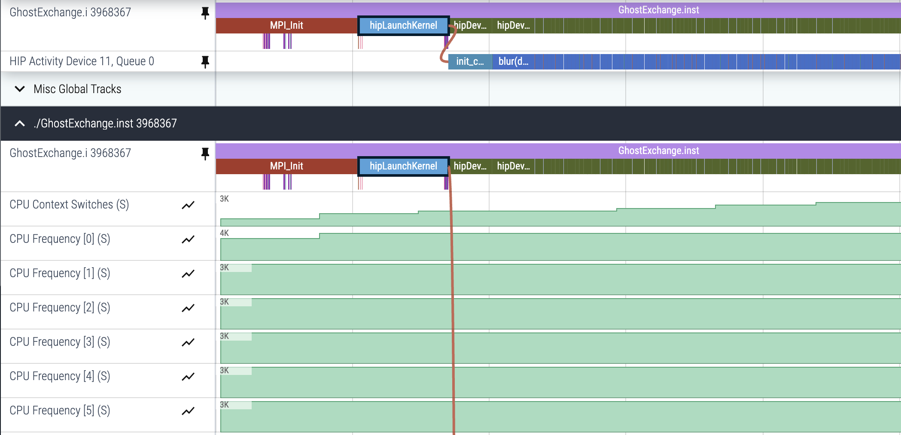

# Ghost Exchange Version 1: HIP GPU port

In this version of the Ghost Exchange, we port the initial code to GPUs using the Heterogenous Interface for Portability (HIP) model. This uses offloading using HIP and a managed memory model, so the only differences between [the original code](https://github.com/amd/HPCTrainingExamples/tree/main/MPI-examples/GhostExchange/GhostExchange_ArrayAssign/Orig) and this version are the addition of HIP kernels.

Using the managed memory model, the memory buffers are still initially allocated on host, but the OS will manage page migration and data movement across the PCIe link between the host and device. In this series of examples, we will demonstrate profiling with Omnitrace using an AMD Instinct&trade; MI210 GPU. ROCm releases (6.2.0+) now include Omnitrace. Please install the additional package called `omnitrace` along with ROCm to find the Omnitrace binaries in the `${ROCM_PATH}/bin` directory.

## Environment Setup

We recommend installing OpenMPI 5.0.3 with UCX 1.16.x. Instructions [here](https://github.com/amd/HPCTrainingDock/blob/main/comm/sources/scripts/openmpi_setup.sh) may be useful reference for this OpenMPI install. We also recommend using cmake version 3.23.2 or greater.

```
module load rocm/6.2.0
module load cmake/3.23.2
module load openmpi/5.0.3_ucx1.16.x
```

## Build and Run

```
cd Ver1
mkdir build; cd build;
cmake -D CMAKE_CXX_COMPILER=${ROCM_PATH}/bin/amdclang++ -D CMAKE_C_COMPILER=${ROCM_PATH}/bin/amdclang ..
make -j8
mpirun -np 4 --mca pml ucx --mca coll ^hcoll ./GhostExchange -x 2  -y 2  -i 20000 -j 20000 -h 2 -t -c -I 100
```

This run should show output that looks like this:

```
GhostExchange_ArrayAssign_HIP Timing is stencil 5.370196 boundary condition 0.024429 ghost cell 0.207778 total 6.359760
```

## Run with affinity settings

Proper binding may affect the performance of this application. To test this, we
will run the code with proper CPU core and GPU affinity for each of the processes.
We will use a script to set GPU bindings and OpenMPI's options for CPU core
bindings. Note also that performance may vary on your system because of a different
topology or software stack. The NUMA affinity for the first four GPU devices (out of 8)
using the command `rocm-smi --showtoponuma` looks like the following.

```
GPU[0]		: (Topology) Numa Node: 3
GPU[0]		: (Topology) Numa Affinity: 3
GPU[1]		: (Topology) Numa Node: 2
GPU[1]		: (Topology) Numa Affinity: 2
GPU[2]		: (Topology) Numa Node: 1
GPU[2]		: (Topology) Numa Affinity: 1
GPU[3]		: (Topology) Numa Node: 0
GPU[3]		: (Topology) Numa Affinity: 0
```

and `lscpu | grep NUMA` shows the CPU hardware threads associated with each of these NUMA domains:

```
NUMA node(s):        4
NUMA node0 CPU(s):   0-15,128-143
NUMA node1 CPU(s):   16-31,144-159
NUMA node2 CPU(s):   32-47,160-175
NUMA node3 CPU(s):   48-63,176-191
```

The GPU affinity script, as described in the
[Affinity part 2 blog post](https://rocm.blogs.amd.com/software-tools-optimization/affinity/part-2/README.html#setting-affinity),
is simply mapping the GPU device id to the MPI rank of the process (in reverse
order to suite the topology of the system at hand). We urge you to set up the
affinity script according to your system topology and verify your bindings
as described in the blog post mentioned above. Please note that this binding
script has been adjusted only to run 4 processes on the first four GPU devices.

```
$ cat set_gpu_device.sh
#!/bin/bash
let mygpu=${OMPI_COMM_WORLD_SIZE}-${OMPI_COMM_WORLD_LOCAL_RANK}-1
export ROCR_VISIBLE_DEVICES=$mygpu
exec $*
```

We then combine that with `mpirun` option, `--map-by NUMA` to place each process
in a NUMA domain that is closest to the GPU device picked for that process.

```
mpirun -np 4 --mca pml ucx --mca coll ^hcoll --map-by NUMA ../../set_gpu_device.sh ./GhostExchange -x 2  -y 2  -i 20000 -j 20000 -h 2 -t -c -I 100
```

This run should show output that looks like this:

```
GhostExchange_ArrayAssign_HIP Timing is stencil 1.383771 boundary condition 0.005227 ghost cell 0.168426 total 2.005595
```

Observe that using proper affinity settings we achieve a 3x speedup of this application.
Again, the performance you observe may be different based on the topology of the system you have.
Note that using managed memory we must have sub-optimal memory movement which we will
correct in subsequent versions of this example.
We will use Omnitrace to narrow down where the additional overhead manifests throughout
these examples.

## Initial Trace

Remember to enable the `HSA_XNACK` environment variable and ensure that the
configuration file is known to Omnitrace. First instrument the binary, and then run
the instrumented binary under the mpirun environment.

```
export HSA_XNACK=1
export OMNITRACE_CONFIG_FILE=~/.omnitrace.cfg
omnitrace-instrument -o ./GhostExchange.inst -- ./GhostExchange
mpirun -np 4 --mca pml ucx --mca coll ^hcoll --map-by NUMA ../../set_gpu_device.sh omnitrace-run -- ./GhostExchange.inst -x 2  -y 2  -i 20000 -j 20000 -h 2 -t -c -I 100
```

## Pin Rows for Easier Visualization

The profile we obtain will show all the offloaded HIP kernels. 
However, the initial visualization we get with Perfetto often does not
group the rows of interest together. In this screenshot, we show the
"pin" icon that allows us to pin rows to the top of the visualization,
allowing us to see relevant tracing data for our specific case:

<p></p>

This profile will also show `rocm-smi` information about each GPU,
though that data seems to indicate that only GPUs 0-3 are engaged.
To show only information relevant to GPUs 0-3, we can add this to `~/.omnitrace.cfg`:

```
OMNITRACE_SAMPLING_GPUS                            = 0-4
```

Before this is set, the profile looks like this:

<p></p>

And after we re-run `omnitrace-run` with `OMNITRACE_SAMPLING_GPUS=0-4`, we see:

<p></p>

## Look at the Flat Timemory profile

Again, add `OMNITRACE_PROFILE=true` and `OMNITRACE_FLAT_PROFILE=true` to `~/.omnitrace.cfg` to get 
`wall_clock-0.txt` to see overall overhead in seconds for each function:

<p></p>

We now see kernels such as `blur` that was called 100 times. 
We also see that the only function call that takes around 1.5 seconds
in the profile is `hipStreamSynchronize`. This indicates that the bulk of
the time is spent in the GPU compute kernels. In this example, we know that
there is some page migration overhead, but Omnitrace does not show page
faults arising from GPU kernels. We are hoping that this feature would be
available in a future update.
