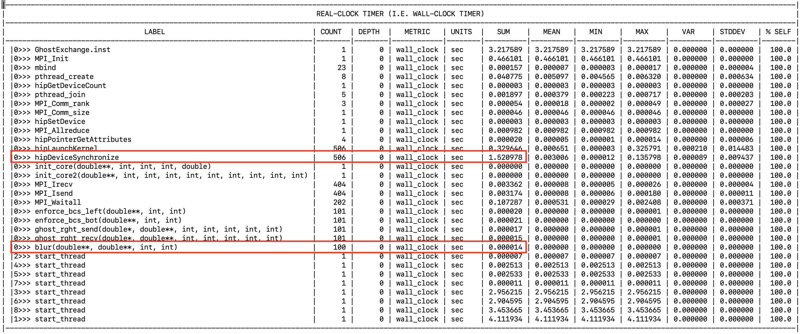

# Ghost Exchange Version 1: HIP GPU port

In this version of the Ghost Exchange, we port the initial code to GPUs using the Heterogenous
Interface for Portability (HIP) programming model. This uses offloading using HIP and a managed
memory model, so the only differences between
[the original code](https://github.com/amd/HPCTrainingExamples/tree/main/MPI-examples/GhostExchange/GhostExchange_ArrayAssign/Orig)
and this version are the addition of HIP kernels.

Using the managed memory model on an MI300A, the memory buffers are still initially allocated
on host using a system allocator, but the OS will manage the address translation and movement
of data to the device. For this to work, we must set the environment variable, `HSA_XNACK=1`.
In this series of examples, we will demonstrate profiling with Omnitrace using an AMD Instinct&trade;
MI300A APU. ROCm releases (6.2.0+) now include Omnitrace. Please install the additional package called
`omnitrace` along with ROCm to find the Omnitrace binaries in the `${ROCM_PATH}/bin` directory.

## Environment Setup

We recommend installing OpenMPI 5.0.5 with UCX 1.17.0, UCC 1.3.0 and xpmem. Instructions in the 
[AMD Training Container repo](https://github.com/amd/HPCTrainingDock/blob/main/comm/sources/scripts/openmpi_setup.sh)
may be useful reference for this OpenMPI install. We also recommend using cmake version 3.23.2 or greater.
These examples were run with ROCm 6.2.1 and CMake 3.30.2.

```
module load openmpi/5.0.5-ucc1.3.0-ucx1.17.0-xpmem2.7.3
export ROCM_PATH=/opt/rocm-6.2.1
export PATH=${ROCM_PATH}/bin:$PATH
```

## Build and Run

```
cd Ver1
mkdir build; cd build;
cmake -D CMAKE_CXX_COMPILER=${ROCM_PATH}/bin/amdclang++ -D CMAKE_C_COMPILER=${ROCM_PATH}/bin/amdclang ..
make -j8
mpirun -np 4 --mca pml ucx --mca coll ^hcoll ./GhostExchange -x 2  -y 2  -i 20000 -j 20000 -h 2 -t -c -I 100
```

This run should show output that looks like this:

```
GhostExchange_ArrayAssign_HIP Timing is stencil 2.161497 boundary condition 0.016163 ghost cell 0.027757 total 3.091757
```

## Run with affinity settings

Proper binding may affect the performance of this application. To test this, we
will run the code with proper CPU core and GPU affinity for each of the processes.
We will use a script to set GPU bindings and OpenMPI's options for CPU core
bindings. Note also that performance may vary on your system because of a different
topology or software stack. The NUMA affinity for four GPU devices on this system
using the command `rocm-smi --showtoponuma` looks like the following.

```
============================ ROCm System Management Interface ============================
======================================= Numa Nodes =======================================
GPU[0]		: (Topology) Numa Node: 0
GPU[0]		: (Topology) Numa Affinity: 0
GPU[1]		: (Topology) Numa Node: 1
GPU[1]		: (Topology) Numa Affinity: 1
GPU[2]		: (Topology) Numa Node: 2
GPU[2]		: (Topology) Numa Affinity: 2
GPU[3]		: (Topology) Numa Node: 3
GPU[3]		: (Topology) Numa Affinity: 3
================================== End of ROCm SMI Log ===================================
```

and `lscpu | grep NUMA` shows the CPU hardware threads associated with each of these NUMA domains:

```
NUMA node(s):                       4
NUMA node0 CPU(s):                  0-23,96-119
NUMA node1 CPU(s):                  24-47,120-143
NUMA node2 CPU(s):                  48-71,144-167
NUMA node3 CPU(s):                  72-95,168-191
```

The GPU affinity script, as described in the
[Affinity part 2 blog post](https://rocm.blogs.amd.com/software-tools-optimization/affinity/part-2/README.html#setting-affinity),
is simply mapping the GPU device id to the MPI rank of the process. We urge you to set up the
affinity script according to your system topology and verify your bindings using `hello_jobstep`
as described in the blog post mentioned above. Please note that this binding
script has been adjusted only to run 4 processes on the four GPU devices.

```
$ cat set_gpu_device_mi300a.sh
#!/bin/bash
let mygpu=${OMPI_COMM_WORLD_LOCAL_RANK}
export ROCR_VISIBLE_DEVICES=$mygpu
exec $*
```

We then combine that with `mpirun` option, `--map-by NUMA` to place each process
in a NUMA domain that is closest to the GPU device picked for that process.

```
mpirun -np 4 --mca pml ucx --mca coll ^hcoll --map-by NUMA ../../set_gpu_device_mi300a.sh ./GhostExchange -x 2  -y 2  -i 20000 -j 20000 -h 2 -t -c -I 100
```

This run should show output that looks like this:

```
GhostExchange_ArrayAssign_HIP Timing is stencil 0.619325 boundary condition 0.003621 ghost cell 0.039834 total 1.167482
```

Observe that using proper affinity settings we achieve a ~2-3x speedup for this simple example.
Again, the performance you observe may be different based on the topology of the system you have.
Note that using managed memory we must have additional latency due to address translation which we will
correct in subsequent versions of this example. We will use Omnitrace to narrow down where the
additional overhead manifests throughout these examples.

## Initial Trace

Creating an Omnitrace configuration file is not required, but we will tune some
parameters in this file as we go along. The commands below will help you create a
default configuration file and set up the environment so that Omnitrace knows about it:

```
omnitrace-avail -G ~/.omnitrace.cfg
export OMNITRACE_CONFIG_FILE=~/.omnitrace.cfg
```

Remember to enable the `HSA_XNACK` environment variable. First instrument the binary, and then run
the instrumented binary under the mpirun environment.

```
export HSA_XNACK=1
omnitrace-instrument -o ./GhostExchange.inst -- ./GhostExchange
mpirun -np 4 --mca pml ucx --mca coll ^hcoll --map-by NUMA ../../set_gpu_device_mi300a.sh omnitrace-run -- ./GhostExchange.inst -x 2  -y 2  -i 20000 -j 20000 -h 2 -t -c -I 100
```

Omnitrace will now write out several files. The traces to visualize are in `perfetto-trace-<rank#>.proto`
files. Look for lines that show the full path to these proto files such as the one below:

```
[omnitrace][161083][perfetto]> Outputting '/datasets/teams/dcgpu_training/ssitaram/HPCTrainingExamples/MPI-examples/GhostExchange/GhostExchange_ArrayAssign_HIP/Ver1/build/omnitrace-GhostExchange.inst-output/2024-09-26_20.27/perfetto-trace-0.proto' (869.90 KB / 0.87 MB / 0.00 GB)... 
```

Copy that proto file to your workstation and open it in [Perfetto](https://ui.perfetto.dev/v46.0-35b3d9845/#!/)
on your browser to visualize the trace.

## Pin Rows for Easier Visualization

The profile we obtain will show all the offloaded HIP kernels. 
However, the initial visualization we get with Perfetto often does not
group the rows of interest together. In this screenshot, we show the
"pin" icon that allows us to pin rows to the top of the visualization,
allowing us to see relevant tracing data for our specific case:

<p></p>

This profile will also show information about each CPU core which clutters
the profile making it very long to scroll. Since we are interested in mainly
the activity on the GPUs, we can disable showing the CPU Core Frequency information
in the profile. To do this, modify the following parameter in your config file, `~/.omnitrace.cfg`:

```
OMNITRACE_SAMPLING_CPUS                            = none
```

Before this is set, the profile looks like this:

<p></p>

And after we re-run `omnitrace-run` with `OMNITRACE_SAMPLING_CPUS=none`, we see:

<p></p>

## Look at the Flat Timemory profile

Again, add `OMNITRACE_PROFILE=true` and `OMNITRACE_FLAT_PROFILE=true` to `~/.omnitrace.cfg` to get 
`wall_clock-0.txt` to see overall overhead in seconds for each function:

<p></p>

We now see kernels such as `blur` that was called 100 times. The application
itself seems to run longer under instrumentation.
We also see that the only function call that takes around 2.8  seconds
in the profile is `hipStreamSynchronize`. This indicates that the bulk of
the time is spent in the GPU compute kernels. In this example, we know that
there is some page migration overhead, but Omnitrace does not show page
faults arising from GPU kernels. We are hoping that this feature would be
available in a future update.
