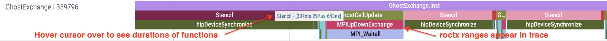

# Ghost Exchange: `roctx` ranges

In this implementation, we add `roctx` ranges to the code to demonstrate their use
in highlighting regions of interest in a trace. This allows you to group several
functions and kernels in the same range to mark logical regions of your application,
making the trace easier to understand at a higher level.

## Environment Setup

We recommend installing OpenMPI 5.0.5 with UCX 1.17.0, UCC 1.3.0 and xpmem. Instructions in the
[AMD Training Container repo](https://github.com/amd/HPCTrainingDock/blob/main/comm/sources/scripts/openmpi_setup.sh)
may be useful reference for this OpenMPI install. We also recommend using cmake version 3.23.2 or greater.
These examples were run with ROCm 6.2.1 and CMake 3.30.2.

```
module load openmpi/5.0.5-ucc1.3.0-ucx1.17.0-xpmem2.7.3
export ROCM_PATH=/opt/rocm-6.2.1
export PATH=${ROCM_PATH}/bin:$PATH
```

## Build and Run

```
cd Ver2
mkdir build; cd build;
cmake -D CMAKE_CXX_COMPILER=${ROCM_PATH}/bin/amdclang++ -D CMAKE_C_COMPILER=${ROCM_PATH}/bin/amdclang ..
make -j8
mpirun -np 4 --mca pml ucx --mca coll ^hcoll --map-by NUMA ../../set_gpu_device_mi300a.sh ./GhostExchange -x 2  -y 2  -i 20000 -j 20000 -h 2 -t -c -I 100
```

Output of this run should look like this, and we don't expect the application run time to change here:

```
GhostExchange_ArrayAssign_HIP Timing is stencil 0.620074 boundary condition 0.003493 ghost cell 0.028732 total 1.192640
```

## Get an Initial Trace

To enable `roctx` ranges in Omnitrace, set `OMNITRACE_USE_ROCTX=true` in your config file. 
Instrument the binary with Omnitrace and run the instrumented binary to get a trace. If you already have
an instrumented binary, the `omnitrace-instrument` step below can be avoided.

```
export HSA_XNACK=1
export OMNITRACE_CONFIG_FILE=~/.omnitrace.cfg
omnitrace-instrument -o ./GhostExchange.inst -- ./GhostExchange
mpirun -np 4 --mca pml ucx --mca coll ^hcoll --map-by NUMA ../../set_gpu_device_mi300a.sh omnitrace-run -- ./GhostExchange.inst -x 2  -y 2  -i 20000 -j 20000 -h 2 -t -c -I 100
```

With `roctx` regions, our trace looks like this:

<p></p>

Note: to reduce the number of rows of `rocm-smi` output you see, you may also need to add `OMNITRACE_SAMPLING_GPUS=0`.
And to avoid seeing information about any CPU cores, you can add `OMNITRACE_SAMPLING_CPUS=none` to the config file.

## Look at Timemory output

With `OMNITRACE_PROFILE=true` and `OMNITRACE_FLAT_PROFILE=true` in your
`~/.omnitrace.cfg` you will see a `wall_clock-0.txt` file that looks like this:

<p></p>

We see that `roctx` regions also show up in this file. Importantly we see the region
called `BufAlloc` gets called 101 times, showing that the code allocating our buffers
is running multiple times throughout our application's execution.
