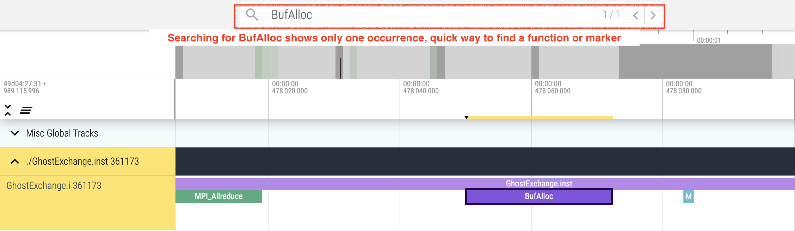
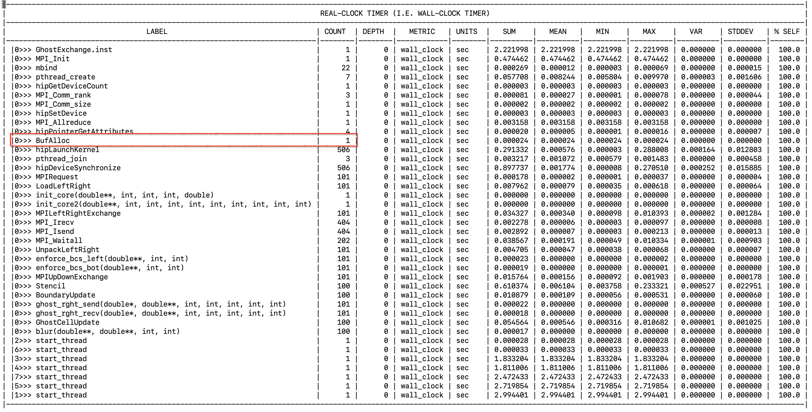

# Ghost Exchange: Reduce Allocations

In the `roctx` range example we saw that BufAlloc was being called 101 times,
indicating we were allocating our buffers several times. In this example, we move
the allocations so that we only need to allocate the buffers one time and explore
how that impacts performance through Omnitrace.

## Environment Setup

We recommend installing OpenMPI 5.0.5 with UCX 1.17.0, UCC 1.3.0 and xpmem. Instructions in the
[AMD Training Container repo](https://github.com/amd/HPCTrainingDock/blob/main/comm/sources/scripts/openmpi_setup.sh)
may be useful reference for this OpenMPI install. We also recommend using cmake version 3.23.2 or greater.
These examples were run with ROCm 6.2.1 and CMake 3.30.2.

```
module load openmpi/5.0.5-ucc1.3.0-ucx1.17.0-xpmem2.7.3
export ROCM_PATH=/opt/rocm-6.2.1
export PATH=${ROCM_PATH}/bin:$PATH
```

## Build and Run

```
cd Ver2
mkdir build; cd build;
cmake -D CMAKE_CXX_COMPILER=${ROCM_PATH}/bin/amdclang++ -D CMAKE_C_COMPILER=${ROCM_PATH}/bin/amdclang ..
make -j8
mpirun -np 4 --mca pml ucx --mca coll ^hcoll --map-by NUMA ../../set_gpu_device_mi300a.sh ./GhostExchange -x 2  -y 2  -i 20000 -j 20000 -h 2 -t -c -I 100
```

The output for this run should look like:

```
GhostExchange_ArrayAssign_HIP Timing is stencil 0.613351 boundary condition 0.003668 ghost cell 0.068785 total 1.186299
```

Note we see similar runtimes to previous examples, so these changes do not fix the issue.

## Get an Initial Trace

```
export HSA_XNACK=1
export OMNITRACE_CONFIG_FILE=~/.omnitrace.cfg
omnitrace-instrument -o ./GhostExchange.inst -- ./GhostExchange
mpirun -np 4 --mca pml ucx --mca coll ^hcoll --map-by NUMA ../../set_gpu_device_mi300a.sh omnitrace-run -- ./GhostExchange.inst -x 2  -y 2  -i 20000 -j 20000 -h 2 -t -c -I 100
```

This trace should look largely like the previous roctx trace. Searching for the roctx region named "BufAlloc" yields only one result in the trace.

<p></p>

An easier way to see how this code has changed is to look at `wall_clock-0.txt`, by adding 
`OMNITRACE_PROFILE=true` and `OMNITRACE_FLAT_PROFILE=true` to `~/.omnitrace.cfg`:

<p></p>

Here we see that the change has the intended effect of reducing the number of calls
to `BufAlloc` to one, rather than 101.
