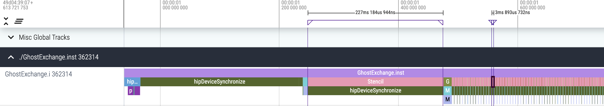
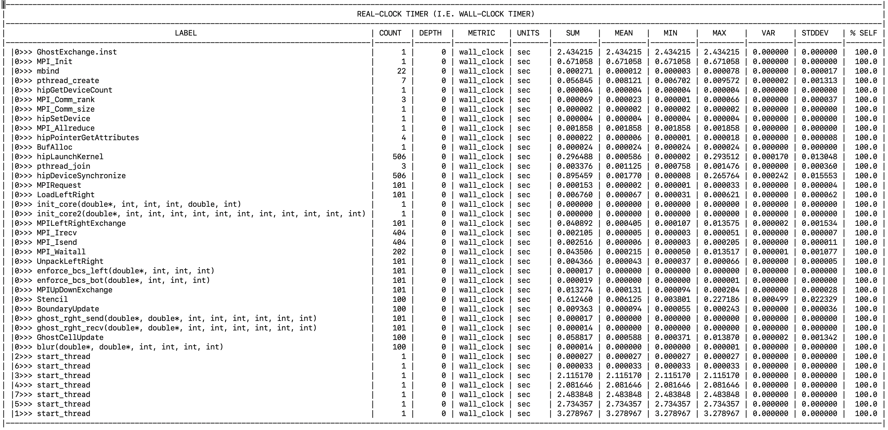

# Ghost Exchange: Changing Data Layout

In this example we explore changing our 2D array layout to 1D and use Omnitrace
to investigate the performance impact.

This sort of change typically requires significant development overhead, as the
indexing of the data must change everywhere in the application.

## Environment Setup

We recommend installing OpenMPI 5.0.5 with UCX 1.17.0, UCC 1.3.0 and xpmem. Instructions in the
[AMD Training Container repo](https://github.com/amd/HPCTrainingDock/blob/main/comm/sources/scripts/openmpi_setup.sh)
may be useful reference for this OpenMPI install. We also recommend using cmake version 3.23.2 or greater.
These examples were run with ROCm 6.2.1 and CMake 3.30.2.

```
module load openmpi/5.0.5-ucc1.3.0-ucx1.17.0-xpmem2.7.3
export ROCM_PATH=/opt/rocm-6.2.1
export PATH=${ROCM_PATH}/bin:$PATH
```

## Build and Run

```
cd Ver5
mkdir build; cd build;
cmake -D CMAKE_CXX_COMPILER=${ROCM_PATH}/bin/amdclang++ -D CMAKE_C_COMPILER=${ROCM_PATH}/bin/amdclang ..
make -j8
mpirun -np 4 --mca pml ucx --mca coll ^hcoll --map-by NUMA ../../set_gpu_device_mi300a.sh ./GhostExchange -x 2  -y 2  -i 20000 -j 20000 -h 2 -t -c -I 100
```

The output from this run should look like:

```
GhostExchange_ArrayAssign_HIP Timing is stencil 0.632020 boundary condition 0.003616 ghost cell 0.029042 total 1.180463
```

We still see a similar runtime indicating this code change did not fix our issue.

## Get a Trace

```
export HSA_XNACK=1
export OMNITRACE_CONFIG_FILE=~/.omnitrace.cfg
omnitrace-instrument -o ./GhostExchange.inst -- ./GhostExchange
mpirun -np 4 --mca pml ucx --mca coll ^hcoll --map-by NUMA ../../set_gpu_device_mi300a.sh omnitrace-run -- ./GhostExchange.inst -x 2  -y 2  -i 20000 -j 20000 -h 2 -t -c -I 100
```

The initial trace for this example should look very similar to previous traces we have seen:

<p></p>

That is, we cannot see an obvious change in performance from just looking at this trace. We will make a note of the runtime of the first `blur` kernel invocation as taking 227ms, and a subsequent `blur` kernel invocation as taking 3ms. In the next version we will compare these numbers to another modification.

## Look at Timemory output

We also see that our `wall_clock-0.txt` file looks pretty similar to our previous example:

<p></p>

To enable the output of this file, add `OMNITRACE_PROFILE=true` and `OMNITRACE_FLAT_PROFILE=true` to your `~/.omnitrace.cfg` file.
