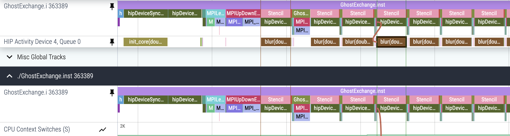
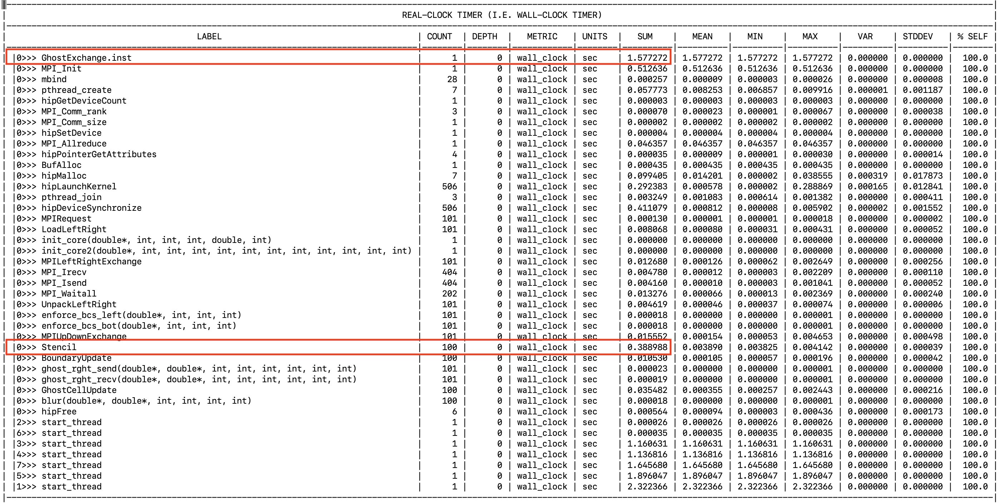

# Ghost Exchange: Explicit Memory Management

In this example we explicitly allocate buffers using hipMalloc, the device memory allocator,
for all data arrays instead of using the system memory allocator and relying on
OS-managed address translations. 

Typically, startup costs of an application are not as important as the kernel runtimes. 
In this case, by explicitly allocating memory on the device at the beginning of our run, 
we're able to remove the overhead of address translation from kernels. 
However our startup is slightly slower since we need to allocate a copy
of all buffers on the device up-front.

## Environment Setup

We recommend installing OpenMPI 5.0.5 with UCX 1.17.0, UCC 1.3.0 and xpmem. Instructions in the
[AMD Training Container repo](https://github.com/amd/HPCTrainingDock/blob/main/comm/sources/scripts/openmpi_setup.sh)
may be useful reference for this OpenMPI install. We also recommend using cmake version 3.23.2 or greater.
These examples were run with ROCm 6.2.1 and CMake 3.30.2.

```
module load openmpi/5.0.5-ucc1.3.0-ucx1.17.0-xpmem2.7.3
export ROCM_PATH=/opt/rocm-6.2.1
export PATH=${ROCM_PATH}/bin:$PATH
```

## Build and Run

```
cd Ver6
mkdir build; cd build;
cmake -D CMAKE_CXX_COMPILER=${ROCM_PATH}/bin/amdclang++ -D CMAKE_C_COMPILER=${ROCM_PATH}/bin/amdclang ..
make -j8
mpirun -np 4 --mca pml ucx --mca coll ^hcoll --map-by NUMA ../../set_gpu_device_mi300a.sh ./GhostExchange -x 2  -y 2  -i 20000 -j 20000 -h 2 -t -c -I 100
```

The output for this run should look like:

```
GhostExchange_ArrayAssign_HIP Timing is stencil 0.395301 boundary condition 0.003739 ghost cell 0.034184 total 0.807627
```

Now we see an improvement in our runtime which can be attributed to the lack of
need for address translation at first touch. This is because we allocated all arrays
using hipMalloc on the device.

## Get a Trace

```
export HSA_XNACK=1
export OMNITRACE_CONFIG_FILE=~/.omnitrace.cfg
omnitrace-instrument -o ./GhostExchange.inst -- ./GhostExchange
mpirun -np 4 --mca pml ucx --mca coll ^hcoll --map-by NUMA ../../set_gpu_device_mi300_mi300aa.sh omnitrace-run -- ./GhostExchange.inst -x 2  -y 2  -i 20000 -j 20000 -h 2 -t -c -I 100
```

Here's what the trace looks like for this run:

<p></p>

The biggest difference we see is that the first invocation of the `blur` kernel is now
just as fast as the subsequent invocations at 3ms. This indicates that we don't spend
time in address translation anymore which was a large contributor to our kernel overhead before.

## Look at Timemory output

The `wall_clock-0.txt` file shows our overall run got faster:

<p></p>

However, we see that the location of our data on CPU+GPU system matters quite a lot
to performance, especially at first touch by the CPU or the GPU.
We recommend using hipMalloc for allocations if you are tuning your application for MI300a.
It is usually worth it to pay the memory movement cost up front once than repeatedly for
each kernel.
