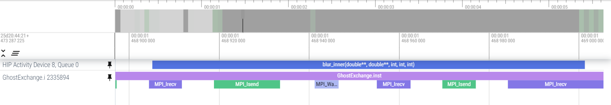

# Ghost Exchange Example: HIP Implementation with GPU kernel / CPU MPI exchange overlap

In this example, the kernel computations adancing the solution happen on the GPU and overlap with the MPI exchanges happening on the CPU., as it can be seen from the image below:

This feature is particularly valuable for the MI300A architecture since no copy and trasfer of data has to be performed.
This example can be see as a HIP implementation of (Orig2)[https://github.com/amd/HPCTrainingExamples/tree/main/MPI-examples/GhostExchange/GhostExchange_ArrayAssign/Orig2], where the CPU computation used to advance the solution has been moved to a HIP kernel on the GPU.
