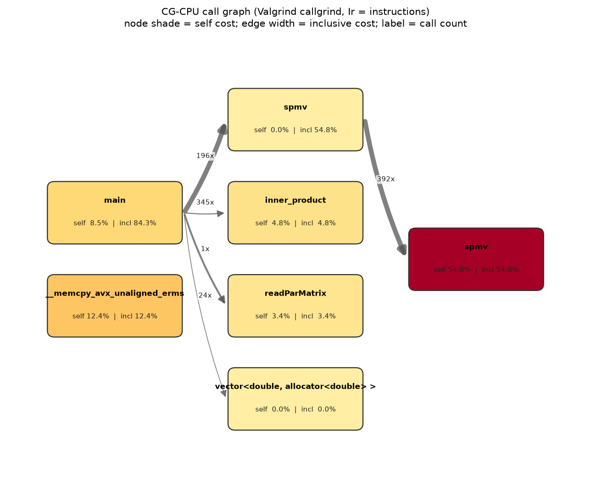
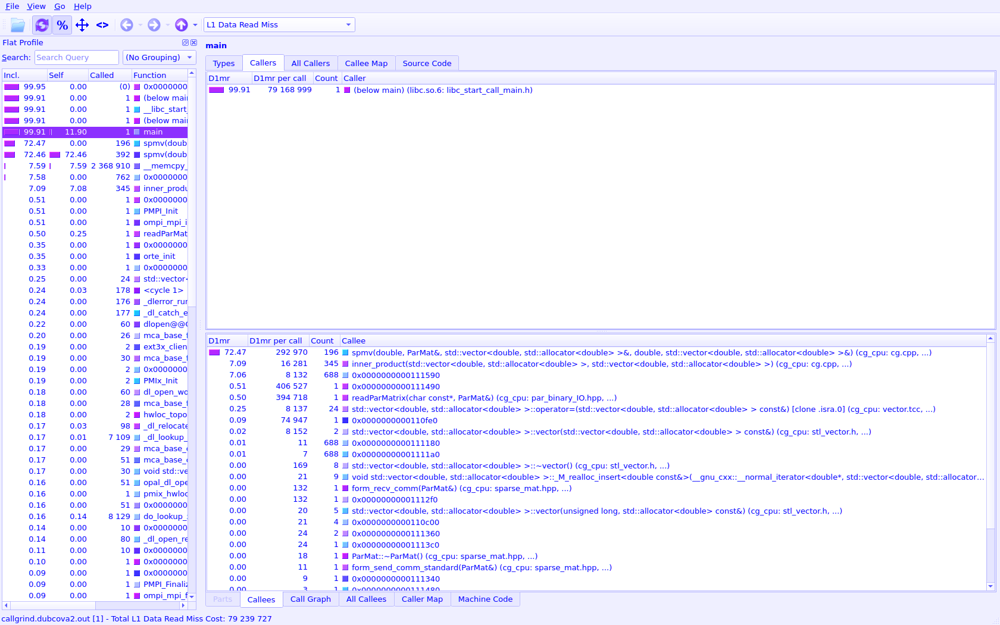
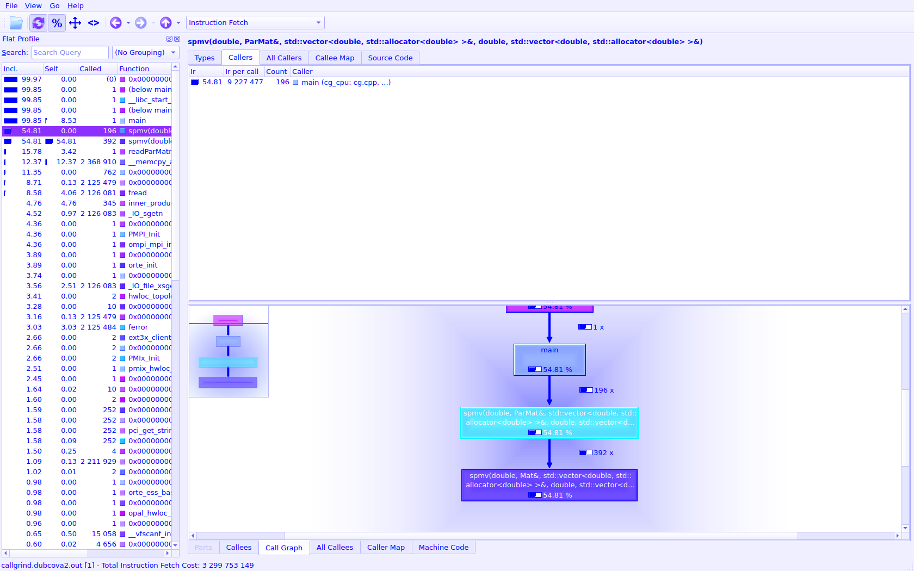

# Valgrind cachegrind — CG-CPU (deterministic cache model)

> Part of the [CG profiler guides](README.md). Read the shared
> [ground rules](../08-profiling.md#ground-rules-or-your-numbers-are-noise) first.

Where [perf](perf.md) reads noisy hardware counters, **cachegrind** *simulates* the
cache hierarchy, so its miss counts are **deterministic and repeatable** — ideal
for comparing two SpMV implementations without run-to-run counter jitter.

**CPU only.** cachegrind is a Valgrind dynamic-binary-instrumentation tool: it
models the **host x86 caches** and only sees host instructions. It cannot profile
GPU kernels, so it targets **`CG-CPU`**, not `CG-GPU`. (Running it on `cg_gpu`
"works" but only instruments the ROCm/HSA host runtime — `amd_comgr` code-object
loading, `malloc`, matrix I/O — and shows **no** SpMV/rocSPARSE/rocBLAS kernels,
which run on the device. Use [rocprof-compute](rocprof-compute.md) or
[Advanced Thread Trace](Advanced_Thread_Trace.md)
for GPU cache/memory instead.)

`valgrind` (and `cg_annotate`, `callgrind_annotate`) are on the MI300A **compute**
nodes (`/usr/bin/…`; **not** on the login node), so run under `srun`/`sbatch`.
Expect a **~20–50× slowdown** (the Dubcova2 solve below takes ~11 s under
cachegrind vs. ~0.5 s native), so keep the seed fixed and the matrix modest.

## 1. Build

```bash
cd CG-CPU
make CXXFLAGS="-O2 -g -std=c++17"   # -g (and -O2) for clean line-level annotation
```

## 2. Exercise — simulate and read the summary

Fix the RHS (`CG_SEED`/`argv[2]`) so every run solves the same system, then run the
cache simulation with branch prediction enabled:

```bash
srun -p PPAC_MI300A_SPX -n1 -c8 -t00:15:00 \
  valgrind --tool=cachegrind --cache-sim=yes --branch-sim=yes \
    --cachegrind-out-file=cg.cachegrind.out \
    ./cg_cpu src/Dubcova2.pm 12345
```

Verified single-CPU run on MI300A (ROCm/system `mpicxx`, valgrind-3.22, seed 12345,
`Dubcova2.pm`, 172 iters):

```
I refs:        3,310,254,465
D refs:        1,989,341,745  (1,409,327,235 rd  + 580,014,510 wr)
D1  misses:       85,926,339  (   79,141,375 rd  +   6,784,964 wr)
LLd misses:          657,223  (       35,301 rd  +     621,922 wr)
D1  miss rate:           4.3% (          5.6% rd +         1.2% wr)
LLd miss rate:           0.0%
Branches:        823,699,085  (  813,138,392 cond + 10,560,693 ind)
Mispredicts:      17,485,433        Mispred rate:  2.1%
```

The **5.6% D1 read-miss rate** is the signature of sparse mat-vec: the CSR values
stream nicely, but the indexed gather `x[col_idx[j]]` jumps around `x` and misses L1.

## 3. Exercise — where do the misses land? (`cg_annotate`)

`cg_annotate` breaks the counts down **per function** and, with `--auto`,
**per source line** (run it from `CG-CPU/` so it can find `src/cg.cpp`):

```bash
cg_annotate cg.cachegrind.out                        # file:function breakdown
cg_annotate --auto=yes --threshold=0.5 cg.cachegrind.out   # line-by-line (auto-finds src/)
```

> **valgrind ≥ 3.22 syntax note.** The rewritten `cg_annotate` auto-locates sources
> with `--auto=yes` (run it from `CG-CPU/` so `src/cg.cpp` is on the recorded path).
> The old form that passed a bare source path as a second argument
> (`cg_annotate out src/cg.cpp`) now errors with *"missing a `command:` line"*.

Per-function, essentially all the cost is the CSR SpMV:

```
Ir 66.3% | D1mr 91.4%   src/cg.cpp   (spmv(Mat) alone: 53.1% Ir)
```

Per-line, one line owns the L1 read misses — the irregular gather:

```
     Ir           Dr            D1mr
807,696,400   605,772,300   52,533,338 (66.4%)   sum += A.data[j] * x[A.col_idx[j]];   // line 284
656,751,900             .   Bcm 15,896,008 (93.3%) for (int j = start; j < end; j++)     // line 282
```

- **Line 284 `x[A.col_idx[j]]`** = **66.4% of all D1 read misses** — the classic
  irregular sparse-gather hotspot.
- **Line 282** (the row loop bound `j < end`) = **93.3% of branch mispredicts** — the
  short, data-dependent inner trip counts confound the predictor.

This is the whole pedagogical point: on the CPU the SpMV is **latency-bound on the
gather**, which is exactly what the APU roofline shows as **HBM-bandwidth-bound**.

## 4. Exercise — go bigger to expose last-level-cache pressure

Dubcova2 (65,536 rows) largely fits the 128 MB LL cache (`LLd ≈ 0.0%`), so it only
stresses L1. A larger matrix makes the LL/HBM pressure visible. Generate a 3D
7-point Poisson matrix (512,000 rows) and re-run:

```bash
python3 ../CG-GPU/gen_poisson.py 80 src/poisson80.pm      # 512,000 rows, ~3.5M nnz
srun -p PPAC_MI300A_SPX -n1 -c8 -t00:20:00 \
  valgrind --tool=cachegrind --cache-sim=yes --branch-sim=yes \
    --cachegrind-out-file=cg.poisson80.out ./cg_cpu src/poisson80.pm 12345
```

| Matrix | rows | D1 miss (rd) | LLd misses | LLd rate |
|--------|-----:|-------------:|-----------:|---------:|
| `Dubcova2.pm` (default) | 65,536 | 4.3% (5.6%) | 657,223 | 0.0% |
| `poisson80.pm` (larger) | 512,000 | **7.2% (8.0%)** | **12,262,269** | **0.2%** |

The bigger working set **spills the last-level cache**: LLd misses jump **~19×** and
the read-miss rate climbs 5.6% → 8.0% — the CPU analog of becoming HBM-bound. Keep
both sizes: the small one isolates the L1 gather, the large one shows the memory wall.

## 5. Call graph (cost + caller/callee)

cachegrind records *flat* per-function costs but **no call edges**. For the call
graph, take one companion run with **callgrind** (same cache model + the call graph):

```bash
srun -p PPAC_MI300A_SPX -n1 -c8 -t00:15:00 \
  valgrind --tool=callgrind --cache-sim=yes \
    --callgrind-out-file=callgrind.out ./cg_cpu src/Dubcova2.pm 12345
callgrind_annotate --tree=both callgrind.out       # text caller/callee tree
```

**Headless image (no GUI needed).** [`render_callgraph.py`](../../CG-CPU/render_callgraph.py)
parses the callgrind output and renders a KCachegrind-style call/cost graph to PNG
over plain SSH (needs `matplotlib`; `pip install --user matplotlib`):

```bash
python3 ../../CG-CPU/render_callgraph.py callgrind.out callgraph.png
```



The chain is `main` (incl 84%) → `spmv(ParMat)` (196× / iter) → **`spmv(Mat)` self
54.8%** (the CSR row loop), with `__memcpy_avx` 12.4% (the `r = b` / `p = r` vector
copies) and `inner_product` 4.8%. Node shade = self cost, edge width = inclusive
cost, edge label = call count.

## 6. Interactive viewer — QCachegrind

For an interactive call/cost browser (sortable flat profile, callers/callees, a
graphical call graph, source and machine-code annotation) load the **NFS module**
and open the callgrind output:

```bash
module load qcachegrind/23.08.5      # Qt-only viewer; bundles graphviz 'dot'
qcachegrind callgrind.out
```

It is a GUI, so launch it inside an AAC6 graphical session:

- `man aac6_vnc` — TurboVNC desktop, then launch the viewer
- `man aac6_novnc` — the same desktop in your local browser
- `man aac6_x11` — `ssh -X` then a single viewer window

**Read the cache misses interactively.** Pick the event type in the toolbar combo
(e.g. **L1 Data Read Miss** = `D1mr`). The flat profile's *Self* column then ranks
functions by L1 read misses — `spmv(Mat)` owns **72.5%**, matching the `cg_annotate`
line in §3:



**Call Graph tab.** Select a function (e.g. `spmv`) and open the *Call Graph* pane
(rendered by the bundled `dot`) to see the `main → spmv(ParMat) → spmv(Mat)` chain
with per-edge call counts — the interactive version of the figure in §5:



> **Headless capture.** The two screenshots above were produced on a compute node
> with no display using [`capture_qcachegrind.sh`](../../CG-CPU/capture_qcachegrind.sh)
> (qcachegrind under `Xvfb`, grabbed with `xwd`, converted by
> [`xwd2png.py`](../../CG-CPU/xwd2png.py)). Users doing the exercise interactively
> just need the VNC/noVNC/X11 desktop above — no capture step.

## See also

- [Linux perf](perf.md) — measured (non-simulated) counters + hotspots
- [AMD uProf](uprof.md) — hardware hotspots + memory analysis
- Driver used to produce the numbers above:
  [`CG-CPU/submit_cachegrind.sbatch`](../../CG-CPU/submit_cachegrind.sbatch)
