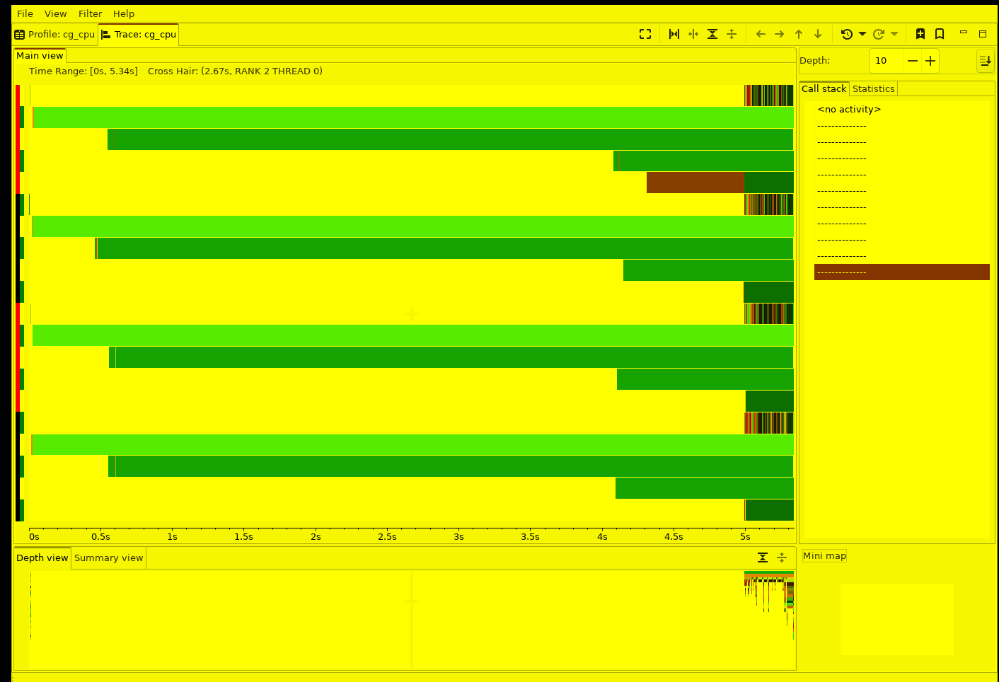
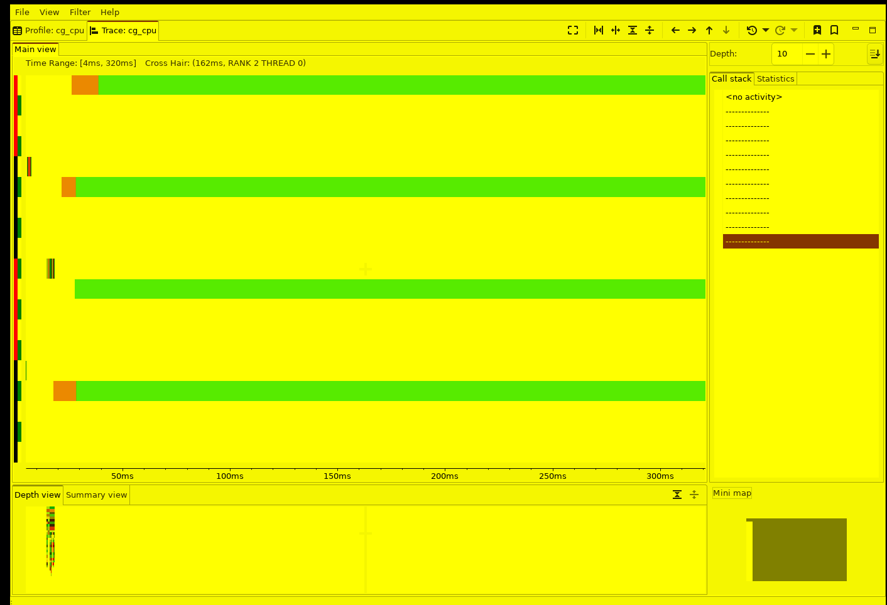
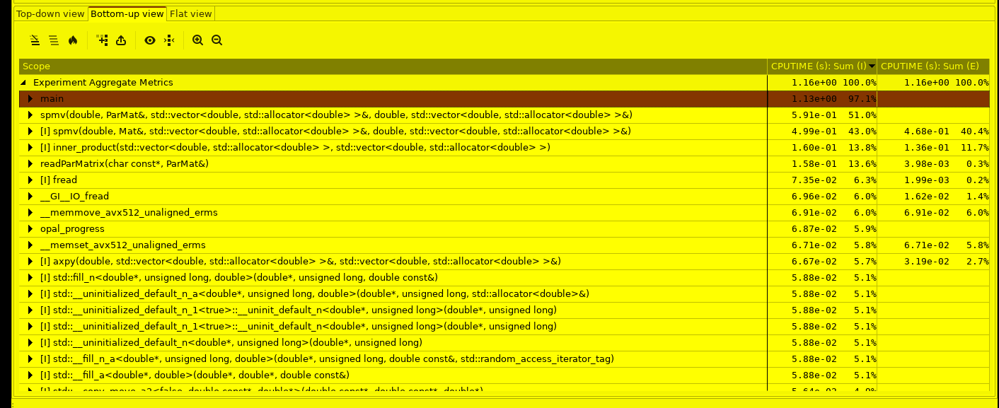

# HPCToolkit — CG-CPU / CG-GPU (call-path sampling + trace timeline)

> Part of the [CG profiler guides](README.md). Read the shared
> [ground rules](../08-profiling.md#ground-rules-or-your-numbers-are-noise) first.

HPCToolkit samples the **full call path** of every thread and, with `hpcrun -t`,
records a **per-rank / per-thread timeline** you open in `hpcviewer`. It answers two
questions at once: *where does the CPU time go* (the call-path profile: local SpMV
vs. the dot-product allreduce vs. the halo wait vs. matrix I/O) and *what is each
rank doing over wall-clock time* (the trace view). Unlike the Perfetto tools it needs
**no instrumentation** — it attributes samples to source by unwinding the stack.

> **Verified on AAC6 / MI300A — ROCm 7.2.4, OpenMPI 5.0.10,
> `hpctoolkit/2025.1.2` + `hpcviewer 2026.0.0`, 4 ranks, seed 12345.** The figures
> below are a 4-rank `CG-CPU` run on the 3D-Poisson matrix `poisson80` (512,000
> rows, 148 CG iterations, ~0.23 s solve). The `CG-GPU` variant (§7) is the same
> workflow with `hpcrun -e gpu=amd`.

## The one thing that will bite you first: `libpapi.so.7.1`

`hpcrun`'s sampling library is linked against `libpapi.so.7.1`, which on this cluster
is present **only on the compute nodes**, not the login node. Run every `hpcrun` /
`hpcstruct` / `hpcprof` step **inside an allocation**:

```bash
salloc -p PPAC_MI300A_SPX -N1 --gres=gpu:4 -t 1:00:00
# ... or submit the batch script below.
```

Symptom on the login node: `hpcrun: Error loading libhpcrun.so: libpapi.so.7.1:
cannot open shared object file`. This is a known item in
[`../PROFILER_ISSUES.md`](../PROFILER_ISSUES.md#14-libpapiso71-missing-on-login-node--workaround).
The `hpcviewer` GUI itself does **not** need PAPI — you can view a finished database
anywhere.

## 1. Build (plain — no instrumentation)

```bash
module load rocm/7.2.4 openmpi hpctoolkit/2025.1.2
cd CG-CPU
make                       # mpicxx -g -O3 ... -> ./cg_cpu   (keep -g for line-level attribution)
# A bigger matrix -> a longer, many-iteration solve that fills the timeline:
python3 ../CG-GPU/gen_poisson.py 80 src/poisson80.pm   # 512,000 rows (or reuse ../CG-GPU/src/poisson80.pm)
```

`-g` (already in the Makefile) lets `hpcstruct` map samples to source lines and
inlined frames; `-O3` is kept so you profile the code you actually ship.

## 2. Measure — two events, two questions

The single most useful HPCToolkit habit for this solver is to take **two**
measurements from the same binary, because the sampling *source* changes the story:

| event | what it samples | what it shows here |
|-------|-----------------|--------------------|
| **`REALTIME@<µs>`** | wall-clock time (on- *and* off-CPU) | the **timeline** — fills the trace view, so blocked MPI time appears |
| **`CPUTIME@<µs>`**  | on-CPU time only | the **compute call-path profile** — which routine actually burns the CPU |

```bash
# (1) REALTIME -> the trace-view timeline. @200 = a sample every 200 µs.
CG_SEED=12345 mpirun -n 4 --oversubscribe --mca pml ob1 --mca btl vader,self,tcp \
  hpcrun -e REALTIME@200 -t -o cg_cpu_rt.m ./cg_cpu src/poisson80.pm

# (2) CPUTIME -> the on-CPU call-path profile.
CG_SEED=12345 mpirun -n 4 --oversubscribe --mca pml ob1 --mca btl vader,self,tcp \
  hpcrun -e CPUTIME@500 -t -o cg_cpu.m ./cg_cpu src/poisson80.pm

# Recover program structure (line/loop/inline map), then build each database:
hpcstruct ./cg_cpu
hpcprof -S cg_cpu.hpcstruct -o cg_cpu_rt.d cg_cpu_rt.m     # timeline DB
hpcprof -S cg_cpu.hpcstruct -o cg_cpu.d    cg_cpu.m        # profile  DB
```

The batch version is
[`submit_hpctoolkit_timeline.sbatch`](../../CG-CPU/submit_hpctoolkit_timeline.sbatch).

> **Three things worth knowing**
> | symptom / choice | note |
> |------------------|------|
> | `WARNING: Struct file partial match … forget a -R?` | harmless; silence it with the suggested `-R '<build>'='<build>/.'` (the batch script does this). |
> | `hpcstruct cg_cpu.m` (on the *measurement dir*) hangs for minutes | it re-analyses every recorded library. Prefer `hpcstruct ./cg_cpu` (the one binary) — a couple of seconds. |
> | `--mca pml ob1 --mca btl vader,self,tcp` | uses OpenMPI's shared-memory path instead of UCX, so the trace holds just the 4 rank threads + one MPI progress thread each. UCX adds several `ucs_*` helper threads that clutter the timeline. |

## 3. View it remotely (`hpcviewer`)

`hpcviewer` is one Eclipse/SWT application with two top tabs — **Profile** (call-path
tables) and **Trace** (the timeline) — plus a right-hand **Call stack** pane that
decodes any point you click:

```bash
module load hpctoolkit/2025.1.2
hpcviewer cg_cpu_rt.d      # open the timeline DB, click the "Trace: cg_cpu" tab
hpcviewer cg_cpu.d         # open the profile  DB, use the "Bottom-up view" tab
```

Launch it inside an AAC6 graphical session (the DB is self-contained — you can also
copy `*.d` to a laptop with hpcviewer installed):

- `man aac6_vnc` — TurboVNC desktop, then `hpcviewer`
- `man aac6_novnc` — the same desktop in your local browser
- `man aac6_x11` — `ssh -X` then `hpcviewer` (single window)

## 4. The timeline (Trace view)

Switch to the **Trace: cg_cpu** tab. Time runs left→right; every rank contributes a
**main thread** row (bright green) and one **MPI progress thread** row (darker green,
`progress_engine → epoll_wait`). The whole run is ~5–6 s wall-clock, almost all of it
matrix setup + teardown; the actual CG solve is the dense multi-colour sliver at the
far left. Click any point and the **Call stack** pane on the right shows the exact
call path sampled there.



**Zoom into the solve.** Rubber-band a box over the leftmost active region (or press
the zoom-in-time toolbar button). Now the time axis reads ~0–320 ms and the four rank
main threads line up as one band each: a short **orange** setup segment (`readParMatrix`
/ allocation) followed by the **green** CG solve. The `Depth` slider (top right) picks
which call-stack level colours the bars — lower it to colour by `spmv` vs
`inner_product` instead of the single leaf.



> **Why the solve looks like one solid band.** At 148 iterations in ~0.23 s each CG
> iteration is ~1.5 ms — near the sampling period — so individual iterations are
> sub-pixel until you zoom to a ~10–20 ms window *and* drop the `Depth` slider.
> HPCToolkit's strength here is the **call-path profile** (§5), not fine-grained
> kernel timing; for a per-kernel GPU timeline use
> [rocprofv3](rocprofv3.md) / [rocprofiler-systems](rocprofiler-systems.md).

## 5. The call-path profile (Bottom-up view) — where the CPU time goes

Open `cg_cpu.d` (the **CPUTIME** database) and click **Bottom-up view**: procedures
sorted by cost, `main` at 97 % of the on-CPU time. This is HPCToolkit's signature
output and it reproduces the solver's own compute/communication split **without any
timers in the code**:



Measured (4 ranks, `poisson80`, seed 12345; % of the 1.16 s aggregate CPUTIME):

| routine (bottom-up) | incl. | excl. | what it is |
|---------------------|------:|------:|------------|
| `spmv(…, ParMat&, …)` | **51 %** | – | parallel SpMV = halo exchange **+** local SpMV |
| `spmv(…, Mat&, …)` | 43 % | **40 %** | the **local sparse mat-vec** — the compute hot spot |
| `inner_product(…)` | **14 %** | 12 % | the dot products → **`MPI_Allreduce`** |
| `readParMatrix` / `fread` | 14 % | – | one-time matrix **I/O** (setup) |
| `opal_progress` | 6 % | 6 % | OpenMPI progress spin inside the MPI calls |
| `axpy` | 6 % | 3 % | the CG vector updates |

**Reading it.** The local SpMV (`spmv(Mat&)`, ~40 % exclusive) is the kernel to
optimise; the halo + dot-product communication surfaces as the `spmv(ParMat&)`
wrapper and `inner_product`/`opal_progress` — the same "compute vs. the allreduce and
halo" breakdown the [rocprof-sys](rocprofiler-systems.md#why-the-cpu-matters-here-the-1-rank-vs-4-rank-contrast)
and [TAU](tau.md) guides show on the GPU host thread, here for the CPU solver and
attributed **per source line** (double-click a row to open the annotated source).
The **Top-down view** shows the opposite: `<program root>` (the compute threads) is
97 % of CPUTIME while `<thread root>` (the idle MPI progress threads) is ~3 %.

## 6. Participant exercises

Work these in a `salloc -p PPAC_MI300A_SPX -N1 --gres=gpu:4` allocation (remember:
`hpcrun` needs the compute node's `libpapi`). Each is a small change to the
measurement command or the `hpcviewer` view.

1. **REALTIME vs CPUTIME.** Build both databases (§2) and open each. *In the
   bottom-up view, how big is `opal_progress` (the MPI spin) under CPUTIME vs
   REALTIME?* Explain why REALTIME inflates the MPI/idle time and CPUTIME does not —
   and which one you'd trust for "which routine should I optimise".

2. **Find the compute hot spot, then its source.** In `cg_cpu.d` → Bottom-up view,
   select `spmv(…, Mat&, …)` and **double-click** it. *Which loop / line carries the
   exclusive time?* Confirm it is the inner `A.data[j] * x[A.col_idx[j]]` mat-vec.

3. **Attribute the communication.** Still in the bottom-up view, expand
   `inner_product` and `opal_progress` to see their callers. *Which CG operations sit
   above them?* Tie this back to `MPI_Allreduce` (dot products) and the halo
   `MPI_Waitall` in `spmv(ParMat&)`.

4. **Read a point on the timeline.** Open `cg_cpu_rt.d` → Trace tab, zoom into the
   solve, and click inside a rank's green band. *What call path does the Call-stack
   pane show?* Now click a progress-thread (darker) row — *what is it doing while the
   main thread computes?*

5. **Sampling rate trade-off.** Re-measure with `-e REALTIME@1000` (coarser) and
   `-e REALTIME@100` (finer). *How does `trace.db` size and the timeline detail
   change?* This is the resolution knob for seeing per-iteration structure.

6. **1 rank vs 4 ranks.** Take a CPUTIME profile of a **single-rank** run
   (`hpcrun -e CPUTIME@500 -t -o cg1.m ./cg_cpu src/poisson80.pm`, no `mpirun`).
   *Does `opal_progress` / the halo `spmv(ParMat&)` still appear?* Explain with the
   1-rank-has-no-halo argument from the [rocprof-sys table](rocprofiler-systems.md#why-the-cpu-matters-here-the-1-rank-vs-4-rank-contrast).

## 7. The `CG-GPU` variant (call paths + AMD GPU operations)

The same workflow profiles the GPU solver; add the `gpu=amd` event so `hpcrun`
records GPU operations alongside the host call paths (needs a GPU allocation):

```bash
module load rocm/7.2.4 openmpi hpctoolkit/2025.1.2
cd CG-GPU && make
CG_SEED=12345 mpirun -n 4 ./gpu_bind.sh \
  hpcrun -e CPUTIME -e gpu=amd -t -o cg_gpu.m ./cg_gpu src/Dubcova2.pm rccl
hpcstruct ./cg_gpu
hpcprof -S cg_gpu.hpcstruct -o cg_gpu.d cg_gpu.m
hpcviewer cg_gpu.d      # Trace tab now includes GPU-operation rows
```

The trace view then adds GPU rows under each rank; the bottom-up view attributes time
to the rocSPARSE SpMV kernel and the RCCL/HIP calls. See
[rocprofv3](rocprofv3.md) for the GPU-only, per-kernel counterpart.

## Capturing these screenshots headlessly

The figures above were captured on a compute node with **no display** by driving
`hpcviewer` on a virtual X server (`Xvfb`) and grabbing the window with `xwd`, then
converting with PIL — the same Xvfb+XTEST approach the
[cachegrind guide](cachegrind.md) uses for QCachegrind. The helper is
[`capture_hpcviewer.sh`](../../CG-CPU/capture_hpcviewer.sh):

```bash
# Bottom-up profile (Profile tab is default; click the tab, select+expand a row):
HV_CLICKS="328 596" ./capture_hpcviewer.sh cg_cpu.d cg_hpctoolkit_profile.png

# Trace timeline (click the "Trace" tab, then rubber-band a time range to zoom):
HV_CLICKS="469 114" HV_DRAG="286 225 350 810" \
  ./capture_hpcviewer.sh cg_cpu_rt.d cg_hpctoolkit_trace_solve.png
```

The `*.m` measurement dirs and `*.d` databases are **not committed** (large) —
regenerate them with §2 or `submit_hpctoolkit_timeline.sbatch`.

## See also

- [TAU](tau.md) — per-call MPI time + communication matrix (Perfetto)
- [rocprofiler-systems](rocprofiler-systems.md) — GPU+host Perfetto timeline
- [Score-P](scorep.md) — the other MPI+GPU call-path/trace tool (Cube/OTF2)
- [cachegrind](cachegrind.md) — CPU cache model, same headless-GUI capture trick
