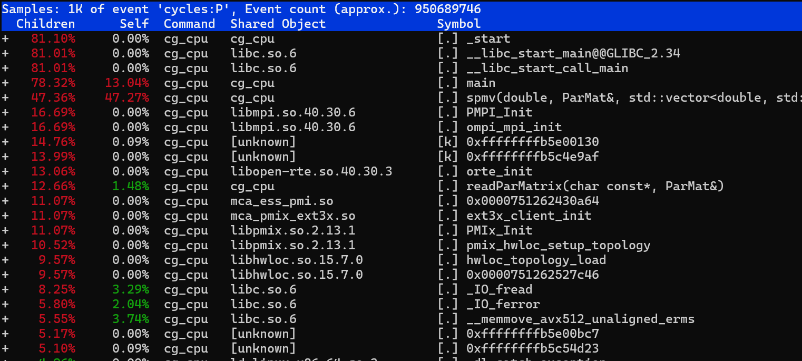

# Linux perf — CG-CPU (always-available CPU baseline)

> Part of the [CG profiler guides](README.md). Read the shared
> [ground rules](../08-profiling.md#ground-rules-or-your-numbers-are-noise) first.

`perf` is a standard linux profiler that needs no modules and no special build.
The MI300A **compute** nodes run with `perf_event_paranoid = -1`, so hardware
counters are fully available (the **login** node is restricted — run perf inside an
allocation).

## 1. Counter summary + hotspots

First get an allocation with enough CPU resources to run a 4 rank MPI job.

```bash
salloc --nodes=1 --ntasks=4 --cpus-per-task=1 --time=00:15:00   # 4 cores → one per rank, uncontended counters
```

Build the CPU conjugate gradient code.

```bash
cd CG-CPU
make
```

### Single rank run

Single-rank counter summary (IPC + cache behaviour). `cg_cpu` is an MPI binary, so
launch it with `mpirun -n 1` even for one rank:

```bash
mpirun -n 1 perf stat -o perf_single.txt \
  -e cycles,instructions,cache-references,cache-misses,L1-dcache-loads,L1-dcache-load-misses \
  ./cg_cpu src/Dubcova2.pm 12345
```

> The `12345` is the RHS seed (or set `CG_SEED=12345`), which fixes the random
> right-hand side so the iteration count — and therefore the absolute cycle/instruction
> totals — are reproducible run-to-run. Without it `cg_cpu` seeds from `time(NULL)`.

Results for single MPI rank on MI300A (`mpirun -n 1 perf stat`, `Dubcova2.pm`, seed
`12345` → 172 iterations to converge):

To see these results, `more perf_single.txt`.

```
# started on Mon Aug 10 14:08:23 2026


 Performance counter stats for './cg_cpu src/Dubcova2.pm 12345':

       982,342,756      cycles                                                                  (82.57%)
     2,787,652,203      instructions                     #    2.84  insn per cycle              (83.95%)
       205,056,157      cache-references                                                        (84.20%)
         6,900,206      cache-misses                     #    3.37% of all cache refs           (83.73%)
     1,159,951,373      L1-dcache-loads                                                         (83.49%)
        95,642,670      L1-dcache-load-misses            #    8.25% of all L1-dcache accesses   (82.06%)

       0.625988691 seconds time elapsed

       0.245701000 seconds user
       0.063818000 seconds sys
```

For this problem the run sustains a high IPC (~3.0) with a low last-level
cache-miss rate (~3%), so the working set for `Dubcova2` largely stays in cache.
The ~8% L1-dcache miss rate reflects the CSR index gather in the SpMV. The
`(NN%)` values are counter multiplexing coverage — these six events don't all fit
in hardware at once, so perf time-shares them and scales the totals. `perf
record`/`perf report` then attribute cycles to the SpMV row-loop and the CSR index
gather.

### Four rank run

Per-rank counter summary for a 4-rank job, one file per rank:

```bash
mpirun -n 4 bash -c 'perf stat -o perf_r${OMPI_COMM_WORLD_RANK}.txt \
  -e cycles,instructions,cache-references,cache-misses,L1-dcache-loads,L1-dcache-load-misses \
  ./cg_cpu src/Dubcova2.pm 12345'
```

To see the results, `more perf_r0.txt`

```
# started on Mon Aug 10 14:13:14 2026


 Performance counter stats for './cg_cpu src/Dubcova2.pm 12345':

       949,664,740      cycles                                                                  (83.77%)
     1,425,304,817      instructions                     #    1.50  insn per cycle              (80.95%)
        94,561,039      cache-references                                                        (84.13%)
         6,184,925      cache-misses                     #    6.54% of all cache refs           (83.92%)
       574,094,199      L1-dcache-loads                                                         (83.89%)
        51,962,900      L1-dcache-load-misses            #    9.05% of all L1-dcache accesses   (83.34%)

       0.529466832 seconds time elapsed

       0.181979000 seconds user
       0.085877000 seconds sys
```

### Hotspot sampling

Hotspot sampling → where the cycles go:

```bash
mpirun -n 1 perf record -g -o perf.data ./cg_cpu src/Dubcova2.pm 12345
perf report -i perf.data        # interactive TUI; or `perf annotate` for source+asm
```



## 2. Viewing the results remotely

`perf report`/`perf annotate` are terminal (TUI) tools — they work over plain SSH,
no graphical session needed. For a **flame graph** of the hotspots:

```bash
perf script -i perf.data | stackcollapse-perf.pl | flamegraph.pl > cg_cpu_flame.svg
```

View the SVG in a graphical session:

[Flame Graph](figs/cg_cpu_flame.svg)

To get your own image of the graphic on the HPC system, use the following graphical session tools.

- `man aac6_vnc` — TurboVNC desktop, open `cg_cpu_flame.svg` in a browser
- `man aac6_novnc` — the same desktop in your local browser
- `man aac6_x11` — `ssh -X` and open a single browser/image window
- or just `scp` the small SVG to your workstation.

## See also

- [Valgrind cachegrind](cachegrind.md) — deterministic (simulated) cache misses
- [AMD uProf](uprof.md) — hotspots + memory/bandwidth analysis with a GUI
