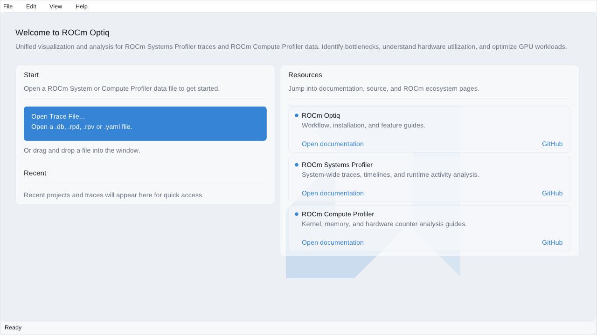

# ROCm Optiq — CG-GPU (interactive trace & roofline viewer)

> Part of the [CG profiler guides](README.md). Read the shared
> [ground rules](../08-profiling.md#ground-rules-or-your-numbers-are-noise) first.
> Unlike the terminal tools on the other pages, **roc-optiq is a native desktop
> GUI** — plan to run it inside an AAC6 graphical session (VNC / noVNC / X11).

[ROCm Optiq](https://github.com/ROCm/roc-optiq) (Beta;
[docs](https://rocm.docs.amd.com/projects/roc-optiq/en/latest/)) is a **visualizer
for the ROCm profiler tools**. It opens two kinds of data produced by the other
guides and gives you an interactive, AMD-native desktop UI for them:

- **ROCm Systems Profiler traces** (`.rpd` / `.db`, rocpd) → a Perfetto-style
  **timeline**: system-topology track tree, event/counter tracks, flow arrows, an
  event/sample table with a filter box, bookmarks and annotations. It is the
  AMD-native alternative to dragging a `.pftrace` onto <https://ui.perfetto.dev>
  (see [rocprofv3](rocprofv3.md) / [rocprofiler-systems](rocprofiler-systems.md)).
- **ROCm Compute Profiler analysis** → **Summary / Kernel-details / Roofline**
  views: top kernels, per-cache memory chart, System Speed-of-Light, and a
  kernel-level roofline (the GUI restatement of
  [rocprof-compute](rocprof-compute.md) / [roofline-extractor](roofline-extractor.md)).

It reads `.db` and `.rpd` traces, `.rpv` project files, and `.yaml`; drag-and-drop
also works. It renders through **Vulkan** or **OpenGL** and ships its own in-app
ImGui file dialog for use over SSH.

## 0. Setup (ROCm 7.2.4)

roc-optiq **v0.5.0** ships as a `rocmplus-7.2.4` module (install root
`/nfsapps/ubuntu-24.04/opt/rocmplus-7.2.4/roc-optiq-v0.5.0`); load it **after**
`rocm/7.2.4`:

```bash
module load rocm/7.2.4
module load roc-optiq
roc-optiq --version            # -> ROCm(TM) Optiq Beta version: 0.5.0.1
```

> **Just installed and `module load roc-optiq` says "Unable to find"?** That is a
> stale Lmod **spider cache**, not a missing module. The site cron rebuilds the
> cache every ≤30 min (`/etc/cron.d/lmod-cache-refresh` on `aac6-fe1`), so it
> resolves itself shortly after an install. To use it *immediately*, bypass the
> cache:
>
> ```bash
> module --ignore_cache load roc-optiq
> ```
>
> See [PROFILER_ISSUES.md §5](../PROFILER_ISSUES.md#5-roc-optiq-module--stale-lmod-cache-after-reinstall--workaround).

## 1. Produce something to open

roc-optiq is a *viewer* — first capture a trace with one of the collectors, asking
for the **rocpd** backend so the output is a `.db` / `.rpd` roc-optiq understands.

**Timeline (ROCm Systems Profiler trace)** — the halo-exchange overlap, per
transport:

```bash
module load rocm/7.2.4 openmpi
cd CG-GPU && make
# rocprofv3 straight to a rocpd .db (kernels + HIP + RCCL):
CG_SEED=12345 mpirun -n 4 ./gpu_bind.sh \
  rocprofv3 --sys-trace --output-format rocpd \
  -d optiq_rccl_rank_${OMPI_COMM_WORLD_RANK:-0} \
  -- ./cg_gpu src/Dubcova2.pm rccl
# ...or the fuller rocprofiler-systems timeline, rocpd backend:
module load rocprofiler-systems
CG_SEED=12345 mpirun -n 4 ./gpu_bind.sh \
  rocprof-sys-run --use-rocpd -- ./cg_gpu src/Dubcova2.pm rccl
```

Each rank writes its own rocpd database (`-d …_rank_N`). Open **one rank's** `.db`
in roc-optiq.

**Roofline / kernel analysis (ROCm Compute Profiler)** — characterise the SpMV:

```bash
rocprof-compute profile -n cg_spmv -- ./cg_gpu src/Dubcova2.pm rccl 12345
# then open the workloads/cg_spmv/… analysis directory in roc-optiq
```

See [rocprofv3](rocprofv3.md), [rocprofiler-systems](rocprofiler-systems.md), and
[rocprof-compute](rocprof-compute.md) for the collection details and the ground
rules (fixed `CG_SEED`, one transport per run, per-rank output dirs).

## 2. Launch the GUI

```
$ roc-optiq --help
Options:
  -b, --backend       'auto' (default), 'vulkan', or 'opengl'
  -f, --file          Open a trace or project file
  -d, --file-dialog   'auto' (default), 'native', or 'imgui'  (use 'imgui' over SSH)
  -v, --version
```

```bash
roc-optiq                                              # empty window, then File -> Open
roc-optiq -f optiq_rccl_rank_0/*.db                    # open a trace directly
roc-optiq --file-dialog imgui -f trace.db              # over SSH: use the built-in dialog
roc-optiq --backend opengl -f trace.db                 # if Vulkan is unavailable
```

- **`--file-dialog imgui`** replaces the native OS file picker with the app's own
  in-window dialog — use it whenever there is no desktop portal (i.e. over plain
  SSH/X11 or a bare VNC session), otherwise the *File → Open* dialog may not appear.
- **`--backend`**: on a real GPU node leave it `auto` (picks **Vulkan**); fall back
  to `--backend opengl` if Vulkan/`libvulkan` is missing (e.g. a login node or a
  software-rendering session).

## 3. Viewing it remotely (VNC / noVNC / X11)

roc-optiq is a full GUI window, so run it inside a graphical session on the node
that holds the trace. All three AAC6 methods work — see the man pages:

- **`man aac6_vnc`** — TurboVNC desktop. In an allocation (`salloc -N1 --gpus=4`)
  the Slurm prolog already starts TurboVNC on `:1`; open the SSH tunnel
  (`ssh -J user@aac6.amd.com -N -L 5901:localhost:5901 user@node`), connect a VNC
  client to `localhost:5901` (security type **None**), then open a terminal in the
  XFCE desktop and run `roc-optiq -f <trace>.db`.
- **`man aac6_novnc`** — the same TurboVNC desktop in your **browser**: tunnel
  `ssh -L 6443:10.194.42.31:6443 user@aac6.amd.com`, browse to
  `https://localhost:6443/novnc/<node>/vnc.html`, authenticate with your TOTP, then
  launch `roc-optiq` in a desktop terminal.
- **`man aac6_x11`** — a single forwarded window: `ssh -X` to the node (inside your
  allocation) and run `roc-optiq --file-dialog imgui -f <trace>.db`. Add
  `--backend opengl` if `ssh -X` gives you a GLX-only (no-Vulkan) visual.

In the XFCE desktop the default **Vulkan/auto** backend works on the MI300A GPU; if
the session is software-rendered use `--backend opengl`.

## 4. Working in the UI

Once a trace is loaded (welcome screen below), the layout is:

1. **System Topology Tree** (left) — expand nodes to relate tracks; the eye icon
   shows/hides a track, *Scroll To Track* jumps to it in the timeline.
2. **Timeline View** — pan/zoom with the mouse wheel or **W/S** (zoom) and
   **A/D** or arrows (pan); click an event for its details; **Ctrl+drag** selects a
   *Time Range Filter*, and *Edit → Save Trace Selection* trims the trace to it.
3. **Advanced Details** — *Event Table* / *Sample Table* with a filter box
   (e.g. `min_duration > 2000` to hide sub-2 µs events), plus *Event/Track Details*
   and *Annotations* tabs. For CG, sort the event table by duration and confirm the
   `rocsparse::csrmvn` SpMV and the RCCL `ncclSend`/`ncclRecv` on the halo stream.
4. **Histogram** — event-density map; drag it to scroll the timeline.
5. **Toolbar** — flow arrows (fan/chain), annotations, search, bookmarks
   (**Ctrl+0–9** to set, **0–9** to recall), mini-map, and reset-view.

For **ROCm Compute Profiler** data you instead get the **Summary** (top kernels +
roofline), **Kernel Details** (add GPU-metric columns, filter with
`metric > threshold`, per-cache memory chart, System Speed-of-Light, kernel
roofline), **Table**, and **Workload Details** views — the memory-bound CG kernels
land under the HBM diagonal, matching [rocprof-compute](rocprof-compute.md).

Persist your track layout, bookmarks, and annotations with **File → Save As** to a
`.rpv` project; reopening it recalls the trace and your customizations.

## Verified

> **Verified on AAC6 / MI300A, ROCm 7.2.4, roc-optiq v0.5.0.1.** `--version` and
> `--help` as above. The GUI **renders headlessly** under `Xvfb` with both
> `--backend opengl` and `--backend vulkan` (`--file-dialog imgui`) — confirming it
> will render inside a TurboVNC / noVNC / `ssh -X` desktop. The welcome window was
> captured with the helper [`CG-GPU/shot_roc_optiq.sh`](../../CG-GPU/shot_roc_optiq.sh)
> (Xvfb + Pillow, the same approach as `shot_cubegui.sh`):



Interactive click-through (expanding the track tree, filtering the event table) is
done in a real VNC/noVNC/X11 desktop as in §3; the headless helper is for
scripted/CI screenshots. Opening a real CG rocpd `.db` requires a GPU allocation to
first collect the trace (§1).

## See also

- [rocprofv3](rocprofv3.md) / [rocprofiler-systems](rocprofiler-systems.md) — collect the timeline traces roc-optiq opens (use `--output-format rocpd` / `--use-rocpd`)
- [rocprof-compute](rocprof-compute.md) / [roofline-extractor](roofline-extractor.md) — the roofline it shows in the Compute-Profiler view
