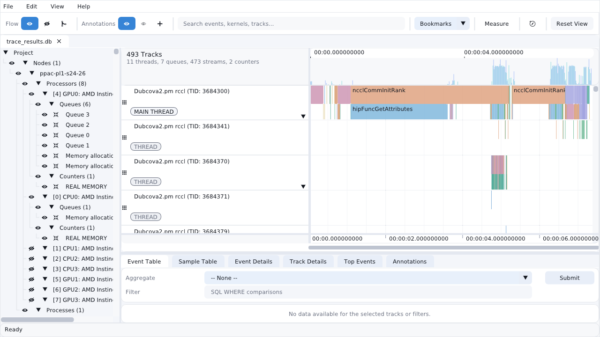
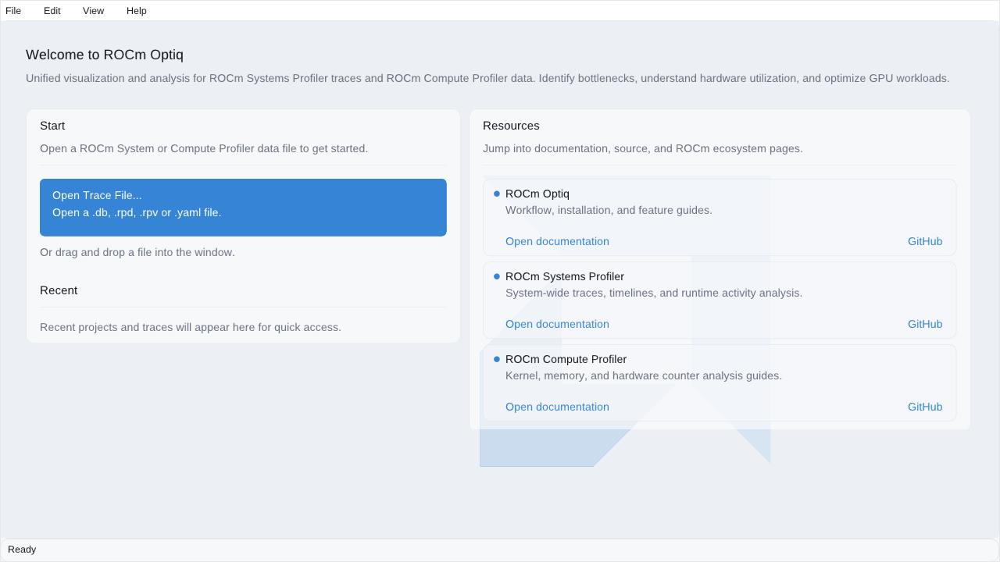

# ROCm Optiq — CG-GPU (interactive trace & roofline viewer)

> Part of the [CG profiler guides](README.md). Read the shared
> [ground rules](../08-profiling.md#ground-rules-or-your-numbers-are-noise) first.
> Unlike the terminal tools on the other pages, **roc-optiq is a native desktop
> GUI** — plan to run it inside an AAC6 graphical session (VNC / noVNC / X11).

[ROCm Optiq](https://github.com/ROCm/roc-optiq) (Beta;
[docs](https://rocm.docs.amd.com/projects/roc-optiq/en/latest/)) is a **visualizer
for the ROCm profiler tools**. It opens two kinds of data produced by the other
guides and gives you an interactive, AMD-native desktop UI for them:

- **ROCm Systems Profiler traces** (`.rpd` / `.db`, rocpd) → a Perfetto-style
  **timeline**: system-topology track tree, event/counter tracks, flow arrows, an
  event/sample table with a filter box, bookmarks and annotations. It is the
  AMD-native alternative to dragging a `.pftrace` onto <https://ui.perfetto.dev>
  (see [rocprofv3](rocprofv3.md) / [rocprofiler-systems](rocprofiler-systems.md)).
- **ROCm Compute Profiler analysis** → **Summary / Kernel-details / Roofline**
  views: top kernels, per-cache memory chart, System Speed-of-Light, and a
  kernel-level roofline (the GUI restatement of
  [rocprof-compute](rocprof-compute.md) / [roofline-extractor](roofline-extractor.md)).

It reads `.db` and `.rpd` traces, `.rpv` project files, and `.yaml`; drag-and-drop
also works. It renders through **Vulkan** or **OpenGL** and ships its own in-app
ImGui file dialog for use over SSH.

## 0. Setup (ROCm 7.2.4)

roc-optiq **v0.5.0** ships as a `rocmplus-7.2.4` module (install root
`/nfsapps/ubuntu-24.04/opt/rocmplus-7.2.4/roc-optiq-v0.5.0`); load it **after**
`rocm/7.2.4`:

```bash
module load rocm/7.2.4
module load roc-optiq
roc-optiq --version            # -> ROCm(TM) Optiq Beta version: 0.5.0.1
```

> **Minimum ROCm version.** roc-optiq itself has **no ROCm dependency** — the GUI is
> a standalone visualizer, so the ROCm version only matters on the machine where you
> *collect* the data ([upstream install docs](https://rocm.docs.amd.com/projects/roc-optiq/en/latest/install/optiq-install.html)):
> **ROCm ≥ 7.1.0** for ROCm Systems Profiler timeline traces (the `.db`/`.rpd` rocpd
> path this guide uses), **ROCm ≥ 7.12.0** for ROCm Compute Profiler analysis data
> (the [§5](#5-participant-exercises) stretch roofline), and **ROCm ≥ 7.14.0** for the
> LDS roofline chart. On this site the `roc-optiq` module is gated behind
> `rocm/7.2.4` / `rocm/7.14.0`; to use it with an older ROCm (e.g. `rocm/7.1.1`) that
> still clears the ≥ 7.1.0 timeline floor, add its install root to `PATH` directly
> (`/nfsapps/ubuntu-24.04/opt/rocmplus-7.2.4/roc-optiq-v0.5.0/bin`, exactly what
> [`shot_roc_optiq.sh`](../../CG-GPU/shot_roc_optiq.sh) falls back to).

> **Just installed and `module load roc-optiq` says "Unable to find"?** That is a
> stale Lmod **spider cache**, not a missing module. The site cron rebuilds the
> cache every ≤30 min (`/etc/cron.d/lmod-cache-refresh` on `aac6-fe1`), so it
> resolves itself shortly after an install. To use it *immediately*, bypass the
> cache:
>
> ```bash
> module --ignore_cache load roc-optiq
> ```
>
> See [PROFILER_ISSUES.md §5](../PROFILER_ISSUES.md#5-roc-optiq-module--stale-lmod-cache-after-reinstall--workaround).

## 1. Produce something to open

roc-optiq is a *viewer* — first capture a trace with one of the collectors, asking
for the **rocpd** backend so the output is a `.db` / `.rpd` roc-optiq understands.

**Timeline (ROCm Systems Profiler trace)** — the halo-exchange overlap, per
transport:

```bash
module load rocm/7.2.4 openmpi
cd CG-GPU && make ROCTX=1        # ROCTX=1 -> searchable phase labels in the trace
# rocprofv3 straight to a rocpd .db (kernels + HIP + RCCL + roctx phases):
CG_SEED=12345 mpirun -n 4 ./gpu_bind.sh \
  rocprofv3 --sys-trace --marker-trace --output-format rocpd \
  -d optiq_rccl_rank_${OMPI_COMM_WORLD_RANK:-0} -o trace \
  -- ./cg_gpu src/Dubcova2.pm rccl
# ...or the fuller rocprofiler-systems timeline, rocpd backend:
module load rocprofiler-systems
CG_SEED=12345 mpirun -n 4 ./gpu_bind.sh \
  rocprof-sys-run --use-rocpd -- ./cg_gpu src/Dubcova2.pm rccl
```

Each rank writes its own rocpd database (`-d …_rank_N/trace_results.db`). Open
**one rank's** `.db` in roc-optiq. `--marker-trace` (with the `ROCTX=1` build) adds
the `cg_iteration` / `spmv_on_proc` / `dot_allreduce` / `halo_*` phase ranges so you
can search and filter them in the UI, exactly as in
[rocprofv3](rocprofv3.md#3-communication-memory-copy--rcclhip-traces).

> **Only have one GPU / running under `srun`?** `mpirun -n 4` needs 4 slots; on a
> single-task `srun` step add `--oversubscribe`. To trace only rank 0 (the figure
> below), guard the `rocprofv3` wrapper with
> `R=${OMPI_COMM_WORLD_RANK:-0}; [ "$R" = 0 ] && rocprofv3 … -- ./cg_gpu … || ./cg_gpu …`.

**Roofline / kernel analysis (ROCm Compute Profiler)** — characterise the SpMV:

```bash
rocprof-compute profile -n cg_spmv -- ./cg_gpu src/Dubcova2.pm rccl 12345
# then open the workloads/cg_spmv/… analysis directory in roc-optiq
```

See [rocprofv3](rocprofv3.md), [rocprofiler-systems](rocprofiler-systems.md), and
[rocprof-compute](rocprof-compute.md) for the collection details and the ground
rules (fixed `CG_SEED`, one transport per run, per-rank output dirs).

## 2. Launch the GUI

```
$ roc-optiq --help
Options:
  -b, --backend       'auto' (default), 'vulkan', or 'opengl'
  -f, --file          Open a trace or project file
  -d, --file-dialog   'auto' (default), 'native', or 'imgui'  (use 'imgui' over SSH)
  -v, --version
```

```bash
roc-optiq                                              # empty window, then File -> Open
roc-optiq -f optiq_rccl_rank_0/*.db                    # open a trace directly
roc-optiq --file-dialog imgui -f trace.db              # over SSH: use the built-in dialog
roc-optiq --backend opengl -f trace.db                 # if Vulkan is unavailable
```

- **`--file-dialog imgui`** replaces the native OS file picker with the app's own
  in-window dialog — use it whenever there is no desktop portal (i.e. over plain
  SSH/X11 or a bare VNC session), otherwise the *File → Open* dialog may not appear.
- **`--backend`**: on a real GPU node leave it `auto` (picks **Vulkan**); fall back
  to `--backend opengl` if Vulkan/`libvulkan` is missing (e.g. a login node or a
  software-rendering session).

## 3. Viewing it remotely (VNC / noVNC / X11)

roc-optiq is a full GUI window, so run it inside a graphical session on the node
that holds the trace. All three AAC6 methods work — see the man pages:

- **`man aac6_vnc`** — TurboVNC desktop. In an allocation (`salloc -N1 --gpus=4`)
  the Slurm prolog already starts TurboVNC on `:1`; open the SSH tunnel
  (`ssh -J user@aac6.amd.com -N -L 5901:localhost:5901 user@node`), connect a VNC
  client to `localhost:5901` (security type **None**), then open a terminal in the
  XFCE desktop and run `roc-optiq -f <trace>.db`.
- **`man aac6_novnc`** — the same TurboVNC desktop in your **browser**: tunnel
  `ssh -L 6443:10.194.42.31:6443 user@aac6.amd.com`, browse to
  `https://localhost:6443/novnc/<node>/vnc.html`, authenticate with your TOTP, then
  launch `roc-optiq` in a desktop terminal.
- **`man aac6_x11`** — a single forwarded window: `ssh -X` to the node (inside your
  allocation) and run `roc-optiq --file-dialog imgui -f <trace>.db`. Add
  `--backend opengl` if `ssh -X` gives you a GLX-only (no-Vulkan) visual.

In the XFCE desktop the default **Vulkan/auto** backend works on the MI300A GPU; if
the session is software-rendered use `--backend opengl`.

## 4. Working in the UI

Once a trace is loaded (see the figure at the end of this section), the layout is:

1. **System Topology Tree** (left) — expand nodes to relate tracks; the eye icon
   shows/hides a track, *Scroll To Track* jumps to it in the timeline.
2. **Timeline View** — pan/zoom with the mouse wheel or **W/S** (zoom) and
   **A/D** or arrows (pan); click an event for its details; **Ctrl+drag** selects a
   *Time Range Filter*, and *Edit → Save Trace Selection* trims the trace to it.
3. **Advanced Details** — *Event Table* / *Sample Table* with a filter box
   (e.g. `min_duration > 2000` to hide sub-2 µs events), plus *Event/Track Details*
   and *Annotations* tabs. For CG, sort the event table by duration and confirm the
   `rocsparse::csrmvn` SpMV and the RCCL `ncclSend`/`ncclRecv` on the halo stream.
4. **Histogram** — event-density map; drag it to scroll the timeline.
5. **Toolbar** — flow arrows (fan/chain), annotations, search, bookmarks
   (**Ctrl+0–9** to set, **0–9** to recall), mini-map, and reset-view.

For **ROCm Compute Profiler** data you instead get the **Summary** (top kernels +
roofline), **Kernel Details** (add GPU-metric columns, filter with
`metric > threshold`, per-cache memory chart, System Speed-of-Light, kernel
roofline), **Table**, and **Workload Details** views — the memory-bound CG kernels
land under the HBM diagonal, matching [rocprof-compute](rocprof-compute.md).

Persist your track layout, bookmarks, and annotations with **File → Save As** to a
`.rpv` project; reopening it recalls the trace and your customizations.

Opening the 4-rank `rccl` rocpd `.db` from §1 (rank 0) gives you exactly this — the
**System Topology Tree** on the left (this node's 4 MI300A GPUs, their queues, and
the CPUs), a header reading **`493 Tracks · 11 threads · 7 queues · 473 streams · 2
counters`**, the host **MAIN THREAD** with `ncclCommInitRank` and `hipFuncGetAttributes`
slices, and the **Event Table** docked below with its `SQL WHERE`-style filter box:



## 5. Participant exercises

Work these in a real VNC / noVNC / `ssh -X` desktop (§3) after collecting the
rank-0 `rccl` `.db` in §1. Each is a small navigation task in the GUI — the goal is
to *read the CG timeline*, not to re-collect data. (For a scripted, no-desktop
capture of the loaded window, see [§6](#6-capturing-the-screenshots-headlessly).)

1. **Open the trace and read the topology.** `roc-optiq -f optiq_rccl_rank_0/trace_results.db`
   (add `--file-dialog imgui` over SSH). Expand **Nodes → … → Processors** in the
   System Topology Tree. *How many GPUs and queues does one rank's trace see?*
   Confirm the header track count (`… threads · … queues · … streams`).

2. **Find the SpMV.** In the search box type `csrmvn` (or `rocsparse`) and press
   **Enter**; click the match, then use **W/S** to zoom and **A/D** to pan onto it.
   *Which GPU Kernel Dispatch Queue does the `rocsparse::csrmvn` SpMV run on?* This
   is the kernel the [rocprof-compute roofline](rocprof-compute.md) shows as
   HBM-bound.

3. **Filter the Event Table by duration.** Open the **Event Table** tab and enter a
   filter such as `duration > 20000` (nanoseconds) in the `SQL WHERE` box and
   **Submit**. Sort by duration. *What are the three longest events — a kernel, an
   RCCL op, or a HIP API call?* Lower the threshold and watch the list grow.

4. **Locate the halo exchange.** Search `ncclDevKernel` (or the roctx phase
   `halo_gather_rccl_post` if you built with `ROCTX=1`). *Is the RCCL send/recv a
   device kernel on a GPU queue, or a host-side wait?* Compare with the
   [rocprofiler-systems host view](rocprofiler-systems.md#4-comparing-transports-on-the-host-thread-isend-vs-staged-vs-rccl),
   which shows the same exchange from the CPU side.

5. **Trim to one iteration with a Time Range Filter.** **Ctrl+drag** across one
   `cg_iteration` in the timeline to set a *Time Range Filter*, then
   **Edit → Save Trace Selection** to write a trimmed `.db`. Re-open it: *how much
   smaller is the file, and does it still contain the SpMV + allreduce + halo?*

6. **Bookmark and save a project.** Set bookmarks with **Ctrl+1** / **Ctrl+2** on
   the SpMV and the allreduce; recall with **1** / **2**. Then **File → Save As** a
   `.rpv` project and reopen it — *do your bookmarks, hidden tracks, and zoom
   return?*

7. **Compare transports.** Re-collect rank 0 for `isend` and `staged` (swap the last
   argument, §1) and open all three. *Does `staged` show a second `GPU Memory Copy to
   Agent` row (the host-staging engine)? Which transport keeps the GPU queues
   busiest?* This is the GUI restatement of the
   [rocprofv3 transport comparison](rocprofv3.md#comparing-communication-methods-isend-vs-staged-vs-rccl).

8. **(Stretch) Open a roofline.** Profile the SpMV with
   [`rocprof-compute`](rocprof-compute.md) (`rocprof-compute profile -n cg_spmv -- ./cg_gpu src/Dubcova2.pm rccl 12345`)
   and open its `workloads/cg_spmv/…` analysis directory in roc-optiq. In the
   **Summary → Roofline** view, *where do the CG kernels land relative to the HBM
   diagonal?* Confirm they are memory-bound.

## 6. Capturing the screenshots headlessly

Both figures on this page were captured on a compute node **with no display** using
[`CG-GPU/shot_roc_optiq.sh`](../../CG-GPU/shot_roc_optiq.sh) (Xvfb + software OpenGL +
Pillow). With a trace argument it opens the `.db` with `-f`, waits for the tracks to
parse (`Track meta data loaded`), grabs the 1280×720 window, and auto-crops the
border:

```bash
module load rocm/7.2.4 roc-optiq
# loaded-timeline figure (this page):
./shot_roc_optiq.sh optiq_rccl_rank_0/trace_results.db \
  ../docs/profilers/figs/cg_roc_optiq_timeline_n4.png
# empty welcome window (no trace argument):
./shot_roc_optiq.sh
```

The rocpd `.db` files are **not committed** (large binaries) — regenerate them with
the §1 commands. Interactive click-through (exercises §5) is done in a real
VNC / noVNC / X11 desktop as in §3; the headless path is for scripted/CI shots.

## Verified

> **Verified on AAC6 / MI300A, ROCm 7.2.4, roc-optiq v0.5.0.1.** `--version` and
> `--help` as above. The GUI **renders headlessly** under `Xvfb` with both
> `--backend opengl` and `--backend vulkan` (`--file-dialog imgui`) — confirming it
> will render inside a TurboVNC / noVNC / `ssh -X` desktop. **Both** the empty
> welcome window *and* a real loaded trace were captured with the helper
> [`CG-GPU/shot_roc_optiq.sh`](../../CG-GPU/shot_roc_optiq.sh) (Xvfb + Pillow):
>
> **Also verified on ROCm 7.1.1** (the earliest 7.1.x available on this site; ≥ 7.1.0
> is the upstream timeline floor). `rocprofv3` (v1.0.0) built `cg_gpu` with `ROCTX=1`
> and collected the rank-0 `rccl` rocpd `.db` (`172 iters, comm 26.2 %, halo 14.7 %,
> dot-allreduce 11.5 %`); the standalone roc-optiq v0.5.0.1 binary opened it
> headlessly (`--backend opengl`), parsed `492 tracks · 10 threads · 7 queues · 473
> streams · 2 counters`, and rendered the same topology + timeline + event-table
> layout as the 7.2.4 figure. The ROCm Compute Profiler roofline (§5 stretch) is
> **not** available below ROCm 7.12.0.



The **loaded-trace** figure in [§4](#4-working-in-the-ui) was produced from a real
4-rank `rccl` rocpd `.db` (§1) — collected in a `PPAC_MI300A_SPX` allocation with
`rocprofv3 --sys-trace --marker-trace --output-format rocpd`
(`CG solve 0.20 s, comm 63 %, halo 17.5 %, dot-allreduce 46 %` on rank 0), then
opened headlessly with `--backend opengl`. The trace parsed to
`493 tracks · 11 threads · 7 queues · 473 streams`. Interactive click-through
(exercises §5) is done in a real VNC / noVNC / X11 desktop as in §3; the headless
helper is for scripted/CI screenshots.

## See also

- [rocprofv3](rocprofv3.md) / [rocprofiler-systems](rocprofiler-systems.md) — collect the timeline traces roc-optiq opens (use `--output-format rocpd` / `--use-rocpd`)
- [rocprof-compute](rocprof-compute.md) / [roofline-extractor](roofline-extractor.md) — the roofline it shows in the Compute-Profiler view
