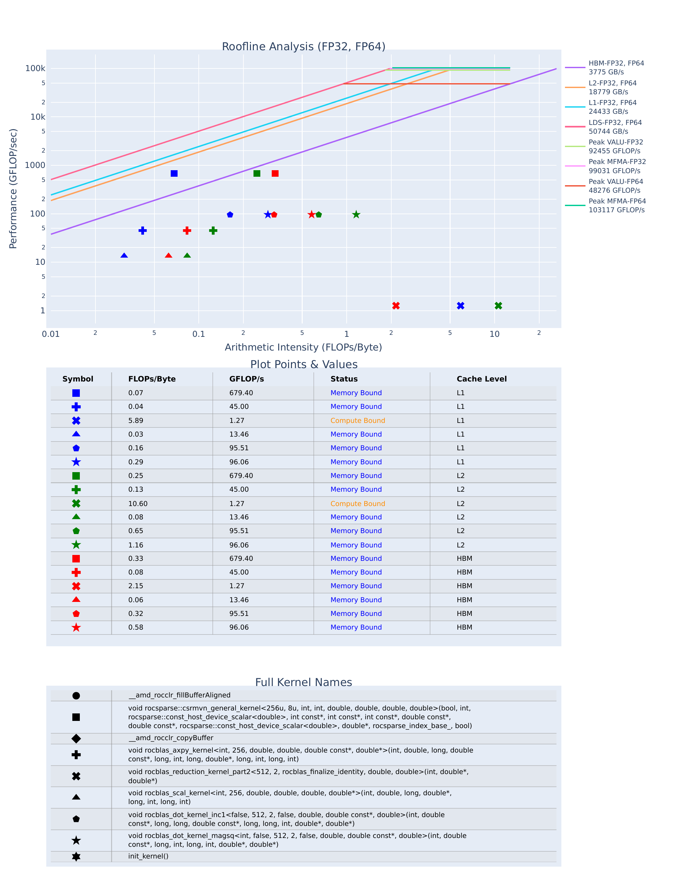

# rocprof-compute — CG-GPU (roofline)

> Part of the [CG profiler guides](README.md). Read the shared
> [ground rules](../08-profiling.md#ground-rules-or-your-numbers-are-noise) first.
> `module load rocm/<ver>` prepends the patched `rocprof-compute` (a self-contained
> Nuitka executable) — never pipe/command-substitute `module` or it silently falls
> back to the unpatched script (see the [index note](README.md)).

`rocprof-compute` characterises GPU kernels against the hardware **roofline**: it
first benchmarks the GPU's own peaks (HBM/L2/L1/LDS bandwidth and FP32/FP64 FLOP/s),
then runs a fast kernel pass and plots every CG kernel on that roofline — proving the
SpMV and rocBLAS kernels are **memory-bound**.

**Verified on MI300A** (`gfx942`, SPX mode, ROCm 7.2.4, `rocprof-compute` 3.4.0)
against `cg_gpu` on `src/Dubcova2.pm`, single rank, `rccl`. Your absolute numbers
will drift a little run-to-run; the *shape* of the result is the point.

---

## 1. Build and run (1 GPU)

The compute per rank is representative, so characterise the kernels on a **single
GPU** (one rank on an SPX node = the whole device):

```bash
module load rocm/7.2.4
cd CG-GPU && make
export HSA_XNACK=1
# Standalone roofline: benchmark the GPU peaks, then profile cg_gpu's kernels.
# --kernel-names labels the dots; -R FP32 FP64 renders both precisions.
rocprof-compute profile -n cg_roof --roof-only --kernel-names -R FP32 FP64 -- \
  mpirun -n 1 ./cg_gpu src/Dubcova2.pm rccl 12345
```

> **Launch it through `mpirun -n 1`.** `cg_gpu` is an MPI program. Inside a Slurm
> allocation a *bare* `./cg_gpu` (or a direct `srun`) aborts in `MPI_Init`
> (`OMPI was not built with SLURM's PMI support`). `rocprof-compute` wraps the whole
> launch line after `--`, so the same command scales to `mpirun -n N …` (see §5).

> **`--roof-only` vs. a full profile.** `--roof-only` collects *only* the counters
> the roofline needs (3 short passes) plus the one-time peak benchmark — fast, and
> exactly what you want for the roofline picture. A full `rocprof-compute profile -n
> cg_full -- …` (no `--roof-only`) collects every counter set for the deeper
> `analyze` panels (LDS, cache hit-rates, occupancy) at the cost of many more passes.

> **Arch note.** Run on an **SPX** MI300A node so the device presents as one GPU and
> the arch string matches a known entry. On a **CPX**-mode node the virtual GPUs may
> not benchmark cleanly for the roofline.

A reproducible batch version is in
[`CG-GPU/submit_rocprof_compute_roofline.sbatch`](../../CG-GPU/submit_rocprof_compute_roofline.sbatch)
(`sbatch submit_rocprof_compute_roofline.sbatch`).

Outputs land under `workloads/cg_roof/MI300A*/`:

- `empirRoof_gpu-0_FP32_FP64.pdf` — the roofline **plot** (one page per datatype set)
- `roofline.csv` — the measured GPU **peaks**
- `pmc_perf.csv` — the per-kernel counters the dots are computed from

## 2. Reading the measured peaks

`roofline.csv` holds the empirical ceilings this GPU actually reached during the
benchmark (not the datasheet numbers). On the verified MI300A run:

| Ceiling | Measured peak |
|---|---|
| **HBM** bandwidth | **3775 GB/s** |
| L2 bandwidth | 18 779 GB/s |
| L1 bandwidth | 24 433 GB/s |
| LDS bandwidth | 50 744 GB/s |
| FP32 peak (VALU) | 92 455 GFLOP/s |
| FP64 peak (VALU) | 48 276 GFLOP/s |
| MFMA FP64 peak | 103 117 GFLOP/s |

These are the diagonal (bandwidth) and flat (compute) lines in the plot. The 3775
GB/s HBM roof is ~99 % of the 3.8 TB/s datasheet peak — a healthy benchmark.

## 3. Reading the per-kernel points

Each kernel is plotted **three times**, once per memory level — blue = **L1**
traffic, green = **L2**, red = **HBM** — because the same FLOPs move a different
number of bytes at each level, so the arithmetic intensity (AI) shifts. Read the
**red (HBM)** points for the "am I bandwidth-bound?" story. The plot's own
*Plot Points & Values* table lists them; the HBM (red) rows for the CG solve:

| Kernel (symbol) | AI HBM (FLOPs/B) | GFLOP/s | Status |
|---|---|---|---|
| `rocsparse::csrmvn_general_kernel` (**SpMV**, ■) | **0.33** | **679** | Memory Bound |
| `rocblas_dot_kernel_magsq` (★) | 0.58 | 96 | Memory Bound |
| `rocblas_dot_kernel_inc1` (⬠) | 0.32 | 96 | Memory Bound |
| `rocblas_axpy_kernel` (`y+=αx`, ✚) | 0.08 | 45 | Memory Bound |
| `rocblas_scal_kernel` (`x*=α`, ▲) | 0.06 | 13 | Memory Bound |
| `rocblas_reduction_kernel_part2` (finalize, ✖) | 2.15 | 1.3 | Compute Bound* |

The story: **every real CG kernel is HBM-bandwidth-bound** — CG is a bandwidth
problem, not a compute problem. The SpMV has the highest AI (0.33) because rocSPARSE
reuses each loaded matrix value across a multiply-add; the BLAS-1 vector updates
(`axpy`, `scal`) touch each byte roughly once, so they sit at AI ≈ 0.06–0.08, far to
the left. Their dots land **orders of magnitude below** the compute (flat) roof — the
gap to the *sloped* HBM roof is what limits them.

*The tiny `reduction_kernel_part2` finalize step reads "Compute Bound" only because
it does almost no memory traffic (a handful of bytes): an artifact of a
launch-latency-bound kernel, not a genuinely compute-heavy one. Ignore it as noise.

## 4. The roofline plot

Convert the PDF to an image or open it directly (see §6/§7). The FP32/FP64 page:



How to read it:

- **The sloped lines are the bandwidth roofs** (HBM/L2/L1/LDS); the **flat lines are
  the compute roofs** (FP32/FP64 VALU, MFMA). A kernel's ceiling is where its
  vertical AI line hits the *lowest* relevant roof: at low AI that is a *sloped*
  bandwidth roof ⇒ the kernel is bandwidth-bound.
- **Colour = memory level.** Each kernel appears as a blue (L1), green (L2) and red
  (HBM) marker; the same **shape** identifies the kernel across levels (legend at the
  bottom). All CG dots sit well under the sloped region — memory-bound top to bottom.
- **Distance below the roof = lost performance.** The SpMV (■) sits highest; the
  `axpy`/`scal` dots (✚/▲) sit an order of magnitude lower — memory-bound *and*
  under-utilizing even the bandwidth they are limited by (too little work per launch).
- The **Plot Points & Values** and **Full Kernel Names** tables under the plot map
  every symbol to its AI, GFLOP/s, bound-status and demangled kernel name.

## 5. Participant exercises

Work these on an **SPX** MI300A node
(`salloc -p SH5_MI300A_SPX --gres=gpu:1`) after the build in §1. Each is a small
change to the command or a look at the plot/CSV.

1. **Find the kernel closest to the roof.** From the plot (or the *Plot Points*
   table), identify which kernel has the highest HBM arithmetic intensity.
   *Why is the SpMV's AI (≈0.33) higher than `axpy`'s (≈0.08)?*
   (Hint: SpMV reuses each loaded matrix value across a multiply-add; `axpy` touches
   each byte once.)

2. **Read your own peaks.** Open `workloads/cg_roof/MI300A*/roofline.csv` and find
   `HBMBw`, `FP32Flops`, `FP64Flops`. *What HBM bandwidth did your GPU actually
   reach, and how close is it to the 3.8 TB/s datasheet peak?* A low number here
   usually means a bad node/allocation, not a bad kernel.

3. **FP32 vs FP64.** The PDF has the FP32 and FP64 compute roofs. *The CG solver is
   double-precision — does moving from the FP32 to the FP64 flat roof change any
   kernel's bound classification?* Explain why lowering the compute ceiling does
   **not** rescue a memory-bound kernel.

4. **Switch the memory level.** Compare a kernel's blue (L1), green (L2) and red
   (HBM) dots. *Do the dots move up toward the roof as you go HBM→L2→L1?* Explain what
   a kernel that is near the L1 roof but far below the HBM roof is telling you about
   cache reuse.

5. **Change the transport (does it move the roofline?).** Re-profile with `staged`
   and with `isend` instead of `rccl`
   (`… -- mpirun -n 1 ./cg_gpu src/Dubcova2.pm staged`). *Do the compute-kernel dots
   move?* They should not — the roofline is a **per-kernel compute/bandwidth**
   picture and is blind to MPI. Use this to argue why a roofline tool is the wrong
   instrument for a communication problem (use [rocprof-sys](rocprofiler-systems.md)
   or the [TAU](tau.md) timeline for that).

6. **Full profile, deeper panels.** Re-run **without** `--roof-only`
   (`rocprof-compute profile -n cg_full -- mpirun -n 1 ./cg_gpu src/Dubcova2.pm rccl
   12345`) then `rocprof-compute analyze -p workloads/cg_full/MI300* | less`. *How
   many more passes did it take, and what extra panels (LDS, cache hit-rate,
   occupancy) do you get?* Relate the L2/L1 hit-rates back to why the HBM dots sit
   where they do.

7. **Two ranks, one workload.** Run `mpirun -n 2 ./cg_gpu src/Dubcova2.pm rccl` under
   the profiler (needs a `--gres=gpu:2` allocation). *Does the roofline picture
   change vs 1 rank?* Relate your answer to whether the per-rank kernels do less work
   each (smaller partition) but the same *kind* of work.

## 6. Capturing the plot headlessly

`empirRoof_*.pdf` is a normal PDF; render it to PNG with `pdftoppm` — no display, no
server. The figure above was produced with:

```bash
pdftoppm -png -r 200 -f 1 -l 1 \
  workloads/cg_roof/MI300A*/empirRoof_gpu-0_FP32_FP64.pdf cg_rocprof_compute_roofline
# -> cg_rocprof_compute_roofline-1.png
```

## 7. Viewing the roofline remotely

To view the PDF live, or to use the interactive **`analyze --gui`** dashboard (a
Dash web app with the roofline plus the memory chart), open it inside a remote
graphical session:

```bash
rocprof-compute analyze -p workloads/cg_roof/MI300A* --gui
# serves on http://localhost:8050 by default
```

- `man aac6_vnc` — TurboVNC desktop; open the PDF or `http://localhost:8050`
- `man aac6_novnc` — the same desktop in your local browser via noVNC
- `man aac6_x11` — `ssh -X` and open a single PDF/browser window
- or tunnel the port: `ssh -L 8050:<node>:8050 <cluster>` then browse locally
- or `scp` the small `empirRoof_*.pdf` to your workstation.

The roofline plot places each kernel by arithmetic intensity; memory-bound CG kernels
cluster under the HBM diagonal, well below the compute ceiling.

## See also

- [rocprofv3](rocprofv3.md) — the raw kernel/counter traces this builds on
- [roofline-extractor](roofline-extractor.md) — automated *percent-of-peak* roofline
  (prints the headline % directly)
- [rocprof-sys](rocprofiler-systems.md) / [TAU](tau.md) — timelines, for the
  *communication* story a roofline cannot show
