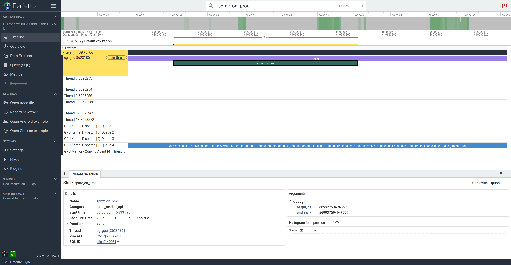
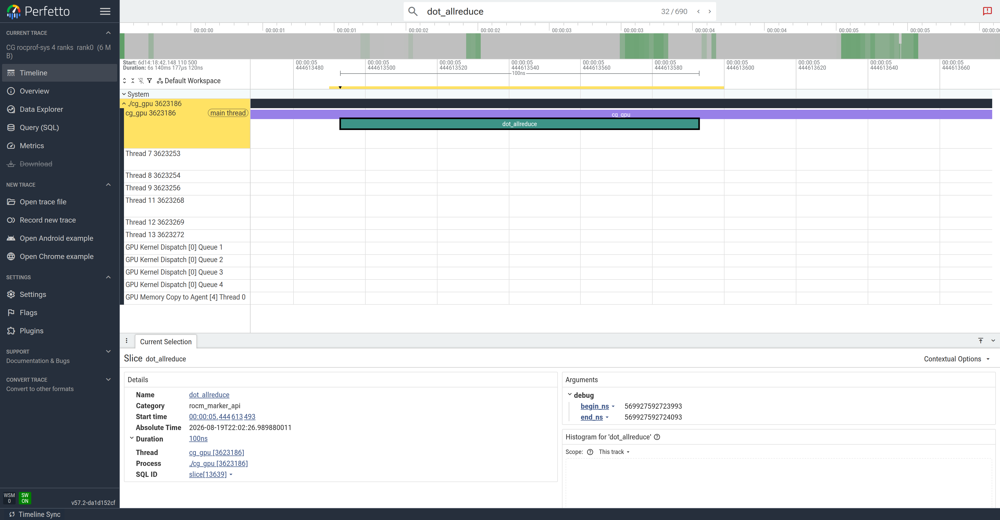
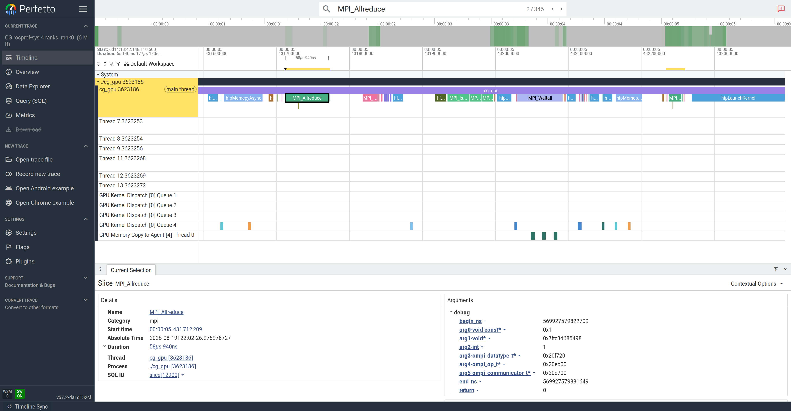
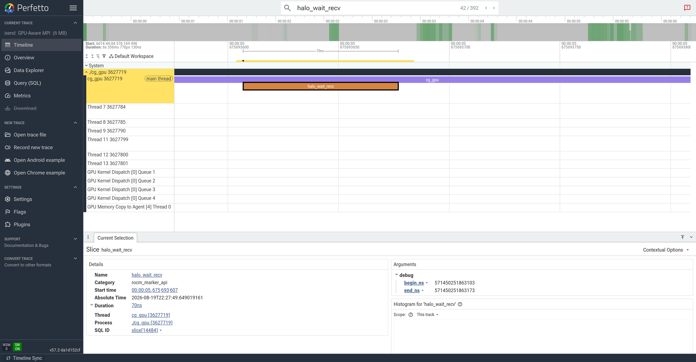
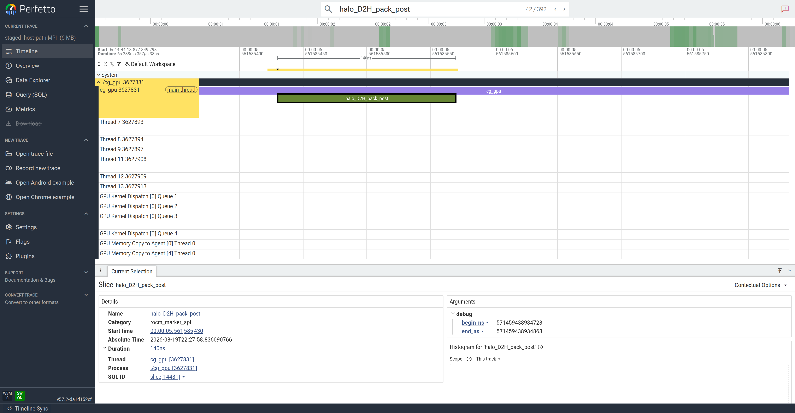
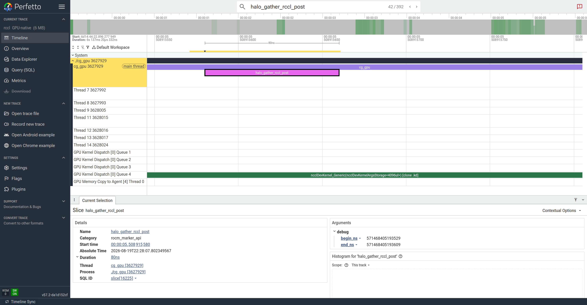

# rocprofiler-systems — CG-GPU (the *host* side of the timeline)

> Part of the [CG profiler guides](README.md). Read the shared
> [ground rules](../08-profiling.md#ground-rules-or-your-numbers-are-noise) first.

[`rocprofv3 --sys-trace`](rocprofv3.md#3-communication-memory-copy--rcclhip-traces)
draws a **GPU-centric** Perfetto timeline: kernel queues, memory-copy engines, and
(with `--marker-trace`) the roctx phase labels. What it does *not* show is **what the
CPU is doing while the GPU runs** — and for this solver that is where most of the
wall-clock goes.

`rocprofiler-systems` (formerly Omnitrace) records the **same** Perfetto timeline but
adds the host: every **CPU thread** with sampled call stacks, the **MPI calls**
(`MPI_Allreduce`, `MPI_Waitall`, `MPI_Isend/Irecv`) as labelled slices, and — as
counter tracks — per-core CPU frequency, context switches, and rocm-smi GPU
busy/power. It is the tool for answering *"the GPU has idle gaps — what is the CPU
blocked on during them?"*

## Why the CPU matters here (the 1-rank vs 4-rank contrast)

The solver's own timers already tell you the CPU is going to be the story at scale:

| run              | CG solve | communication (host/MPI) | compute |
|------------------|---------:|-------------------------:|--------:|
| **1 rank**       | ~0.09 s  | **2.5 %** (allreduce only, no halo) | 97.5 % |
| **4 ranks** (rank 0) | ~0.10 s | **~70 %** (halo ~37 % + dot allreduce ~37 %) | ~30 % |

On one GPU the run is compute-bound and the CPU barely appears. At four ranks
**~70 % of the solve is spent on the host in MPI** — the halo exchange and the
per-iteration dot-product allreduce. rocprofv3 shows this only indirectly (GPU idle
gaps); rocprofiler-systems shows it *directly*, as MPI blocks on the host thread.

## 1. Build so the host phases are labelled (`rocprofiler-sdk-roctx`)

The `rocprofv3` figures used the classic roctracer library (`-lroctx64`). **rocprof-sys
is a rocprofiler-sdk tool** and captures roctx via its `marker_api` domain, which
tracks the *newer* `rocprofiler-sdk-roctx` library. Build against that one so the same
phase names (`cg_iteration`, `dot_allreduce`, `halo_wait_recv`, `spmv_on_proc`, …)
appear — and become **searchable in Perfetto**, exactly as in the rocprofv3 walkthrough:

```bash
module load rocm/6.4.1 rocprofiler-systems/6.4.1 openmpi
cd CG-GPU
make clean && make ROCTX=1 ROCTX_LIB=-lrocprofiler-sdk-roctx
```

> The default `make ROCTX=1` links `-lroctx64`, which `rocprofv3 --marker-trace` reads
> but rocprof-sys does **not**. If you skip the `ROCTX_LIB=…` override the timeline
> still works, you just lose the searchable phase labels on the host thread.

## 2. Collect a trace with the CPU turned on

CPU call-stack sampling is **off by default** (`ROCPROFSYS_USE_SAMPLING=false`) — the
single most important switch for this exercise. Turn it on, and drop the per-core
counter rows so the GPU-kernel queues sit directly under the host thread:

```bash
export ROCPROFSYS_USE_SAMPLING=ON       # host call-stack sampling (per-thread rows)
export ROCPROFSYS_SAMPLING_FREQ=1000
export ROCPROFSYS_SAMPLING_DELAY=0.0
export ROCPROFSYS_USE_PROCESS_SAMPLING=OFF   # hide ~5 per-core counter rows (readable fig)
export ROCPROFSYS_TIME_OUTPUT=OFF

# 4 ranks, trace rank 0 only (the other ranks run bare so MPI still completes)
CG_SEED=12345 mpirun -n 4 ./gpu_bind.sh bash -c '
  R=${OMPI_COMM_WORLD_RANK:-0}
  export ROCPROFSYS_OUTPUT_PATH=rsys_n4/rank$R
  if [ "$R" = 0 ]; then exec rocprof-sys-run -- ./cg_gpu src/Dubcova2.pm isend
  else exec ./cg_gpu src/Dubcova2.pm isend; fi'
```

This writes `rsys_n4/rank0/perfetto-trace-0.proto`. `ROCPROFSYS_USE_MPIP` is **on by
default**, so the MPI calls are already wrapped — no rebuild needed for those. The
batch version is [`submit_rocsys_timeline.sbatch`](../../CG-GPU/submit_rocsys_timeline.sbatch).

> **Knobs that change the picture**
> | env var | default | effect |
> |---------|---------|--------|
> | `ROCPROFSYS_USE_SAMPLING` | `false` | **turn ON** — adds host call-stack rows |
> | `ROCPROFSYS_USE_MPIP` | `true` | the `MPI_*` slices on the host thread |
> | `ROCPROFSYS_USE_PROCESS_SAMPLING` | `true` | CPU-freq / rocm-smi counter rows (turn OFF for a compact timeline) |
> | `ROCPROFSYS_SAMPLING_CPUS` | `all` | set to `0` to keep just one CPU-frequency row |

## 3. View it: search a roctx label, then zoom (same flow as rocprofv3)

A browser is available with `module load google-chrome/stable` (see
[viewing remotely](#viewing-the-timeline-remotely)). Open the `.proto` at
<https://ui.perfetto.dev>, then — just as in the
[rocprofv3 timeline section](rocprofv3.md#capturing-these-screenshots-short-run--headless-perfetto):

1. Command palette (`>`) → **`Expand all`**.
2. Type a **roctx phase** in the search box (e.g. `dot_allreduce`, `spmv_on_proc`,
   `halo_wait_recv`) and press **Enter** to jump to it.
3. Press **`f`** to zoom to the selected slice, then **`s`** a few times to widen to a
   full `cg_iteration`.

> **Tip.** Prefer a *phase* label (`dot_allreduce`, `spmv_on_proc`) or an MPI label
> (`MPI_Allreduce`) as the search target. `cg_iteration` also works but rocprof-sys
> emits a zero-length "begin" marker alongside each range, so `f` on a bare
> `cg_iteration` match can zoom onto the instant instead of the range.

### What you see — the CPU driving (and stalling) the GPU

**`spmv_on_proc` — the host range sits right on top of the GPU kernel it launched.**
The `spmv_on_proc` roctx range on the **host thread** lines up exactly with the
`rocsparse::csrmvn_general_kernel` (SpMV) block on **GPU Kernel Dispatch Queue 4**:
the CPU-side annotation and the GPU compute it triggered, on the same time axis.



**`dot_allreduce` — the host is busy, the GPU is idle.** Search `dot_allreduce` and the
host thread shows the reduction phase; the **GPU-kernel queues underneath are empty**.
This is the exposed cost: the CPU is in `MPI_Allreduce` and the GPU has nothing to do.



**Zoom out to a full iteration — the host thread is the bottleneck.** Widening to
~one `cg_iteration`, the host thread `cg_gpu` row is almost solid `MPI_Allreduce` and a
long `MPI_Waitall` (plus the `hipMemcpyAsync`/`hipLaunchKernel` calls), while the GPU
`Kernel Dispatch` queues fire only brief, sparse kernels with wide idle gaps. The
`GPU Memory Copy to Agent` row shows the small halo SDMA copies. **The CPU, not the
GPU, owns most of the iteration** — the direct view of the ~70 % communication the
solver's timers report.



Contrast this with the [rocprofv3 GPU-only timeline](rocprofv3.md#what-the-timeline-looks-like):
same iterations, same idle gaps — but rocprof-sys names *what fills them on the host*.

## 4. Comparing transports on the host thread (`isend` vs `staged` vs `rccl`)

The halo exchange is swapped by the last command-line argument, and each transport
lands **differently on the CPU**. This is the host-side companion to the
[rocprofv3 transport comparison](rocprofv3.md#comparing-communication-methods-isend-vs-staged-vs-rccl):
same math, same convergence, but the *where does the exchange run* answer is visible on
the host thread. Regenerate the three rank-0 traces (loop the last argument, or use
[`submit_rocsys_timeline.sbatch`](../../CG-GPU/submit_rocsys_timeline.sbatch)) and search
the halo phase named per transport.

Measured on MI300A, 4 ranks (rank 0), `Dubcova2`, seed 12345:

| transport | CG solve | comm % | halo % | dot allreduce % | host-thread signature |
|-----------|---------:|-------:|-------:|----------------:|-----------------------|
| **isend** (GPU-Aware MPI) | ~0.10 s | 67 % | 36 % | 31 % | `MPI_Waitall` on device pointers; **no copy row** |
| **staged** (host-path)    | **~0.21 s** | **92 %** | **63 %** | 29 % | `hipMemcpy` staging + a **2nd GPU-copy row** |
| **rccl** (GPU-native)     | ~0.095 s | 74 % | 30 % | 43 % | `ncclDevKernel` on a GPU queue; host just posts |

**`isend` — GPU-Aware MPI.** `MPI_Isend/Irecv` operate directly on device pointers, so
there are **no staging copies**: the timeline has a single `GPU Memory Copy to Agent`
row. Searching `halo_wait_recv` lands on the host wait, and the GPU-kernel queues below
it are **empty** — the CPU blocks in `MPI_Waitall` and the GPU has nothing to overlap
but the tiny SDMA halo copy.



**`staged` — host-path MPI (the slow one).** Ghosts are copied **GPU→host**, packed and
sent from host buffers, then copied **host→GPU**. The extra work is visible two ways:
the host phase is now `halo_D2H_pack_post` → `halo_wait_recv_H2D` (with `hipMemcpy`
blocks), and a **second `GPU Memory Copy to Agent` row** appears — the staging engine
that `isend`/`rccl` never touch. The cost is not subtle: the solve is **~2× slower**
(0.21 s vs 0.10 s) and the halo alone jumps to **63 %** of the run.



**`rccl` — GPU-native collectives.** `ncclSend/ncclRecv` run as a **device kernel on the
GPU** (`halo_gather_rccl_post` on the host just launches it). Searching
`halo_gather_rccl_post` shows the host range with an `ncclDevKernel_Generic` block on
**GPU Kernel Dispatch Queue 4** *concurrent* with it — the communication is real GPU
work that can overlap `spmv_on_proc`, instead of a CPU `MPI_Waitall` gap. The host does
not block in a long wait; it only syncs the stream (`halo_wait_rccl`).



**Reading the comparison.** All three converge identically. `staged` pays for explicit
D↔H copies (and is ~2× slower here); `isend` removes those copies but still stalls the
CPU in `MPI_Waitall`; `rccl` turns the exchange into an overlappable device kernel and
keeps the CPU out of the critical path. On this small, latency-bound matrix none hides
the stall completely — but the host timeline shows *why* each behaves as it does.

## 5. Participant exercises

Work these on a `salloc --gres=gpu:4` node after the build in step 1. Each is a small
change to the collection command or the Perfetto search.

1. **Find the CPU cost of the halo exchange.** Collect the rank-0 trace (step 2),
   search `halo_wait_recv`, press `f`. *How long is the host blocked in the MPI wait?
   What are the GPU-kernel queues doing during it?* Compare to `dot_allreduce`.

2. **Turn the CPU rows off and on.** Re-run with `ROCPROFSYS_USE_SAMPLING=OFF`. *Which
   rows disappear?* Confirm the `MPI_*` slices remain (they come from `USE_MPIP`, not
   from sampling) — i.e. you can see the MPI cost even without call-stack sampling.

3. **1 rank vs 4 ranks.** Trace a single-rank run (`rocprof-sys-run -- ./cg_gpu
   src/Dubcova2.pm isend`, no `mpirun`). *Does `MPI_Waitall` appear? Is the host thread
   busy or idle between kernels?* Explain using the 2.5 % vs ~70 % table above.

4. **Reproduce the transport table (§4).** Regenerate rank 0 for `staged` and `rccl`
   (swap the last argument). *Read each solve's `comm total` %, and in Perfetto count
   the `GPU Memory Copy to Agent` rows — why does only `staged` have a second one?
   Find the `ncclDevKernel…` block on a GPU queue for `rccl`.* Confirm `staged` is
   ~2× slower than `isend`.

5. **Read a call stack.** With sampling on, click the host thread inside a
   `MPI_Waitall` region and expand the sampled frames in the details pane. *Which
   library/function is the CPU spinning in during the wait?*

## Capturing the screenshots headlessly

The figures above were captured on a compute node with no display using
[`screenshot_perfetto.py`](../../CG-GPU/screenshot_perfetto.py) (drives
`ui.perfetto.dev` through Perfetto's `postMessage` API with headless Google Chrome
from `module load google-chrome/stable`):

```bash
module load google-chrome/stable
export CHROME_BIN=$(command -v google-chrome)
# search 'spmv_on_proc', press f, then widen; writes a PNG
python screenshot_perfetto.py rsys_n4/rank0/perfetto-trace-0.proto \
  cg_rocsys_spmv_overlap_n4.png "CG rocprof-sys 4 ranks" 16000 spmv_on_proc 6
```

The `.proto` files are **not committed** (large binaries) — regenerate them with the
commands above or `submit_rocsys_timeline.sbatch`.

## Viewing the timeline remotely

Open the `.proto` at <https://ui.perfetto.dev>. Since the trace is on the cluster,
run a browser inside a graphical session (or use the headless path above):

- `module load google-chrome/stable` then `perfetto-viewer` (opens the Perfetto UI)
- `man aac6_vnc` — TurboVNC desktop, open the trace in Chrome/Firefox
- `man aac6_novnc` — the same desktop in your local browser
- `man aac6_x11` — `ssh -X` and launch a single browser window

Drag the `.proto` onto the Perfetto UI; zoom to one CG iteration and align the host
thread, the GPU-kernel queues, and the memory-copy row.

## See also

- [rocprofv3](rocprofv3.md) `--sys-trace` — the GPU-side timeline this guide extends
- [rocprof-compute](rocprof-compute.md) — the roofline for the kernels you see here
- [TAU](tau.md) / [HPCToolkit](hpctoolkit.md) — deeper MPI call-path analysis
