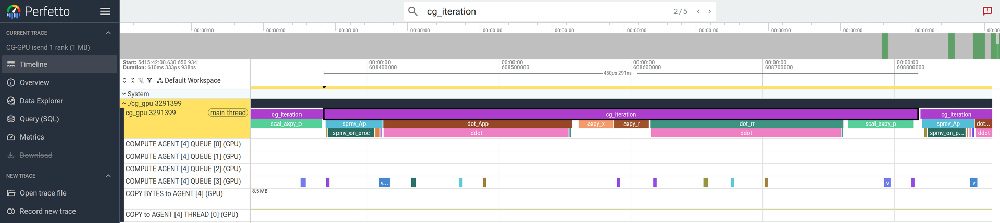
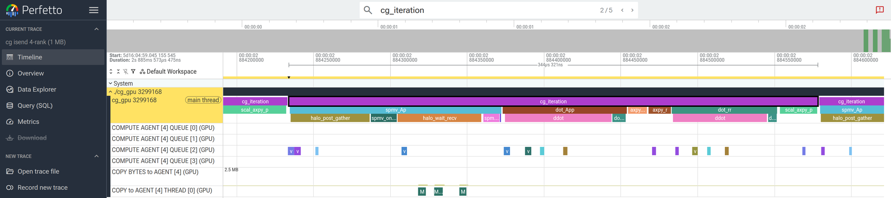
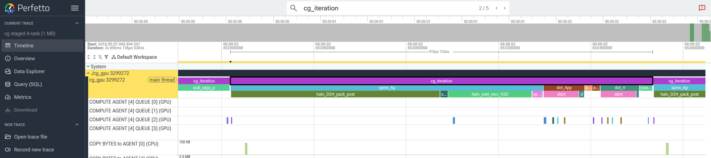
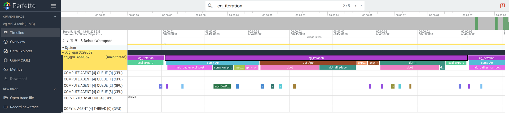

# rocprofv3 — CG-GPU (kernels + transports)

> Part of the [CG profiler guides](README.md). Read the shared
> [ground rules](../08-profiling.md#ground-rules-or-your-numbers-are-noise) first;
> load the patched profilers with `module load rocm/<ver>` (see the
> [index note](README.md#the-patched-hipblaslt-performance-runs)).

`rocprofv3` is the in-box ROCm profiler. It traces **GPU kernels** (compute),
**memory copies / HIP / RCCL** (communication), and — with `--att` — decodes a
single kernel to the **ISA-instruction** level. It does **not** trace MPI itself;
use [TAU](tau.md) or [HPCToolkit](hpctoolkit.md) for `MPI_Isend`/`MPI_Allreduce`.

## 1. Single GPU vs CPU: how the relative cost shifts (`--stats`)

The most instructive first experiment is to profile **one** GPU and compare the
kernel breakdown against the [CPU `perf` hotspots](perf.md#hotspot-sampling) for the
*same* matrix and seed. Adding `--stats` makes `rocprofv3` print (and write
`*_kernel_stats.csv`) a per-kernel table of **call count, total time, and percent of
GPU time** — the GPU analogue of a `perf report`.

Grab one GPU, build, and run the solver under `rocprofv3 --kernel-trace --stats`:

```bash
salloc --nodes=1 --ntasks=1 --gres=gpu:1 --time=00:15:00
module load rocm openmpi
cd CG-GPU && make
CG_SEED=12345 rocprofv3 --kernel-trace --stats --output-format csv \
  -d prof_1gpu -- ./cg_gpu src/Dubcova2.pm isend
```

`Dubcova2.pm` with seed `12345` converges in 172 iterations; the solver's built-in
timer reports a `CG solve time` of ~76 ms with **~0 % communication** (a single rank
has no halo exchange and no dot-product allreduce), so every kernel below is pure
compute or runtime overhead:

| kernel (`--stats`)             | calls | total ms | % GPU |
|--------------------------------|------:|---------:|------:|
| `__amd_rocclr_fillBufferAligned` |  526 |   2.09   | 23.5  |
| `__amd_rocclr_copyBuffer`      |   629 |   1.63   | 18.4  |
| rocBLAS `axpy`                 |   494 |   1.38   | 15.6  |
| **rocSPARSE SpMV** (`csrmvn`)  |   196 |   1.15   | **12.9** |
| rocBLAS `scal`                 |   172 |   0.80   |  9.0  |
| rocBLAS `dot` (3 kernels)      |   690 |   1.83   | 20.6  |

Grouped: **SpMV 12.9 % · BLAS (dot/axpy/scal) 45 % · fill 23.5 % · copy 18.4 %**.

Now compare to the CPU. `perf record` on `cg_cpu` (same matrix and seed) attributes
**≈47 % of the run to `spmv`** — it is the single dominant hotspot, exactly what you
expect for a sparse mat-vec, since an irregular, memory-bound CSR gather is the CPU's
weakest operation:

| where the time goes  | CPU (`perf`)            | 1 GPU (`rocprofv3`) |
|----------------------|------------------------:|--------------------:|
| SpMV (mat-vec)       | **≈47 %** (top hotspot) | **13 %**            |
| BLAS dot/axpy/scal   | small (inlined in `main`) | **45 %**          |
| runtime fill + copy  | none                    | **42 %**            |

**Porting to the GPU doesn't just speed up the hotspot — it moves the hotspot.** On
the GPU the sparse mat-vec is no longer the bottleneck: it drops from ~47 % to ~13 %
because the hardware dispatches the CSR mat-vec far more efficiently. The time
redistributes to (a) many *tiny* BLAS kernels — two dot products, an `axpy`, and a
`scal` every iteration — and (b) pure **runtime overhead**: `fillBufferAligned` is
the rocBLAS dot-product workspace zeroing and `copyBuffer` is the `r`/`p` vector
copies.

The reason is scale. `Dubcova2` is only 65 025 rows, so each GPU kernel runs in
**2–4 µs** and the whole solve is **launch/dispatch-overhead bound**, not compute
bound — the matrix is too small to fill the GPU. The optimization lesson is therefore
the *opposite* of the CPU one: don't tune the SpMV, instead **reduce kernel count**
(fuse BLAS ops, keep vectors resident, batch the reductions) and **run a larger
problem per GPU**.

> Rocprofv3 can work on a multi-processor MPI run, but the results can be 
> misleading. Load imbalance can inflate the kernel times reported. This
> can be more pronounced with smaller jobs. 

## 2. Compute: per-kernel trace (all ranks)

```bash
module load rocm openmpi
cd CG-GPU && make
CG_SEED=12345 mpirun -n 4 ./gpu_bind.sh \
  rocprofv3 --kernel-trace --output-format csv \
  -d prof_kern_rank_${OMPI_COMM_WORLD_RANK:-0} \
  -- ./cg_gpu src/Dubcova2.pm rccl
```

The kernel CSV shows where GPU compute goes: `rocsparse_spmv` (dominant), the
`rocsparse_dgthr` gather that packs the send buffer, and the rocBLAS
`ddot`/`daxpy`/`dscal` kernels. Roll up total ns per kernel to rank the compute.

## 3. Communication: memory-copy + RCCL/HIP traces

```bash
# staged / alltoallv_staged: see the D->H and H->D staging copies
CG_SEED=12345 mpirun -n 4 ./gpu_bind.sh \
  rocprofv3 --memory-copy-trace --hip-trace --output-format pftrace \
  -d prof_comm_rank_${OMPI_COMM_WORLD_RANK:-0} \
  -- ./cg_gpu src/Dubcova2.pm staged

# rccl: --sys-trace additionally captures the RCCL API (ncclSend/ncclRecv)
CG_SEED=12345 mpirun -n 4 ./gpu_bind.sh \
  rocprofv3 --sys-trace --output-format pftrace \
  -d prof_rccl_rank_${OMPI_COMM_WORLD_RANK:-0} \
  -- ./cg_gpu src/Dubcova2.pm rccl
```

For `staged` you see the D↔H staging copies around each SpMV; for `rccl` you see
`ncclSend`/`ncclRecv` on the `rccl_stream` overlapping the on-proc SpMV on the
default stream. This is the halo-exchange cost the solver rolls into
`g_halo_time`, now resolved by transport.

### Labelling the timeline with roctx ranges (`make ROCTX=1`)

A raw kernel/HIP timeline is hard to read — you see kernels and gaps but not *which
solver phase* each belongs to. Build with `ROCTX=1` to wrap every timed phase in a
named [roctx](https://rocm.docs.amd.com/projects/roctracer) range
(`spmv_Ap`, `dot_App`, `dot_allreduce`, `halo_post_gather`, `halo_wait_recv`,
`halo_wait_send`, `cg_iteration`, …). `rocprofv3` captures them with
`--marker-trace` (included in `--sys-trace`) and draws them as a dedicated track
**directly under the GPU-kernel row** in Perfetto:

```bash
cd CG-GPU && make clean && make ROCTX=1     # links -lroctx64; override with ROCTX_LIB=...
CG_SEED=12345 mpirun -n 4 ./gpu_bind.sh \
  rocprofv3 --sys-trace --marker-trace --output-format pftrace \
  -d prof_roctx_rank_${OMPI_COMM_WORLD_RANK:-0} \
  -- ./cg_gpu src/Dubcova2.pm isend
```

Open the `.pftrace` in Perfetto and the `dot_allreduce` / `halo_wait_*` ranges land
exactly over the **GPU idle gaps** each iteration — the visual proof that the GPU
stalls on the blocking MPI collectives (and why the tiny kernels that restart after
each stall dominate a 4-rank kernel `--stats` roll-up). The default build
(`make`, no `ROCTX=1`) compiles the markers out entirely — no roctx dependency, no
overhead.

#### What the timeline looks like

**1 rank** — the roctx phases (`spmv_Ap`, `dot_App`, `ddot`, `axpy_x`, `dot_rr`,
`scal_axpy_p`) run **back-to-back** and the `COMPUTE AGENT QUEUE` kernel rows below
are continuously busy. There is no MPI, so no gaps: the GPU is the bottleneck.



**4 ranks (rank 0)** — the same iterations now contain wide `halo_post_gather` /
`halo_wait_recv` and `dot_allreduce` ranges, and the kernel rows underneath go
**empty for the duration of those ranges** — the GPU sits idle while the CPU blocks
in `MPI_Waitall` / `MPI_Allreduce`. The `COPY to AGENT` row shows the halo SDMA
copies (`M`). This idle-then-restart pattern is the real cost that the 4-rank
kernel `--stats` mis-attributes to inflated `fillBufferAligned` time.



#### Capturing these screenshots (short run + headless Perfetto)

A full solve is 172 iterations — too dense to read. Cap it with `CG_MAX_ITERS` so the
trace holds only a few iterations, which makes Perfetto's default view *be* the
zoomed-in view:

```bash
cd CG-GPU && make ROCTX=1
# 1 rank, 5 iterations
CG_SEED=12345 CG_MAX_ITERS=5 rocprofv3 --kernel-trace --marker-trace \
  --memory-copy-trace --output-format pftrace -d tl_n1 -- ./cg_gpu src/Dubcova2.pm isend
# 4 ranks, 5 iterations, trace rank 0
CG_SEED=12345 CG_MAX_ITERS=5 mpirun -n 4 ./gpu_bind.sh bash -c '
  [ "${OMPI_COMM_WORLD_RANK}" = 0 ] \
    && exec rocprofv3 --kernel-trace --marker-trace --memory-copy-trace \
         --output-format pftrace -d tl_n4 -- ./cg_gpu src/Dubcova2.pm isend \
    || exec ./cg_gpu src/Dubcova2.pm isend'
```

Then open each `*.pftrace` at <https://ui.perfetto.dev> (a browser is available via
`module load google-chrome/stable`), press **`Expand all`** (via the `>` command
palette), type a **roctx label** such as `cg_iteration` in the search box and press
Enter to jump to it, then `f` to zoom to the selection. The figures above were
captured headlessly with [`screenshot_perfetto.py`](../../CG-GPU/screenshot_perfetto.py)
(drives `ui.perfetto.dev` through Perfetto's `postMessage` API). The `.pftrace` files
themselves are **not committed** (they are large binaries) — run the commands above,
or [`submit_timeline_pftrace.sbatch`](../../CG-GPU/submit_timeline_pftrace.sbatch), to
generate your own in a few seconds and open them in Perfetto.

#### Comparing communication methods (`isend` vs `staged` vs `rccl`)

The halo exchange is swapped by the command-line transport argument, and each one
draws a **different picture** on the timeline. All three below are the *same* 4-rank
solve (rank 0, 5 iterations, seed 12345), captured the same way — only the last
argument to `cg_gpu` changed. The roctx halo phases are named per transport so you
can see exactly where the CPU blocks and whether the GPU has anything to overlap.

```bash
# generate all three (see submit_timeline_methods.sbatch for the batch version)
for m in isend staged rccl; do
  CG_SEED=12345 CG_MAX_ITERS=5 mpirun -n 4 ./gpu_bind.sh bash -c '
    [ "${OMPI_COMM_WORLD_RANK}" = 0 ] \
      && exec rocprofv3 --kernel-trace --marker-trace --memory-copy-trace \
           --output-format pftrace -d tl_'"$m"' -- ./cg_gpu src/Dubcova2.pm '"$m"' \
      || exec ./cg_gpu src/Dubcova2.pm '"$m"''
done
```

**`isend` — GPU-Aware MPI (the original).** `MPI_Isend/Irecv` operate directly on
device pointers. The halo phases are `halo_post_gather` → `halo_wait_recv` →
`halo_wait_send`. During `halo_wait_recv` the CPU blocks in `MPI_Waitall` and the
`COMPUTE AGENT QUEUE` rows go **empty** — only the tiny SDMA halo copy (`M` in the
`COPY to AGENT` row) moves. On-proc SpMV (`spmv_on_proc`) is the only thing that
overlaps the message.


**`staged` — host-path MPI.** Ghost values are copied **GPU→host**, packed on the
CPU, sent from host buffers, and copied **host→GPU** after the wait. The phases are
`halo_D2H_pack_post` → `halo_wait_recv_H2D` → `halo_wait_send`, and the extra cost is
now *visible as data movement*: the `COPY BYTES to AGENT (CPU)` / `COPY to AGENT`
rows carry green D↔H blocks that the `isend` timeline does not have. The GPU idles
through both the copies and the `MPI_Waitall`.



**`rccl` — GPU-native collectives.** `ncclSend/ncclRecv` run as a **device kernel on
a separate `rccl_stream`** (`halo_gather_rccl_post`). Look for the `ncclDevKernel…`
block on a `COMPUTE AGENT QUEUE` row *concurrent* with `spmv_on_proc` on the default
stream — the communication is real GPU work that overlaps compute, instead of a CPU
`MPI_Waitall` gap. The remaining `halo_wait_rccl` is just the stream sync before the
off-proc SpMV reads the ghosts.



**Reading the comparison.** All three converge identically (the residual is the same
because the math is unchanged); they differ only in *how the ghost exchange lands on
the hardware*: `staged` adds explicit D↔H copies, `isend` removes those copies but
still stalls the CPU in `MPI_Waitall`, and `rccl` turns the exchange into an
overlappable device kernel. On this small matrix the exchange is latency-bound, so
none of them hides the stall completely — but the timeline shows *why* each behaves
the way it does, which the aggregate `--stats` (with its inflated `fillBufferAligned`)
cannot. Generate the three short traces yourself with
[`submit_timeline_methods.sbatch`](../../CG-GPU/submit_timeline_methods.sbatch) (or the
`for m in isend staged rccl` loop above) and open each in Perfetto to compare.

## 4. Bandwidth counters (optional)

```bash
printf 'pmc: FETCH_SIZE WRITE_SIZE L2CacheHit VALUBusy\n' > counters.txt
mpirun -n 4 ./gpu_bind.sh rocprofv3 -i counters.txt --output-format csv \
  -d prof_pmc_rank_${OMPI_COMM_WORLD_RANK:-0} -- ./cg_gpu src/Dubcova2.pm rccl
```

`FETCH_SIZE`+`WRITE_SIZE` ÷ kernel time = achieved HBM bandwidth per kernel — or
let [rocprof-compute](rocprof-compute.md) do the math.

## 5. Instruction-level: Advanced Thread Trace (ATT)

**Advanced Thread Trace** records wavefront execution at the **ISA-instruction**
granularity on selected compute units: a per-instruction hotspot/hit map, stall
reasons, VALU/VMEM issue behaviour, and occupancy for a single kernel — the tool
for asking *why* the SpMV is bandwidth-bound rather than just *that* it is.

ATT produces an enormous amount of data, so you **must** target it:

- **One kernel** — `--kernel-include-regex` (here the `rocsparse` SpMV, e.g.
  `csrmv`), optionally `--att-consecutive-kernels N`.
- **One rank** — run `-n 1`; the compute per rank is representative.
- **A few CUs / SIMDs** — `--att-target-cu` (default 1), `--att-simd-select`
  (default `0xF`), `--att-shader-engine-mask` (default `0x1`).

MI300A is **gfx942 (gfx9)**, so the gfx9-only options apply: `--att-perfcounters`
and `--att-activity 8` (AMD's recommended period).

```bash
module load rocm/7.13.0 openmpi   # 7.13.0 (or 7.12.0) ships the ATT decoder
cd CG-GPU && make
# Instruction trace of the SpMV kernel on CU 1 of one rank:
CG_SEED=12345 mpirun -n 1 --oversubscribe ./gpu_bind.sh \
  rocprofv3 --att \
    --att-library-path $ROCM_PATH/lib \
    --att-target-cu 1 \
    --att-shader-engine-mask 0x1 \
    --att-simd-select 0xF \
    --att-activity 8 \
    --att-consecutive-kernels 1 \
    --kernel-include-regex 'csrmv' \
    -d att_spmv \
    -- ./cg_gpu src/Dubcova2.pm rccl
```

The decoded output lands under the `-d` directory: `*_gfx942_code_object_id_*.out`
files hold the **ISA disassembly annotated with per-instruction hit counts**, and
a `ui_output_agent_*_dispatch_*/` folder holds per-wavefront JSON for the ROCm ATT
viewer (a `*_results.db` rocpd SQLite database is written too). Read it to confirm
the SpMV spends its cycles on `global_load`/`flat_load` (VMEM) waits rather than in
VALU — the instruction-level restatement of "CG is memory-bound".

> **Decoder library — use ROCm ≥ 7.12 (measured).** ATT *collection* is built into
> `rocprofv3`, but *decoding* needs the separate closed-source
> `rocprof-trace-decoder` library. On this cluster it ships with **`rocm/7.12.0`
> and `rocm/7.13.0`** (`$ROCM_PATH/lib/librocprof-trace-decoder.so`) but **not**
> with `rocm/7.2.4` or earlier — there the run aborts with
> `Fatal error: rocprof-trace-decoder library path not found`. **Verified
> decode-to-ISA on MI300A with `rocm/7.13.0`** (decoder `0.1.7`). Modes 1–3 need no
> decoder.

## Viewing the results remotely

- **Perfetto traces** (`*.pftrace` from step 3): open at
  <https://ui.perfetto.dev>. On a compute node with no outbound browser, start a
  graphical session and run a browser there:
  - `man aac6_vnc` — TurboVNC desktop, then open the trace in Firefox/Chromium
  - `man aac6_novnc` — the same desktop in your local browser
  - `man aac6_x11` — `ssh -X` and launch a single browser window
- **CSV / counter output** (steps 2, 4) is text — inspect with `column -s, -t` or a
  spreadsheet.
- **ATT viewer** (step 5): load the `ui_output_agent_*` folder in the ROCm ATT
  viewer inside the VNC desktop.

## See also

- [rocprof-compute](rocprof-compute.md) — turn these counters into a roofline
- [rocprofiler-systems](rocprofiler-systems.md) — full host+GPU timeline
- [TAU](tau.md) / [HPCToolkit](hpctoolkit.md) — the MPI communication rocprofv3 can't see
