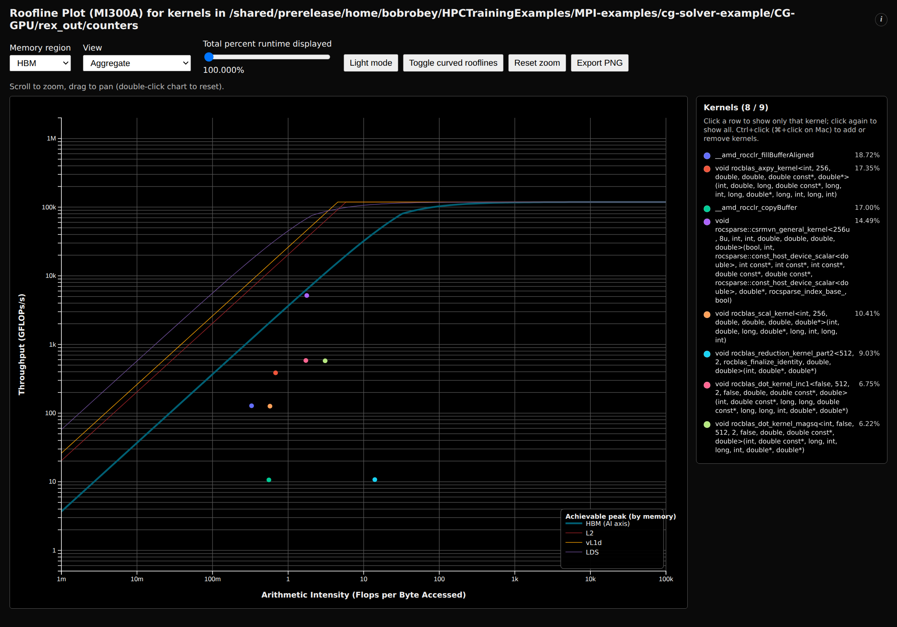

# roofline-extractor — CG-GPU (percent-of-peak roofline)

> Part of the [CG profiler guides](README.md). Read the shared
> [ground rules](../08-profiling.md#ground-rules-or-your-numbers-are-noise) first.

`roofline-extractor` (module `roofline-extractor`, load after `rocm`) is an
automated **percent-of-peak** roofline analyser. It drives `rocprofv3` for you
(four counter passes + one kernel-trace pass), then reports, per kernel, arithmetic
intensity at each memory level (HBM/L2/L1/LDS), the active limiter,
achieved-vs-peak throughput, and % of roofline reached — with an interactive HTML
plot. It is the turnkey complement to [rocprof-compute](rocprof-compute.md): less to
drive, and it prints the headline number directly.

**Verified on MI300A** (`gfx942`, SPX mode, ROCm 7.2.4, `roofline-extractor/dev`)
against `cg_gpu` on `src/Dubcova2.pm`, single rank, `rccl`. Your absolute numbers
will drift a little run-to-run; the *shape* of the result is the point.

---

## 1. Build and run

```bash
module load rocm/7.2.4
module load openmpi/5.0.10-ucc1.6.0-ucx1.19.1-xpmem-2.7.4
module load roofline-extractor
cd CG-GPU && make
export HSA_XNACK=1
# End-to-end: profiles cg_gpu and prints the per-kernel roofline breakdown.
CG_SEED=12345 roofline-extractor-profile -o rex_out --arch MI300A -- \
  mpirun -n 1 ./cg_gpu src/Dubcova2.pm rccl
```

> **Launch it through `mpirun -n 1`.** `cg_gpu` is an MPI program. Inside a Slurm
> allocation a *bare* `./cg_gpu` (or a direct `srun`) aborts in `MPI_Init`
> (`OMPI was not built with SLURM's PMI support`). `roofline-extractor-profile`
> auto-detects the launcher after `--` and runs `rocprofv3` *inside* it (once per
> rank), which is exactly what we want. Everything after `--` is your normal launch
> line, so the same command scales to `mpirun -n 4 …` (see §5).

> **Build note (OpenMPI 5.x).** The `CG-GPU/Makefile` links with `-Wl,--as-needed`.
> OpenMPI 5 dropped the C++ bindings, but the `mpicxx` wrapper still appends
> `-lmpi_cxx`; without `--as-needed` the binary picks up the *incompatible* system
> `libmpi_cxx.so.40` and aborts with `undefined symbol:
> ompi_mpi_errors_throw_exceptions`. `--as-needed` drops the unused dependency
> (the solver uses only the C MPI API). If you copy the build elsewhere, keep it.

> **Arch note.** The tool needs an MI-series arch it recognizes
> (MI250/MI300A/MI300X/MI325X/MI350X/…). On a **CPX**-mode node the virtual GPUs may
> not match a known arch string — run on **SPX**, or pin `--arch MI300A` as above.

A reproducible batch version is in
[`CG-GPU/submit_roofline_extractor.sbatch`](../../CG-GPU/submit_roofline_extractor.sbatch)
(`sbatch submit_roofline_extractor.sbatch`).

## 2. Reading the per-kernel breakdown

The run prints one block per kernel above the significance threshold (default: ≥10 %
of GPU time; lower it with `--sig-runtime`). A representative block:

```text
void rocsparse::csrmvn_general_kernel<...>(...)          # the SpMV
  Total contribution to GPU time: 14.489 %
  Total dispatches:               196
  Arithmetic intensity (HBM):     1.7651  FLOPs/B
  Achieved throughput:            5.161 TFLOPs/s
  Achieved HBM bandwidth:         2.924 TB/s
  Linear roofline performance limiter:   HBM_BW (MI300A)
  Percent of linear roofline achieved:   79.2813 %
  Percent of curved roofline achieved:   94.4595 %
...
Total application GPU time on MI300A: 7.86e+06 ns (0.007861 s)
Average percent of linear roofline achieved: 17.784 %
Average percent of curved roofline achieved: 20.578 %
```

The 9 kernels of the CG solve, ranked by GPU time (from `rex_out/profile_*.log` and
`counters_EXTRACTED_AGG.csv`):

| Kernel | % GPU time | AI (HBM) | Achieved | Limiter | % of **linear** roofline |
|---|---|---|---|---|---|
| `__amd_rocclr_fillBufferAligned` | 18.7 % | 0.33 | 128 GF/s | HBM_BW | 10.6 % |
| `rocblas_axpy_kernel` (BLAS-1 `y+=αx`) | 17.3 % | 0.68 | 387 GF/s | HBM_BW | 15.4 % |
| `__amd_rocclr_copyBuffer` | 17.0 % | 0.56 | 11 GF/s | HBM_BW | 0.5 % |
| `rocsparse::csrmvn_general_kernel` (**SpMV**) | 14.5 % | **1.77** | **5.16 TF/s** | HBM_BW | **79.3 %** |
| `rocblas_scal_kernel` (BLAS-1 `x*=α`) | 10.4 % | 0.58 | 126 GF/s | HBM_BW | 5.9 % |
| dot / reduction kernels (×4) | < 10 % each (omitted from CLI) | | | | |

The story: **every kernel is `HBM_BW`-limited** — CG is a bandwidth problem, not a
compute problem, top to bottom. But only the **SpMV** actually reaches the roof
(79 % linear, **94 % of the curved roofline**): rocSPARSE moves the matrix at
~2.9 TB/s, near the 3.7 TB/s peak. The BLAS-1 vector updates (`axpy`, `scal`) and
the runtime's buffer `fill`/`copy` sit far below the roof — they are short,
launch/latency-bound kernels with too little work per byte to saturate HBM — and
that is what drags the workload **average down to ~18 %**. The lesson is not "make
the SpMV faster"; it is "there are too many tiny memory-bound kernels around it."

## 3. The roofline plot

Outputs land in `rex_out/`: `counters.csv`, `counters_EXTRACTED*.csv`, and the
self-contained `counters.html`. Open `counters.html` for the interactive plot —
each kernel is a dot on the log-log (arithmetic-intensity vs GFLOP/s) plane, with
the HBM/L2/L1/LDS achievable-peak "rooflines" drawn as curves:



How to read it:

- **The diagonal-then-flat curves are the rooflines.** A kernel's ceiling is where
  its vertical AI line hits a curve: low AI ⇒ you hit the *sloped* (bandwidth) part,
  so you are bandwidth-bound. Every CG dot lands under the sloped region.
- **Distance below the curve = lost performance.** The SpMV dot (AI ≈ 1.8) sits just
  under the HBM roof; the `axpy`/`scal`/`fill`/`copy` dots (AI ≈ 0.3–0.7) sit an
  order of magnitude below it — memory-bound *and* under-utilizing the bandwidth
  they are limited by.
- **Controls** (top bar): the **Memory region** dropdown re-plots against L2 / L1 /
  LDS traffic instead of HBM; **Aggregate vs per-dispatch** view; **Toggle curved
  rooflines** switches the sharp-corner "linear" model to the realistic "curved"
  one (which is why the SpMV reads 79 % linear but 94 % curved); scroll to zoom,
  drag to pan; **Export PNG** saves the current view.
- Click a kernel in the right-hand legend to isolate it; `Ctrl`/`⌘`-click to add or
  remove kernels from the plot.

## 4. Participant exercises

Work these on an **SPX** MI300A node (`salloc -p SH5_MI300A_SPX --gres=gpu:1`) after
the build in §1. Each is a small change to the command or a click in the plot.

1. **Find the kernel that reaches the roof.** From the CLI output (or by clicking
   legend rows), identify which kernel has the highest *% of linear roofline*.
   *What is its arithmetic intensity, and why is it higher than the vector kernels'?*
   (Hint: SpMV reuses each loaded matrix value across a multiply-add; `axpy` touches
   each byte once.)

2. **Lower the significance threshold.** Re-run `rooflineExtractor.py` on the same
   data with `--sig-runtime 1` (or re-profile) so the four omitted dot/reduction
   kernels appear. *Where do they land on the plot?* Confirm they are also
   `HBM_BW`-limited and even further below the roof than `axpy`.

3. **Switch the memory region.** In `counters.html`, change **Memory region** from
   HBM to **L2**, then **L1**. *Do the dots move up toward the roof?* Explain what a
   kernel that is near the L1 roof but far below the HBM roof is telling you about
   cache reuse.

4. **Linear vs curved.** Toggle the curved rooflines. *By how much does the SpMV's
   "percent of roofline" change (≈79 % → ≈94 %)?* Which model would you quote to
   claim the SpMV is "well optimized," and why is the curved one more honest near
   the knee?

5. **Change the transport (does it move the roofline?).** Re-profile with `staged`
   and with `isend` instead of `rccl`
   (`… -- mpirun -n 1 ./cg_gpu src/Dubcova2.pm staged`). *Do the compute-kernel dots
   move?* They should not — the roofline is a **per-kernel compute/bandwidth**
   picture and is blind to MPI. Use this to argue why a roofline tool is the wrong
   instrument for a communication problem (use [rocprof-sys](rocprofiler-systems.md)
   or the [nsys](nsys.md) timeline for that).

6. **Two ranks, one workload.** Run `mpirun -n 2 ./cg_gpu src/Dubcova2.pm rccl` under
   the profiler (needs a `--gres=gpu:2` allocation). The tool profiles each rank and
   analyzes them **together**. *Does the average % of roofline change vs 1 rank?*
   Relate your answer to whether the per-rank kernels do less work each (smaller
   partition) but the same *kind* of work.

## 5. Multi-rank and multi-run analysis

`roofline-extractor-profile` handles MPI automatically — just put the launcher after
`--`; it profiles every rank into `rex_out/mpi_counters/rank_*` and
`rex_out/mpi_trace/rank_*`, then merges them into one workload:

```bash
CG_SEED=12345 roofline-extractor-profile -o rex_out_n4 --arch MI300A -- \
  mpirun -n 4 ./cg_gpu src/Dubcova2.pm rccl
```

To compare **several runs/phases** as one picture (e.g. `isend` vs `staged` vs
`rccl`), collect each into its own bundle dir (each needs a `counters.csv` and a
`trace_kernel_trace.csv`) and point the extractor at the parent:

```bash
roofline-extractor-extract -D my_bundle --plot --dump --arch MI300A
```

See `man roofline-extractor` and `METRICS_SUMMARY.md` / `METRICS_DETAILED.md` under
the install root (`/nfsapps/…/rooflineExtractor/`) for the exact counter equations.

## 6. Capturing the plot headlessly

`counters.html` is self-contained (d3 inlined), so headless Google Chrome renders it
straight from disk — no display, no server. The figure above was produced with:

```bash
module load google-chrome/stable
CHROME=$(command -v google-chrome)
"$CHROME" --headless --disable-gpu --no-sandbox --hide-scrollbars \
  --force-device-scale-factor=1.5 --window-size=1500,1050 \
  --virtual-time-budget=10000 \
  --screenshot=cg_roofline_extractor_n1.png \
  "file://$PWD/rex_out/counters.html"
```

To capture a *specific* view first (e.g. Light mode, or one isolated kernel) you need
to click a button before the shot — use the small Playwright helper
[`CG-GPU/screenshot_roofline.py`](../../CG-GPU/screenshot_roofline.py), which loads
the file, clicks buttons by their visible text, then screenshots:

```bash
python3 screenshot_roofline.py rex_out/counters.html light.png "Light mode"
```

## 7. Viewing the roofline remotely

If you prefer the live interactive plot over a screenshot, open `rex_out/counters.html`
in a browser on the node:

- `man aac6_vnc` — TurboVNC desktop, open `counters.html` in a browser
- `man aac6_novnc` — the same desktop in your local browser
- `man aac6_x11` — `ssh -X` and open a single browser window
- or `scp` the self-contained HTML to your workstation.

## See also

- [rocprof-compute](rocprof-compute.md) — the interactive roofline GUI
- [IntelliKit `metrix`](intellikit.md) — decoded per-kernel bandwidth
- [rocprof-sys](rocprofiler-systems.md) / [nsys](nsys.md) — timelines, for the
  *communication* story a roofline cannot show
