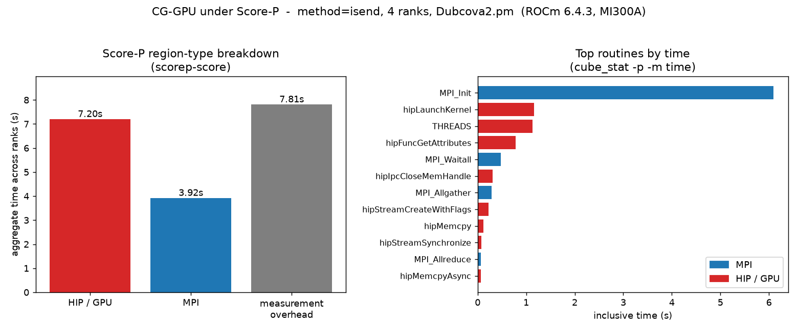
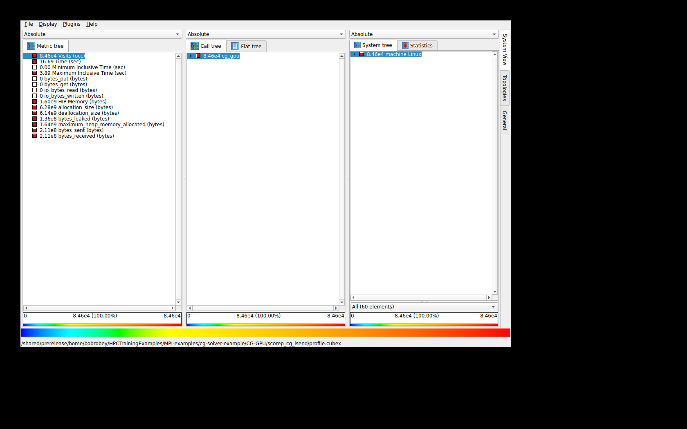

# Score-P — CG solver (MPI + ROCm/HIP tracing)

[Score-P](https://www.vi-hps.org/projects/score-p/) is a community instrumentation
and measurement system for MPI / OpenMP / GPU codes. It produces two artifacts you
analyse afterwards:

- a **CUBE4 profile** (`profile.cubex`) — an aggregated call summary, opened in **CubeGUI**;
- an **OTF2 trace** (`traces.otf2`) — a full timeline of events, opened in a trace viewer.

For the CG solver, Score-P gives the **whole-application MPI communication view**
(`MPI_Allreduce`, `MPI_Isend`, `MPI_Waitall`, …) together with the **ROCm/HIP GPU
activity** (kernel launches, `hipMemcpy`, streams) in one measurement — something
the GPU-only tools (rocprofv3, rocprof-compute) do not show.

> **Verified on AAC6 / MI300A — ROCm 6.4.3, OpenMPI 5.0.10, Score-P 9.4, 4 ranks,
> `Dubcova2.pm`.** All text output and the figure below are from that run.

## Which ROCm version (important)

| ROCm | Score-P captures | Notes |
|------|------------------|-------|
| **6.4.x** (with **scorep/9.4**) | **MPI + GPU/HIP kernels** | Recommended for the full Score-P picture. This page uses 6.4.3. |
| 7.2.x (patched hipBLASLt perf stack) | **MPI only** | The Score-P **ROCm adapter aborts** on 7.2.x (rocprofiler-sdk incompatibility). `run_scorep.sh` disables GPU capture there automatically. Use **rocprofv3** / **rocprofiler-systems** for GPU kernels on 7.2.x. |

So: profile **GPU behaviour with Score-P on ROCm 6.4.3**, and use the ROCm-native
tools for kernel detail on your 7.2.x performance runs.

## 1. Environment

Run everything inside a GPU allocation (see the tutorial's
[ground rules](../03-correct-measurement.md)):

```bash
srun -p <partition> --exclusive --gres=gpu:4 -t 00:20:00 --pty bash

module purge
module load rocm/6.4.3
# Load the tuned hipBLASLt if this ROCm build provides one (perf runs).
if module avail hipblaslt/patched 2>&1 | grep -q 'hipblaslt/patched'; then
  module load hipblaslt/patched
fi
module load openmpi
module load scorep/9.4
scorep --version        # -> Score-P 9.4
```

> ROCm 6.4.3 has **no** `hipblaslt/patched` module; the snippet is portable and
> becomes a no-op there. On ROCm 7.2.0/7.2.3/7.2.4 the `rocm` module auto-loads it;
> on 7.13.0 the explicit load above is required.

## 2. Build the instrumented solver

The `Makefile` has a `SCOREP=1` switch that wraps the MPI compiler with Score-P:

```bash
cd MPI-examples/cg-solver-example/CG-GPU
make clean
make SCOREP=1
```

This wraps `mpicxx` with `scorep --nocompiler --mpp=mpi`. We use **`--nocompiler`**
on purpose: automatic compiler instrumentation of the HIP / rocSPARSE / rocBLAS
header inlines generates so many regions that it overflows the Score-P trace buffer.
`--nocompiler` still records the **MPI adapter** and, at run time, the **ROCm/HIP
GPU** activity — the communication + compute view we want, with negligible overhead.

## 3. Run under Score-P

The easiest path is the provided script:

```bash
./run_scorep.sh                      # method=isend, 4 ranks, GPU capture on (ROCm 6.x)
METHOD=rccl ./run_scorep.sh          # a different communication variant
ROCM_VERSION=7.2.3 ./run_scorep.sh   # MPI-only (GPU capture auto-disabled)
```

Equivalent manual steps (what the script does):

```bash
export HSA_XNACK=1
export SCOREP_ENABLE_PROFILING=true    # -> profile.cubex
export SCOREP_ENABLE_TRACING=true      # -> traces.otf2
export SCOREP_ROCM_ENABLE=yes          # GPU/HIP capture (ROCm 6.x only)
export SCOREP_TOTAL_MEMORY=64M         # scorep-score estimated ~23 MB; 64M is safe
export SCOREP_EXPERIMENT_DIRECTORY=scorep_cg_isend

mpirun --bind-to none --oversubscribe -n 4 ./cg_gpu src/Dubcova2.pm isend
```

`--oversubscribe` is needed because a single `srun ... bash` shell exposes one slot
to OpenMPI. The measurement writes `scorep_cg_isend/` containing `profile.cubex`,
`traces.otf2`, `traces.def`, and `traces/`.

## 4. Text output

### `scorep-score` — region-type breakdown

```bash
scorep-score scorep_cg_isend/profile.cubex
```

```
Estimated aggregate size of event trace:                   3041kB
Estimated requirements for largest trace buffer (max_buf): 771kB
Estimated memory requirements (SCOREP_TOTAL_MEMORY):       23MB

flt     type max_buf[B] visits time[s] time[%] time/visit[us]  region
         ALL    788,713 84,887   18.93   100.0         223.02  ALL
         HIP    653,068 77,351    7.20    38.1          93.13  HIP
         MPI    135,594  7,532    3.92    20.7         520.78  MPI
      SCOREP         51      4    7.81    41.2     1951374.97  SCOREP
```

`HIP` (GPU launches/copies/streams) and `MPI` (communication) are both captured;
`SCOREP` is measurement overhead (dominated by one-off `MPI_Init` here).

### `cube_stat` — flat per-routine time profile

```bash
cube_stat -p -m time scorep_cg_isend/profile.cubex
```

```
Routine                                       time
INCL(cg_gpu)                             18.931784
  EXCL(cg_gpu)                            7.805500
  MPI_Init                                6.088721
  hipLaunchKernel                         1.161256
  hipFuncGetAttributes                    0.785020
  MPI_Waitall                             0.478415
  hipIpcCloseMemHandle                    0.308422
  MPI_Allgather                           0.287930
  hipStreamCreateWithFlags                0.227185
  hipMemcpy                               0.120051
  hipStreamSynchronize                    0.073777
  MPI_Allreduce                           0.069153
  hipMemcpyAsync                          0.068648
  MPI_Isend                               0.027188
  ...
```

> Use **`cube_stat`** for text, not `cube_dump -c region` — the latter can hang on
> some CUBE builds. The `run_scorep.sh` script guards it with `timeout`.

## 5. Figure

`run_scorep.sh` leaves the data behind; the committed
[`figs/make_scorep_fig.py`](figs/make_scorep_fig.py) turns it into a figure:

```bash
python -m venv --system-site-packages ~/scorep-venvs/figs
source ~/scorep-venvs/figs/bin/activate
pip install matplotlib
cd docs/profilers/figs && python make_scorep_fig.py    # -> scorep_cg_breakdown.png
```



*Left:* time by region type (HIP/GPU vs MPI vs measurement overhead). *Right:* the
top routines by time — `MPI_Init` (startup) dominates, then the HIP launch/attribute
calls and `MPI_Waitall`/`MPI_Allgather` from the halo exchange and dot-product
all-reduce.

## 6. Graphics: CubeGUI and the trace, remotely

Score-P's GUIs are viewed inside a remote graphical session on AAC6. Start one with
the documented methods:

- **`man aac6_vnc`** — TurboVNC desktop (best for CubeGUI / trace viewers)
- **`man aac6_novnc`** — the same desktop in a browser (noVNC)
- **`man aac6_x11`** — X11-forward a single GUI window (`ssh -X`)

CubeGUI is not installed on the cluster. The simplest self-contained viewer is the
official **CubeGui AppImage** — one file, no root, runs inside your VNC desktop
(verified: `CubeGui-4.9.1.AppImage`, 84 MB, from the Jülich release server):

```bash
# once, on a login node (has network); ~/ is shared to the compute nodes:
cd ~/tools
wget https://apps.fz-juelich.de/scalasca/releases/cube/4.9/dist/CubeGui-4.9.1.AppImage
chmod +x CubeGui-4.9.1.AppImage

# inside the TurboVNC / noVNC / ssh -X desktop terminal, in your run dir:
~/tools/CubeGui-4.9.1.AppImage scorep_cg_isend/profile.cubex
```

If FUSE is unavailable, extract once and run the unpacked binary instead
(this is what was verified here):

```bash
~/tools/CubeGui-4.9.1.AppImage --appimage-extract          # -> ./squashfs-root/
LD_LIBRARY_PATH=~/tools/squashfs-root/usr/lib \
  ~/tools/squashfs-root/usr/bin/cube scorep_cg_isend/profile.cubex
```

> The GUI is Qt/xcb — it needs an X display and `libxcb-cursor0`. A TurboVNC/noVNC
> desktop or `ssh -X` is the interactive route; for an **unattended screenshot** you
> can now also drive it under a virtual X server (`Xvfb`) — see below.

### Headless screenshot (Xvfb)

The AAC6 image now ships `Xvfb`, `libxcb-cursor0` and `libturbojpeg0`, so CubeGUI can
be rendered without a desktop and captured to a PNG. The helper
[`../../CG-GPU/shot_cubegui.sh`](../../CG-GPU/shot_cubegui.sh) starts `Xvfb :99`,
launches the AppImage on a `profile.cubex`, and grabs the screen:

```bash
cd MPI-examples/cg-solver-example/CG-GPU
./shot_cubegui.sh scorep_cg_isend/profile.cubex ../docs/profilers/figs/cg_cubegui.png
```



The three panes are the **metric tree** (left — `Time`, `Visits`, `HIP Memory`, bytes
sent/received …), the **call/flat tree** (centre — the instrumented `cg_gpu` root,
expandable into the MPI and HIP calls), and the **system tree** (right — the machine
/ ranks). This is the same view you get interactively; in a live VNC/`ssh -X` session
you can click to expand **MPI** and **HIP** under the call tree and
Alternatively, run a remote **`cube_server`** on the cluster and connect a local
CubeGUI/AppImage to it (`cube_server` on the node, then `ssh -L 3300:localhost:3300`),
or use the 4.9.1 JupyterLab CubeGUI (WASM) extension if your site enables it.

To view the **OTF2 trace** timeline, open `traces.otf2` in a trace viewer
(e.g. Vampir, or convert with `otf2-print traces.otf2 | less` for a text dump of
events). The matplotlib PNG from step 5 can be viewed directly in the desktop:

```bash
xdg-open docs/profilers/figs/scorep_cg_breakdown.png
```

## 7. Troubleshooting

| Symptom | Cause / fix |
|---------|-------------|
| `No free memory page … increase SCOREP_TOTAL_MEMORY` | Raise `SCOREP_TOTAL_MEMORY` (e.g. `256M`); avoid compiler instrumentation (keep `--nocompiler`). |
| Process **aborts** when GPU capture is on (ROCm 7.2.x) | Known ROCm-adapter incompatibility on 7.2.x. Use MPI-only (`SCOREP_GPU=0`) or profile GPU on ROCm 6.4.3. |
| `not enough slots available` | Add `--oversubscribe` to `mpirun` inside an `srun` shell. |
| `libpapi.so.7.1: cannot open shared object file` | Runs on a **compute node** (it has libpapi); the login node does not. |
| `cube_dump: command not found` / hangs | The `scorep` module ships `cube_stat`/`scorep-score` but not `cube_dump`. Use `cube_stat -p -m time` (see step 4). |
| Empty experiment dir / no `profile.cubex` | Measurement aborted before finalize — check for the abort above; on 7.2.x disable GPU capture. |

## See also

- [`../08-profiling.md`](../08-profiling.md) — the full profiler chapter
- [`README.md`](README.md) — per-profiler index for the CG example
- [`../03-correct-measurement.md`](../03-correct-measurement.md) — measurement ground rules
