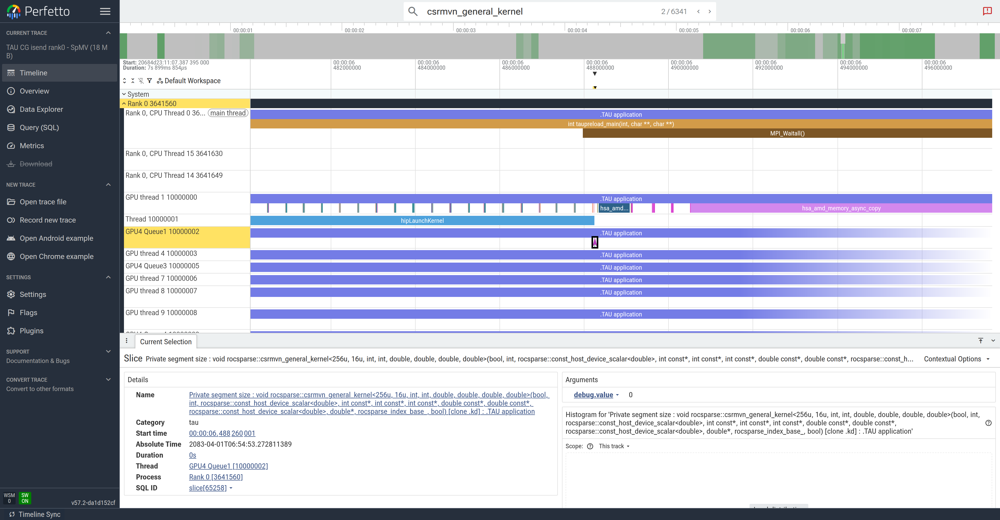
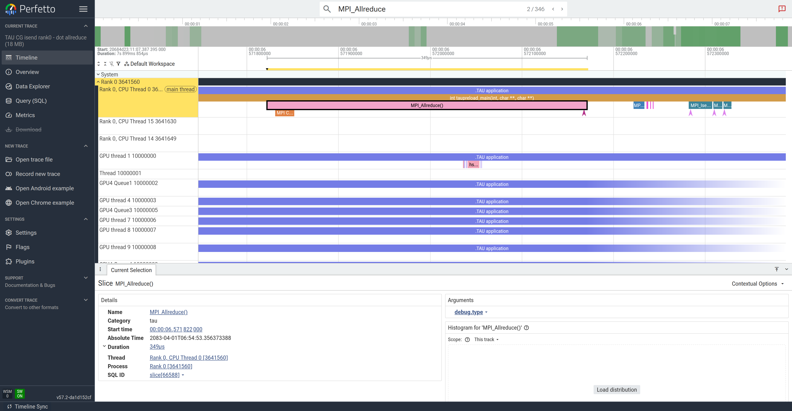
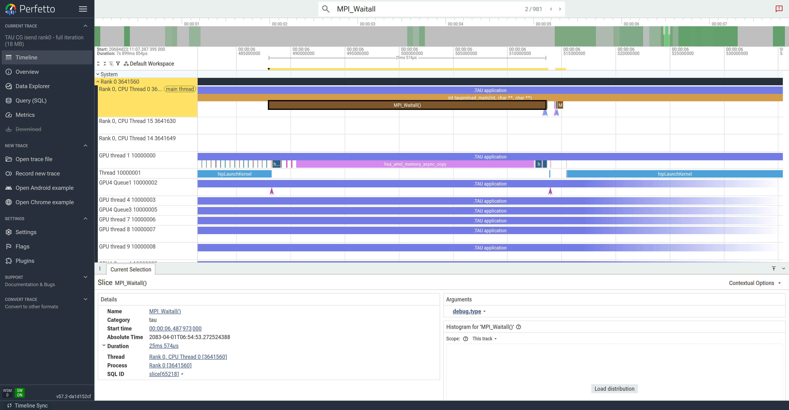
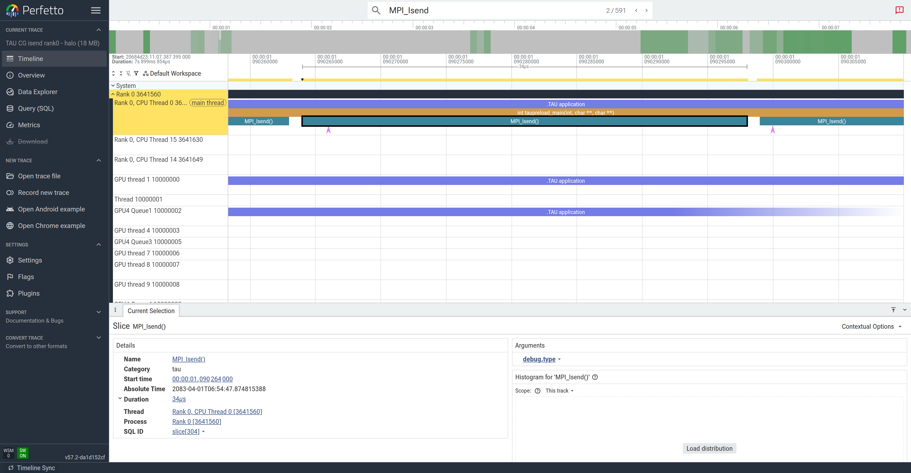
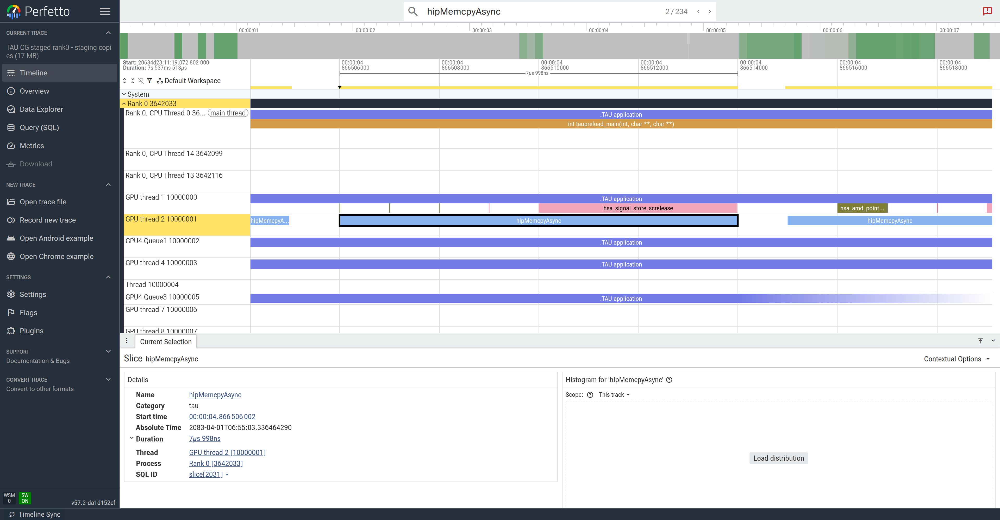
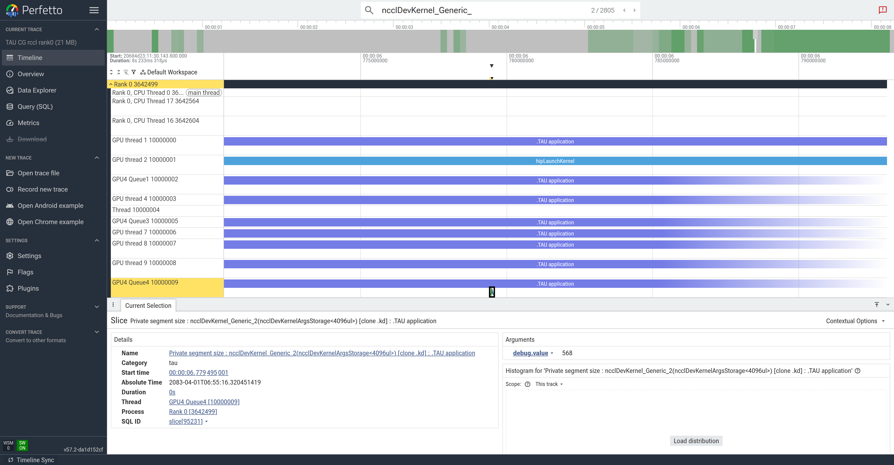

# TAU — CG-GPU (the *MPI-labelled* Perfetto timeline)

> Part of the [CG profiler guides](README.md). Read the shared
> [ground rules](../08-profiling.md#ground-rules-or-your-numbers-are-noise) first.

This is the **TAU companion to the
[rocprofiler-systems walkthrough](rocprofiler-systems.md)**: the *same* Perfetto
timeline of the CG solver, captured a different way. Where rocprof-sys reads the
`roctx` phase labels you build into the code, **TAU intercepts MPI (and, with
`-rocm`, the HIP/RCCL runtime) itself** — so the halo exchange and the dot-product
allreduce appear as `MPI_Isend` / `MPI_Waitall` / `MPI_Allreduce` slices **without
any roctx instrumentation**. On AAC6 TAU is built with `-perfetto`, so it writes a
Perfetto protobuf you open in exactly the same viewer.

> **Verified on AAC6 / MI300A — ROCm 7.2.4, OpenMPI 5.0.10, `tau/dev`
> (tau-2.35.2, `-perfetto` + rocprofiler-sdk), 4 ranks, `Dubcova2.pm`, seed 12345.**
> The figures below are rank-0 traces from that run.

## Why the CPU matters here (the same story as rocprof-sys)

The solver's own timers say the host is the story at scale — the halo exchange and
the per-iteration dot-product allreduce dominate at four ranks:

| run              | CG solve | communication (host/MPI) | compute |
|------------------|---------:|-------------------------:|--------:|
| **1 rank**       | ~0.09 s  | **2.5 %** (allreduce only, no halo) | 97.5 % |
| **4 ranks** (rank 0) | ~0.10 s | **~70 %** (halo + dot allreduce) | ~30 % |

TAU shows this **directly and per MPI call**: the host thread is a wall of
`MPI_Waitall` / `MPI_Allreduce` slices while the GPU-kernel queues below sit idle.

> **On timing.** `tau_exec` interception adds overhead, so TAU's *absolute*
> wall-clock is inflated (the solver prints ~0.7 s under TAU vs ~0.10 s bare). Read
> the TAU timeline for **communication structure and per-call attribution**, and use
> [rocprofv3](rocprofv3.md) / [rocprofiler-systems](rocprofiler-systems.md) for the
> real wall-clock numbers. This is the [ground rules](../08-profiling.md#ground-rules-or-your-numbers-are-noise)
> point: one tool per question.

## 1. Build (plain — no roctx needed)

TAU labels the MPI calls itself, so a **normal build** is all you need:

```bash
module load rocm/7.2.4 openmpi tau/dev     # see `man aac6_tau`
cd CG-GPU
make clean && make
tau_exec -v 2>/dev/null | head -1          # confirm tau_exec is on PATH
```

> The `tau/dev` module is published per-ROCm-version (`module spider tau` lists
> them); load a `rocm` module first. It sets `TAU_PROFILE_FORMAT=merged` and, when
> present, auto-loads `google-chrome` for the Perfetto viewer.
>
> **Use ROCm 7.2.4.** Perfetto output needs a TAU build configured with `-perfetto`:
> the **`rocm/6.4.1`** TAU build has none (it warns *"TAU built without Perfetto
> support"* and falls back to classic `.trc`), while **6.4.3 / 7.0.2 / 7.2.3 /
> 7.2.4** have it. `7.2.4` is the version the nightly `TAU_Profile_Check` regression
> validates on this cluster, so this guide pins it. Trying an *earlier* ROCm does not
> avoid the finalize hang below — that is TAU's cross-rank merge, not a ROCm issue.

## 2. Collect a Perfetto trace with the MPI + GPU runtime turned on

Two environment switches turn TAU's tracing into a **Perfetto** timeline; the third
keeps the per-rank files so a single readable rank-0 trace can be opened on its own:

```bash
export HSA_XNACK=1
export TAU_TRACE=1                 # enable tracing (profile-only otherwise)
export TAU_TRACE_FORMAT=perfetto   # emit a Perfetto protobuf, not classic .trc/.edf
export TAU_PERFETTO_KEEP_FILES=1   # keep tau.rank_<n>.perfetto after the merge

OUT=tau_n4; mkdir -p "$OUT"
export TRACEDIR=$PWD/$OUT PROFILEDIR=$PWD/$OUT

# 4 ranks under tau_exec -rocm (HIP/RCCL API + GPU kernels + MPI interception).
CG_SEED=12345 mpirun -n 4 --oversubscribe -mca coll_ucc_enable 0 \
  ./gpu_bind.sh tau_exec -rocm ./cg_gpu src/Dubcova2.pm isend
```

This writes per-rank `tau.rank_<n>.perfetto` and a merged, gzipped
`tau.perfetto.gz` (all four ranks). For the readable single-rank figures below, open
**`tau.rank_0.perfetto`**. The batch version is
[`submit_tau_timeline.sbatch`](../../CG-GPU/submit_tau_timeline.sbatch).

> **Two gotchas, both handled above.**
> | symptom | fix |
> |---------|-----|
> | only `tauprofile.xml` appears, no `.perfetto` | you forgot `TAU_TRACE=1` **and** `TAU_TRACE_FORMAT=perfetto` — `-rocm` alone writes a *profile* |
> | `UCC ERROR … Message truncated` then a hang | add `-mca coll_ucc_enable 0`; UCC collectives abort under `tau_exec`'s `LD_PRELOAD` |
> | trace all four ranks, not just rank 0 | run **every** rank under `tau_exec` (as above). If only rank 0 is wrapped, TAU's finalize-time cross-rank merge deadlocks waiting for the untraced ranks. |

## 3. View it: search an MPI label, then zoom (same flow as rocprof-sys)

Open `tau.rank_0.perfetto` at <https://ui.perfetto.dev> (or `module load
google-chrome; perfetto-viewer`), then — just as in the
[rocprofv3](rocprofv3.md#capturing-these-screenshots-short-run--headless-perfetto) /
[rocprof-sys](rocprofiler-systems.md#3-view-it-search-a-roctx-label-then-zoom-same-flow-as-rocprofv3)
walkthroughs:

1. Command palette (`>`) → **`Expand all`**.
2. Type an **MPI label** in the search box (`MPI_Allreduce`, `MPI_Waitall`,
   `MPI_Isend`) — or a **GPU kernel** (`csrmvn_general_kernel`) — and press **Enter**
   to jump to a match.
3. Press **`f`** to zoom to the selected slice, then hover the timeline and press
   **`s`** a few times to widen to a full CG iteration.

> **The key difference from rocprof-sys:** you search **`MPI_*`** (TAU's own MPI
> interception) instead of a `roctx` phase like `dot_allreduce`. Same picture, no
> instrumented build required.

### What you see — the CPU driving (and stalling) the GPU

**The SpMV kernel on the GPU queue, launched from the host.** Search
`csrmvn_general_kernel` (the rocSPARSE SpMV). TAU shows `hipLaunchKernel` on the HIP
runtime thread and the resulting `csrmvn_general_kernel` on a **GPU dispatch queue** —
the CPU-side launch and the GPU compute it triggered, on one time axis.



**`MPI_Allreduce` — the host is busy, the GPU is idle.** Search `MPI_Allreduce` and
the main thread shows the dot-product reduction; the **GPU-kernel queues underneath
are empty** (`TAU application`, no kernel slices). This is the exposed cost: the CPU
is in the allreduce and the GPU has nothing to do.



**Zoom out to a full iteration — the host thread is the bottleneck.** Widening to
~one iteration, the main thread is almost solid `MPI_Waitall` (a single wait here is
tens of ms of trace time), the HIP runtime thread fires brief `hipLaunchKernel`
bursts and `hsa_amd_memory_async_copy` for the halo, and the GPU dispatch queues are
mostly idle. **The CPU, not the GPU, owns most of the iteration** — the direct view
of the communication the solver's timers report.



Contrast with the [rocprofv3 GPU-only timeline](rocprofv3.md#what-the-timeline-looks-like)
and the [rocprof-sys host timeline](rocprofiler-systems.md#what-you-see--the-cpu-driving-and-stalling-the-gpu):
same iterations, same idle gaps — TAU names them with the MPI calls it intercepted.

## 4. Comparing transports on the host thread (`isend` vs `staged` vs `rccl`)

The halo exchange is swapped by the last command-line argument, and each transport
lands **differently** in TAU's labels. This is the TAU companion to the
[rocprof-sys transport comparison](rocprofiler-systems.md#4-comparing-transports-on-the-host-thread-isend-vs-staged-vs-rccl):
regenerate the three rank-0 traces (loop the last argument, or use
[`submit_tau_timeline.sbatch`](../../CG-GPU/submit_tau_timeline.sbatch)) and count the
labels — TAU makes the transport visible as *which* calls appear, not just where.

Measured **under TAU** on MI300A, 4 ranks (rank 0), `Dubcova2`, seed 12345
(absolute time inflated by interception — read the *structure*):

| transport | CG solve (under TAU) | comm % | TAU label signature (per rank-0 trace) |
|-----------|---------------------:|-------:|----------------------------------------|
| **isend** (GPU-Aware MPI) | ~0.69 s | 55 % | `MPI_Waitall` ×981, `MPI_Isend` ×591, `MPI_Allreduce` ×346, **`hipMemcpy` ×22** |
| **staged** (host-path)    | ~0.78 s | 60 % | same MPI calls **plus `hipMemcpy` ×392** — the D↔H staging copies |
| **rccl** (GPU-native)     | ~0.70 s | 52 % | **`ncclDevKernel_Generic_` ×3332** on a GPU queue, `MPI_Waitall` ×1 |

**`isend` — GPU-Aware MPI.** `MPI_Isend`/`MPI_Irecv` operate directly on device
pointers, so the halo is pure MPI: searching `MPI_Isend` lands on the host post and
the GPU-kernel queues below are **empty** (no staging copies — only ~22 `hipMemcpy`
in the whole run, from setup).



**`staged` — host-path MPI (the extra copies).** Ghosts are copied **GPU→host**,
sent from host buffers, then copied **host→GPU**. TAU counts **`hipMemcpy` ×392**
(vs ×22 for `isend`), and searching `hipMemcpyAsync` lands on a HIP-runtime row full
of back-to-back staging copies (`hsa_signal_store_screlease` between them) that
`isend`/`rccl` never issue.



**`rccl` — GPU-native collectives.** `ncclSend`/`ncclRecv` run as a **device kernel
on the GPU**: TAU records **`ncclDevKernel_Generic_` ×3332** on a GPU dispatch queue,
and `MPI_Waitall` all but disappears (×1 — the halo no longer goes through MPI). The
host posts the group and syncs the stream instead of blocking in a long MPI wait.



**Reading the comparison.** All three converge identically. `isend` is pure
device-pointer MPI (no copies); `staged` adds a wall of `hipMemcpy` staging;
`rccl` moves the exchange onto the GPU as `ncclDevKernel`. TAU shows *which calls*
each transport makes — the per-call companion to the rocprof-sys host timeline.

## 5. Text profile and the communication matrix (TAU's extra views)

The same run also writes a profile TAU can summarise without a GUI:

```bash
cd tau_n4 && pprof        # flat per-thread table: %Time, exclusive/inclusive, calls
```

`pprof` attributes time to `MPI_Allreduce` (the dot reduction → `g_allreduce_time`),
`MPI_Isend`/`MPI_Irecv`/`MPI_Waitall` (the halo → `g_halo_time`), and the HIP/GPU
calls — the same split the solver prints, now per MPI call. For the GUI (per-call
bar charts and the **communication matrix** across ranks):

```bash
paraprof tau_n4          # Java GUI; a JRE ships on the AAC6 nodes (see man aac6_tau)
```

> `paraprof` is a Java Swing app; run it inside a graphical session
> (`man aac6_novnc` / `man aac6_vnc` / `man aac6_x11`). The Perfetto timeline
> (§3–4) needs only a browser — `perfetto-viewer` after `module load google-chrome`.

## 6. Participant exercises

Work these on a `salloc -N1 --gres=gpu:4` node after the build in step 1. Each is a
small change to the collection command or the Perfetto search.

1. **Find the CPU cost of the halo wait.** Collect the trace (step 2), search
   `MPI_Waitall`, press `f`. *How long is the host blocked in one wait? What are the
   GPU dispatch queues doing during it?* Compare to `MPI_Allreduce`.

2. **Profile vs trace.** Re-run with `TAU_TRACE=0` (leave `TAU_TRACE_FORMAT` set).
   *Which output file disappears?* Confirm `pprof` still gives the per-call MPI table
   from `tauprofile.xml` — i.e. you can attribute MPI time even without the timeline.

3. **1 rank vs 4 ranks.** Trace a single-rank run (`tau_exec -rocm ./cg_gpu
   src/Dubcova2.pm isend`, no `mpirun`). *Does `MPI_Waitall` appear at all? Is the
   host thread busy or idle between kernels?* Explain with the 2.5 % vs ~70 % table.

4. **Reproduce the transport table (§4).** Regenerate rank 0 for `staged` and `rccl`
   (swap the last argument). In each `tau.rank_0.perfetto`, count the labels:
   `strings tau.rank_0.perfetto | grep -oE 'hipMemcpy|ncclDevKernel_Generic_|MPI_Waitall' | sort | uniq -c`.
   *Why does only `staged` have hundreds of `hipMemcpy`? Where did `MPI_Waitall` go
   for `rccl`?*

5. **TAU vs rocprof-sys, side by side.** Open this `tau.rank_0.perfetto` and the
   [rocprof-sys `.proto`](rocprofiler-systems.md#2-collect-a-trace-with-the-cpu-turned-on)
   for the same transport. *Both are Perfetto timelines of the same solver — what does
   TAU label that rocprof-sys does not (per-call MPI), and what does rocprof-sys add
   that TAU does not (sampled host call stacks, rocm-smi counters)?*

## Capturing the screenshots headlessly

The figures above were captured on a compute node with no display using
[`screenshot_perfetto.py`](../../CG-GPU/screenshot_perfetto.py) (drives
`ui.perfetto.dev` through Perfetto's `postMessage` API with headless Google Chrome
from `module load google-chrome/stable`) — the same helper the rocprof-sys guide uses:

```bash
module load google-chrome/stable
export CHROME_BIN=$(command -v google-chrome)
# search 'MPI_Allreduce', press f, then widen; writes a PNG
python screenshot_perfetto.py tau_n4/tau.rank_0.perfetto \
  cg_tau_allreduce_n4.png "TAU CG 4 ranks" 16000 MPI_Allreduce 5
```

The `.perfetto` files are **not committed** (large binaries) — regenerate them with
the commands above or `submit_tau_timeline.sbatch`.

## Viewing the timeline remotely

Open the `.perfetto` at <https://ui.perfetto.dev>. Since the trace is on the cluster,
run a browser inside a graphical session (or use the headless path above):

- `module load google-chrome/stable` then `perfetto-viewer` (opens the Perfetto UI)
- `man aac6_vnc` — TurboVNC desktop, open the trace in Chrome/Firefox
- `man aac6_novnc` — the same desktop in your local browser
- `man aac6_x11` — `ssh -X` and launch a single browser window

Click **Open trace file**, choose `tau.rank_0.perfetto`; nothing is uploaded. Zoom to
one CG iteration and align the host thread, the HIP runtime thread, and the GPU
dispatch queues.

## See also

- [rocprofiler-systems](rocprofiler-systems.md) — the roctx-labelled host timeline this guide mirrors
- [rocprofv3](rocprofv3.md) `--sys-trace` — the GPU-side Perfetto timeline
- [Score-P](scorep.md) / [HPCToolkit](hpctoolkit.md) — other MPI+GPU call-path/trace tools
- `man aac6_tau` — the cluster's TAU quick-start (modes, `tau_exec_launch`, viewers)
