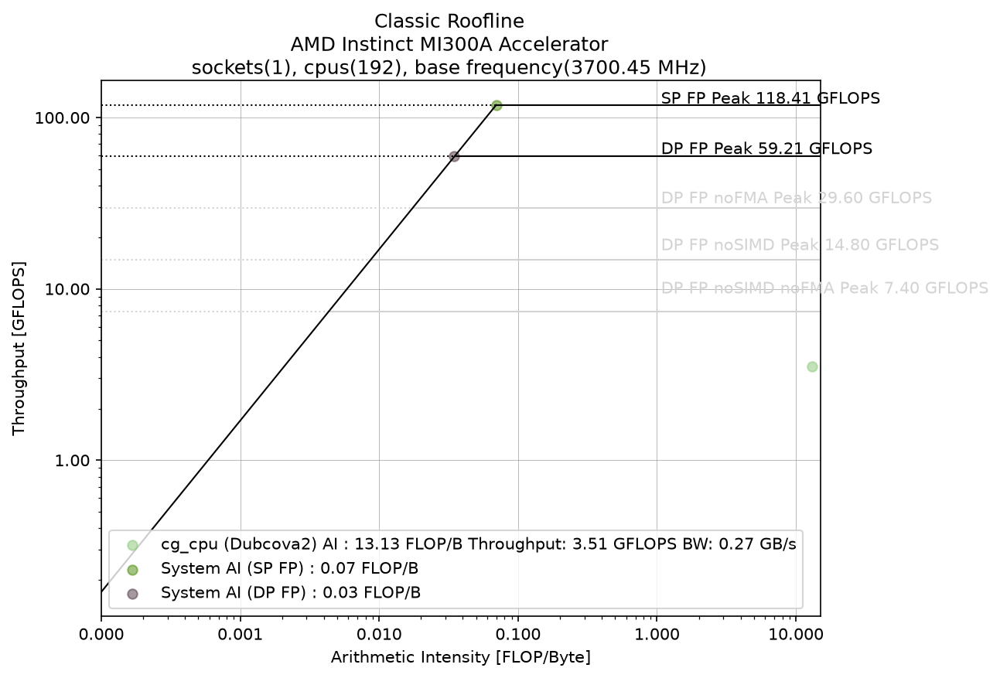

# AMD uProf — CG-CPU (CPU hotspots, memory + classic roofline)

> Part of the [CG profiler guides](README.md). Read the shared
> [ground rules](../08-profiling.md#ground-rules-or-your-numbers-are-noise) first.

AMD uProf **does** work on the MI300A node (unlike [likwid](likwid.md)). Profile it
**per rank under `mpirun`** (so uProf runs on the compute node where the ranks
execute), each writing its own directory, then report from that **directory**.

## 1. Collect and report (hotspots)

```bash
export PATH=$PATH:/nfsapps/ubuntu-24.04-nightlies/opt/AMDuProf_5.3-518/bin
cd CG-CPU && make
# Time-based (hotspot) profiling, one uProf per rank:
mpirun --oversubscribe -n 4 bash -c \
  'AMDuProfCLI collect --config tbp -o uprof_r${OMPI_COMM_WORLD_RANK} ./cg_cpu src/Dubcova2.pm'
# Report from the collection DIRECTORY (not the session.uprof file):
AMDuProfCLI report -i uprof_r0        # writes uprof_r0/report.csv
```

Measured on MI300A, `report.csv` lists the hottest functions — for this solver the
top entry is the CSR SpMV (`spmv(double, ParMat&, ...)`), then `main` and the
`std::map` column-index lookups. The memory/bandwidth analysis config (see
`AMDuProfCLI collect --help`) adds DRAM traffic and cache behaviour — the CPU-side
analog of the [rocprof-compute](rocprof-compute.md) roofline.

> Requires `perf_event_paranoid` low enough to sample; the MI300A compute nodes are
> configured permissively (see [perf-security.md](perf-security.md)).

## 2. Viewing the results remotely

- `report.csv` is text — inspect with `column -s, -t uprof_r0/report.csv` or a
  spreadsheet.
- The **AMDuProf GUI** imports a collection directory for graphical hotspot/flame
  and memory views. Launch it inside a graphical session:
  - `man aac6_vnc` — TurboVNC desktop, then `AMDuProf`
  - `man aac6_novnc` — the same desktop in your local browser
  - `man aac6_x11` — `ssh -X` then `AMDuProf` (single window)

## 3. Classic roofline model

uProf ships its own **classic roofline** flow
([AMD uProf user guide §5.1](https://docs.amd.com/r/en-US/57368-uProf-user-guide/5.1.-Classic-Roofline-Model)).
The intended one-liner is:

```bash
# Collect FP + DRAM-bandwidth counters and emit report.html with the plot:
AMDuProfPcm roofline -O out_roofline -- ./myapp
# …or render a PDF from the CSV with uProf's plotting script:
AMDuProfModelling.py -i out_roofline/myapp-roofline.csv -o out_roofline --dp-roofs -a myapp
```

The model puts **arithmetic intensity** (FLOP/byte) on the x-axis and **throughput**
(GFLOP/s) on the y-axis; horizontal lines are the FP compute peaks and the diagonal
is `min(peak GFLOPS, peak DRAM BW × AI)`.

> **Two MI300A gotchas that block the turnkey command.** `AMDuProfPcm roofline`
> refused to run as-is on the APU cores (family `0x19`, model `0x90`):
> 1. **No shipped roofline config.** uProf has `RL_0x19_0x0/0x1/0xa.conf` but none
>    for model `0x90` → *"unsupported processor model."* Copy a Zen4 one and widen
>    the model range (see [`CG-CPU/rl_mi300a.conf`](../../CG-CPU/rl_mi300a.conf),
>    then pass it with `AMDuProfPcm roofline -i rl_mi300a.conf …`).
> 2. **DRAM bandwidth needs privileged counters.** The data-fabric (DF/uncore) PMCs
>    that measure DRAM traffic need the `amd_uncore` module / `--msr` (root) on this
>    kernel — participants get *"kernel does not support amd_df counters … try
>    `--msr`"*. The **FP** (core) counters work fine unprivileged.

So on these nodes we measure the two roofline inputs with tools that work **without
root**, then plot with uProf's own `AMDuProfModelling.py`:

| Roofline input | Tool that works unprivileged here | Value (Dubcova2, 1 rank) |
|---|---|---|
| FP work (retired SSE/AVX FLOPs) | `AMDuProfPcm -m fp` | **0.57 GFLOP** |
| Solve time | the solver's own timer | **0.16 s** → **~3.5 GFLOP/s** |
| DRAM bytes (last-level-D misses × 64) | [`valgrind cachegrind`](cachegrind.md) | **~43 MB** → **AI ≈ 13 FLOP/B** |

The whole pipeline (measure → build the roofline CSV → render) is one batch job,
[`CG-CPU/submit_uprof_roofline.sbatch`](../../CG-CPU/submit_uprof_roofline.sbatch),
which calls uProf's plotter through the thin driver
[`CG-CPU/render_cpu_roofline.py`](../../CG-CPU/render_cpu_roofline.py) (it imports
`AMDuProfModelling.py` unmodified and only saves with a tight bounding box so the
right-hand roof labels are not clipped):

```bash
cd CG-CPU
sbatch submit_uprof_roofline.sbatch      # writes docs/profilers/figs/cg_uprof_roofline_cpu_n1.png
```



### Reading this roofline

uProf's plotter draws the **single-core** MI300A ceilings (from `cores×2 FMA×(256/64)
lanes×2 FLOP×3.70 GHz`) and the fixed MI300A DRAM roof it hard-codes as **1700 GB/s**:

- **DP FP Peak 59.2 GF/s**, SP 118.4 GF/s (vector + FMA).
- Grey sub-roofs from `--dp-roofs`: **DP no-FMA 29.6**, **no-SIMD 14.8**, and
  **no-SIMD no-FMA (scalar) 7.4 GF/s** — the ceiling for plain scalar `a*b+c`.
- The diagonal **DRAM roof** meets the compute peak at the "knee" near AI ≈ 0.035
  FLOP/B.

The **`cg_cpu` point sits at AI ≈ 13 FLOP/B, far to the *right* of the knee** — i.e.
**not DRAM-bound**. That is the whole story: Dubcova2 (≈13 MB of CSR) fits in the
APU's large last-level (Infinity) cache, so after the first iteration the matrix is
served from cache and almost nothing goes to DRAM (43 MB total, most of it the
one-time load). At AI ≈ 13 the DRAM diagonal is way overhead; the binding ceilings
are the **compute** ones. `cg_cpu` reaches ~3.5 GF/s — about **half of the 7.4 GF/s
scalar no-FMA roof** and ~6 % of the 59 GF/s vector peak.

Below even the *scalar* roof means the core is **stalling**, not FP-limited: this is
the L1 indirect-gather latency that [cachegrind](cachegrind.md) pins on
`x[A.col_idx[j]]`. Vectorizing/FMA-ing the SpMV cannot help a gather that misses L1.

> **Contrast with the GPU.** The [roofline-extractor](roofline-extractor.md) and
> [rocprof-compute](rocprof-compute.md) rooflines show the *same* solver as strongly
> **HBM-bandwidth-bound** on the GPU (SpMV at 94 % of the curved roof). The GPU has
> no 256 MB cache, so it re-streams the matrix from HBM every iteration → **low AI,
> memory-bound**. Same math, opposite limiter — because the APU CPU cores get to
> keep the matrix in cache. This is the single most important lesson of the CPU
> roofline.

## 4. Participant exercises

Build first (`cd CG-CPU && make`) and work these on an MI300A node
(`salloc -p PPAC_MI300A_SPX -N1 -c16`). Fix the seed (`CG_SEED=12345`) so every run
solves the same system.

1. **Reproduce the point.** Run `sbatch submit_uprof_roofline.sbatch` (or the three
   steps by hand) and read the printed line
   `FLOPs=… solve=… DRAM=… -> … GFLOPS, … GB/s, AI=…`. *Where does the point land
   relative to the 7.4 GF/s scalar roof?* Confirm it is compute/latency-region, not
   DRAM-region, and explain what AI ≈ 13 FLOP/B tells you about cache residency.

2. **Recompute AI against a different memory level.** The plotted AI uses DRAM bytes
   (`LLd misses × 64`). From the same [cachegrind](cachegrind.md) run, redo the
   arithmetic with **L1-fill** bytes instead (`D1 misses × 64` ≈ 85.9 M × 64 ≈
   5.5 GB). *Which way does the point move, and why?* (Hint: more bytes ⇒ lower AI ⇒
   the point slides left toward — and under — a bandwidth roof. The L1 view is the
   one that actually explains the stall.)

3. **Spill the cache and watch AI drop.** Generate a bigger matrix and re-measure:
   ```bash
   python3 ../CG-GPU/gen_poisson.py 80 src/poisson80.pm    # 512,000 rows
   ```
   Point the pipeline at `src/poisson80.pm` and regenerate. Cachegrind already shows
   LLd misses jump ~19× for this size. *Does AI fall (point moves left, toward the
   DRAM roof)?* Relate this to becoming memory-bound as the working set exceeds the
   cache — the CPU analog of the GPU being HBM-bound.

4. **CPU vs GPU limiter.** Open the [GPU roofline](roofline-extractor.md) for the
   *same* solver. *Why is CG HBM-bound on the GPU but compute/latency-bound on the
   APU CPU cores?* Write one sentence tying the answer to the 256 MB last-level cache
   and to arithmetic intensity.

5. **Add the SP / half-precision peaks.** Re-render with `--sp-roofs` (and `--hp`)
   via `render_cpu_roofline.py` / `AMDuProfModelling.py`. *Do any of these higher
   ceilings help `cg_cpu`?* Explain why a double-precision, scalar, gather-bound
   solver cannot reach the SP or FMA roofs no matter how high they are.

6. **Try the privileged, turnkey path.** If you can get root (or `amd_uncore`
   loaded), run the real one-liner
   `AMDuProfPcm roofline -i rl_mi300a.conf --msr -O out -- mpirun -n 1 ./cg_cpu src/Dubcova2.pm 12345`
   and open `out/…/report.html`. *Does uProf's directly-measured DRAM bandwidth give
   an AI close to the ~13 FLOP/B we derived from cachegrind?* If they disagree,
   which do you trust for a cache-resident code, and why?

## See also

- [Linux perf](perf.md) — lighter, always-available hotspots
- [Valgrind cachegrind](cachegrind.md) — deterministic per-line cache misses (the
  DRAM/L1 byte counts behind the roofline AI)
- [roofline-extractor](roofline-extractor.md) / [rocprof-compute](rocprof-compute.md)
  — the **GPU** rooflines, where the same solver is HBM-bandwidth-bound
