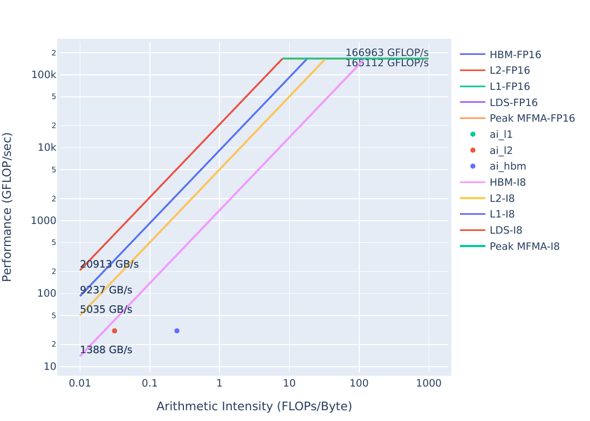

## Exercise 1: Launch Parameter Tuning

Simple kernel implementing a version of yAx, to demonstrate effects of Launch Parameters on kernel 
execution time. 

**Note:** This exercise was tested on a system with MI210s, on a recent commit of Omniperf version `2.0.0` and ROCm `6.0.0`. **Any Omniperf version `2.0.0` or greater is incompatible with versions of ROCm less than `6.0.0`.**

Client-side installation instructions are available in the official omniperf documentation, and provide all functionality demonstrated here.

If your system has an older version of Omniperf, please refer to the archived READMEs in this directory and use a ROCm version lesser than `6.0.0`.


<details>
<summary><h3>Background: Acronyms and terms used in this exercise</h3></summary>
     <ul>
          <li>yAx: a vector-matrix-vector product, y*A*x, where y and x are vectors, and A is a matrix</li>
          <li>FP(32/16): 32- or 16-bit Floating Point numeric types</li>
          <li>FLOPs: Floating Point Operations Per second</li>
          <li>HBM: High Bandwidth Memory is globally accessible from the GPU, and is a level of memory above the L2 cache</li>
     </ul>
</details>

### Initial Roofline Analysis:
The roofline model is a way to gauge kernel performance in terms of maximum achievable bandwidth and floating-point operations.
It can be used to determine how efficiently a kernel makes use of the available hardware. It is a key tool in initially determining
which kernels are performing well, and which kernels should be able to perform better. Below are roofline plots for the yAx kernel in problem.cpp:

| Roofline Type | Roofline Legend                                    | Roofline Plot                                        |
|---------------|----------------------------------------------------|------------------------------------------------------|
|FP32/FP64      ||      |
|FP16/INT8      || |

These plots were generated by running:

```
omniperf profile -n problem_roof_only --roof-only --kernel-names -- ./problem.exe
```
The plots will appear as PDF files in the `./workloads/problem_roof_only/MI200` directory, if generated on MI200 hardware.

We see that the kernel's performance is not near the achievable bandwidth possible on the hardware, which makes it a good candidate to consider
optimizing.

### Exercise instructions:
From the roofline we were able to see that there is room for improvement in this kernel. One of the
first things to check is whether or not we have reasonable launch parameters for this kernel.

To get started, build and run the problem code:
     
```
make
./problem.exe
```
(*simulated output*)
```
yAx time: 2911 milliseconds
```
     
The runtime of the problem should be very slow, due to sub-optimal launch parameters.
Let's confirm this hypothesis by looking at the omniperf profile. Start by running:
     
```
omniperf profile -n problem --no-roof -- ./problem.exe
```
This command requires omniperf to run your code a few times to collect all the necessary hardware counters.
- `-n problem` names the workload, meaning that the profile will appear in the `./workloads/problem/MI200/` directory, if you are profiling on an MI200 device.
- `--no-roof` turns off the roofline, which will save some profiling time by avoiding the collection of achievable bandwidths and FLOPs on the device.
- Everything after the `--` is the command that will be profiled.

After the profiling data is collected, we can view the profile by using this command:
```
omniperf analyze -p workloads/problem/MI200 --dispatch 1 --block 7.1.0 7.1.1 7.1.2
```
This allows us to view nicely formatted profiling data directly in the command line.
The command given here has a few arguments that are noteworthy:
- `-p workloads/problem/MI200` must point to the output directory of your profile run. For the above `omniperf profile` command, this will be `workloads/problem/MI200`.
- `--dispatch 1` filters kernel statistics by dispatch ID. In this case kernel 0 was a "warm-up" kernel, and kernel 1 is what the code reports timings for.
- `--block` displays only the requested metrics, in this case we want metrics specific to Launch Parameters:
   - `7.1.0` is the Grid Size
   - `7.1.1` is the Workgroup Size
   - `7.1.2` is the Total Wavefronts Launched

The output of the `omniperf analyze` command should look something like this:
```
  ___                  _                  __
 / _ \ _ __ ___  _ __ (_)_ __   ___ _ __ / _|
| | | | '_ ` _ \| '_ \| | '_ \ / _ \ '__| |_
| |_| | | | | | | | | | | |_) |  __/ |  |  _|
 \___/|_| |_| |_|_| |_|_| .__/ \___|_|  |_|
                        |_|

Analysis mode = cli
[analysis] deriving Omniperf metrics...
                                                                                                                                                                                                                --------------------------------------------------------------------------------
0. Top Stats
0.1 Top Kernels
╒════╤══════════════════════════════════════════╤═════════╤══════════════╤══════════════╤══════════════╤════════╕
│    │ Kernel_Name                              │   Count │      Sum(ns) │     Mean(ns) │   Median(ns) │    Pct │
╞════╪══════════════════════════════════════════╪═════════╪══════════════╪══════════════╪══════════════╪════════╡
│  0 │ yax(double*, double*, double*, int, int, │    1.00 │ 751342314.00 │ 751342314.00 │ 751342314.00 │ 100.00 │
│    │  double*) [clone .kd]                    │         │              │              │              │        │
╘════╧══════════════════════════════════════════╧═════════╧══════════════╧══════════════╧══════════════╧════════╛                                                                                               0.2 Dispatch List
╒════╤═══════════════╤═══════════════════════════════════════════════════════════════╤══════════╕
│    │   Dispatch_ID │ Kernel_Name                                                   │   GPU_ID │
╞════╪═══════════════╪═══════════════════════════════════════════════════════════════╪══════════╡
│  0 │             1 │ yax(double*, double*, double*, int, int, double*) [clone .kd] │        2 │
╘════╧═══════════════╧═══════════════════════════════════════════════════════════════╧══════════╛

                                                                                                                                                                                                                --------------------------------------------------------------------------------
7. Wavefront
7.1 Wavefront Launch Stats
╒═════════════╤══════════════════╤════════╤════════╤════════╤════════════╕
│ Metric_ID   │ Metric           │    Avg │    Min │    Max │ Unit       │
╞═════════════╪══════════════════╪════════╪════════╪════════╪════════════╡
│ 7.1.0       │ Grid Size        │ 256.00 │ 256.00 │ 256.00 │ Work items │
├─────────────┼──────────────────┼────────┼────────┼────────┼────────────┤
│ 7.1.1       │ Workgroup Size   │  64.00 │  64.00 │  64.00 │ Work items │
├─────────────┼──────────────────┼────────┼────────┼────────┼────────────┤
│ 7.1.2       │ Total Wavefronts │   4.00 │   4.00 │   4.00 │ Wavefronts │
╘═════════════╧══════════════════╧════════╧════════╧════════╧════════════╛
```
Looking through this data we see:
- Workgroup Size (`7.1.1`) is 64 threads, which corresponds with the size of a wavefront.
- Total Wavefronts (`7.1.2`) shows that we are launching only 4 Wavefronts.

We can definitely get better performance by adjusting the launch parameters of our kernel.
Either try out some new values for the launch bounds, or run the provided solution to see its performance:

```
cd solution
make
./solution.exe
```
(*simulated output*)
```
yAx time: 70 ms
```

We get much better performance with the new launch parameters. Note that in general it can be difficult to find the
most optimal launch parameters for a given kernel due to the many factors that impact performance, so determining 
launch parameters experimentally is usually necessary.

We should also confirm that our updated launch parameters are reported by omniperf, we need to run:

```
omniperf profile -n solution --no-roof -- ./solution.exe
```
This command is the same as before, except the workload name has changed to `solution`.
Once the `profile` command has completed, run:

```
omniperf analyze -p workloads/solution/MI200 --dispatch 1 --block 7.1.0 7.1.1 7.1.2
```
Again, this command largely uses the same arguments as before, except for the workload name.
The output should look something like this:
```
  ___                  _                  __
 / _ \ _ __ ___  _ __ (_)_ __   ___ _ __ / _|
| | | | '_ ` _ \| '_ \| | '_ \ / _ \ '__| |_
| |_| | | | | | | | | | | |_) |  __/ |  |  _|
 \___/|_| |_| |_|_| |_|_| .__/ \___|_|  |_|
                        |_|

Analysis mode = cli
[analysis] deriving Omniperf metrics...
                                                                                                                                                                                                                --------------------------------------------------------------------------------
0. Top Stats
0.1 Top Kernels
╒════╤══════════════════════════════════════════╤═════════╤═════════════╤═════════════╤══════════════╤════════╕
│    │ Kernel_Name                              │   Count │     Sum(ns) │    Mean(ns) │   Median(ns) │    Pct │
╞════╪══════════════════════════════════════════╪═════════╪═════════════╪═════════════╪══════════════╪════════╡
│  0 │ yax(double*, double*, double*, int, int, │    1.00 │ 69512860.00 │ 69512860.00 │  69512860.00 │ 100.00 │
│    │  double*) [clone .kd]                    │         │             │             │              │        │
╘════╧══════════════════════════════════════════╧═════════╧═════════════╧═════════════╧══════════════╧════════╛                                                                                                 0.2 Dispatch List
╒════╤═══════════════╤═══════════════════════════════════════════════════════════════╤══════════╕
│    │   Dispatch_ID │ Kernel_Name                                                   │   GPU_ID │
╞════╪═══════════════╪═══════════════════════════════════════════════════════════════╪══════════╡
│  0 │             1 │ yax(double*, double*, double*, int, int, double*) [clone .kd] │        2 │
╘════╧═══════════════╧═══════════════════════════════════════════════════════════════╧══════════╛

                                                                                                                                                                                                                --------------------------------------------------------------------------------
7. Wavefront
7.1 Wavefront Launch Stats
╒═════════════╤══════════════════╤═══════════╤═══════════╤═══════════╤════════════╕
│ Metric_ID   │ Metric           │       Avg │       Min │       Max │ Unit       │
╞═════════════╪══════════════════╪═══════════╪═══════════╪═══════════╪════════════╡
│ 7.1.0       │ Grid Size        │ 131072.00 │ 131072.00 │ 131072.00 │ Work items │
├─────────────┼──────────────────┼───────────┼───────────┼───────────┼────────────┤
│ 7.1.1       │ Workgroup Size   │     64.00 │     64.00 │     64.00 │ Work items │
├─────────────┼──────────────────┼───────────┼───────────┼───────────┼────────────┤
│ 7.1.2       │ Total Wavefronts │   2048.00 │   2048.00 │   2048.00 │ Wavefronts │
╘═════════════╧══════════════════╧═══════════╧═══════════╧═══════════╧════════════╛
```

Looking through this data we see:
- Workgroup Size (`7.1.1`) corresponds to the first argument of the block launch parameter
- Total Wavefronts (`7.1.2`) corresponds to the first index of the grid launch parameter
- Grid size (`7.1.0`) is Workgroup Size (`7.1.1`) times Total Wavefronts (`7.1.2`)

### Omniperf Command Line Comparison Feature

**On releases newer than Omniperf 1.0.10**, the comparison feature of omniperf can be used to quickly compare two profiles.
To use this feature, use the command:

```
omniperf analyze -p workloads/problem/MI200 -p solution/workloads/solution/MI200 --dispatch 1 --block 7.1.0 7.1.1 7.1.2
```

This feature sets the first `-p` argument as the baseline, and the second as the comparison workload.
In this case, problem is set as the baseline and is compared to solution.
The output should look like:
```
  ___                  _                  __
 / _ \ _ __ ___  _ __ (_)_ __   ___ _ __ / _|
| | | | '_ ` _ \| '_ \| | '_ \ / _ \ '__| |_
| |_| | | | | | | | | | | |_) |  __/ |  |  _|
 \___/|_| |_| |_|_| |_|_| .__/ \___|_|  |_|
                        |_|

Analysis mode = cli
[analysis] deriving Omniperf metrics...

--------------------------------------------------------------------------------
0. Top Stats
0.1 Top Kernels
╒════╤══════════════════════════════════════════╤═════════╤════════════╤════════════╤══════════════╤══════════════════════╤══════════════╤══════════════════════╤══════════════╤══════════════════════╤════════╤══════════════╕
│    │ Kernel_Name                              │   Count │ Count      │   Abs Diff │      Sum(ns) │ Sum(ns)              │     Mean(ns) │ Mean(ns)             │   Median(ns) │ Median(ns)           │    Pct │ Pct          │
╞════╪══════════════════════════════════════════╪═════════╪════════════╪════════════╪══════════════╪══════════════════════╪══════════════╪══════════════════════╪══════════════╪══════════════════════╪════════╪══════════════╡
│  0 │ yax(double*, double*, double*, int, int, │    1.00 │ 1.0 (0.0%) │       0.00 │ 751342314.00 │ 69512860.0 (-90.75%) │ 751342314.00 │ 69512860.0 (-90.75%) │ 751342314.00 │ 69512860.0 (-90.75%) │ 100.00 │ 100.0 (0.0%) │
│    │  double*) [clone .kd]                    │         │            │            │              │                      │              │                      │              │                      │        │              │
╘════╧══════════════════════════════════════════╧═════════╧════════════╧════════════╧══════════════╧══════════════════════╧══════════════╧══════════════════════╧══════════════╧══════════════════════╧════════╧══════════════╛
0.2 Dispatch List
╒════╤═══════════════╤═══════════════════════════════════════════════════════════════╤══════════╕
│    │   Dispatch_ID │ Kernel_Name                                                   │   GPU_ID │
╞════╪═══════════════╪═══════════════════════════════════════════════════════════════╪══════════╡
│  0 │             1 │ yax(double*, double*, double*, int, int, double*) [clone .kd] │        2 │
╘════╧═══════════════╧═══════════════════════════════════════════════════════════════╧══════════╛


--------------------------------------------------------------------------------
7. Wavefront
7.1 Wavefront Launch Stats
╒═════════════╤══════════════════╤════════╤═════════════════════╤════════════╤════════╤═════════════════════╤════════╤═════════════════════╤════════════╕
│ Metric_ID   │ Metric           │    Avg │ Avg                 │   Abs Diff │    Min │ Min                 │    Max │ Max                 │ Unit       │
╞═════════════╪══════════════════╪════════╪═════════════════════╪════════════╪════════╪═════════════════════╪════════╪═════════════════════╪════════════╡
│ 7.1.0       │ Grid Size        │ 256.00 │ 131072.0 (51100.0%) │  130816.00 │ 256.00 │ 131072.0 (51100.0%) │ 256.00 │ 131072.0 (51100.0%) │ Work items │
├─────────────┼──────────────────┼────────┼─────────────────────┼────────────┼────────┼─────────────────────┼────────┼─────────────────────┼────────────┤
│ 7.1.1       │ Workgroup Size   │  64.00 │ 64.0 (0.0%)         │       0.00 │  64.00 │ 64.0 (0.0%)         │  64.00 │ 64.0 (0.0%)         │ Work items │
├─────────────┼──────────────────┼────────┼─────────────────────┼────────────┼────────┼─────────────────────┼────────┼─────────────────────┼────────────┤
│ 7.1.2       │ Total Wavefronts │   4.00 │ 2048.0 (51100.0%)   │    2044.00 │   4.00 │ 2048.0 (51100.0%)   │   4.00 │ 2048.0 (51100.0%)   │ Wavefronts │
╘═════════════╧══════════════════╧════════╧═════════════════════╧════════════╧════════╧═════════════════════╧════════╧═════════════════════╧════════════╛
```
Note that the comparison workload shows the percentage difference from the baseline.
This feature can be used to quickly compare filtered stats to make sure code changes fix known issues.

### More Kernel Filtering

For this exercise, it is appropriate to filter the `omniperf analyze` command with the `--dispatch 1` argument. 
This `--dispatch 1` argument filters the data shown to only include the kernel invocation with dispatch ID 1, or the second kernel run during profiling.

However, there is another way to filter kernels that may be more applicable in real use-cases.
Typically real codes launch many kernels, and only a few of them take most of the overall kernel runtime.
To see a ranking of the top kernels that take up most of the kernel runtime in your code, you can run:
```
omniperf analyze -p workloads/problem/MI200 --list-stats
```

This command will output something like:
```
                                                                                                                                                                                                                  ___                  _                  __
 / _ \ _ __ ___  _ __ (_)_ __   ___ _ __ / _|
| | | | '_ ` _ \| '_ \| | '_ \ / _ \ '__| |_
| |_| | | | | | | | | | | |_) |  __/ |  |  _|
 \___/|_| |_| |_|_| |_|_| .__/ \___|_|  |_|
                        |_|

Analysis mode = cli
[analysis] deriving Omniperf metrics...
                                                                                                                                                                                                                --------------------------------------------------------------------------------
Detected Kernels (sorted descending by duration)
╒════╤═══════════════════════════════════════════════════════════════╕
│    │ Kernel_Name                                                   │
╞════╪═══════════════════════════════════════════════════════════════╡
│  0 │ yax(double*, double*, double*, int, int, double*) [clone .kd] │
╘════╧═══════════════════════════════════════════════════════════════╛
                                                                                                                                                                                                                --------------------------------------------------------------------------------
Dispatch list
╒════╤═══════════════╤═══════════════════════════════════════════════════════════════╤══════════╕
│    │   Dispatch_ID │ Kernel_Name                                                   │   GPU_ID │
╞════╪═══════════════╪═══════════════════════════════════════════════════════════════╪══════════╡
│  0 │             0 │ yax(double*, double*, double*, int, int, double*) [clone .kd] │        2 │
├────┼───────────────┼───────────────────────────────────────────────────────────────┼──────────┤
│  1 │             1 │ yax(double*, double*, double*, int, int, double*) [clone .kd] │        2 │
╘════╧═══════════════╧═══════════════════════════════════════════════════════════════╧══════════╛
```

Using Omniperf versions greater than `2.0.0`, `--list-stats` will list all kernels launched by your code, in order of runtime (largest runtime first).
The number displayed beside the kernel in the output can be used to filter `omniperf analyze` commands.
**Note that this will display aggregated stats for kernels of the same name**, meaning that the invocations could differ in terms of launch parameters, and vary widely in terms of work completed. 
This filtering is accomplished with the `-k` argument:
```
omniperf analyze -p workloads/problem/MI200 -k 0 --metric 7.1.0 7.1.1 7.1.2
```
Which should show something like:
```
                                                                                                                                                                                                                  ___                  _                  __
 / _ \ _ __ ___  _ __ (_)_ __   ___ _ __ / _|
| | | | '_ ` _ \| '_ \| | '_ \ / _ \ '__| |_
| |_| | | | | | | | | | | |_) |  __/ |  |  _|
 \___/|_| |_| |_|_| |_|_| .__/ \___|_|  |_|
                        |_|

Analysis mode = cli
[analysis] deriving Omniperf metrics...
                                                                                                                                                                                                                --------------------------------------------------------------------------------
0. Top Stats
0.1 Top Kernels
╒════╤══════════════════════════════════════════╤═════════╤═══════════════╤══════════════╤══════════════╤════════╤═════╕
│    │ Kernel_Name                              │   Count │       Sum(ns) │     Mean(ns) │   Median(ns) │    Pct │ S   │
╞════╪══════════════════════════════════════════╪═════════╪═══════════════╪══════════════╪══════════════╪════════╪═════╡
│  0 │ yax(double*, double*, double*, int, int, │    2.00 │ 1501207023.00 │ 750603511.50 │ 750603511.50 │ 100.00 │ *   │
│    │  double*) [clone .kd]                    │         │               │              │              │        │     │
╘════╧══════════════════════════════════════════╧═════════╧═══════════════╧══════════════╧══════════════╧════════╧═════╛                                                                                        0.2 Dispatch List
╒════╤═══════════════╤═══════════════════════════════════════════════════════════════╤══════════╕
│    │   Dispatch_ID │ Kernel_Name                                                   │   GPU_ID │
╞════╪═══════════════╪═══════════════════════════════════════════════════════════════╪══════════╡
│  0 │             0 │ yax(double*, double*, double*, int, int, double*) [clone .kd] │        2 │
├────┼───────────────┼───────────────────────────────────────────────────────────────┼──────────┤
│  1 │             1 │ yax(double*, double*, double*, int, int, double*) [clone .kd] │        2 │
╘════╧═══════════════╧═══════════════════════════════════════════════════════════════╧══════════╛

                                                                                                                                                                                                                --------------------------------------------------------------------------------
7. Wavefront
7.1 Wavefront Launch Stats
╒═════════════╤══════════════════╤════════╤════════╤════════╤════════════╕
│ Metric_ID   │ Metric           │    Avg │    Min │    Max │ Unit       │
╞═════════════╪══════════════════╪════════╪════════╪════════╪════════════╡
│ 7.1.0       │ Grid Size        │ 256.00 │ 256.00 │ 256.00 │ Work items │
├─────────────┼──────────────────┼────────┼────────┼────────┼────────────┤
│ 7.1.1       │ Workgroup Size   │  64.00 │  64.00 │  64.00 │ Work items │
├─────────────┼──────────────────┼────────┼────────┼────────┼────────────┤
│ 7.1.2       │ Total Wavefronts │   4.00 │   4.00 │   4.00 │ Wavefronts │
╘═════════════╧══════════════════╧════════╧════════╧════════╧════════════╛
```
Note that the 'count' field in Top Stat is 2 here, where filtering by dispatch ID displays a count of 1, indicating that filtering with `-k` returns aggregated stats for two kernel invocations in this case.
Also note that the "Top Stats" table will still show all the top kernels but the rightmost column titled "S" (think "Selected") will have an asterisk beside the kernel for which data is being displayed. Also note that the dispatch list displays two entries rather than the one we see when we filter by `--dispatch 1`.
 

### Solution Roofline
We've demonstrated better performance than problem.cpp in solution.cpp, but could we potentially do better?
To answer that we again turn to the roofline model:

| Roofline Type | Roofline Legend                                    | Roofline Plot                                        |
|---------------|----------------------------------------------------|------------------------------------------------------|
|FP32/FP64      ||     |
|FP16/INT8      |||

These plots were generated with:

```
omniperf profile -n solution_roof_only --roof-only --kernel-names -- ./solution.exe
```
The plots will appear as PDF files in the `./workloads/solution_roof_only/MI200` directory, if generated on MI200 hardware.

We see that the solution is solidly in the bandwidth-bound regime, but even still there seems to be room for improvement. Further performance improvements will be a topic for later exercises.

### Roofline Comparison
| Roofline Type | Problem Roofline                                     | Solution Roofline                                      |
|---------------|------------------------------------------------------|--------------------------------------------------------|
| FP32/FP64     |      |       |
| FP16/INT8     | |  |

We see that the solution has drastically increased performance over the problem code, as shown by the solution points moving up closer to the line plotted by the bandwidth limit. 

**Note:** on statically generated roofline images, it is possible for the L1, L2, or HBM points to overlap and hide one another.

### Summary and Take-aways

Launch parameters should be the first check in optimizing performance, due to the fact that they are 
usually easy to change, but can have a large performance impact if they aren't tuned to your workload. 
It is difficult to predict the optimal launch parameters for any given kernel, so some experimentation 
may be required to achieve the best performance.
