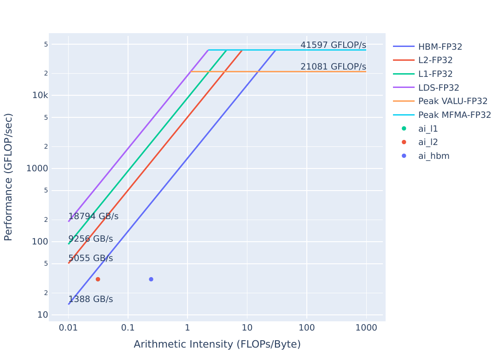
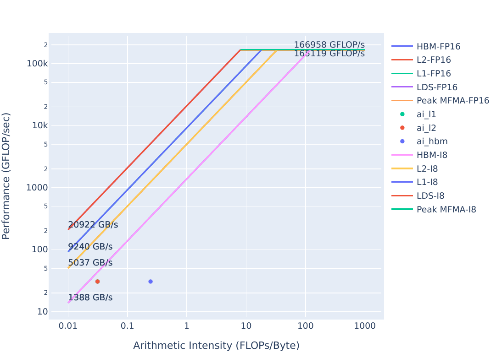

## Exercise 3: Register Occupancy Limiter

More complex yAx implementation to demonstrate a register limited kernel using an innocuous looking
function call. The register limit no longer shows up for recent versions of ROCm on certain accelerators.
Nevertheless, this exercise is useful for learning how to find register limited kernels using Omniperf and asks you to imagine the limiter exists for the sake of the exercise.
This is an example of how many things influence performance bugs: they exist on hardware, with a software stack, at a certain time. They may never exist outside that context.

**Note:** This exercise was tested on a system with MI210s, on Omniperf version `2.0.0` and ROCm `6.0.2`
**Omniperf versions `2.0.0` and greater are incompatible with ROCm versions lesser than `6.0.0`**

<details>
<summary><h3>Background: Acronyms and terms used in this exercise</h3></summary>
     <ul>
          <li><strong>VGPR:</strong> Vector General Purpose Register, holds distinct values for each thread in a wavefront</li>
          <li><strong>SGPR:</strong> Scalar General Purpose Register, holds a single value for all threads in a workgroup</li>
          <li><strong>AGPR:</strong> Accumulation vector General Purpose Register, used for Matrix Fused Multiply-Add (MFMA) instructions, or low-cost register spills</li>
          <li><strong>Wavefront:</strong> A collection of threads, usually 64.</li>
          <li><strong>Workgroup:</strong> A collection of Wavefronts (at least 1), which can be scheduled on a Compute Unit (CU)</li>
          <li><strong>LDS:</strong> Local Data Store is Shared Memory that is accessible to the entire workgroup on a Compute Unit (CU)</li>
          <li><strong>CU:</strong> The Compute Unit is responsible for executing the User's kernels</li>
          <li><strong>SPI:</strong> Shader Processor Input, also referred to as the Workgroup Manager, is responsible for scheduling workgroups on Compute Units</li>
          <li><strong>Occupancy:</strong> A measure of how many wavefronts are executing on the GPU on average through the duration of the kernel</li>
          <li><strong>PoP:</strong> Percent of Peak refers to the ratio of an achieved value and a theoretical or actual maximum. In terms of occupancy, it is how many wavefronts on average were on the device divided by how many can fit on the device.
          <li><strong>yAx:</strong> a vector-matrix-vector product, y*A*x, where y and x are vectors, and A is a matrix</li>
          <li><strong>FP(32/16):</strong> 32- or 16-bit Floating Point numeric types</li>
          <li><strong>FLOPs:</strong> Floating Point Operations Per second</li>
          <li><strong>HBM:</strong> High Bandwidth Memory is globally accessible from the GPU, and is a level of memory above the L2 cache</li>
     </ul>
</details>

### Initial Roofline Analysis
This kernel is slightly different from the one we used in previous exercises. Let's see how well it measures up in the roofline:

| Roofline Type | Roofline Legend                                    | Roofline Plot                                        |
|---------------|----------------------------------------------------|------------------------------------------------------|
|FP32/FP64      ||      |
|FP16/INT8      || |

You can generate these plots by running:
```
omniperf profile -n problem_roof_only --roof-only --kernel-names -- ./problem.exe
```
The plots will appear as PDF files in the `./workloads/problem_roof_only/MI200` directory, if generated on MI200 hardware.

We see that the kernel is still a considerable amount below the maximum achievable bandwidth, so there should still be room for improvement.

### Exercise Instructions:
Let's get an idea of the runtime of this code:

```
make
./problem.exe
```
(*simulated output*)
```
yAx time 71 ms
```
We see that this kernel seems to be on par with some of our other exercises, but let's see what omniperf shows us:

```
omniperf profile -n problem --no-roof -- ./problem.exe
```
(*lots of output from this command*)
```
omniperf analyze -p workloads/problem/MI200 --dispatch 1 --block 2.1.15 6.2.5 7.1.5 7.1.6 7.1.7
```
- `2.1.15` Shows Wavefront occupancy
- `6.2.5` Shows Insufficient SIMD VGPRs -- indicating if this kernel is occupancy limited by VGPR usage
- `7.1.5-7` Shows the register usage: VGPRs, SGPRs, and AGPRs
```
  ___                  _                  __
 / _ \ _ __ ___  _ __ (_)_ __   ___ _ __ / _|
| | | | '_ ` _ \| '_ \| | '_ \ / _ \ '__| |_
| |_| | | | | | | | | | | |_) |  __/ |  |  _|
 \___/|_| |_| |_|_| |_|_| .__/ \___|_|  |_|
                        |_|

Analysis mode = cli
[analysis] deriving Omniperf metrics...

--------------------------------------------------------------------------------
0. Top Stats
0.1 Top Kernels
╒════╤══════════════════════════════════════════╤═════════╤═════════════╤═════════════╤══════════════╤════════╕
│    │ Kernel_Name                              │   Count │     Sum(ns) │    Mean(ns) │   Median(ns) │    Pct │
╞════╪══════════════════════════════════════════╪═════════╪═════════════╪═════════════╪══════════════╪════════╡
│  0 │ yax(double*, double*, double*, int, int, │    1.00 │ 69960451.00 │ 69960451.00 │  69960451.00 │ 100.00 │
│    │  double*) [clone .kd]                    │         │             │             │              │        │
╘════╧══════════════════════════════════════════╧═════════╧═════════════╧═════════════╧══════════════╧════════╛
0.2 Dispatch List
╒════╤═══════════════╤═══════════════════════════════════════════════════════════════╤══════════╕
│    │   Dispatch_ID │ Kernel_Name                                                   │   GPU_ID │
╞════╪═══════════════╪═══════════════════════════════════════════════════════════════╪══════════╡
│  0 │             1 │ yax(double*, double*, double*, int, int, double*) [clone .kd] │        8 │
╘════╧═══════════════╧═══════════════════════════════════════════════════════════════╧══════════╛


--------------------------------------------------------------------------------
2. System Speed-of-Light
2.1 Speed-of-Light
╒═════════════╤═════════════════════╤════════╤════════════╤═════════╤═══════════════╕
│ Metric_ID   │ Metric              │    Avg │ Unit       │    Peak │   Pct of Peak │
╞═════════════╪═════════════════════╪════════╪════════════╪═════════╪═══════════════╡
│ 2.1.15      │ Wavefront Occupancy │ 448.11 │ Wavefronts │ 3328.00 │         13.46 │
╘═════════════╧═════════════════════╧════════╧════════════╧═════════╧═══════════════╛


--------------------------------------------------------------------------------
6. Workgroup Manager (SPI)
6.2 Workgroup Manager - Resource Allocation
╒═════════════╤═════════════════════════╤═══════╤═══════╤═══════╤════════╕
│ Metric_ID   │ Metric                  │   Avg │   Min │   Max │ Unit   │
╞═════════════╪═════════════════════════╪═══════╪═══════╪═══════╪════════╡
│ 6.2.5       │ Insufficient SIMD VGPRs │  0.00 │  0.00 │  0.00 │ Pct    │
╘═════════════╧═════════════════════════╧═══════╧═══════╧═══════╧════════╛


--------------------------------------------------------------------------------
7. Wavefront
7.1 Wavefront Launch Stats
╒═════════════╤══════════╤═══════╤═══════╤═══════╤═══════════╕
│ Metric_ID   │ Metric   │   Avg │   Min │   Max │ Unit      │
╞═════════════╪══════════╪═══════╪═══════╪═══════╪═══════════╡
│ 7.1.5       │ VGPRs    │ 32.00 │ 32.00 │ 32.00 │ Registers │
├─────────────┼──────────┼───────┼───────┼───────┼───────────┤
│ 7.1.6       │ AGPRs    │  0.00 │  0.00 │  0.00 │ Registers │
├─────────────┼──────────┼───────┼───────┼───────┼───────────┤
│ 7.1.7       │ SGPRs    │ 96.00 │ 96.00 │ 96.00 │ Registers │
╘═════════════╧══════════╧═══════╧═══════╧═══════╧═══════════╛

```
Looking at this data, we see:
- Insufficient SIMD VGPRs (`6.2.5`) shows that we are not occupancy limited by VGPRs (this example used to be register limited for earlier versions of ROCm)
- VGPRs (`7.1.5`) shows we are using a moderate amount of VGPRs and AGPRs (`7.1.6`) shows we are using no AGPRs, which can indicate low-cost register spills in the absence of MFMA instructions.

In previous versions of ROCm, the limiter was due to a call to `assert` that checks if our result is zeroed out on device.
To make sure the problem is gone in this newer ROCm, let's look at the solution code:

```
cd solution
make
./solution.exe
```
(*simulated output*)
```
yAx time: 70 ms
```

Our runtime seems fairly similar with or without the `assert`, but we should also check that omniperf reports that our limiters remain gone:

```
omniperf profile -n solution --no-roof -- ./solution.exe
```
(*omitted output*)
```
omniperf analyze -p workloads/solution/MI200 --dispatch 1 --metric 2.1.15 6.2.5 7.1.5 7.1.6 7.1.7
```
The output of this command should look something like:

```
  ___                  _                  __
 / _ \ _ __ ___  _ __ (_)_ __   ___ _ __ / _|
| | | | '_ ` _ \| '_ \| | '_ \ / _ \ '__| |_
| |_| | | | | | | | | | | |_) |  __/ |  |  _|
 \___/|_| |_| |_|_| |_|_| .__/ \___|_|  |_|
                        |_|

Analysis mode = cli
[analysis] deriving Omniperf metrics...

--------------------------------------------------------------------------------
0. Top Stats
0.1 Top Kernels
╒════╤══════════════════════════════════════════╤═════════╤═════════════╤═════════════╤══════════════╤════════╕
│    │ Kernel_Name                              │   Count │     Sum(ns) │    Mean(ns) │   Median(ns) │    Pct │
╞════╪══════════════════════════════════════════╪═════════╪═════════════╪═════════════╪══════════════╪════════╡
│  0 │ yax(double*, double*, double*, int, int, │    1.00 │ 69955651.00 │ 69955651.00 │  69955651.00 │ 100.00 │
│    │  double*) [clone .kd]                    │         │             │             │              │        │
╘════╧══════════════════════════════════════════╧═════════╧═════════════╧═════════════╧══════════════╧════════╛
0.2 Dispatch List
╒════╤═══════════════╤═══════════════════════════════════════════════════════════════╤══════════╕
│    │   Dispatch_ID │ Kernel_Name                                                   │   GPU_ID │
╞════╪═══════════════╪═══════════════════════════════════════════════════════════════╪══════════╡
│  0 │             1 │ yax(double*, double*, double*, int, int, double*) [clone .kd] │        8 │
╘════╧═══════════════╧═══════════════════════════════════════════════════════════════╧══════════╛


--------------------------------------------------------------------------------
2. System Speed-of-Light
2.1 Speed-of-Light
╒═════════════╤═════════════════════╤════════╤════════════╤═════════╤═══════════════╕
│ Metric_ID   │ Metric              │    Avg │ Unit       │    Peak │   Pct of Peak │
╞═════════════╪═════════════════════╪════════╪════════════╪═════════╪═══════════════╡
│ 2.1.15      │ Wavefront Occupancy │ 437.49 │ Wavefronts │ 3328.00 │         13.15 │
╘═════════════╧═════════════════════╧════════╧════════════╧═════════╧═══════════════╛


--------------------------------------------------------------------------------
6. Workgroup Manager (SPI)
6.2 Workgroup Manager - Resource Allocation
╒═════════════╤═════════════════════════╤═══════╤═══════╤═══════╤════════╕
│ Metric_ID   │ Metric                  │   Avg │   Min │   Max │ Unit   │
╞═════════════╪═════════════════════════╪═══════╪═══════╪═══════╪════════╡
│ 6.2.5       │ Insufficient SIMD VGPRs │  0.00 │  0.00 │  0.00 │ Pct    │
╘═════════════╧═════════════════════════╧═══════╧═══════╧═══════╧════════╛


--------------------------------------------------------------------------------
7. Wavefront
7.1 Wavefront Launch Stats
╒═════════════╤══════════╤═══════╤═══════╤═══════╤═══════════╕
│ Metric_ID   │ Metric   │   Avg │   Min │   Max │ Unit      │
╞═════════════╪══════════╪═══════╪═══════╪═══════╪═══════════╡
│ 7.1.5       │ VGPRs    │ 32.00 │ 32.00 │ 32.00 │ Registers │
├─────────────┼──────────┼───────┼───────┼───────┼───────────┤
│ 7.1.6       │ AGPRs    │  0.00 │  0.00 │  0.00 │ Registers │
├─────────────┼──────────┼───────┼───────┼───────┼───────────┤
│ 7.1.7       │ SGPRs    │ 96.00 │ 96.00 │ 96.00 │ Registers │
╘═════════════╧══════════╧═══════╧═══════╧═══════╧═══════════╛

```
Looking at this data, we see:
- Insufficient SIMD VGPRs (`6.2.5`) shows we are still not occupancy limited by VGPR usage.
- VGPRs (`7.1.5`), AGPRs (`7.1.6`), and SGPRs (`7.1.7`) show exactly the same register usage.
- Wave Occupancy (`2.1.26`) shows our occupancy is also more or less the same.

More generally, you can use this command to look at all SPI "insufficient resource" stats in the same screen, to determine if any resource is currently limiting occupancy.
In fact, we can use this to ensure our problem implementation no longer has any SPI-related occupancy limiters with the newer version of ROCm:
```
omniperf analyze -p workloads/problem/MI200 --dispatch 1 --metric 6.2
```
Which will show output similar to this (note, fields `6.2.4` to `6.2.8` show resources which currently limit occupancy):
```

  ___                  _                  __
 / _ \ _ __ ___  _ __ (_)_ __   ___ _ __ / _|
| | | | '_ ` _ \| '_ \| | '_ \ / _ \ '__| |_
| |_| | | | | | | | | | | |_) |  __/ |  |  _|
 \___/|_| |_| |_|_| |_|_| .__/ \___|_|  |_|
                        |_|

Analysis mode = cli
[analysis] deriving Omniperf metrics...

--------------------------------------------------------------------------------
0. Top Stats
0.1 Top Kernels
╒════╤══════════════════════════════════════════╤═════════╤═════════════╤═════════════╤══════════════╤════════╕
│    │ Kernel_Name                              │   Count │     Sum(ns) │    Mean(ns) │   Median(ns) │    Pct │
╞════╪══════════════════════════════════════════╪═════════╪═════════════╪═════════════╪══════════════╪════════╡
│  0 │ yax(double*, double*, double*, int, int, │    1.00 │ 69960451.00 │ 69960451.00 │  69960451.00 │ 100.00 │
│    │  double*) [clone .kd]                    │         │             │             │              │        │
╘════╧══════════════════════════════════════════╧═════════╧═════════════╧═════════════╧══════════════╧════════╛
0.2 Dispatch List
╒════╤═══════════════╤═══════════════════════════════════════════════════════════════╤══════════╕
│    │   Dispatch_ID │ Kernel_Name                                                   │   GPU_ID │
╞════╪═══════════════╪═══════════════════════════════════════════════════════════════╪══════════╡
│  0 │             1 │ yax(double*, double*, double*, int, int, double*) [clone .kd] │        8 │
╘════╧═══════════════╧═══════════════════════════════════════════════════════════════╧══════════╛


--------------------------------------------------------------------------------
6. Workgroup Manager (SPI)
6.2 Workgroup Manager - Resource Allocation
╒═════════════╤════════════════════════════════════════╤═══════╤═══════╤═══════╤════════╕
│ Metric_ID   │ Metric                                 │   Avg │   Min │   Max │ Unit   │
╞═════════════╪════════════════════════════════════════╪═══════╪═══════╪═══════╪════════╡
│ 6.2.0       │ Not-scheduled Rate (Workgroup Manager) │  0.00 │  0.00 │  0.00 │ Pct    │
├─────────────┼────────────────────────────────────────┼───────┼───────┼───────┼────────┤
│ 6.2.1       │ Not-scheduled Rate (Scheduler-Pipe)    │  0.00 │  0.00 │  0.00 │ Pct    │
├─────────────┼────────────────────────────────────────┼───────┼───────┼───────┼────────┤
│ 6.2.2       │ Scheduler-Pipe Stall Rate              │  0.00 │  0.00 │  0.00 │ Pct    │
├─────────────┼────────────────────────────────────────┼───────┼───────┼───────┼────────┤
│ 6.2.3       │ Scratch Stall Rate                     │  0.00 │  0.00 │  0.00 │ Pct    │
├─────────────┼────────────────────────────────────────┼───────┼───────┼───────┼────────┤
│ 6.2.4       │ Insufficient SIMD Waveslots            │  0.00 │  0.00 │  0.00 │ Pct    │
├─────────────┼────────────────────────────────────────┼───────┼───────┼───────┼────────┤
│ 6.2.5       │ Insufficient SIMD VGPRs                │  0.00 │  0.00 │  0.00 │ Pct    │
├─────────────┼────────────────────────────────────────┼───────┼───────┼───────┼────────┤
│ 6.2.6       │ Insufficient SIMD SGPRs                │  0.00 │  0.00 │  0.00 │ Pct    │
├─────────────┼────────────────────────────────────────┼───────┼───────┼───────┼────────┤
│ 6.2.7       │ Insufficient CU LDS                    │  0.00 │  0.00 │  0.00 │ Pct    │
├─────────────┼────────────────────────────────────────┼───────┼───────┼───────┼────────┤
│ 6.2.8       │ Insufficient CU Barriers               │  0.00 │  0.00 │  0.00 │ Pct    │
├─────────────┼────────────────────────────────────────┼───────┼───────┼───────┼────────┤
│ 6.2.9       │ Reached CU Workgroup Limit             │  0.00 │  0.00 │  0.00 │ Pct    │
├─────────────┼────────────────────────────────────────┼───────┼───────┼───────┼────────┤
│ 6.2.10      │ Reached CU Wavefront Limit             │  0.00 │  0.00 │  0.00 │ Pct    │
╘═════════════╧════════════════════════════════════════╧═══════╧═══════╧═══════╧════════╛
```

### Solution Roofline
With similar performance, we expect to see similar plots in the roofline for problem and solution:

| Roofline Type | Roofline Legend                                    | Roofline Plot                                        |
|---------------|----------------------------------------------------|------------------------------------------------------|
|FP32/FP64      |||
|FP16/INT8      |||


You can generate these plots with:

```
omniperf profile -n problem_roof_only --roof-only --kernel-names -- ./problem.exe
```
The plots will appear as PDF files in the `./workloads/problem_roof_only/MI200` directory, if generated on MI200 hardware.

The plots are indistinguishable, which is further confirmation performance is now unchanged between problem and solution.
However, we see there is still room for improvement as this kernel is not getting the maximum achievable bandwidth.

### Roofline Comparison

| Roofline Type | Problem Roofline                                     | Solution Roofline                                      |
|---------------|------------------------------------------------------|--------------------------------------------------------|
| FP32/FP64     | |  |
| FP16/INT8     | |  |

### Summary and Take-aways

Function calls inside kernels can have surprisingly adverse performance side-effects. However, performance issues in general may be subject to compiler versions or other environment details. 
Calling assert, printf and even excessive use of math functions (e.g. pow, sin, cos) can limit performance in difficult-to-predict ways. 
If you see unexpected resource usage, try eliminating or reducing the use of these sorts of function calls.
