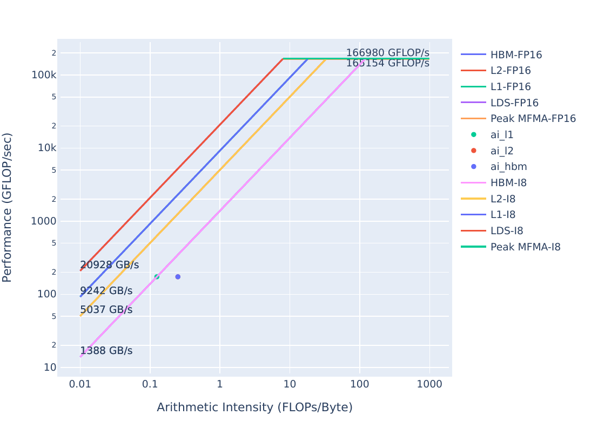

## Exercise 5: Algorithmic Optimizations

A simple yAx kernel, and more efficient, but more complex yAx kernel to demonstrate algorithmic improvements.

**Note:** This exercise was tested on a system with MI210s, on omniperf version `2.0.0` and ROCm `6.0.2`
**Omniperf `2.0.0` is incompatible with ROCm versions lesser than `6.0.0`**

<details>
<summary><h3>Background: Acronyms and terms used in this exercise</h3></summary>
     <ul>
          <li><strong>L1:</strong> Level 1 Cache, the first level cache local to the Compute Unit (CU). If requested data is not found in the L1, the request goes to the L2</li>
          <li><strong>L2:</strong> Level 2 Cache, the second level cache, which is shared by all Compute Units (CUs) on a GPU. If requested data is not found in the L2, the request goes to HBM</li>
          <li><strong>HBM:</strong> High Bandwidth Memory is globally accessible from the GPU, and is a level of memory above the L2 cache</li>
          <li><strong>CU:</strong> The Compute Unit is responsible for executing the User's kernels </li> 
          <li><strong>yAx:</strong> a vector-matrix-vector product, y*A*x, where y and x are vectors, and A is a matrix</li>
          <li><strong>FP(32/16):</strong> 32- or 16-bit Floating Point numeric types</li>
     </ul>
</details>

<details>
<summary><h3>Background: yAx Algorithmic Improvement Explanation</h3></summary>
 Our approach up to this point could be described as having each thread sum up a row, as illustrated below:
 
 However, this is not efficient in the way the parallelism is expressed. Namely, we could add up all the partial sums for each row in parallel.
 This would make our approach to be: give a rows to wavefronts, and have the threads inside each wavefront sum up partial sums in parallel.
 Then, we reduce the partial sums atomically with shared memory, before completing the computation and reducing the final answer using global atomics.
 This approach expresses more of the parallelism that is available, and would look something like the figure below:
 
 The expressed parallelism in each approach roughly corresponds to the number of red arrows in each figure.
</details>

### Initial Roofline Analysis
We should start by doing a roofline to see where the problem executable stands.
These plots can be generated with:

```
omniperf profile -n problem_roof_only --roof-only --kernel-names -- ./problem.exe
```
The plots will appear as PDF files in the `./workloads/problem_roof_only/MI200` directory, if generated on MI200 hardware.

They are also provided below for easy reference:

| Roofline Type | Roofline Legend                                    | Roofline Plot                                        |
|---------------|----------------------------------------------------|------------------------------------------------------|
|FP32/FP64      ||      |
|FP16/INT8      || |

The performance of this kernel looks pretty close to being HBM bandwidth bound.
In the case of algorithmic optimizations, there may not be obvious evidence other than a suspicion that poor 
usage of hardware resources may be improved by changing the overall approach. 
In this case, we should be able to make better usage of both L1 and L2 resources by using wavefronts more efficiently 
to better parallelize our computation.

### Exercise Instructions:

To start, let's profile `problem.exe`:

```
make
./problem.exe
```
(*simulated output*)
```
yAx time 12 ms
```

This should be in line with our last solution. From the last exercise, we saw this output from `omniperf analyze` for this kernel:

```
  ___                  _                  __
 / _ \ _ __ ___  _ __ (_)_ __   ___ _ __ / _|
| | | | '_ ` _ \| '_ \| | '_ \ / _ \ '__| |_
| |_| | | | | | | | | | | |_) |  __/ |  |  _|
 \___/|_| |_| |_|_| |_|_| .__/ \___|_|  |_|
                        |_|

Analysis mode = cli
[analysis] deriving Omniperf metrics...

--------------------------------------------------------------------------------
0. Top Stats
0.1 Top Kernels
╒════╤══════════════════════════════════════════╤═════════╤═════════════╤═════════════╤══════════════╤════════╕
│    │ Kernel_Name                              │   Count │     Sum(ns) │    Mean(ns) │   Median(ns) │    Pct │
╞════╪══════════════════════════════════════════╪═════════╪═════════════╪═════════════╪══════════════╪════════╡
│  0 │ yax(double*, double*, double*, int, int, │    1.00 │ 12364156.00 │ 12364156.00 │  12364156.00 │ 100.00 │
│    │  double*) [clone .kd]                    │         │             │             │              │        │
╘════╧══════════════════════════════════════════╧═════════╧═════════════╧═════════════╧══════════════╧════════╛
0.2 Dispatch List
╒════╤═══════════════╤═══════════════════════════════════════════════════════════════╤══════════╕
│    │   Dispatch_ID │ Kernel_Name                                                   │   GPU_ID │
╞════╪═══════════════╪═══════════════════════════════════════════════════════════════╪══════════╡
│  0 │             1 │ yax(double*, double*, double*, int, int, double*) [clone .kd] │        8 │
╘════╧═══════════════╧═══════════════════════════════════════════════════════════════╧══════════╛


--------------------------------------------------------------------------------
16. Vector L1 Data Cache
16.1 Speed-of-Light
╒═════════════╤═════════════╤═══════╤═════════════╕
│ Metric_ID   │ Metric      │   Avg │ Unit        │
╞═════════════╪═════════════╪═══════╪═════════════╡
│ 16.1.0      │ Hit rate    │ 49.98 │ Pct of peak │
├─────────────┼─────────────┼───────┼─────────────┤
│ 16.1.1      │ Bandwidth   │ 12.29 │ Pct of peak │
├─────────────┼─────────────┼───────┼─────────────┤
│ 16.1.2      │ Utilization │ 98.12 │ Pct of peak │
├─────────────┼─────────────┼───────┼─────────────┤
│ 16.1.3      │ Coalescing  │ 25.00 │ Pct of peak │
╘═════════════╧═════════════╧═══════╧═════════════╛


--------------------------------------------------------------------------------
17. L2 Cache
17.1 Speed-of-Light
╒═════════════╤═══════════════════════════════╤════════╤════════╕
│ Metric_ID   │ Metric                        │    Avg │ Unit   │
╞═════════════╪═══════════════════════════════╪════════╪════════╡
│ 17.1.0      │ Utilization                   │  98.56 │ Pct    │
├─────────────┼───────────────────────────────┼────────┼────────┤
│ 17.1.1      │ Bandwidth                     │  10.03 │ Pct    │
├─────────────┼───────────────────────────────┼────────┼────────┤
│ 17.1.2      │ Hit Rate                      │   0.52 │ Pct    │
├─────────────┼───────────────────────────────┼────────┼────────┤
│ 17.1.3      │ L2-Fabric Read BW             │ 694.86 │ Gb/s   │
├─────────────┼───────────────────────────────┼────────┼────────┤
│ 17.1.4      │ L2-Fabric Write and Atomic BW │   0.00 │ Gb/s   │
╘═════════════╧═══════════════════════════════╧════════╧════════╛

```
Looking at this data again, we see:
- L1 Cache Hit (`16.1.0`) is about 50%, which is fairly low for a "well performing" kernel.
- L2 Cache Hit (`17.1.2`) is about 0%, which is very low to consider this kernel "well performing".

Let's run the profiling again, but dig more into detailed L1 and L2 stats 
to see if we can make better use of the L1 and L2:

```
omniperf profile -n problem --no-roof -- ./problem.exe
```
(*output omitted*)
```
omniperf analyze -p workloads/problem/MI200 --dispatch 1 --block 16.3 16.4 17.3 17.2
```
The metrics we request are:
- `16.3` Detailed L1 cache access stats
- `16.4` Detailed L1-L2 transaction stats
- `17.3` Detailed L2 access stats
- `17.2` Detailed L2-Fabric transaction stats

The output from the `analyze` command should look something like:

```
  ___                  _                  __
 / _ \ _ __ ___  _ __ (_)_ __   ___ _ __ / _|
| | | | '_ ` _ \| '_ \| | '_ \ / _ \ '__| |_
| |_| | | | | | | | | | | |_) |  __/ |  |  _|
 \___/|_| |_| |_|_| |_|_| .__/ \___|_|  |_|
                        |_|

Analysis mode = cli
[analysis] deriving Omniperf metrics...

--------------------------------------------------------------------------------
0. Top Stats
0.1 Top Kernels
╒════╤══════════════════════════════════════════╤═════════╤═════════════╤═════════════╤══════════════╤════════╕
│    │ Kernel_Name                              │   Count │     Sum(ns) │    Mean(ns) │   Median(ns) │    Pct │
╞════╪══════════════════════════════════════════╪═════════╪═════════════╪═════════════╪══════════════╪════════╡
│  0 │ yax(double*, double*, double*, int, int, │    1.00 │ 12280317.00 │ 12280317.00 │  12280317.00 │ 100.00 │
│    │  double*) [clone .kd]                    │         │             │             │              │        │
╘════╧══════════════════════════════════════════╧═════════╧═════════════╧═════════════╧══════════════╧════════╛
0.2 Dispatch List
╒════╤═══════════════╤═══════════════════════════════════════════════════════════════╤══════════╕
│    │   Dispatch_ID │ Kernel_Name                                                   │   GPU_ID │
╞════╪═══════════════╪═══════════════════════════════════════════════════════════════╪══════════╡
│  0 │             1 │ yax(double*, double*, double*, int, int, double*) [clone .kd] │        8 │
╘════╧═══════════════╧═══════════════════════════════════════════════════════════════╧══════════╛


--------------------------------------------------------------------------------
16. Vector L1 Data Cache
16.3 L1D Cache Accesses
╒═════════════╤═════════════════════╤════════════╤════════════╤════════════╤════════════════╕
│ Metric_ID   │ Metric              │        Avg │        Min │        Max │ Unit           │
╞═════════════╪═════════════════════╪════════════╪════════════╪════════════╪════════════════╡
│ 16.3.0      │ Total Req           │  524368.00 │  524368.00 │  524368.00 │ Req per wave   │
├─────────────┼─────────────────────┼────────────┼────────────┼────────────┼────────────────┤
│ 16.3.1      │ Read Req            │  524304.00 │  524304.00 │  524304.00 │ Req per wave   │
├─────────────┼─────────────────────┼────────────┼────────────┼────────────┼────────────────┤
│ 16.3.2      │ Write Req           │       0.00 │       0.00 │       0.00 │ Req per wave   │
├─────────────┼─────────────────────┼────────────┼────────────┼────────────┼────────────────┤
│ 16.3.3      │ Atomic Req          │      64.00 │      64.00 │      64.00 │ Req per wave   │
├─────────────┼─────────────────────┼────────────┼────────────┼────────────┼────────────────┤
│ 16.3.4      │ Cache BW            │ 8392960.00 │ 8392960.00 │ 8392960.00 │ Bytes per wave │
├─────────────┼─────────────────────┼────────────┼────────────┼────────────┼────────────────┤
│ 16.3.5      │ Cache Hit Rate      │      49.98 │      49.98 │      49.98 │ Pct            │
├─────────────┼─────────────────────┼────────────┼────────────┼────────────┼────────────────┤
│ 16.3.6      │ Cache Accesses      │  131140.00 │  131140.00 │  131140.00 │ Req per wave   │
├─────────────┼─────────────────────┼────────────┼────────────┼────────────┼────────────────┤
│ 16.3.7      │ Cache Hits          │   65538.00 │   65538.00 │   65538.00 │ Req per wave   │
├─────────────┼─────────────────────┼────────────┼────────────┼────────────┼────────────────┤
│ 16.3.8      │ Invalidations       │       0.00 │       0.00 │       0.00 │ Req per wave   │
├─────────────┼─────────────────────┼────────────┼────────────┼────────────┼────────────────┤
│ 16.3.9      │ L1-L2 BW            │ 4198528.00 │ 4198528.00 │ 4198528.00 │ Bytes per wave │
├─────────────┼─────────────────────┼────────────┼────────────┼────────────┼────────────────┤
│ 16.3.10     │ L1-L2 Read          │   65538.00 │   65538.00 │   65538.00 │ Req per wave   │
├─────────────┼─────────────────────┼────────────┼────────────┼────────────┼────────────────┤
│ 16.3.11     │ L1-L2 Write         │       0.00 │       0.00 │       0.00 │ Req per wave   │
├─────────────┼─────────────────────┼────────────┼────────────┼────────────┼────────────────┤
│ 16.3.12     │ L1-L2 Atomic        │      64.00 │      64.00 │      64.00 │ Req per wave   │
├─────────────┼─────────────────────┼────────────┼────────────┼────────────┼────────────────┤
│ 16.3.13     │ L1 Access Latency   │     480.17 │     480.17 │     480.17 │ Cycles         │
├─────────────┼─────────────────────┼────────────┼────────────┼────────────┼────────────────┤
│ 16.3.14     │ L1-L2 Read Latency  │     399.91 │     399.91 │     399.91 │ Cycles         │
├─────────────┼─────────────────────┼────────────┼────────────┼────────────┼────────────────┤
│ 16.3.15     │ L1-L2 Write Latency │    5756.61 │    5756.61 │    5756.61 │ Cycles         │
╘═════════════╧═════════════════════╧════════════╧════════════╧════════════╧════════════════╛
16.4 L1D - L2 Transactions
╒═════════════╤═════════════╤════════╤═════════════╤══════════╤══════════╤══════════╤══════════════╕
│ Metric_ID   │ Metric      │ Xfer   │ Coherency   │      Avg │      Min │      Max │ Unit         │
╞═════════════╪═════════════╪════════╪═════════════╪══════════╪══════════╪══════════╪══════════════╡
│ 16.4.0      │ NC - Read   │ Read   │ NC          │     0.00 │     0.00 │     0.00 │ Req per wave │
├─────────────┼─────────────┼────────┼─────────────┼──────────┼──────────┼──────────┼──────────────┤
│ 16.4.1      │ UC - Read   │ Read   │ UC          │     0.00 │     0.00 │     0.00 │ Req per wave │
├─────────────┼─────────────┼────────┼─────────────┼──────────┼──────────┼──────────┼──────────────┤
│ 16.4.2      │ CC - Read   │ Read   │ CC          │     0.00 │     0.00 │     0.00 │ Req per wave │
├─────────────┼─────────────┼────────┼─────────────┼──────────┼──────────┼──────────┼──────────────┤
│ 16.4.3      │ RW - Read   │ Read   │ RW          │ 65538.00 │ 65538.00 │ 65538.00 │ Req per wave │
├─────────────┼─────────────┼────────┼─────────────┼──────────┼──────────┼──────────┼──────────────┤
│ 16.4.4      │ RW - Write  │ Write  │ RW          │     0.00 │     0.00 │     0.00 │ Req per wave │
├─────────────┼─────────────┼────────┼─────────────┼──────────┼──────────┼──────────┼──────────────┤
│ 16.4.5      │ NC - Write  │ Write  │ NC          │     0.00 │     0.00 │     0.00 │ Req per wave │
├─────────────┼─────────────┼────────┼─────────────┼──────────┼──────────┼──────────┼──────────────┤
│ 16.4.6      │ UC - Write  │ Write  │ UC          │     0.00 │     0.00 │     0.00 │ Req per wave │
├─────────────┼─────────────┼────────┼─────────────┼──────────┼──────────┼──────────┼──────────────┤
│ 16.4.7      │ CC - Write  │ Write  │ CC          │     0.00 │     0.00 │     0.00 │ Req per wave │
├─────────────┼─────────────┼────────┼─────────────┼──────────┼──────────┼──────────┼──────────────┤
│ 16.4.8      │ NC - Atomic │ Atomic │ NC          │     0.00 │     0.00 │     0.00 │ Req per wave │
├─────────────┼─────────────┼────────┼─────────────┼──────────┼──────────┼──────────┼──────────────┤
│ 16.4.9      │ UC - Atomic │ Atomic │ UC          │     0.00 │     0.00 │     0.00 │ Req per wave │
├─────────────┼─────────────┼────────┼─────────────┼──────────┼──────────┼──────────┼──────────────┤
│ 16.4.10     │ CC - Atomic │ Atomic │ CC          │     0.00 │     0.00 │     0.00 │ Req per wave │
├─────────────┼─────────────┼────────┼─────────────┼──────────┼──────────┼──────────┼──────────────┤
│ 16.4.11     │ RW - Atomic │ Atomic │ RW          │    64.00 │    64.00 │    64.00 │ Req per wave │
╘═════════════╧═════════════╧════════╧═════════════╧══════════╧══════════╧══════════╧══════════════╛

--------------------------------------------------------------------------------
17. L2 Cache
17.2 L2 - Fabric Transactions
╒═════════════╤═══════════════════════════════════╤════════════╤════════════╤════════════╤════════════════╕
│ Metric_ID   │ Metric                            │ Avg        │ Min        │ Max        │ Unit           │
╞═════════════╪═══════════════════════════════════╪════════════╪════════════╪════════════╪════════════════╡
│ 17.2.0      │ Read BW                           │ 4195095.38 │ 4195095.38 │ 4195095.38 │ Bytes per wave │
├─────────────┼───────────────────────────────────┼────────────┼────────────┼────────────┼────────────────┤
│ 17.2.1      │ HBM Read Traffic                  │ 100.0      │ 100.0      │ 100.0      │ Pct            │
├─────────────┼───────────────────────────────────┼────────────┼────────────┼────────────┼────────────────┤
│ 17.2.2      │ Remote Read Traffic               │ -0.0       │ -0.0       │ -0.0       │ Pct            │
├─────────────┼───────────────────────────────────┼────────────┼────────────┼────────────┼────────────────┤
│ 17.2.3      │ Uncached Read Traffic             │ 0.0        │ 0.0        │ 0.0        │ Pct            │
├─────────────┼───────────────────────────────────┼────────────┼────────────┼────────────┼────────────────┤
│ 17.2.4      │ Write and Atomic BW               │ 0.11       │ 0.11       │ 0.11       │ Bytes per wave │
├─────────────┼───────────────────────────────────┼────────────┼────────────┼────────────┼────────────────┤
│ 17.2.5      │ HBM Write and Atomic Traffic      │ 100.0      │ 100.0      │ 100.0      │ Pct            │
├─────────────┼───────────────────────────────────┼────────────┼────────────┼────────────┼────────────────┤
│ 17.2.6      │ Remote Write and Atomic Traffic   │ 0.0        │ 0.0        │ 0.0        │ Pct            │
├─────────────┼───────────────────────────────────┼────────────┼────────────┼────────────┼────────────────┤
│ 17.2.7      │ Atomic Traffic                    │ 0.0        │ 0.0        │ 0.0        │ Pct            │
├─────────────┼───────────────────────────────────┼────────────┼────────────┼────────────┼────────────────┤
│ 17.2.8      │ Uncached Write and Atomic Traffic │ 0.0        │ 0.0        │ 0.0        │ Pct            │
├─────────────┼───────────────────────────────────┼────────────┼────────────┼────────────┼────────────────┤
│ 17.2.9      │ Read Latency                      │ 276.09     │ 276.09     │ 276.09     │ Cycles         │
├─────────────┼───────────────────────────────────┼────────────┼────────────┼────────────┼────────────────┤
│ 17.2.10     │ Write and Atomic Latency          │ 914.43     │ 914.43     │ 914.43     │ Cycles         │
├─────────────┼───────────────────────────────────┼────────────┼────────────┼────────────┼────────────────┤
│ 17.2.11     │ Atomic Latency                    │            │            │            │ Cycles         │
├─────────────┼───────────────────────────────────┼────────────┼────────────┼────────────┼────────────────┤
│ 17.2.12     │ Read Stall                        │            │            │            │ Pct            │
├─────────────┼───────────────────────────────────┼────────────┼────────────┼────────────┼────────────────┤
│ 17.2.13     │ Write Stall                       │            │            │            │ Pct            │
╘═════════════╧═══════════════════════════════════╧════════════╧════════════╧════════════╧════════════════╛
17.3 L2 Cache Accesses
╒═════════════╤══════════════════════╤════════════╤════════════╤════════════╤═════════════════════╕
│ Metric_ID   │ Metric               │        Avg │        Min │        Max │ Unit                │
╞═════════════╪══════════════════════╪════════════╪════════════╪════════════╪═════════════════════╡
│ 17.3.0      │ Bandwidth            │ 4217003.50 │ 4217003.50 │ 4217003.50 │ Bytes per wave      │
├─────────────┼──────────────────────┼────────────┼────────────┼────────────┼─────────────────────┤
│ 17.3.1      │ Req                  │   32945.34 │   32945.34 │   32945.34 │ Req per wave        │
├─────────────┼──────────────────────┼────────────┼────────────┼────────────┼─────────────────────┤
│ 17.3.2      │ Read Req             │   32881.34 │   32881.34 │   32881.34 │ Req per wave        │
├─────────────┼──────────────────────┼────────────┼────────────┼────────────┼─────────────────────┤
│ 17.3.3      │ Write Req            │       0.00 │       0.00 │       0.00 │ Req per wave        │
├─────────────┼──────────────────────┼────────────┼────────────┼────────────┼─────────────────────┤
│ 17.3.4      │ Atomic Req           │      64.00 │      64.00 │      64.00 │ Req per wave        │
├─────────────┼──────────────────────┼────────────┼────────────┼────────────┼─────────────────────┤
│ 17.3.5      │ Streaming Req        │       0.00 │       0.00 │       0.00 │ Req per wave        │
├─────────────┼──────────────────────┼────────────┼────────────┼────────────┼─────────────────────┤
│ 17.3.6      │ Probe Req            │       0.00 │       0.00 │       0.00 │ Req per wave        │
├─────────────┼──────────────────────┼────────────┼────────────┼────────────┼─────────────────────┤
│ 17.3.7      │ Cache Hit            │       0.52 │       0.52 │       0.52 │ Pct                 │
├─────────────┼──────────────────────┼────────────┼────────────┼────────────┼─────────────────────┤
│ 17.3.8      │ Hits                 │     171.22 │     171.22 │     171.22 │ Hits per wave       │
├─────────────┼──────────────────────┼────────────┼────────────┼────────────┼─────────────────────┤
│ 17.3.9      │ Misses               │   32774.12 │   32774.12 │   32774.12 │ Misses per wave     │
├─────────────┼──────────────────────┼────────────┼────────────┼────────────┼─────────────────────┤
│ 17.3.10     │ Writeback            │       0.02 │       0.02 │       0.02 │ Cachelines per wave │
├─────────────┼──────────────────────┼────────────┼────────────┼────────────┼─────────────────────┤
│ 17.3.11     │ Writeback (Internal) │       0.00 │       0.00 │       0.00 │ Cachelines per wave │
├─────────────┼──────────────────────┼────────────┼────────────┼────────────┼─────────────────────┤
│ 17.3.12     │ Writeback (vL1D Req) │       0.00 │       0.00 │       0.00 │ Cachelines per wave │
├─────────────┼──────────────────────┼────────────┼────────────┼────────────┼─────────────────────┤
│ 17.3.13     │ Evict (Internal)     │   32741.55 │   32741.55 │   32741.55 │ Cachelines per wave │
├─────────────┼──────────────────────┼────────────┼────────────┼────────────┼─────────────────────┤
│ 17.3.14     │ Evict (vL1D Req)     │       0.00 │       0.00 │       0.00 │ Cachelines per wave │
├─────────────┼──────────────────────┼────────────┼────────────┼────────────┼─────────────────────┤
│ 17.3.15     │ NC Req               │       0.05 │       0.05 │       0.05 │ Req per wave        │
├─────────────┼──────────────────────┼────────────┼────────────┼────────────┼─────────────────────┤
│ 17.3.16     │ UC Req               │       0.27 │       0.27 │       0.27 │ Req per wave        │
├─────────────┼──────────────────────┼────────────┼────────────┼────────────┼─────────────────────┤
│ 17.3.17     │ CC Req               │       0.00 │       0.00 │       0.00 │ Req per wave        │
├─────────────┼──────────────────────┼────────────┼────────────┼────────────┼─────────────────────┤
│ 17.3.18     │ RW Req               │   32945.00 │   32945.00 │   32945.00 │ Req per wave        │
╘═════════════╧══════════════════════╧════════════╧════════════╧════════════╧═════════════════════╛

```

Profiling information of this level of detail is available, and it can be useful once it is determined that the high-level speed-of-light statistics
indicate there may be a performance issue in the code that hits a specific hardware subsystem.

Looking at the L1 stats, we see:
- L1 Total Req (`16.3.0`) and L1 Read Req (`16.3.1`) show we generate a lot of L1 requests
- L1 Cache Hit Rate (`16.3.5`) shows half the requests have to go out to the L2 

Looking at the L2 (`17.3`, `17.2`) data, we see:
- L2 Req (`17.3.1`) is 32945.34
- L2 Read Req (`17.3.2`) is 32881.34
- L2 Hits (`17.3.8`) is 171.22 
- L2 Misses (`17.3.9`) is 32774.12
- We are issuing a lot of requests to the L2 (`17.3.1`,`17.3.2`), but we almost never find the data in the L2 (`17.3.8`, `17.3.9`).
- L2 Read Bandwidth (`17.2.0`, `17.3.0`) is consequently very high, the L2 always has to go out to HBM to find data.


This data indicates that we should be able to make better usage of our memory system, so let's apply the algorithmic optimization present in `solution.cpp`:

```
cd solution
make
./solution.exe
```
(*simulated output*)
```
yAx time: 0.4 ms
```

It should be noted again that algorithmic optimizations are usually the most expensive optimizations to implement, as they usually entail
re-conceptualizing the problem in a way that allows for a more efficient solution. However, as we see here, algorithmic optimization _can_
result in impressive speedups. A better runtime is not proof that we are using our caches more efficiently, we have to profile the solution:

```
omniperf profile -n solution --no-roof -- ./solution.exe
```
(*output omitted*)
```
omniperf analyze -p workloads/solution/MI200 --dispatch 1 --block 16.3 16.4 17.3 17.2
```
The output for the solution should look something like:
```
  ___                  _                  __
 / _ \ _ __ ___  _ __ (_)_ __   ___ _ __ / _|
| | | | '_ ` _ \| '_ \| | '_ \ / _ \ '__| |_
| |_| | | | | | | | | | | |_) |  __/ |  |  _|
 \___/|_| |_| |_|_| |_|_| .__/ \___|_|  |_|
                        |_|

Analysis mode = cli
[analysis] deriving Omniperf metrics...

--------------------------------------------------------------------------------
0. Top Stats
0.1 Top Kernels
╒════╤══════════════════════════════════════════╤═════════╤═══════════╤════════════╤══════════════╤════════╕
│    │ Kernel_Name                              │   Count │   Sum(ns) │   Mean(ns) │   Median(ns) │    Pct │
╞════╪══════════════════════════════════════════╪═════════╪═══════════╪════════════╪══════════════╪════════╡
│  0 │ yax(double*, double*, double*, int, int, │    1.00 │ 423680.00 │  423680.00 │    423680.00 │ 100.00 │
│    │  double*) [clone .kd]                    │         │           │            │              │        │
╘════╧══════════════════════════════════════════╧═════════╧═══════════╧════════════╧══════════════╧════════╛
0.2 Dispatch List
╒════╤═══════════════╤═══════════════════════════════════════════════════════════════╤══════════╕
│    │   Dispatch_ID │ Kernel_Name                                                   │   GPU_ID │
╞════╪═══════════════╪═══════════════════════════════════════════════════════════════╪══════════╡
│  0 │             1 │ yax(double*, double*, double*, int, int, double*) [clone .kd] │        8 │
╘════╧═══════════════╧═══════════════════════════════════════════════════════════════╧══════════╛


--------------------------------------------------------------------------------
16. Vector L1 Data Cache
16.3 L1D Cache Accesses
╒═════════════╤═════════════════════╤═══════════╤═══════════╤═══════════╤════════════════╕
│ Metric_ID   │ Metric              │       Avg │       Min │       Max │ Unit           │
╞═════════════╪═════════════════════╪═══════════╪═══════════╪═══════════╪════════════════╡
│ 16.3.0      │ Total Req           │  16448.00 │  16448.00 │  16448.00 │ Req per wave   │
├─────────────┼─────────────────────┼───────────┼───────────┼───────────┼────────────────┤
│ 16.3.1      │ Read Req            │  16384.00 │  16384.00 │  16384.00 │ Req per wave   │
├─────────────┼─────────────────────┼───────────┼───────────┼───────────┼────────────────┤
│ 16.3.2      │ Write Req           │      0.00 │      0.00 │      0.00 │ Req per wave   │
├─────────────┼─────────────────────┼───────────┼───────────┼───────────┼────────────────┤
│ 16.3.3      │ Atomic Req          │     64.00 │     64.00 │     64.00 │ Req per wave   │
├─────────────┼─────────────────────┼───────────┼───────────┼───────────┼────────────────┤
│ 16.3.4      │ Cache BW            │ 262208.00 │ 262208.00 │ 262208.00 │ Bytes per wave │
├─────────────┼─────────────────────┼───────────┼───────────┼───────────┼────────────────┤
│ 16.3.5      │ Cache Hit Rate      │     69.90 │     69.90 │     69.90 │ Pct            │
├─────────────┼─────────────────────┼───────────┼───────────┼───────────┼────────────────┤
│ 16.3.6      │ Cache Accesses      │   4097.00 │   4097.00 │   4097.00 │ Req per wave   │
├─────────────┼─────────────────────┼───────────┼───────────┼───────────┼────────────────┤
│ 16.3.7      │ Cache Hits          │   2864.00 │   2864.00 │   2864.00 │ Req per wave   │
├─────────────┼─────────────────────┼───────────┼───────────┼───────────┼────────────────┤
│ 16.3.8      │ Invalidations       │      0.00 │      0.00 │      0.00 │ Req per wave   │
├─────────────┼─────────────────────┼───────────┼───────────┼───────────┼────────────────┤
│ 16.3.9      │ L1-L2 BW            │  78912.00 │  78912.00 │  78912.00 │ Bytes per wave │
├─────────────┼─────────────────────┼───────────┼───────────┼───────────┼────────────────┤
│ 16.3.10     │ L1-L2 Read          │   1232.00 │   1232.00 │   1232.00 │ Req per wave   │
├─────────────┼─────────────────────┼───────────┼───────────┼───────────┼────────────────┤
│ 16.3.11     │ L1-L2 Write         │      0.00 │      0.00 │      0.00 │ Req per wave   │
├─────────────┼─────────────────────┼───────────┼───────────┼───────────┼────────────────┤
│ 16.3.12     │ L1-L2 Atomic        │      1.00 │      1.00 │      1.00 │ Req per wave   │
├─────────────┼─────────────────────┼───────────┼───────────┼───────────┼────────────────┤
│ 16.3.13     │ L1 Access Latency   │    890.92 │    890.92 │    890.92 │ Cycles         │
├─────────────┼─────────────────────┼───────────┼───────────┼───────────┼────────────────┤
│ 16.3.14     │ L1-L2 Read Latency  │    685.08 │    685.08 │    685.08 │ Cycles         │
├─────────────┼─────────────────────┼───────────┼───────────┼───────────┼────────────────┤
│ 16.3.15     │ L1-L2 Write Latency │    909.84 │    909.84 │    909.84 │ Cycles         │
╘═════════════╧═════════════════════╧═══════════╧═══════════╧═══════════╧════════════════╛
16.4 L1D - L2 Transactions
╒═════════════╤═════════════╤════════╤═════════════╤═════════╤═════════╤═════════╤══════════════╕
│ Metric_ID   │ Metric      │ Xfer   │ Coherency   │     Avg │     Min │     Max │ Unit         │
╞═════════════╪═════════════╪════════╪═════════════╪═════════╪═════════╪═════════╪══════════════╡
│ 16.4.0      │ NC - Read   │ Read   │ NC          │    0.00 │    0.00 │    0.00 │ Req per wave │
├─────────────┼─────────────┼────────┼─────────────┼─────────┼─────────┼─────────┼──────────────┤
│ 16.4.1      │ UC - Read   │ Read   │ UC          │    0.00 │    0.00 │    0.00 │ Req per wave │
├─────────────┼─────────────┼────────┼─────────────┼─────────┼─────────┼─────────┼──────────────┤
│ 16.4.2      │ CC - Read   │ Read   │ CC          │    0.00 │    0.00 │    0.00 │ Req per wave │
├─────────────┼─────────────┼────────┼─────────────┼─────────┼─────────┼─────────┼──────────────┤
│ 16.4.3      │ RW - Read   │ Read   │ RW          │ 1232.00 │ 1232.00 │ 1232.00 │ Req per wave │
├─────────────┼─────────────┼────────┼─────────────┼─────────┼─────────┼─────────┼──────────────┤
│ 16.4.4      │ RW - Write  │ Write  │ RW          │    0.00 │    0.00 │    0.00 │ Req per wave │
├─────────────┼─────────────┼────────┼─────────────┼─────────┼─────────┼─────────┼──────────────┤
│ 16.4.5      │ NC - Write  │ Write  │ NC          │    0.00 │    0.00 │    0.00 │ Req per wave │
├─────────────┼─────────────┼────────┼─────────────┼─────────┼─────────┼─────────┼──────────────┤
│ 16.4.6      │ UC - Write  │ Write  │ UC          │    0.00 │    0.00 │    0.00 │ Req per wave │
├─────────────┼─────────────┼────────┼─────────────┼─────────┼─────────┼─────────┼──────────────┤
│ 16.4.7      │ CC - Write  │ Write  │ CC          │    0.00 │    0.00 │    0.00 │ Req per wave │
├─────────────┼─────────────┼────────┼─────────────┼─────────┼─────────┼─────────┼──────────────┤
│ 16.4.8      │ NC - Atomic │ Atomic │ NC          │    0.00 │    0.00 │    0.00 │ Req per wave │
├─────────────┼─────────────┼────────┼─────────────┼─────────┼─────────┼─────────┼──────────────┤
│ 16.4.9      │ UC - Atomic │ Atomic │ UC          │    0.00 │    0.00 │    0.00 │ Req per wave │
├─────────────┼─────────────┼────────┼─────────────┼─────────┼─────────┼─────────┼──────────────┤
│ 16.4.10     │ CC - Atomic │ Atomic │ CC          │    0.00 │    0.00 │    0.00 │ Req per wave │
├─────────────┼─────────────┼────────┼─────────────┼─────────┼─────────┼─────────┼──────────────┤
│ 16.4.11     │ RW - Atomic │ Atomic │ RW          │    1.00 │    1.00 │    1.00 │ Req per wave │
╘═════════════╧═════════════╧════════╧═════════════╧═════════╧═════════╧═════════╧══════════════╛

--------------------------------------------------------------------------------
17. L2 Cache
17.2 L2 - Fabric Transactions
╒═════════════╤═══════════════════════════════════╤══════════╤══════════╤══════════╤════════════════╕
│ Metric_ID   │ Metric                            │ Avg      │ Min      │ Max      │ Unit           │
╞═════════════╪═══════════════════════════════════╪══════════╪══════════╪══════════╪════════════════╡
│ 17.2.0      │ Read BW                           │ 65688.59 │ 65688.59 │ 65688.59 │ Bytes per wave │
├─────────────┼───────────────────────────────────┼──────────┼──────────┼──────────┼────────────────┤
│ 17.2.1      │ HBM Read Traffic                  │ 100.0    │ 100.0    │ 100.0    │ Pct            │
├─────────────┼───────────────────────────────────┼──────────┼──────────┼──────────┼────────────────┤
│ 17.2.2      │ Remote Read Traffic               │ -0.0     │ -0.0     │ -0.0     │ Pct            │
├─────────────┼───────────────────────────────────┼──────────┼──────────┼──────────┼────────────────┤
│ 17.2.3      │ Uncached Read Traffic             │ 0.03     │ 0.03     │ 0.03     │ Pct            │
├─────────────┼───────────────────────────────────┼──────────┼──────────┼──────────┼────────────────┤
│ 17.2.4      │ Write and Atomic BW               │ 0.02     │ 0.02     │ 0.02     │ Bytes per wave │
├─────────────┼───────────────────────────────────┼──────────┼──────────┼──────────┼────────────────┤
│ 17.2.5      │ HBM Write and Atomic Traffic      │ 100.0    │ 100.0    │ 100.0    │ Pct            │
├─────────────┼───────────────────────────────────┼──────────┼──────────┼──────────┼────────────────┤
│ 17.2.6      │ Remote Write and Atomic Traffic   │ 0.0      │ 0.0      │ 0.0      │ Pct            │
├─────────────┼───────────────────────────────────┼──────────┼──────────┼──────────┼────────────────┤
│ 17.2.7      │ Atomic Traffic                    │ 0.0      │ 0.0      │ 0.0      │ Pct            │
├─────────────┼───────────────────────────────────┼──────────┼──────────┼──────────┼────────────────┤
│ 17.2.8      │ Uncached Write and Atomic Traffic │ 0.0      │ 0.0      │ 0.0      │ Pct            │
├─────────────┼───────────────────────────────────┼──────────┼──────────┼──────────┼────────────────┤
│ 17.2.9      │ Read Latency                      │ 703.95   │ 703.95   │ 703.95   │ Cycles         │
├─────────────┼───────────────────────────────────┼──────────┼──────────┼──────────┼────────────────┤
│ 17.2.10     │ Write and Atomic Latency          │ 129.0    │ 129.0    │ 129.0    │ Cycles         │
├─────────────┼───────────────────────────────────┼──────────┼──────────┼──────────┼────────────────┤
│ 17.2.11     │ Atomic Latency                    │          │          │          │ Cycles         │
├─────────────┼───────────────────────────────────┼──────────┼──────────┼──────────┼────────────────┤
│ 17.2.12     │ Read Stall                        │          │          │          │ Pct            │
├─────────────┼───────────────────────────────────┼──────────┼──────────┼──────────┼────────────────┤
│ 17.2.13     │ Write Stall                       │          │          │          │ Pct            │
╘═════════════╧═══════════════════════════════════╧══════════╧══════════╧══════════╧════════════════╛
17.3 L2 Cache Accesses
╒═════════════╤══════════════════════╤══════════╤══════════╤══════════╤═════════════════════╕
│ Metric_ID   │ Metric               │      Avg │      Min │      Max │ Unit                │
╞═════════════╪══════════════════════╪══════════╪══════════╪══════════╪═════════════════════╡
│ 17.3.0      │ Bandwidth            │ 79028.50 │ 79028.50 │ 79028.50 │ Bytes per wave      │
├─────────────┼──────────────────────┼──────────┼──────────┼──────────┼─────────────────────┤
│ 17.3.1      │ Req                  │   617.41 │   617.41 │   617.41 │ Req per wave        │
├─────────────┼──────────────────────┼──────────┼──────────┼──────────┼─────────────────────┤
│ 17.3.2      │ Read Req             │   616.41 │   616.41 │   616.41 │ Req per wave        │
├─────────────┼──────────────────────┼──────────┼──────────┼──────────┼─────────────────────┤
│ 17.3.3      │ Write Req            │     0.00 │     0.00 │     0.00 │ Req per wave        │
├─────────────┼──────────────────────┼──────────┼──────────┼──────────┼─────────────────────┤
│ 17.3.4      │ Atomic Req           │     1.00 │     1.00 │     1.00 │ Req per wave        │
├─────────────┼──────────────────────┼──────────┼──────────┼──────────┼─────────────────────┤
│ 17.3.5      │ Streaming Req        │     0.00 │     0.00 │     0.00 │ Req per wave        │
├─────────────┼──────────────────────┼──────────┼──────────┼──────────┼─────────────────────┤
│ 17.3.6      │ Probe Req            │     0.00 │     0.00 │     0.00 │ Req per wave        │
├─────────────┼──────────────────────┼──────────┼──────────┼──────────┼─────────────────────┤
│ 17.3.7      │ Cache Hit            │    16.85 │    16.85 │    16.85 │ Pct                 │
├─────────────┼──────────────────────┼──────────┼──────────┼──────────┼─────────────────────┤
│ 17.3.8      │ Hits                 │   104.02 │   104.02 │   104.02 │ Hits per wave       │
├─────────────┼──────────────────────┼──────────┼──────────┼──────────┼─────────────────────┤
│ 17.3.9      │ Misses               │   513.39 │   513.39 │   513.39 │ Misses per wave     │
├─────────────┼──────────────────────┼──────────┼──────────┼──────────┼─────────────────────┤
│ 17.3.10     │ Writeback            │     0.02 │     0.02 │     0.02 │ Cachelines per wave │
├─────────────┼──────────────────────┼──────────┼──────────┼──────────┼─────────────────────┤
│ 17.3.11     │ Writeback (Internal) │     0.00 │     0.00 │     0.00 │ Cachelines per wave │
├─────────────┼──────────────────────┼──────────┼──────────┼──────────┼─────────────────────┤
│ 17.3.12     │ Writeback (vL1D Req) │     0.00 │     0.00 │     0.00 │ Cachelines per wave │
├─────────────┼──────────────────────┼──────────┼──────────┼──────────┼─────────────────────┤
│ 17.3.13     │ Evict (Internal)     │   481.25 │   481.25 │   481.25 │ Cachelines per wave │
├─────────────┼──────────────────────┼──────────┼──────────┼──────────┼─────────────────────┤
│ 17.3.14     │ Evict (vL1D Req)     │     0.00 │     0.00 │     0.00 │ Cachelines per wave │
├─────────────┼──────────────────────┼──────────┼──────────┼──────────┼─────────────────────┤
│ 17.3.15     │ NC Req               │     0.03 │     0.03 │     0.03 │ Req per wave        │
├─────────────┼──────────────────────┼──────────┼──────────┼──────────┼─────────────────────┤
│ 17.3.16     │ UC Req               │     0.13 │     0.13 │     0.13 │ Req per wave        │
├─────────────┼──────────────────────┼──────────┼──────────┼──────────┼─────────────────────┤
│ 17.3.17     │ CC Req               │     0.00 │     0.00 │     0.00 │ Req per wave        │
├─────────────┼──────────────────────┼──────────┼──────────┼──────────┼─────────────────────┤
│ 17.3.18     │ RW Req               │   617.25 │   617.25 │   617.25 │ Req per wave        │
╘═════════════╧══════════════════════╧══════════╧══════════╧══════════╧═════════════════════╛
```
Looking at the L1 data, we see:
- L1 Cache Hit Rate (`16.3.5`) has increased about 20%.
- L1 Total Req (`16.3.0`) has decreased by ~32x, 16448 compared to 524368 previously.
- This results in fewer requests going out to the L2.

Looking at the L2 data, we see:
- L2 Req (`17.3.1`) has decreased by ~53x, 617.4 compared to 32945.35 previously.
- L2 Cache Hit (`17.3.7`) is orders of magnitude higher than before: 16.85% compared to 0.52% previously.
- L2 Hits (`17.3.8`) is slightly lower than before: 104 compared to 171
- L2 Misses (`17.3.9`) has decreased by ~64x, 513 compared to 32773
- L2 Read bandwidth (`17.2.0`, `17.3.0`) has decreased due to the decrease in L2 misses. 
- We have orders of magnitude fewer requests going out to HBM than we did previously, which explains our observed speedup.

### Solution Roofline Analysis
As a final step, we should check how this new implementation stacks up with the roofline.
These plots can be generated with:

```
omniperf profile -n solution_roof_only --roof-only --kernel-names -- ./solution.exe
```
The plots will appear as PDF files in the `./workloads/solution_roof_only/MI200` directory, if generated on MI200 hardware.

They are also provided below for easy reference:

| Roofline Type | Roofline Legend                                    | Roofline Plot                                        |
|---------------|----------------------------------------------------|------------------------------------------------------|
|FP32/FP64      ||      |
|FP16/INT8      || |

As the Omniperf stats indicate, we are moving most data through the L1, which shows in the roofline as a decrease in Arithmetic Intensity for that cache layer.
We have a high hit rate in L1, with a fairly low hit rate in L2, and we end up having to go to HBM much less frequently than we did previously, 
thus our HBM bandwidth has decreased as a result of more efficient usage of our memory system.

### Roofline Comparison

The comparison of these two rooflines is confusing, due to the fact that these algorithms use the memory system very differently.
It is important to keep in mind that our solution runs **29x** faster than the problem.

| Roofline Type | Problem Roofline                                     | Solution Roofline                                      |
|---------------|------------------------------------------------------|--------------------------------------------------------|
| FP32/FP64     |      |       |
| FP16/INT8     | |  |

We see a significant speedup from problem to solution, but on the roofline it is difficult to determine which implementation is using the hardware more efficiently. The problem seems to be better, as the HBM point is very close to the achievable bandwidth, while the performance of the solution points seem to decrease.
The roofline, though useful for estimating efficiencies of kernels, still only shows one perspective of performance.

### Summary and Take-aways

This algorithmic optimization is able to work more efficiently out of the L1, generating far fewer 
L2 requests that require expensive memory operations. Algorithmic optimizations are all but guaranteed
to have significant development overhead, but finding a more efficient algorithm can have large impacts
to performance. If profiling reveals inefficient use of the memory hardware, it could be worth thinking
about alternative algorithms. 
