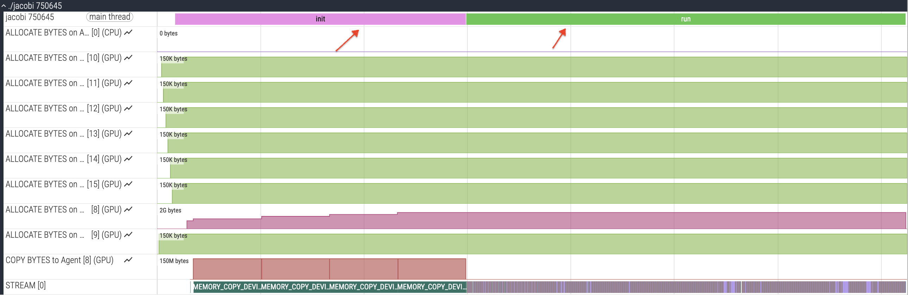

# Test Fortran jacobi code with ROCtx markers

Instrument your code with region annotations using hipfort interfaces
as shown in the example in this directory in `jacobi.f90`. This includes
using the `hipfort_roctx` module:

```
  use iso_c_binding
  use hipfort
  use hipfort_roctx
```

and surrounding the region of interest using the roctx API:

```
  ret = roctxRangePush("init"//c_null_char)
  ...
  <region of interest>
  ...
  ret = roctxRangePop()
```

Do not forget to include the hipfort module directory in the compilation command
in the Makefile:

```
%.o : %.f90 Makefile
    $(FC) $(FFLAGS) -c $< -o $@ -I${HIPFORT_INC}
```

and to link with the `rocprofiler-sdk-roctx` library:

```
${EXEC}: ${OBJS}
    $(FC) $(LDFLAGS) $^ -o $@ -lrocprofiler-sdk-roctx
```

Now, you can trace markers using rocprofv3 using a command such as:

```
rocprofv3 --runtime-trace -- ./jacobi
rocpd2pftrace -i <path_to_rocpd_db_file> -o <path_to_pftrace_file>
```

and view the perfetto trace in a browser. The trace should now have a track with your
ROCtx markers as shown in the figure below:

<p></p>

