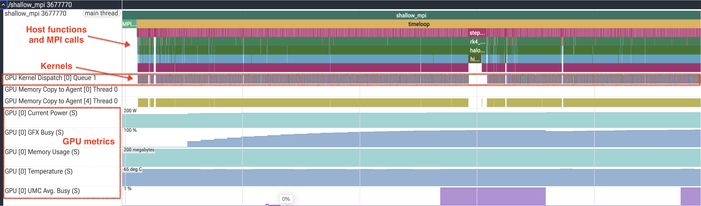
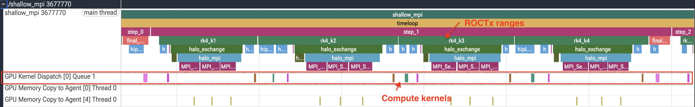
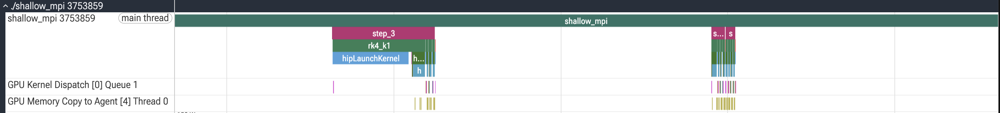
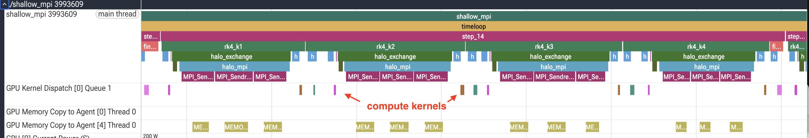

# Stage 0: Baseline

This is the starting point, before any optimization. The global domain is 512x512, split as a 1D
slab in Y across the ranks. Every RK4 stage applies the boundary conditions, exchanges halos, and
evaluates the right-hand side, and the compute kernels are launched with 16x16 thread blocks.

The halo exchange is the part to keep an eye on. Look at `exchange_y_halos` in `shallow_mpi.hip`:

```c++
    // Ensure device writes are visible
    CHECK_CUDA(hipDeviceSynchronize());
    ...
    if (rank_down != MPI_PROC_NULL) {
        MPI_Sendrecv(send_bot_h, nx, MPI_FLOAT, rank_down, 100,
                     recv_bot_h, nx, MPI_FLOAT, rank_down, 200, comm, MPI_STATUS_IGNORE);
        MPI_Sendrecv(send_bot_hu, nx, MPI_FLOAT, rank_down, 101,
                     recv_bot_hu, nx, MPI_FLOAT, rank_down, 201, comm, MPI_STATUS_IGNORE);
        MPI_Sendrecv(send_bot_hv, nx, MPI_FLOAT, rank_down, 102,
                     recv_bot_hv, nx, MPI_FLOAT, rank_down, 202, comm, MPI_STATUS_IGNORE);
    }
```

That is a device-wide synchronization followed by up to six separate blocking exchanges, three
arrays in each of two directions, and it happens four times per time step. Nothing here is
deliberately broken; it is the shortest correct way to write a halo exchange, and it is what most
codes start out with. Our job over the next six stages is to let the profiler tell us what to change.

## Build and run

```bash
module load rocm openmpi
make
mpirun -n 2 --map-by ppr:1:numa --bind-to numa ../gpu_bind.sh ./shallow_mpi
```

or with CMake:

```bash
mkdir build && cd build
cmake ..
make
mpirun -n 2 --map-by ppr:1:numa --bind-to numa ../gpu_bind.sh ./shallow_mpi
```

Every timing in this track depends on that placement, to the tune of about 100x, and it needs an
`--exclusive` allocation; see
[affinity](../README.md#affinity-which-decides-everything-else) in the track README.

## Expected output

```
MPI ranks: 2  |  GPUs detected: 1
Domain: 512x512 (global), steps=500, dt=0.0728643
Elapsed (max over ranks): 0.107 s  |  Throughput: 4899.27 MCUPS
Mass: initial=2.626466547e+05, final=2.626464582e+05, rel.err=7.483e-07
Min(h) after run: 0.981776
```

Keep the last two lines in view for the rest of the tutorial. Mass conservation and a positive
minimum depth are how we confirm that an optimization sped the code up without changing the answer,
and in a multi-rank code they are also how we confirm that the halo exchange is still delivering the
data it is supposed to.

## Step 1: Does it scale at all?

Before profiling anything, run the same binary on one, two and four GPUs. This costs three commands
and it decides what to do next. None of it runs on a login node, so take an allocation first and run
the loop from inside it:

```bash
salloc -N 1 -p LocalQ --exclusive --gres=gpu:4 -t 2:00:00

cd 0_baseline
make
for n in 1 2 4; do
    mpirun -n $n --map-by ppr:1:numa --bind-to numa ../gpu_bind.sh ./shallow_mpi
done
```

`ppr:1:numa` places one rank per NUMA domain, which on this node is one rank per GPU.

| Ranks | Elapsed | MCUPS | Efficiency |
|---|---|---|---|
| 1 | 0.064 s | 8159.26 | -- |
| 2 | 0.107 s | 4899.27 | 30.0 percent |
| 4 | 0.170 s | 3084.88 | 9.5 percent |

Adding GPUs makes this code slower in absolute terms. Four GPUs take nearly three times as long as one
to do exactly the same work. This is not a subtle scaling inefficiency to be shaved down later, it is
a signal that the configuration being measured is the wrong one, and it invalidates any conclusion
we might draw about the kernels while it holds.

It is worth being clear about why, because the diagnosis determines the fix. A 512x512 global domain
divided across four ranks leaves each rank a 512x128 band. That band has 65536 interior cells, and
its two boundary rows are 512 cells each. So roughly one interior cell in 64 has to be shipped to a
neighbour every RK4 stage, and there is not remotely enough arithmetic per cell to hide the latency
of doing so. Worse, 65536 cells in 16x16 blocks is 256 workgroups, spread across a GPU with 228
compute units: barely one workgroup per compute unit, so most of the machine is idle even before
communication starts.

## Step 2: Where does the time go, per rank?

`rocprofv3` profiles a single process, so under `mpirun` it has to be applied to each rank:

```bash
mpirun -n 2 --map-by ppr:1:numa --bind-to numa ../gpu_bind.sh \
    rocprofv3 --kernel-trace --stats -S -T -f csv \
    -o results_%env{OMPI_COMM_WORLD_RANK}% -- ./shallow_mpi
```

Note the position of `rocprofv3`: it wraps the application, and `mpirun` launches the profiler rather
than the other way around. Reversing the two profiles `mpirun` itself, which is not what we want.
The remaining options are as in the novice example: `--kernel-trace` records every kernel dispatch,
`--stats` computes per-kernel statistics, `-S` prints the summary to the console, and `-T` truncates
the demangled kernel names so the table stays readable.

You now get one `results_<rank>_kernel_stats.csv` per rank, next to the per-dispatch
`results_<rank>_kernel_trace.csv`. On a symmetric decomposition like this the two summaries should
look nearly identical, and confirming that they do is the point: a rank that is doing noticeably more
or less work than its neighbours is a load-balance problem, and no amount of kernel tuning will fix
it. Rank 0's file reads:

```csv
"Name","Calls","TotalDurationNs","AverageNs","Percentage","MinNs","MaxNs","StdDev"
"update_stage",1500,11346397,7564.264667,29.74,3680,10200,2380.652205
"compute_rhs",2000,10823322,5411.661000,28.37,4080,8400,904.574602
"apply_reflect_bc_x_yphys",2001,10267765,5131.316842,26.91,3480,9880,457.647296
"final_update",500,5707498,11414.996000,14.96,10360,12280,334.969439
"init_gaussian",1,5360,5360.000000,0.0140,5360,5360,0.00000000e+00
```

The call counts confirm that the trace matches the algorithm: 500 time steps with four RK4 stages
each, so 2000 `compute_rhs` calls, 1500 `update_stage` calls, 500 `final_update` calls, and 2001
boundary-condition calls including the one during initialization.

Rank 1 reports those same five call counts and totals 38.6 ms of kernel time against rank 0's
38.2 ms, so the decomposition is balanced. Read `MaxNs` alongside `TotalDurationNs` rather than on its
own: rank 1's `update_stage` maximum is 325 us against a 7.8 us average, which is one cold first
dispatch rather than a recurring stall.

Both totals are small in absolute terms. About 38 ms of GPU time per rank stands against the 107 ms
of wall time the scaling table reported, so most of the elapsed time is outside kernel execution.

## Step 3: What the kernel trace cannot tell you

The gap between those two figures is the whole reason this example exists: a kernel trace accounts
for time spent *on* the GPU, and says nothing about time spent waiting for MPI. On this
configuration most of the run sits in the gap.

To see it, we need a host-and-device timeline. `rocprof-sys` records the MPI calls, HIP activity and
the ROCTx ranges already present in the source on the same timeline. Take the whole run first, with
`--flat-profile` so that the `wall_clock` report summarises each region once instead of building a
call tree out of them:

```bash
mpirun -n 2 --map-by ppr:1:numa --bind-to numa ../gpu_bind.sh \
    rocprof-sys-run --preset=trace-hpc --flat-profile -o trace -- ./shallow_mpi
```

Load the resulting `trace/<timestamp>/perfetto-trace-*.proto` into [Perfetto](https://ui.perfetto.dev),
one file per rank:

<!-- SNAPSHOT: unfiltered trace of the whole 500-step run, zoomed out -->


Zooming in to a few timesteps shows the pattern that repeats 500 times. Each step opens the four RK4
stages `rk4_k1` through `rk4_k4`, and each of those holds a `halo_exchange` range with the `halo_mpi`
transfers inside it, above the row of compute-kernel dispatches they surround.

<!-- SNAPSHOT: the same unfiltered trace zoomed in to a few timesteps, the RK4 stages and their exchanges -->


Everything we need is in there, but it is an unwieldy way to get at it. That run wrote 10.0 MB of
Perfetto trace per rank, covering 2000 RK4 stages that all look alike, and the part worth looking at
is a fraction of a millisecond wide.

The ROCTx ranges the source already pushes give a way to record only part of the run.
`--selected-regions` names the ones to keep:

```bash
mpirun -n 2 --map-by ppr:1:numa --bind-to numa ../gpu_bind.sh \
    rocprof-sys-run --preset=trace-hpc --flat-profile \
    --selected-regions step_3,step_4,step_5 -o trace -- ./shallow_mpi
```

That drops the same per-rank output to 47 KB of Perfetto trace, about 220x smaller, while keeping
every event inside the three steps asked for. The saving is what makes the timeline worth opening,
and it costs nothing in resolution:

<!-- SNAPSHOT: trace filtered to steps 3, 4 and 5, showing halo_exchange against the kernels -->


The selected trace contains 12 `halo_exchange` ranges per rank, exactly three steps times four RK4
stages, and the flat `wall_clock` report says the same on both ranks: one row for `halo_exchange`,
count 12. Two things about the filtered trace are still being investigated: a gap after the first
selected region, and MPI calls that the unfiltered trace shows but this one does not. In Perfetto the
host ranges are far wider than the kernel dispatches around them, which the kernel statistics above
put at 5 to 11 us on average.

Let's zoom in to one step of the run:

<!-- SNAPSHOT: one step of the filtered trace, the four RK4 stages and their exchanges against the kernels -->


The timeline shows the MPI calls taking substantially longer than the kernels they surround. The
`hipDeviceSynchronize()` at the top of `exchange_y_halos` makes this worse than it needs to be, since
it drains the whole device before the first byte moves, but the dominant term is simply that there is
too little work per rank.

## What we learned, and what to do about it

Two independent measurements point the same way. The scaling study says the problem is too small to
divide, and the timeline says communication costs more than the compute it feeds. Both have the same
cheapest possible experiment behind them: give each rank more work to do, and see whether the
communication cost becomes a tolerable fraction of it.

So grow the global domain from 512x512 to 8192x8192, a 256x increase in cells. If the diagnosis is
right, throughput per cell should rise sharply on a single GPU, and the scaling efficiency should
recover at the same time.

Continue to [`1_larger_domain`](../1_larger_domain), and note that the entire change is two lines:

```bash
diff ../0_baseline/shallow_mpi.hip ../1_larger_domain/shallow_mpi.hip
```
