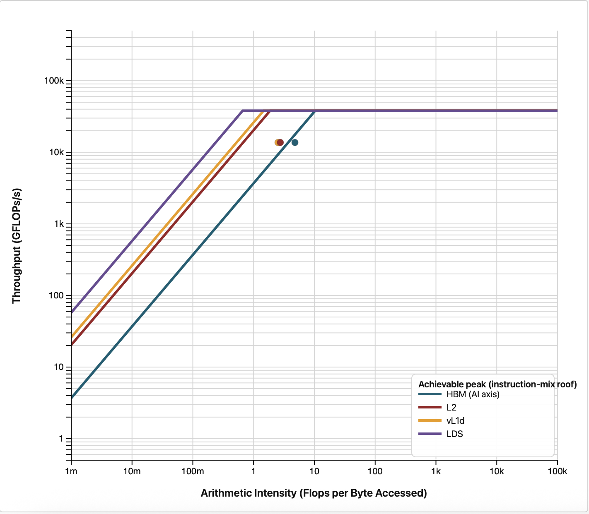
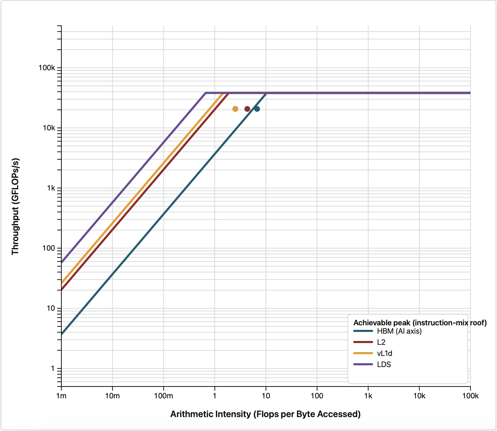

# Stage 2: A larger thread block

`VALUBusy` for `compute_rhs` sits around half, so the vector units idle much of the time even though
there is now plenty of work in flight. For a stencil kernel the usual suspect is cache reuse, and the
block shape controls how much of it we get.

## What changed

```bash
diff ../1_larger_domain/shallow_mpi.hip shallow_mpi.hip
```

One line:

```c++
    dim3 block(32,32);
```

That takes the workgroup from 256 threads to 1024, the maximum. The grid dimensions adjust
automatically, since they are computed from `block`. The boundary-condition kernel is launched with
its own 256-thread configuration and is unaffected.

## Build and run

```bash
module load rocm openmpi
make
mpirun -n 4 --bind-to none ../gpu_bind.sh ./shallow_mpi
```

## Expected output

```
MPI ranks: 4  |  GPUs detected: 1
Domain: 8192x8192 (global), steps=500, dt=0.0728643
Elapsed (max over ranks): 1.276 s  |  Throughput: 105162.88 MCUPS
Mass: initial=6.710936665e+07, final=6.710936646e+07, rel.err=2.929e-09
Min(h) after run: 0.981776
```

| Ranks | MCUPS at 16x16 | MCUPS at 32x32 | Speedup | Efficiency |
|---|---|---|---|---|
| 1 | 22228.56 | 28918.90 | 1.30x | -- |
| 2 | 43364.87 | 58031.88 | 1.34x | 100 percent |
| 4 | 79748.87 | 105162.88 | 1.32x | 91 percent |

**A 1.32x gain at four GPUs, and the same 1.30x on one.** That the two agree is the useful part: this
change is purely local to the kernel, so it should help every rank equally and leave the
communication cost alone, and the numbers say it did.

## Did VALUBusy improve?

```bash
mpirun -n 4 --bind-to none ../gpu_bind.sh \
    rocprofv3 --pmc VALUBusy -T --output-format csv -d prof -o valu_%rank% -- ./shallow_mpi
```

<!-- MEASUREMENT TODO: VALUBusy per kernel, 16x16 vs 32x32, 4 ranks -->

A block that covers a 32x32 patch of the grid has a smaller perimeter relative to its area than a
16x16 patch, so proportionally fewer of the stencil's neighbour reads fall outside the block and have
to come from memory instead of cache.

## The surprise: occupancy went down

```bash
mpirun -n 4 --bind-to none ../gpu_bind.sh \
    rocprofv3 --pmc OccupancyPercent -T --output-format csv -d prof -o occ_%rank% -- ./shallow_mpi
```

<!-- MEASUREMENT TODO: OccupancyPercent per kernel, 16x16 vs 32x32, 4 ranks -->

Occupancy falls and yet the code gets a third faster. This is the same lesson the novice example
draws at this step, and it is worth repeating: occupancy is not the objective, it is a proxy for one
particular failure mode, namely having too little work in flight to hide latency. In stage 1 that
proxy was measuring something real and acting on it paid off. Here we traded some of it for better
cache behaviour and came out ahead. Larger workgroups are coarser units of scheduling, so the
scheduler has less freedom to pack them onto compute units, which is where the occupancy went.

If you optimize for the metric instead of for the time, you will sometimes make the code slower.
Always validate against the wall clock.

## Roofline

```bash
rocprof-compute profile -n 2_block_32x32 --roof-only --device 0 -k compute_rhs \
    --iteration-multiplexing -- ./shallow_mpi
rocprof-compute analyze -p workloads/2_block_32x32/0
```

Both plots below are the novice measurements of the same kernel at the two block shapes, reused for
[the reason given in stage 1](../1_larger_domain/README.md#is-the-gpu-busy-now): a roofline
characterizes the kernel, not the decomposition. 16x16 on the left, 32x32 on the right.

<p>


</p>

The kernel has moved closer to the memory bandwidth ceilings, which is consistent with more of its
traffic being served from cache.

## What we learned, and what to do about it

There is still stall time to recover and we are still memory bound. So far we have only changed how
*many* threads are in a block, not how they are arranged.

Arrangement matters because consecutive threads in a workgroup map to consecutive lanes of a
wavefront, and a wavefront is 64 lanes wide on AMD GPUs. With a 32x32 block, each row of the block is
only 32 threads, so a single wavefront straddles two rows of the grid and each memory request covers
two disjoint stretches of memory. Making the block 64 wide and only 4 tall lines each wavefront up
with one contiguous run of 64 cells, which is both a better fit for cache lines and a longer
consecutive read.

Continue to [`3_block_64x4`](../3_block_64x4). Note that this also takes the block back down from
1024 threads to 256, so it is a change of shape and size at once.
