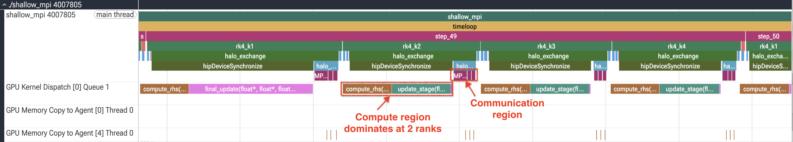
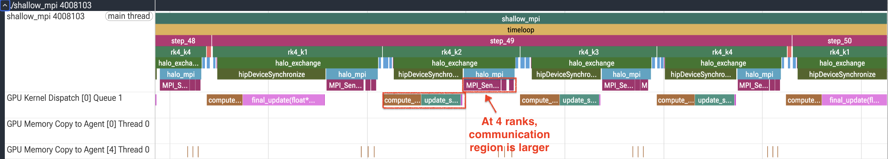

# Stage 4: Aligned wide loads and fewer divides

The launch configuration is as good as it gets, `compute_rhs` is still memory bound, and counters have
been taken as far as they go. This stage introduces a tool that reports which instruction the vector
units stall on, and then acts on what it says.

## A new point of view: thread trace

Thread trace, also called SQTT or ATT, traces wavefronts on the GPU at instruction granularity. Where
a counter gives one number per kernel, a thread trace gives near cycle-accurate timing for every
instruction, the exact execution path taken, and how long each instruction spent stalled versus
issuing. It is a targeted tool rather than a survey one: it traces a single compute unit per shader
engine and is meant for one kernel at a time.

The basic invocation, before the optimization, on the stage 3 binary:

```bash
cd ../3_block_64x4
rocprofv3 --att -- ./shallow_mpi
```

On Instinct hardware it is worth also streaming the SQ performance counters into the trace buffer,
which is what gives you the activity breakdown per instruction:

```bash
rocprofv3 --att --att-activity 8 --kernel-include-regex compute_rhs \
    -o att -- ./shallow_mpi
```

`--kernel-include-regex` matters here for the same reason `-k` mattered for the roofline: without it
you trace whatever kernel happens to be dispatched first. Two further notes:

- Thread trace decoding needs the ROCprof Trace Decoder library, and the resulting timeline is
  viewed in the ROCprof Compute Viewer, which is a separate desktop application. See the
  [thread trace documentation](https://rocm.docs.amd.com/projects/rocprofiler-sdk/en/latest/how-to/using-thread-trace.html)
  and the [viewer documentation](https://rocm.docs.amd.com/projects/rocprof-compute-viewer/en/amd-mainline/index.html).
- Build with `-g` so the trace can put your source lines next to the ISA. The Makefile in every stage
  already does.

<!-- MEASUREMENT TODO: ROCprof Compute Viewer snapshot of the stage 3 thread trace, before the
     vectorization change, showing the s_waitcnt stall and the global_load_dwordx3 x-neighbour reads -->

The run produces `stats_*.csv`, a per-instruction latency summary, and one
`ui_output_agent_*_dispatch_*` directory per traced dispatch for the viewer. The CSV is the quickest
way in, with one row per instruction:
| Column | Meaning |
|---|---|
| `Instruction` | The ISA instruction |
| `Hitcount` | How many times it executed, summed over all traced waves |
| `Latency` | Total cycles, stall plus issue time |
| `Stall` | Cycles in which the pipe could not issue, typically cache or LDS backpressure |
| `Idle` | Gap since the previous instruction finished, from register dependencies or instruction cache misses |
| `Source` | The source line, when built with debug symbols |

If `stats_*.csv` comes back empty even though the kernel definitely ran, the trace found no wave on
the one compute unit it was watching. Widen the search with `--att-shader-engine-mask 0x11111111`.

The stage 3 trace captured 4608 hits per instruction. Its largest stall is an `s_waitcnt vmcnt(8)`
with 6.57 million stalled cycles. The hottest load is
`global_load_dwordx3 ... offset:-4`, with 606784 stalled cycles, attributed to the first x-neighbour
read:

```c++
    const float hi  = h[id];
    const float hui = hu[id];
    const float hvi = hv[id];
```

together with the `h[ip]`, `h[im]` and equivalents that follow. The compiler has already combined
the three adjacent x values for each array into `global_load_dwordx3`; the remaining y-neighbour
reads appear as scalar `global_load_dword` instructions. The trace therefore points to memory
latency, but it also corrects a tempting source-level assumption: these are not nine independent
machine loads.

The decoder reported that part of the trace was dropped because of bandwidth limitations. The
per-instruction CSV is populated and supports the ranking above, but exact whole-trace totals should
not be quoted from this run.

## What changed

```bash
diff ../3_block_64x4/shallow_mpi.hip shallow_mpi.hip
```

This is the first stage whose diff is more than a line or two. The central change replaces the three
separate reads along x with a single 16-byte load per array:

```c++
    const float4 h_x_vec = *reinterpret_cast<const float4*>(&h[im]);
    const float h_jm = h[jm];  // y-neighbors are not contiguous, load separately
    const float h_jp = h[jp];
```

One `global_load_dwordx4` fetches `i-1`, `i`, `i+1` and one cell beyond, and the components are pulled
out afterwards. The y-neighbours cannot join in, since they are a row apart in memory. Three
supporting changes come with it:

- Cache-line-aligned row pitch. `pitch` is rounded up to a multiple of 16 floats so every row
  starts on a 64-byte boundary, which is what makes the wide loads land inside a single cache line
  rather than straddling two.
- Fewer divisions. One reciprocal is computed per location and reused for both velocity
  components, and the flux terms use `fmaf`.
- A `j+2` prefetch and `__launch_bounds__(256,1)`, both attempts to keep more memory requests in
  flight.

What this buys is an aligned four-float access rather than fewer loads, since the compiler was
already emitting x3, plus one prefetched value and less arithmetic latency from the reciprocal and
`fmaf` changes.

## Build and run

```bash
module load rocm openmpi
make
mpirun -n 4 --map-by ppr:1:numa --bind-to numa ../gpu_bind.sh ./shallow_mpi
```

## Expected output

```
MPI ranks: 4  |  GPUs detected: 1
Domain: 8192x8192 (global), steps=500, dt=0.0728643
Elapsed (max over ranks): 1.075 s  |  Throughput: 124889.46 MCUPS
Mass: initial=6.710936665e+07, final=6.710936646e+07, rel.err=2.916e-09
Min(h) after run: 0.981776
```

| Ranks | MCUPS at stage 3 | MCUPS now | Speedup | Efficiency |
|---|---|---|---|---|
| 1 | 33946.38 | 36113.05 | 1.06x | -- |
| 2 | 67339.87 | 70436.30 | 1.05x | 97.5 percent |
| 4 | 124762.34 | 124889.46 | 1.00x | 86.5 percent |

A 1.06x gain on one GPU that arrives as nothing at all on four. Read those two rows together,
because this is the most instructive result in the tutorial. The kernel really did get 6 percent
faster, the single-GPU row proves it, and the four-GPU row is flat to within run-to-run spread. The
speedup was spent on communication rather than banked, and the efficiency column says the same thing
from the other side: 92 percent in stage 3, 87 percent here.

It is also the last of the kernel gains, and a modest return for by far the largest code change so
far, which is part of the lesson too: the deeper you go, the more effort each remaining percent costs.
On one GPU we have now gone from 22239 to 36113 MCUPS since stage 1, a cumulative 1.62x, all of it
from the four changes a profiler pointed at. On four GPUs that same work is worth only 1.57x, and the
gap between those two figures is the communication cost that stage 5 goes after.

This is the only stage that alters the arithmetic, so its accuracy checks are the ones worth watching
most closely. The mass error moves from 2.929e-09 to 2.916e-09, a change in the last digits from
reassociating the flux expressions and using reciprocals, and the minimum depth is unchanged. Both
are comfortably within what single precision entitles us to.

## Confirming it with the trace

Re-run the thread trace on this stage and compare:

```bash
rocprofv3 --att --att-activity 8 --kernel-include-regex compute_rhs \
    -o att -- ./shallow_mpi
```

<!-- MEASUREMENT TODO: thread trace hotspot view after vectorization, and the roofline -->

```bash
rocprof-compute profile -n 4_vectorized_loads --no-roof -k compute_rhs \
    --iteration-multiplexing -- ./shallow_mpi
rocprof-compute analyze -p workloads/4_vectorized_loads/0
```

## How much of the step is communication?

The efficiency column says communication now costs something. A timeline says how much, and the
answer depends on how much work each rank is left with. Trace the same steps at two ranks and at
four, both inside one node:

```bash
salloc -N 1 -p LocalQ --exclusive --gres=gpu:4 -t 1:00:00
for n in 2 4; do
    mpirun -n $n --map-by ppr:1:numa --bind-to numa ../gpu_bind.sh \
        rocprof-sys-run --preset=trace-hpc --flat-profile \
        --selected-regions step_3,step_4,step_5 -o trace_n$n -- ./shallow_mpi
done
```

At two ranks the kernels dominate each RK4 stage and `halo_exchange` is a thin band between them. At
four ranks that band holds its width while the kernels around it shrink: the work per rank halves
and the exchange does not.

The kernel statistics put a number on it. At four ranks the five kernels sum to 910 ms of GPU time
per rank over the run, which is 1.82 ms of each 2.15 ms step: communication and launch overhead own
the remaining 15 percent. That share grows with rank count, and a timeline shows where it goes in a
way that a table of totals cannot.

<!-- SNAPSHOT: rocprof-sys timelines side by side, 2 ranks on the left and 4 ranks on the right -->
<p>


</p>

Whether the exchange eventually costs more than the compute it separates is a question for a wider
job than one node. At 16 ranks or more, spread over several nodes, the same trace is worth repeating.

## What we learned, and what to do about it

The kernel side of this application is finished, or near enough that further effort is better spent
elsewhere. Look at the efficiency column across the last four stages: 90, 91, 92, 87 percent. It held
while the kernels had slack in them and broke at the stage where they ran out, which is the clearest
signal available that the limiter has moved. Communication is now the largest single thing left.

Re-profiling the kernels at four ranks shows how the ranking has moved. The boundary kernel has gone
from a quarter of the GPU time to almost none, and the two kernels this track never optimized now sit
alongside `compute_rhs`:

```bash
mpirun -n 4 --map-by ppr:1:numa --bind-to numa ../gpu_bind.sh \
    rocprofv3 --kernel-trace --stats -S -T -f csv \
    -o results_%env{OMPI_COMM_WORLD_RANK}% -- ./shallow_mpi
```

Rank 0 reads:

```csv
"Name","Calls","TotalDurationNs","AverageNs","Percentage","MinNs","MaxNs","StdDev"
"compute_rhs",2000,354838293,177419.146500,38.97,167920,205081,2266.908457
"update_stage",1500,321526462,214350.974667,35.31,200160,244401,2923.840005
"final_update",500,219204941,438409.882000,24.07,410202,441442,5545.280621
"apply_reflect_bc_x_yphys",2001,14897350,7444.952524,1.64,6520,40840,810.733628
"init_gaussian",1,70401,70401.000000,7.732e-03,70401,70401,0.00000000e+00
```

In stage 0 `compute_rhs` and `update_stage` were within a few points of each other at 28 and 30
percent, with the boundary kernel taking a quarter of the time. Here `compute_rhs` holds 39 percent,
`update_stage` 35 and `final_update` 24, while the boundary kernel has fallen to 1.6: the kernels we
never touched now account for 59 percent of GPU time between them.

The next stage stops optimizing kernels and starts optimizing the halo exchange.

Continue to [`5_halo_pipeline`](../5_halo_pipeline).
