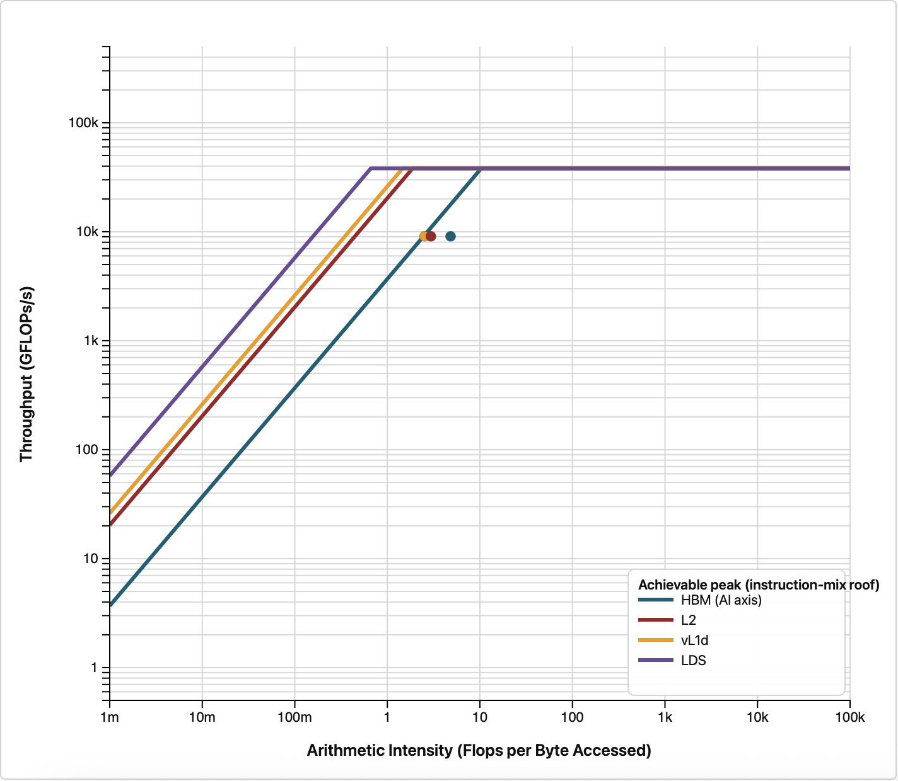

# Stage 1: Give the GPU enough work

Stage 0 left us with two facts: `compute_rhs` is memory bound, and occupancy is stuck around 24
percent. Both point at the same cause, not enough parallelism in flight to hide memory latency, so
the first thing to try is simply a bigger problem.

## What changed

```bash
diff ../0_baseline/shallow.hip shallow.hip
```

Two lines, the domain size:

```c++
constexpr int NX = 2048;            // interior cells in x
constexpr int NY = 2048;            // interior cells in y
```

That is 16 times as many cells. Everything else, the kernels, the block size, the synchronization,
is untouched.

## Build and run

```bash
module load rocm
make
./shallow
```

## Expected output

```
Domain: 2048x2048, steps=500, dt=0.0728643
Elapsed: 0.427 s  |  Throughput (including RK4 stages): 19638.63 MCUPS
Mass: initial=4.194806655e+06, final=4.194806458e+06, rel.err=4.681e-08
Min(h) after run: 0.981776
```

**19638.63 MCUPS, a 3.13x improvement over the baseline's 6282.26.**

Read that carefully, because the wall-clock time went *up*, from 0.083 s to 0.427 s. That is the
expected outcome: we asked for 16 times the work and it took 5.1 times as long, so each cell update
became 3.13 times cheaper. MCUPS, not elapsed time, is the metric that lets us compare across
problem sizes.

The mass error actually improved, from 7.477e-07 to 4.681e-08, because the finer grid resolves the
Gaussian bump better. Correctness is intact.

## Confirming the diagnosis

Re-run the occupancy measurement to check that the extra work landed where we predicted:

```bash
rocprofv3 --pmc OccupancyPercent -T --output-format csv -d outdir -o shallow -- ./shallow
```

```
"Correlation_Id","Dispatch_Id","Agent_Id","Queue_Id","Process_Id","Thread_Id","Grid_Size","Kernel_Id","Kernel_Name","Workgroup_Size","LDS_Block_Size","Scratch_Size","VGPR_Count","Accum_VGPR_Count","SGPR_Count","Counter_Name","Counter_Value","Start_Timestamp","End_Timestamp"
1,1,"Agent 1",2,3260732,3260732,4194304,5,"init_gaussian",256,0,0,12,4,32,"OccupancyPercent",62.563927,1569088261977668,1569088262011279
2,2,"Agent 1",2,3260732,3260732,2048,4,"apply_reflect_bc",256,0,0,28,4,32,"OccupancyPercent",1.92478703e-01,1569088262096169,1569088262101857
3,3,"Agent 1",2,3260732,3260732,2048,4,"apply_reflect_bc",256,0,0,28,4,32,"OccupancyPercent",1.84416852e-01,1569088304576625,1569088304583836
4,4,"Agent 1",2,3260732,3260732,4194304,3,"compute_rhs",256,0,0,52,4,32,"OccupancyPercent",81.251605,1569088304641724,1569088304724251
5,5,"Agent 1",2,3260732,3260732,4194304,2,"update_stage",256,0,0,16,0,32,"OccupancyPercent",80.567040,1569088304777292,1569088304874402
6,6,"Agent 1",2,3260732,3260732,2048,4,"apply_reflect_bc",256,0,0,28,4,32,"OccupancyPercent",1.91723108e-01,1569088304914063,1569088304919791
7,7,"Agent 1",2,3260732,3260732,4194304,3,"compute_rhs",256,0,0,52,4,32,"OccupancyPercent",80.810704,1569088304961576,1569088305042991
8,8,"Agent 1",2,3260732,3260732,4194304,2,"update_stage",256,0,0,16,0,32,"OccupancyPercent",82.239656,1569088305092627,1569088305189175
```

| Kernel | Occupancy before | Occupancy now |
|---|---|---|
| `init_gaussian` | 13.3 percent | 62.6 percent |
| `compute_rhs` | 24.5 percent | 78.7 percent |
| `update_stage` | 23.6 percent | 81.7 percent |
| `final_update` | 25.0 percent | 86.0 percent |
| `apply_reflect_bc` | 0.05 percent | 0.19 percent |

The main kernels went from roughly a quarter of the machine to roughly four fifths of it. The
roofline tells the same story from a different angle:

```bash
module load rocm roofline-extractor
roofline-extractor-profile -o roofline_out --arch MI300A -- ./shallow
```

The equivalent in `rocprof-compute`:

```bash
rocprof-compute profile -n 1_larger_domain --roof-only --device 0 -k compute_rhs --iteration-multiplexing -- ./shallow
rocprof-compute analyze -p workloads/1_larger_domain/0
```

Both are explained in [Roofline plots](../README.md#roofline-plots).

<p>


</p>

Stage 0 at 512x512 is on the left, this stage at 2048x2048 on the right. `compute_rhs` has moved up
toward the memory ceiling. Arithmetic intensity is unchanged, since we did not touch the arithmetic,
but we are now much closer to extracting the bandwidth the hardware can deliver.

## Step 2: Where is the remaining time going?

Occupancy is healthy, so the next question is whether the GPU is being kept busy *continuously*.
For that we need a timeline rather than a counter. Collect both the kernel dispatches and the HIP
API calls:

```bash
rocprofv3 --kernel-trace --hip-trace -d outdir -o shallow -- ./shallow
```

This writes `outdir/shallow_results.db`. Since ROCm 7.0, `rocprofv3` collects into a SQLite
database by default and leaves the choice of output format to a second step. Convert that database
to Perfetto format with `rocpd`:

```bash
rocpd2pftrace -i outdir/shallow_results.db -d outdir -o shallow
```

which produces `outdir/shallow_results.pftrace`. Separating collection from export means the run is
profiled once and can be re-exported as often as you like: `rocpd2csv` and `rocpd2summary` read the
same database, so changing your mind about the output no longer costs another run of the
application.

Open the resulting `.pftrace` file at [ui.perfetto.dev](https://ui.perfetto.dev) and zoom into a few
time steps.

<p>

</p>

There are visible gaps after each kernel, and lining the kernel row up against the HIP API row shows
what fills them: `hipDeviceSynchronize()`. Every launch in the RK4 loop is followed by one.

## What we learned, and what to do about it

Those synchronizations are not buying us anything. The whole solver runs on a single HIP stream, and
operations on one stream already execute in order, so kernel N is guaranteed to finish before kernel
N+1 begins. The explicit synchronization only adds a round trip to the host between every launch.

They were presumably added while debugging, which is exactly when they are useful. In a finished
code they are pure overhead.

Continue to [`2_no_device_sync`](../2_no_device_sync), where they come out.
