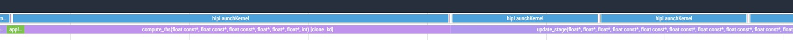

# Stage 2: Remove the redundant synchronization

The HIP API trace in stage 1 showed the GPU idling between kernels while the host waited on
`hipDeviceSynchronize()`. Since the solver uses a single stream, which already orders its operations,
those calls guarantee nothing that the stream does not guarantee for free.

## What changed

```bash
diff ../1_larger_domain/shallow.hip shallow.hip
```

The eight `hipDeviceSynchronize()` calls inside the RK4 loop are commented out rather than deleted,
so you can still see where they were:

```c++
        apply_reflect_bc<<<gridBC, nthreads_bc>>>(d_h, d_hu, d_hv, pitch);
	//CHECK_CUDA(hipDeviceSynchronize());
        compute_rhs<<<grid, block>>>(d_h, d_hu, d_hv, d_k1_h, d_k1_hu, d_k1_hv, pitch);
	//CHECK_CUDA(hipDeviceSynchronize());
```

The one synchronization after initialization stays, because it sits outside the timed loop and costs
nothing measurable.

If you want to keep the calls available for debugging, guard them with a macro rather than deleting
them. They are genuinely useful when a kernel is producing wrong answers, because they make errors
surface at the launch that caused them.

## Build and run

```bash
module load rocm
make
./shallow
```

## Expected output

```
Domain: 2048x2048, steps=500, dt=0.0728643
Elapsed: 0.396 s  |  Throughput (including RK4 stages): 21204.86 MCUPS
Mass: initial=4.194806655e+06, final=4.194806458e+06, rel.err=4.681e-08
Min(h) after run: 0.981776
```

21204.86 MCUPS, 1.08x faster than stage 1's 19638.63. Running total from the baseline: 3.38x.

An eight percent gain for deleting eight lines is a good trade, and the accuracy checks are unchanged,
which is what we expect since removing a redundant synchronization cannot alter the arithmetic.

## Confirming the gaps are gone

Collect the same trace as before and compare:

```bash
rocprofv3 --kernel-trace --hip-trace -d outdir -o shallow -- ./shallow
rocpd2pftrace -i outdir/shallow_results.db -d outdir -o shallow
```

<p>

</p>

The kernels now abut one another instead of being separated by host round trips.

## Step 2: Check the roofline again

`profile_app.py` in Roofline Extractor needs its
[Python environment](../README.md#roofline-extractor) active:

```bash
python3 "$ROOFLINE_EXTRACTOR/profile_app.py" -o roofline_out --arch MI300A -- ./shallow
```

The equivalent in `rocprof-compute`, whose `analyze` step needs its
[Python environment](../README.md#rocprof-compute-analyze) active:

```bash
rocprof-compute profile -n 2_no_device_sync --roof-only --device 0 -k compute_rhs --iteration-multiplexing -- ./shallow
rocprof-compute analyze -p workloads/2_no_device_sync/0
```

Both are explained in [Roofline plots](../README.md#roofline-plots).

<p>


</p>

This one is worth dwelling on, because the two plots look essentially identical. That is not
a disappointment, it is a correct reading: the roofline characterizes what happens *inside* a kernel,
and we did not change any kernel. We removed dead time *between* kernels, which the wall clock sees
and the roofline does not.

The lesson is that no single tool sees everything. A trace found this problem; a roofline never would
have.

## Step 3: A different counter

Since the roofline has stopped telling us anything new, ask a different question. `VALUBusy` reports
the percentage of GPU time during which vector ALU instructions are being issued. The ideal is close
to 100 percent.

```bash
rocprofv3 --pmc VALUBusy -T --output-format csv -d outdir -o valu -- ./shallow
```

```
"Correlation_Id","Dispatch_Id","Agent_Id","Queue_Id","Process_Id","Thread_Id","Grid_Size","Kernel_Id","Kernel_Name","Workgroup_Size","LDS_Block_Size","Scratch_Size","VGPR_Count","Accum_VGPR_Count","SGPR_Count","Counter_Name","Counter_Value","Start_Timestamp","End_Timestamp"
1,1,"Agent 1",2,3260905,3260905,4194304,5,"init_gaussian",256,0,0,12,4,32,"VALUBusy",24.657900,1569115829711253,1569115829744144
2,2,"Agent 1",2,3260905,3260905,2048,4,"apply_reflect_bc",256,0,0,28,4,32,"VALUBusy",2.48342814e-02,1569115829820780,1569115829827030
3,3,"Agent 1",2,3260905,3260905,2048,4,"apply_reflect_bc",256,0,0,28,4,32,"VALUBusy",1.77540975e-02,1569115874101615,1569115874108826
4,4,"Agent 1",2,3260905,3260905,4194304,3,"compute_rhs",256,0,0,52,4,32,"VALUBusy",51.287701,1569115874146924,1569115874229490
5,5,"Agent 1",2,3260905,3260905,4194304,2,"update_stage",256,0,0,16,0,32,"VALUBusy",2.750964,1569115874382886,1569115874479835
6,6,"Agent 1",2,3260905,3260905,2048,4,"apply_reflect_bc",256,0,0,28,4,32,"VALUBusy",2.38510447e-02,1569115874514328,1569115874520137
7,7,"Agent 1",2,3260905,3260905,4194304,3,"compute_rhs",256,0,0,52,4,32,"VALUBusy",49.378490,1569115874548821,1569115874631247
8,8,"Agent 1",2,3260905,3260905,4194304,2,"update_stage",256,0,0,16,0,32,"VALUBusy",2.751583,1569115874666782,1569115874763570
```

| Kernel | Workgroup size | VALUBusy |
|---|---|---|
| `init_gaussian` | 256 | 24.7 percent |
| `compute_rhs` | 256 | 46.9 percent |
| `update_stage` | 256 | 2.7 percent |
| `final_update` | 256 | 3.5 percent |
| `apply_reflect_bc` | 256 | 0.02 percent |

`compute_rhs` keeps the vector units busy less than half the time. The low figures for
`update_stage` and `final_update` are unsurprising, since they are pure streaming operations with
almost no arithmetic per byte, and they are bandwidth-limited by nature.

We record occupancy here as well. Removing the synchronizations did not change how many wavefronts
fit on the machine, so these figures are within a percentage point of stage 1, but they are the
baseline the next stage compares its larger blocks against:

```bash
rocprofv3 --pmc OccupancyPercent -T --output-format csv -d outdir -o occupancy -- ./shallow
```

| Kernel | Occupancy |
|---|---|
| `init_gaussian` | 60.7 percent |
| `compute_rhs` | 78.3 percent |
| `update_stage` | 81.5 percent |
| `final_update` | 85.9 percent |
| `apply_reflect_bc` | 0.18 percent |

## What we learned, and what to do about it

`compute_rhs` is a five-point stencil, so neighbouring threads read overlapping data. How much of
that overlap turns into cache reuse rather than repeated memory traffic depends on the shape and size
of the thread block, and the block size is one of the easiest things in the whole code to change.

At 16x16 the block holds 256 threads, a quarter of the 1024 maximum. Going to 32x32 gives each block
four times the footprint, so a larger fraction of each thread's stencil neighbours are loaded by the
same block and can be served from cache.

Continue to [`3_block_32x32`](../3_block_32x32). Once again the change is a single line.
