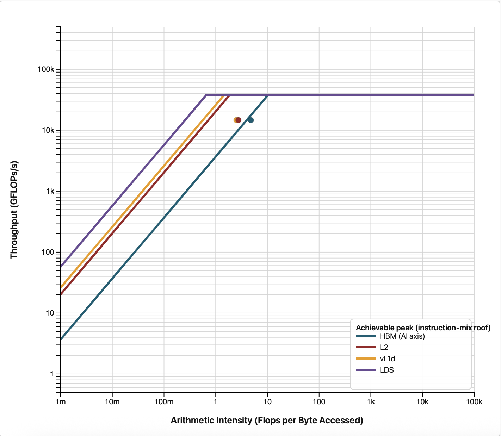

# Stage 3: A larger thread block

`VALUBusy` for `compute_rhs` was 47 percent, so the vector units sit idle more than half the time even
though occupancy is high. For a stencil kernel the usual suspect is cache reuse, and the block shape
controls how much of it we get.

## What changed

```bash
diff ../2_no_device_sync/shallow.hip shallow.hip
```

One line:

```c++
    dim3 block(32,32);
```

That takes the workgroup from 256 threads to 1024, the maximum. The grid dimensions adjust
automatically, since they are computed from `block`.

## Build and run

```bash
module load rocm
make
./shallow
```

## Expected output

```
Domain: 2048x2048, steps=500, dt=0.0728643
Elapsed: 0.285 s  |  Throughput (including RK4 stages): 29400.84 MCUPS
Mass: initial=4.194806655e+06, final=4.194806458e+06, rel.err=4.681e-08
Min(h) after run: 0.981776
```

29400.84 MCUPS, 1.39x faster than stage 2's 21204.86. Running total from the baseline: 4.68x.

## Did VALUBusy improve?

```bash
rocprofv3 --pmc VALUBusy -T --output-format csv -d outdir -o shallow -- ./shallow
```

| Kernel | VALUBusy at 16x16 | VALUBusy at 32x32 |
|---|---|---|
| `init_gaussian` | 24.7 percent | 32.5 percent |
| `compute_rhs` | 46.9 percent | 61.9 percent |
| `update_stage` | 2.7 percent | 3.8 percent |
| `final_update` | 3.5 percent | 5.1 percent |
| `apply_reflect_bc` | 0.02 percent | 0.02 percent |

`compute_rhs` went from 47 to 62 percent. A block that covers a 32x32 patch of the grid has a
smaller perimeter relative to its area than a 16x16 patch, so proportionally fewer of the stencil's
neighbour reads fall outside the block and have to come from memory instead of cache.

`apply_reflect_bc` is unmoved, as expected: it was left at 256 threads and it is not a stencil.

## The surprise: occupancy went down

Re-run the occupancy counter and compare against stage 1:

```bash
rocprofv3 --pmc OccupancyPercent -T --output-format csv -d outdir -o shallow -- ./shallow
```

```
"Correlation_Id","Dispatch_Id","Agent_Id","Queue_Id","Process_Id","Thread_Id","Grid_Size","Kernel_Id","Kernel_Name","Workgroup_Size","LDS_Block_Size","Scratch_Size","VGPR_Count","Accum_VGPR_Count","SGPR_Count","Counter_Name","Counter_Value","Start_Timestamp","End_Timestamp"
1,1,"Agent 1",2,3261059,3261059,4194304,5,"init_gaussian",1024,0,0,12,4,32,"OccupancyPercent",48.846775,1569140249026718,1569140249051195
2,2,"Agent 1",2,3261059,3261059,2048,3,"apply_reflect_bc",256,0,0,28,4,32,"OccupancyPercent",1.68555351e-01,1569140249145459,1569140249151148
3,3,"Agent 1",2,3261059,3261059,2048,3,"apply_reflect_bc",256,0,0,28,4,32,"OccupancyPercent",1.83332251e-01,1569140293236826,1569140293243916
4,4,"Agent 1",2,3261059,3261059,4194304,2,"compute_rhs",1024,0,0,52,4,32,"OccupancyPercent",65.598547,1569140293279650,1569140293346743
5,5,"Agent 1",2,3261059,3261059,4194304,1,"update_stage",1024,0,0,16,0,32,"OccupancyPercent",71.833870,1569140293523895,1569140293592441
6,6,"Agent 1",2,3261059,3261059,2048,3,"apply_reflect_bc",256,0,0,28,4,32,"OccupancyPercent",1.97207156e-01,1569140293623168,1569140293629297
7,7,"Agent 1",2,3261059,3261059,4194304,2,"compute_rhs",1024,0,0,52,4,32,"OccupancyPercent",63.026505,1569140293675208,1569140293737203
8,8,"Agent 1",2,3261059,3261059,4194304,1,"update_stage",1024,0,0,16,0,32,"OccupancyPercent",71.644535,1569140293775061,1569140293843126
```

| Kernel | Occupancy at 16x16 | Occupancy at 32x32 |
|---|---|---|
| `init_gaussian` | 60.7 percent | 48.9 percent |
| `compute_rhs` | 78.3 percent | 61.9 percent |
| `update_stage` | 81.5 percent | 72.5 percent |
| `final_update` | 85.9 percent | 75.7 percent |

Occupancy fell substantially, from 78 to 62 percent for `compute_rhs`, and yet the code got 39
percent faster.

This is the single most important lesson in the whole tutorial. Occupancy is not the objective, it
is a proxy for one particular failure mode, namely having too little work in flight to hide latency.
In stage 1 that proxy was measuring something real and acting on it paid off handsomely. Here we
traded some of it for better cache behaviour and came out ahead. Larger workgroups are coarser units
of scheduling, so the scheduler has less freedom to pack them onto compute units, which is where the
occupancy went.

If you optimize for the metric instead of for the time, you will sometimes make the code slower.
Always validate against the wall clock.

## Roofline

```bash
module load rocm roofline-extractor
roofline-extractor-profile -o roofline_out --arch MI300A -- ./shallow
```

The equivalent in `rocprof-compute`:

```bash
rocprof-compute profile -n 3_block_32x32 --roof-only --device 0 -k compute_rhs --iteration-multiplexing -- ./shallow
rocprof-compute analyze -p workloads/3_block_32x32/0
```

Both are explained in [Roofline plots](../README.md#roofline-plots).

<p>


</p>

With the 16x16 blocks of stage 2 on the left and 32x32 on the right, the kernel has moved closer to
the memory bandwidth ceilings, consistent with more of its traffic being served from cache.

## What we learned, and what to do about it

`VALUBusy` at 62 percent says there is still stall time to recover, and we are still memory bound.
So far we have only changed how *many* threads are in a block, not how they are arranged.

Arrangement matters because consecutive threads in a workgroup map to consecutive lanes of a
wavefront, and a wavefront is 64 lanes wide on AMD GPUs. With a 32x32 block, each row of the block is
only 32 threads, so a single wavefront straddles two rows of the grid and each memory request covers
two disjoint stretches of memory. Making the block 64 wide and only 4 tall lines each wavefront up
with one contiguous run of 64 cells, which is both a better fit for cache lines and a longer
consecutive read.

Continue to [`4_block_64x4`](../4_block_64x4). Note that this also takes the block back down from
1024 threads to 256, so it is a change of shape and size at once.
