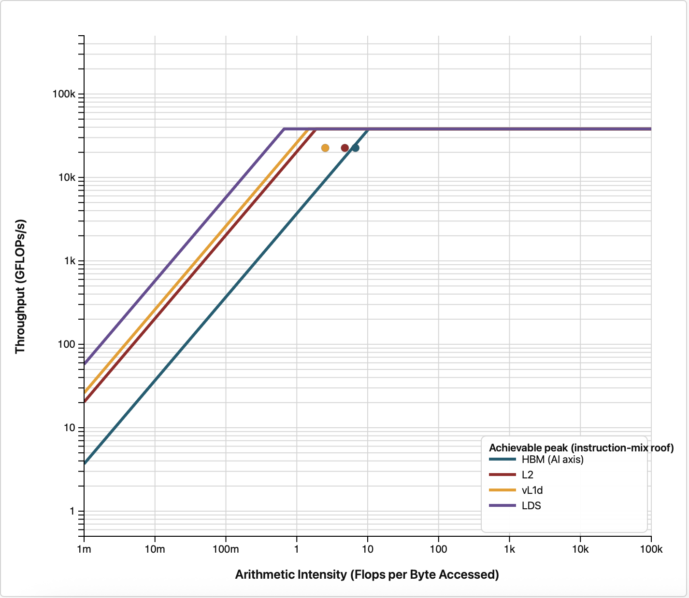

# Stage 4: A rectangular thread block

Square blocks are a habit, not a rule. On AMD GPUs a wavefront is 64 lanes wide, so a block that is
64 threads wide lets each wavefront read one unbroken run of 64 consecutive cells.

## What changed

```bash
diff ../3_block_32x32/shallow.hip shallow.hip
```

One line:

```c++
    dim3 block(64,4);
```

Two things happen at once here, and it is worth separating them. The block becomes 16 times wider
than it is tall, which is the change we are actually testing. It also shrinks from 1024 threads back
to 256, which is a side effect of keeping the block a sensible size.

## Build and run

```bash
module load rocm
make
./shallow
```

## Expected output

```
Domain: 2048x2048, steps=500, dt=0.0728643
Elapsed: 0.243 s  |  Throughput (including RK4 stages): 34551.31 MCUPS
Mass: initial=4.194806655e+06, final=4.194806458e+06, rel.err=4.681e-08
Min(h) after run: 0.981776
```

**34551.31 MCUPS, 1.18x faster than stage 3's 29400.84.**

This is the end of the case study, so here is the full progression:

| Stage | Change | Elapsed (s) | MCUPS | Step speedup |
|---|---|---|---|---|
| 0 | 512x512 baseline | 0.083 | 6282.26 | -- |
| 1 | Domain to 2048x2048 | 0.427 | 19638.63 | 3.13x |
| 2 | Remove `hipDeviceSynchronize()` | 0.396 | 21204.86 | 1.08x |
| 3 | Block 16x16 to 32x32 | 0.285 | 29400.84 | 1.39x |
| 4 | Block 32x32 to 64x4 | 0.243 | 34551.31 | 1.18x |

**6282 to 34551 MCUPS, a cumulative 5.50x speedup**, with the mass error and minimum depth identical
to stage 1 throughout. Every change was a one or two line edit found by asking a tool a question.

## What the counters say

Re-running both counters shows that this stage did something stage 3 could not:

| Kernel | Occupancy at 32x32 | Occupancy at 64x4 | VALUBusy at 32x32 | VALUBusy at 64x4 |
|---|---|---|---|---|
| `compute_rhs` | 61.9 percent | 74.4 percent | 61.9 percent | 65.5 percent |
| `update_stage` | 72.5 percent | 76.8 percent | 3.8 percent | 4.8 percent |
| `final_update` | 75.7 percent | 81.6 percent | 5.1 percent | 6.7 percent |

Stage 3 bought vector utilization by giving up occupancy. This stage gets both back at once, which
is why it is worth having even though it is the smaller of the two block-size changes. Going to a
64-wide block improves the memory access pattern, and dropping back to 256 threads per block
restores the scheduler's freedom to pack workgroups onto compute units.

It is also worth noticing where the time actually went. In the kernel trace, `compute_rhs` improved
by only 7 percent between stages 3 and 4, from 100.5 ms to 93.1 ms, while `update_stage` improved by
21 percent and `final_update` by 23 percent. The change was aimed at the stencil but paid off most
in the two streaming kernels, which are the ones that care most about contiguous access.

## Roofline

```bash
module load rocm roofline-extractor
AMD_SERIALIZE_KERNEL=3 roofline-extractor-profile -o roofline_out --arch MI300A -- ./shallow
```

The equivalent in `rocprof-compute`:

```bash
rocprof-compute profile -n block_64x4_roof --roof-only --device 0 -k compute_rhs --iteration-multiplexing -- ./shallow
rocprof-compute analyze -p workloads/block_64x4_roof/0
```

Both are explained in [Roofline plots](../README.md#roofline-plots).

`AMD_SERIALIZE_KERNEL=3` is needed for the same reason as in
[stage 2](../2_no_device_sync/README.md#step-2-check-the-roofline-again): with no synchronization in
the time loop, counter collection stalls on the queued backlog.

<p>

</p>

The plot shows no visible change from stage 3, even though the code is 18 percent faster. As in
stage 2, this is a reminder that a roofline summarizes arithmetic intensity and achieved bandwidth,
and a change can be worth having without moving either enough to see on a log-log plot.

## Why this worked, and why the tool did not tell us

Nothing in the profiler output said "try 64x4". `VALUBusy` said there were stalls, and the roofline
said we were memory bound, but the specific idea of matching the block width to the 64-lane wavefront
came from knowing how the hardware fetches memory.

That is the honest summary of this whole exercise. Profilers are very good at telling you *where*
the problem is and roughly *what kind* of problem it is. Turning that into a specific code change
still takes knowledge of the architecture and a willingness to try things and measure.

Some experiments worth running yourself, since the answers are hardware-dependent:

- Other block shapes: 64x2, 64x8, 128x2, 256x1. There is no reason to believe 64x4 is optimal on
  every GPU.
- Enlarge the domain again beyond 2048x2048 and watch whether the gains keep coming or reverse.
- Re-run the whole sequence on a different GPU generation and compare which steps mattered most.

## Where to go next

The four iterations above only ever changed constants. The kernels themselves were never touched,
which means there is a whole category of optimization still unexplored.

Continue to [`5_vectorized_loads`](../5_vectorized_loads), which keeps this 64x4 block and rewrites
`compute_rhs` itself to issue wider memory requests.
