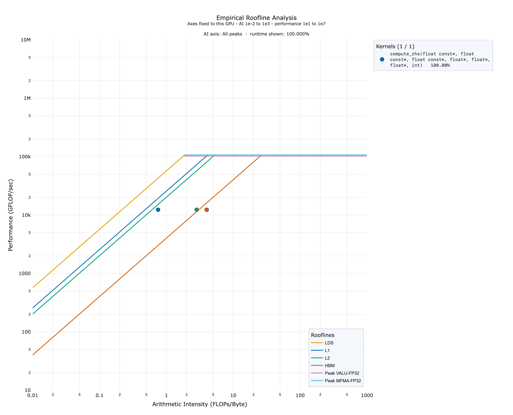
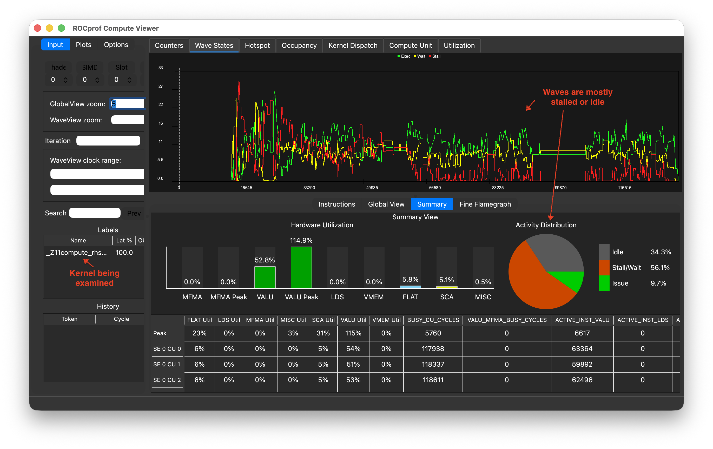
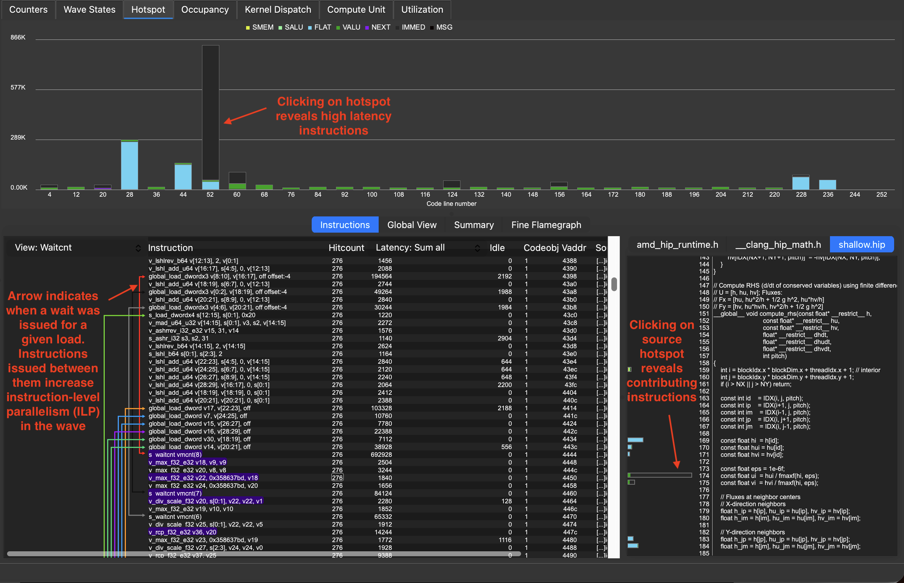
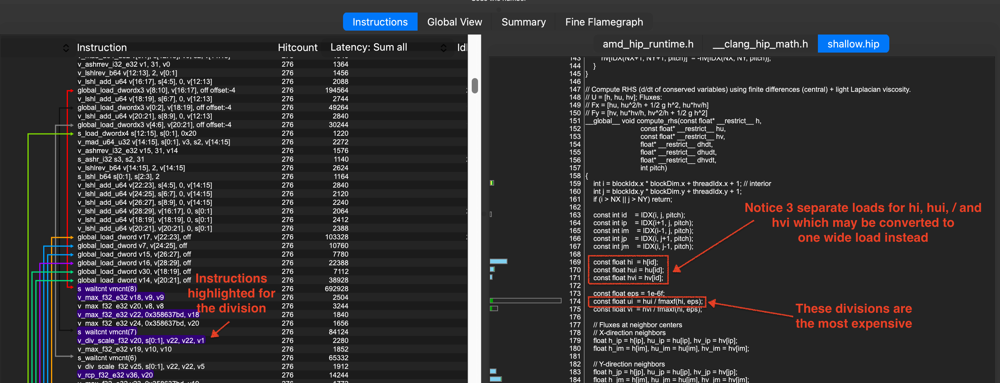

# Stage 4: A rectangular thread block

Square blocks are a habit, not a rule. On AMD Instinct GPUs a wavefront is 64 lanes wide, so a block
that is 64 threads wide lets each wavefront read one unbroken run of 64 consecutive cells.

## What changed

```bash
diff ../3_block_32x32/shallow.hip shallow.hip
```

One line:

```c++
    dim3 block(64,4);
```

Two things happen at once here, and it is worth separating them. The block becomes 16 times wider
than it is tall, which is the change we are actually testing. It also shrinks from 1024 threads back
to 256, which is a side effect of keeping the block a sensible size.

## Build and run

```bash
module load rocm
make
./shallow
```

## Expected output

```
Domain: 2048x2048, steps=500, dt=0.0728643
Elapsed: 0.243 s  |  Throughput (including RK4 stages): 34551.31 MCUPS
Mass: initial=4.194806655e+06, final=4.194806458e+06, rel.err=4.681e-08
Min(h) after run: 0.981776
```

34551.31 MCUPS, 1.18x faster than stage 3's 29400.84.

Through this stage, the progression is:

| Stage | Change | Elapsed (s) | MCUPS | Step speedup |
|---|---|---|---|---|
| 0 | 512x512 baseline | 0.083 | 6282.26 | -- |
| 1 | Domain to 2048x2048 | 0.427 | 19638.63 | 3.13x |
| 2 | Remove `hipDeviceSynchronize()` | 0.396 | 21204.86 | 1.08x |
| 3 | Block 16x16 to 32x32 | 0.285 | 29400.84 | 1.39x |
| 4 | Block 32x32 to 64x4 | 0.243 | 34551.31 | 1.18x |

6282 to 34551 MCUPS, a cumulative 5.50x speedup, with the mass error and minimum depth identical
to stage 1 throughout. Every change was a one or two line edit found by asking a tool a question.

## What the counters say

Re-running both counters shows that this stage did something stage 3 could not:

| Kernel | Occupancy at 32x32 | Occupancy at 64x4 | VALUBusy at 32x32 | VALUBusy at 64x4 |
|---|---|---|---|---|
| `compute_rhs` | 61.9 percent | 74.4 percent | 61.9 percent | 65.5 percent |
| `update_stage` | 72.5 percent | 76.8 percent | 3.8 percent | 4.8 percent |
| `final_update` | 75.7 percent | 81.6 percent | 5.1 percent | 6.7 percent |

Stage 3 bought vector utilization by giving up occupancy. This stage gets both back at once, which
is why it is worth having even though it is the smaller of the two block-size changes. Going to a
64-wide block improves the memory access pattern, and dropping back to 256 threads per block
restores the scheduler's freedom to pack workgroups onto compute units.

It is also worth noticing where the time actually went. We run the kernel trace from
[stage 0](../0_baseline/README.md#step-1-which-kernel-should-we-look-at) here and in
`3_block_32x32`:

```bash
rocprofv3 --kernel-trace --stats -S -T -d outdir -o shallow -- ./shallow
```

In the kernel trace, `compute_rhs` improved
by only 7 percent between stages 3 and 4, from 100.5 ms to 93.1 ms, while `update_stage` improved by
21 percent and `final_update` by 23 percent. The change was aimed at the stencil but paid off most
in the two streaming kernels, which are the ones that care most about contiguous access.

## Roofline

We collect it with `rocprof-compute`, whose `analyze` step needs its
[Python environment](../README.md#rocprof-compute-analyze) active:

```bash
rocprof-compute profile -n 4_block_64x4 --roof-only --device 0 -k compute_rhs --iteration-multiplexing -- ./shallow
rocprof-compute analyze -p workloads/4_block_64x4/0
```

The command is explained in [Roofline plots](../README.md#roofline-plots).

<p>


</p>

With 32x32 on the left and 64x4 on the right, the plots show no visible change, even though the code
is 18 percent faster. As in
stage 2, this is a reminder that a roofline summarizes arithmetic intensity and achieved bandwidth,
and a change can be worth having without moving either enough to see on a log-log plot.

## Why this worked, and why the tool did not tell us

Nothing in the profiler output said "try 64x4". `VALUBusy` said there were stalls, and the roofline
said we were memory bound, but the specific idea of matching the block width to the 64-lane wavefront
came from knowing how the hardware fetches memory.

That is the honest summary of this whole exercise. Profilers are very good at telling you *where*
the problem is and roughly *what kind* of problem it is. Turning that into a specific code change
still takes knowledge of the architecture and a willingness to try things and measure.

Some experiments worth running yourself, since the answers are hardware-dependent:

- Other block shapes: 64x2, 64x8, 128x2, 256x1. There is no reason to believe 64x4 is optimal on
  every GPU.
- Enlarge the domain again beyond 2048x2048 and watch whether the gains keep coming or reverse.
- Re-run the whole sequence on a different GPU generation and compare which steps mattered most.

## Where the time goes inside the kernel

The counters and the roofline locate the limit. Which instruction inside `compute_rhs` accounts
for that time is the next question. Advanced Thread Trace (ATT) answers it. ATT records
wavefronts on one compute unit, one instruction at a time. For each instruction we see how long
it spent issuing and how long it spent waiting. The trace covers a single compute unit per
shader engine, so we point it at one kernel.

The Makefile already passes `-g`. That is what lets the viewer place source lines next to the
ISA. On Instinct, `--att-activity 8` streams the SQ activity counters into the trace.
`--kernel-include-regex` keeps the capture on `compute_rhs`.

```bash
rocprofv3 --att --att-activity 8 --kernel-include-regex compute_rhs \
    -d att -o att -- ./shallow
```

`rocprofv3` decodes the capture into a directory named `ui_output_agent_*_dispatch_*` under
`att/`. We open that directory in the ROCprof Compute Viewer:

```bash
rocprof-compute-viewer att/ui_output_agent_*_dispatch_*
```

The viewer is a desktop application, installed separately from ROCm. We copy the directory to a
workstation and open it there. The decoder ships with ROCm 7.13 and later. Collection options
are in the
[thread trace documentation](https://rocm.docs.amd.com/projects/rocprofiler-sdk/en/latest/how-to/using-thread-trace.html).
The viewer is documented with
[ROCprof Compute Viewer](https://rocm.docs.amd.com/projects/rocprof-compute-viewer/en/latest/).

We start from the summary view. Hotspot then ranks instructions by the cycles they cost.
Selecting a source line highlights its instructions in the assembly view. Wave States separates
an explicit wait, such as `s_waitcnt`, from a stall.

<!-- SNAPSHOT: summary view of compute_rhs -->


We then move to Hotspot to identify the instructions where `compute_rhs` spends its cycles:

<!-- SNAPSHOT: hotspot view of compute_rhs -->


Selecting line 174, the first use of the loaded values, highlights the `s_waitcnt` that blocks
there and the division that follows:

```c++
    const float ui  = hui / fmaxf(hi, eps);
```

<!-- SNAPSHOT: hotspot view with the wait and the division selected -->


The x-neighbour reads in this trace are `global_load_dwordx3` instructions: the compiler has
already combined the three adjacent values of each array. The y-neighbour reads stay scalar
`global_load_dword` instructions. The next stage rewrites those loads in the source. We trace
the kernel again there. Continue to [`5_vectorized_loads`](../5_vectorized_loads).
